# MECHANICAL_MODEL_MAP.md

**PL1-B, 2026-08-08.** One map: accepted B601 truth → skeleton → engineering CAD → top assembly → collision representation → simulation → SAFE-00/capture. Tags: **[CURRENT]** / **[DONOR]** / **[SUPERSEDED]** / **[HOLD]**.

Residence reminder: `REPO` = `F:\China Graduate Future Flight Vehicle Innovation Competition`; `WT` = `F:\_SEI_PROJECT_CONSOLIDATION_20260807\12_WAVE4\WORKTREE_RECONCILIATION\20_engineering`. Active F3R1/F3R2 packages now live under `REPO\20_engineering\` (363/363 and 482/482 hash-identical rescue copies); WT is their verified source mirror and remains the only residence of the full historical CAD lineage. The active ROOT A copies are untracked and remain under CM/backup/reference-integrity HOLD.

## 1. The map (mermaid)

```mermaid
flowchart TD
    subgraph L0["L0 DYNAMICS_TRUTH (frozen, verified 2026-08-08)"]
        URDF["arm_b601_v1.urdf [CURRENT]<br/>REPO 20_engineering/cad/spacecraft_layout/arm_b601_v1/<br/>sha256 raw 1bc2b748… / LF 408147dd…<br/>mass 4.695555949342986 kg · 6R+1F+2P"]
        GEO["arm_b601_v1.yaml (geometry SSOT) [CURRENT]<br/>REPO 20_engineering/config/geometry/"]
        FRAMES["frame_tree_v1.yaml · arm_mount_v1.yaml [CURRENT]<br/>T_SM = [185.25,0,0] mm + Ry(90°) frozen"]
    end

    subgraph VENDOR["VENDOR / DONOR SOURCES (L3)"]
        REBOT["reBot-DevArm vendor tree [DONOR]<br/>REPO 80_third_party/vendor/reBot-DevArm/ (177f, gitignored)<br/>STEP v1.1_20260425 + source URDFs · CERN-OHL-W-2.0"]
        HAGA["HAGA_HIFI_FREECAD [DONOR visual-only]<br/>REPO cad/reference_donors/ (21f) · mass EXCLUDED"]
        V22["V2_2_NATIVE frozen baseline [DONOR canonical]<br/>REPO F3R1/.../SPACECRAFT_V2_2_NATIVE_COPY/ (WT mirror)<br/>108f · sha 30C09B50…"]
        B51ARM["B51 articulated arm protected donor [DONOR]<br/>25,610,223 B · sha 603B87BB…DE2E22<br/>initial recopy equality only"]
        WINGS["V2_2 wing panels ×4 [DONOR]<br/>WING_PANEL_DONORS/ (no hinge bore)"]
        FCAD["freecad_authoritative C1-A [CURRENT engineering estimates]<br/>REPO cad/freecad_authoritative/ (36f)<br/>skeleton · carriers · kinematic asm · base adapter F2 pilot"]
        OLD["V0.1/V1.0/V2.0/V2.1/V2_3/B5.0/B5.1/B5.1R1 trees [SUPERSEDED]<br/>WT cad/ lineage (kept as evidence)"]
    end

    subgraph L1["L1 ENGINEERING_NATIVE_CAD (SolidWorks) — REPO rescue + WT mirror; HUMAN/CM/BACKUP/REF HOLD"]
        SKEL["00_Master_Skeleton_V2_2.SLDPRT [CURRENT driver]<br/>18 planes · 34 params · zero solids"]
        ARM["B51_B601_ARTICULATED_ENGINEERING_ARM.SLDASM [CURRENT carrier]<br/>REPO F3R1/.../B601_ARM_B51_COPY/<br/>25,720,876 B · sha 597C2975… · not byte-identical to donor<br/>6 joints ALIGNED vs URDF · 25 mates"]
        GRIP["Gripper solids 58 (L24/R24/palm10) [CURRENT measured]<br/>two-finger components NOT modelled [HOLD]"]
        TOP["F3R2_SPACE_EMBODIED_ROBOT_OPERATIONAL_BASELINE.SLDASM [MACHINE-SELECTED candidate]<br/>REPO F3R2/.../03_native_cad/ · = F3R1 V3 bytes sha 19D85E9C…<br/>82 comp · 6 top mates · 8 registered/gate-checked configs<br/>7 differentiated; PARTIAL not differentiated<br/>gate 11/14 · C11/C12/C14 fail · 4 HOLD tokens + 7 open items · PENDING_HUMAN_REVIEW"]
        LUG["WING_ROOT_LUG LEFT/RIGHT [HOLD defined-not-modelled]<br/>closes 30.0 mm gap D-F3R1-06"]
        SAD["G07/G08/Mid real supports [HOLD defined-not-modelled]<br/>placeholders still in CAD (R3-04 open)"]
        HDRM["ARM HDRM demonstrator [HOLD defined-not-modelled]<br/>solar HDRM = donor parts only"]
        CAM["Camera + harness [HOLD/NOT_STARTED]<br/>camera absent; harness envelopes only"]
    end

    subgraph L2["L2 SIMULATION_MODEL (project chain pure Python; MuJoCo reference checkout only, no project integration)"]
        PARSER["sim_05 b601_model.py [CURRENT parser · HOLD broken path]<br/>points at pre-REORG04 cad/… path"]
        SIMS["sim_05/06/09/10/11/12 · control_01/02 · e16 [FROZEN gates]<br/>e16 hash-pins URDF (valid)"]
        COLL["Collision: URDF = same 10 STLs as visual [CURRENT]<br/>sim_09 capsule model r45mm (A1–A7) [CURRENT assumption-set]"]
        SAFE["SAFE-00 safety_00 [FROZEN PASS 47/47 PENDING_REVIEW]<br/>consumes NO mechanical model — hash-bound frozen evidence"]
        CAP["Capture chain: sim_06 impulse · sim_11 coupled · sim_12 strategy<br/>→ SAFE-00 gate · competition Lane C [FROZEN]"]
    end

    REBOT --> URDF
    URDF --> GEO
    URDF --> ARM
    V22 --> SKEL
    V22 --> TOP
    B51ARM --> ARM
    WINGS --> TOP
    FCAD -. "engineering estimates (mass-excluded)" .-> TOP
    HAGA -. "visual donor only" .-> TOP
    OLD -. "evidence only" .-> TOP
    SKEL --> TOP
    ARM --> TOP
    GRIP --> ARM
    TOP --> LUG
    TOP --> SAD
    TOP --> HDRM
    TOP --> CAM
    URDF --> PARSER
    PARSER --> SIMS
    URDF --> COLL
    COLL --> SIMS
    SIMS --> SAFE
    SIMS --> CAP
    TOP -. "clearance evidence (offline mesh; native attribution HOLD)" .-> SAFE
    FRAMES --> PARSER
```

## 2. Reading the map in 60 seconds

- **Truth enters once** (vendor → accepted URDF) and is never edited downstream; every F3R1/F3R2 round ends `ALL_PROTECTED_UNCHANGED`.
- **The native CAD line is a donor-composition**: V2_2 spacecraft + B51 arm + 4 wing panels, integrated by F3R1 (G0→G2) and verified/extended by F3R2. F3R2's top bytes equal F3R1 V3; it is the current machine-selected candidate, pending human review, not a ratified baseline. Nothing in it was redesigned from scratch — its candidate standing comes from donor selection, measured alignment and machine-gate evidence, not from being newest or most detailed.
- **Everything still open hangs off the top assembly**: lug, supports, HDRM, camera, harness, finger components — all DEFINED_NOT_MODELLED.
- **Simulation never touches CAD directly**: the project chain parses the URDF (one parser, currently path-broken) and uses capsule/box collision assumptions; SAFE-00 is a hash-bound evidence gate, not a physics consumer. MuJoCo exists only as a third-party/reference checkout: no project MJCF, consumption, integration or mission authority was found.
- **The two known safe-to-ignore traps**: (1) FreeCAD C1-A can look "more complete", but it is an authoritative engineering-estimate subset whose mass remains excluded from dynamics; other FreeCAD tops are donor/evidence only; (2) SolidWorks mass properties exist in CAD — excluded from dynamics by rule; URDF 4.6956 kg is the only mass truth.
- **Authorization is narrow**: F3R2 `next_stage_authorized=true` permits F4 deployed-control / embodied continuation under HOLDs. It does not ratify the candidate or authorize V4/residual CAD writes; those require new scope-specific change authorization. ROOT A health is **FAIL 1 (dirty only)**: structure checks pass; use the health-check's live `porcelain_entries` because PL1 report creation changes the count.

## 3. Asset tag index (authoritative paths)

| Tag | Assets |
|---|---|
| [CURRENT] | accepted URDF + meshes (REPO); geometry SSOT set (REPO `config/geometry/`); freecad_authoritative C1-A (REPO); F3R2 machine-selected candidate + F3R1 package (`REPO\20_engineering\F3R2_MECHANICAL_TERMINAL_CLOSURE_20260807\` and `...\F3R1_MECHANICAL_INTEGRATION_RECOVERY_20260806\`, untracked rescue with WT mirror); B601_ARM_B51_COPY (current sha `597C2975…`), SPACECRAFT_V2_2_NATIVE_COPY, WING_PANEL_DONORS; F3R2 definitions/poses/thread; sim_05 parser + frozen sim gates (REPO) |
| [DONOR] | reBot-DevArm vendor (REPO 80_third_party); HAGA_HIFI_FREECAD (REPO); V2_2_NATIVE canonical (WT/full-history source plus active donor-copy in REPO F3R1); protected B51 arm donor (sha `603B87BB…`, distinct from current carrier); `F:\Robotic arm` external reference root (MuJoCo checkout is reference-only, with no project runtime integration); OreSat/reference STL+SLDASM libs (REPO 80_third_party/external) |
| [SUPERSEDED] | V0.1/V1.0/V2.0/V2.1 (WT lineage); V2_3 tree (R3-02 hash drift; proxies remain evidence); B5.0/B5.1/B5.1R1 candidates (WT); FreeCAD F3P3 top assemblies (R3-01/R3-03 demoted); `reBot_arm_v0_min.urdf` 2-DOF-era (legacy flag; still feeding sim_03/04/06 by hard-code — documented supersession); 140×140 & 90×180 adapter footprints (D-1) |
| [HOLD] | F3R2 human ratification; ROOT A untracked-tree CM acceptance + backup/DR + native reference repair; scope-specific authorization before any V4/residual CAD write; WING_ROOT_LUG / supports / HDRM / camera / fingers (defined-not-modelled); service-sequence pose authority; native pair attribution; sim_05 parser path; q_stow/PARTIAL/SERVICE config holds; system mass budget; panel mass placeholder (Yang-Heng TODO-3); gripper T_c measurement (hardware TODO-2) |
