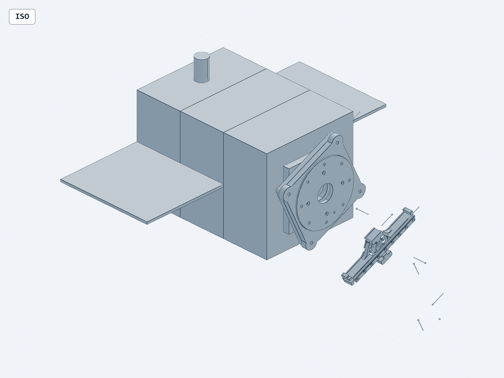
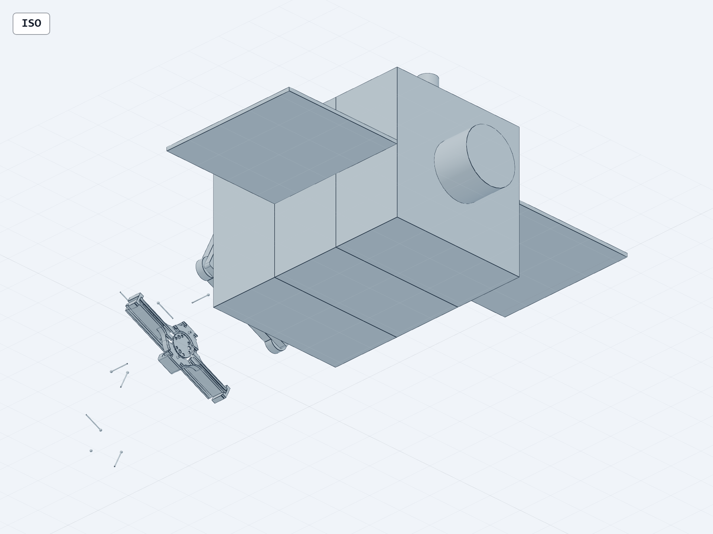

# R2 数字样机与抓取动力学准入审计（2026-08-27）

## 1. 总裁决

当前可以正式保留并继续执行 **Sim14/Sim15 有界诊断动力学线**，但尚不能诚实地宣布“完整 12U 服务星＋可运动 B601＋真实接触抓取”已经闭环，也不能进入 Sim13 非 ABORT 生产抓取。

本轮已完成六项关键纠偏：

1. 证明用户看到的外观偏差不是显示错误：冻结 R2 master 中的 B601 本来就只是轴线/坐标见证体，夹爪 palm overlay 也未安装在完整机械臂上。
2. 在不改写冻结发布件的前提下，建立了“12U 服务星＋完整 B601 固定 q0”独立研究候选的 STEP-first 生成链，并冻结源哈希、过滤合同、安装变换、几何预期和低内存一次性授权门。
3. 逐项复核 Unified R2 URDF，并重放 Sim14/Sim15，确认原始准入裁决可重复。
4. 将 0.005 m/s 与 0.05 m/s 的接触速度冲突闭合为显式消费者规则：0.005 m/s 是当前设计目标硬上限，0.05 m/s 保留历史记录但拒绝当前消费者；物理能力仍为 `MEASUREMENT_PENDING`。
5. 建立 Sim13 System Binding V2 只读候选，23/23 输入哈希一致、静态模型一致，但 Owner/Route-C/G12/M01/consumer/contact 权威均未被越权提升，最大状态仍为 `ABORT_ONLY`。
6. 闭合 DG1--DG5 的**加性、有界候选证据**：DG1 建立混合 6R+2P 显式参考度量；DG2 在非零总动量下传播基座位置/姿态并逐刚体独立复算；DG3 建立冻结线性切点、C=0 守恒和真正 modes-removed 诊断；DG4 建立两个独立刚体的有限权限冲量状态机；DG5 建立 1024 设计角点与 Solar R2 三离散角点筛查。五条候选均不改写父动力学 Gate。

原始准入裁决保持为：

```text
PASS_BOUNDED_DIAGNOSTIC_DYNAMICS_ENTRY__INTEGRATED_CAD_AND_NON_ABORT_GRASPING_HOLD
```

这不是机械终局 PASS，而是“诊断动力学入口可重复、完整 CAD 生成与非 ABORT 抓取继续 HOLD”。

新增 V2 汇合裁决为：

```text
PASS_ADDITIVE_DIAGNOSTIC_CONVERGENCE__CONTACT_CONFLICT_RESOLVED_FOR_0P005_BOUNDED_CONSUMER__DG1_DG2_AND_STATIC_SYSTEM_BINDING_CANDIDATES_PASS__CAD_M01_ROUTE_C_NON_ABORT_AND_RELEASE_HOLD
```

V2 为 10/10，但它只确认新增证据相互一致；`next_stage_authorized=false`、`release_credit=false`。

新增 V3 汇合裁决为：

```text
PASS_ADDITIVE_DG1_TO_DG5_DESIGN_CANDIDATE_CONVERGENCE__PARENT_DYNAMICS_CAD_M01_ROUTE_C_PHYSICAL_CONTACT_NON_ABORT_CONTROL_AND_RELEASE_HOLD
```

V3 为 19/19，并精确绑定 11 份当前机器裁决。它只把 DG1--DG5 归档为边界不同的加性设计候选，并确认离线控制预开发研究范围可继续；父 Dynamics、Control、Joint、Mechanical Release 以及 M01/Sim13 非 ABORT 权威全部保持 false/HOLD。

## 2. 为什么此前看到的样机不像“机械臂＋人造卫星”

冻结发布件：

```text
20_engineering/MECHANICAL_ENGINEERING_RELEASE_R2/04_MASTER_GEOMETRY.step
SHA-256 = 8C85585E9C051AEBB849E48F56354B48BF4204F61103B550BD92FC77BA99EA9E
```

标准 CAD inspection 得到：1 occurrence、41 solids、647 faces、1691 edges。四视图复核显示，服务星本体、Solar R2、M3R 和 load bridge 存在，但完整机械臂不存在；画面中的细杆是轴线见证体，孤立的小型夹爪形状是 palm overlay。





这与现行产品结构和 M7 生成器完全一致：

- B601 geometry：`FRAME_AXIS_WITNESS_ONLY`；
- gripper fingers：`DEFINED_NOT_MODELLED`；
- M7 源码明确写明 `B601 is installed as frame/axis witness only`；
- Solar R2 仅是 C01 部署快照，不包含完整 hinge/HDRM/latch 运动链；
- harness 未建模。

因此，此前模型“看起来完全不一样”的根因是 **现行 master 的设计内容不完整**，不是视角、爆炸图或装配变换失效。

## 3. 新建的完整外观/装配定位候选

本轮新增工作包：

```text
20_engineering/MECHANICAL_ENGINEERING_RELEASE_R2/_work/
digital_prototype_dynamics_entry_v1/
```

核心生成器：`R2_INTEGRATED_DIGITAL_PROTOTYPE_C01_V1.py`。它执行以下受控操作：

1. 读取冻结 R2 master，校验 bytes 与 SHA-256；
2. 按固定 traversal 合同保留 s1–s8、s27、s28、s41；
3. 删除 s9–s26 的 B601 axis witness 和 s29–s40 的 detached palm overlay；
4. 读取 B5.0 的完整 B601 固定 q0 B-rep：388 solids，SHA-256 `70B3F05A...AACCFA0`；
5. 按冻结安装变换将其装到 M3R：

```text
T_S_B601_ARM_BASE = Ry(+90°) · Rz(+25.000014°)
translation = [208, 0, 0] mm
```

6. 检查 B601 安装后最小 x 与 M3R 外端面均为 210.405 mm，允许误差 0.01 mm；
7. 输出预期为 399 solids、两个分组，整星预期边界为：

```text
min = [-230.25, -313.15, -274.86072588] mm
max = [ 488.533214, 313.15,  285.63229787] mm
```

B5.0 完整机械臂固定构型的既有可视证据如下：


### 3.1 必须保留的限制

该新候选解决的是“整星外观和装配位置不完整”，不是以下问题：

- 固定 q0 STEP 不保留 8 个驱动自由度；
- 它不能覆盖 accepted B601 URDF 的质量、惯量、关节轴和限位；
- 它没有 operational collision、真实接触或制造权威；
- 它不关闭 Route-C 线束、M01 路径搜索、Sim13 非 ABORT 或飞行发布 Gate。

因此后续动力学必须继续由 Unified R2 URDF 驱动，完整 q0 STEP 只负责几何可视、装配定位和后续碰撞资产派生的候选输入。

## 4. URDF 动力学骨架复核

本轮对 accepted B601 URDF 与 Unified R2 URDF 做了只读、逐树复核：

| 项目 | 结果 |
|---|---:|
| Unified links | 19 |
| Unified joints | 18 |
| fixed / revolute / prismatic | 10 / 6 / 2 |
| actuated DOF | 8 |
| 含惯性 link | 16 |
| 总模型质量 | 31.0228648073429873 kg |
| 根 link | `spacecraft_bus` |
| 重复 child / 环 / 未连接 link | 0 / 0 / 0 |
| accepted B601 子树逐字段差异 | 0/9 |

结论：Unified R2 的拓扑、模型质量和 accepted B601 子树可作为 **诊断模型加载入口**；但它仍是 `SOURCE_ONLY_BUILDER_EMISSION__PENDING_OWNER_REVIEW`，不能被表述为 Owner 已接受或生产接触模型已授权。

## 5. 动力学与抓取验证结果

### 5.1 Sim14：有界理想刚性捕获诊断

- pytest：25/25 PASS；
- 22 kg、0.5°/s 锚点：线动量残差 `5.4210e-20 kg·m/s`，角动量残差 `5.5511e-17 kg·m²/s`；
- 150 kg、3°/s 锚点：线动量残差 `4.4409e-16 kg·m/s`，角动量残差 `2.2204e-16 kg·m²/s`；
- 判定：`PASS_DIAGNOSTIC_ONLY`；
- production dynamics、contact、flex、RL、HIL、flight 均保持 HOLD。

### 5.2 Sim15：几何门控抓取诊断

- pytest：79/79 PASS；
- 8 个 capture cases；
- 6 行 joint equilibrium；
- 确定性重算与 hash chain 均 PASS；
- LG-019：`PASS_SIM15_DIAGNOSTIC_REPRODUCIBILITY_CLOSURE`；
- physical contact、structural analysis 保持 HOLD；production 为 `ABORT_NOT_AUTHORIZED`。

### 5.3 Sim13：运行时安全后端

Sim13 的 20/20 负控制注册表通过，说明 UNKNOWN/错误输入能够被 fail-closed 捕获；它不说明真实抓取成功。当前最大运行状态仍为：

```text
ABORT_ONLY_WITH_VALIDATED_FAIL_CLOSED_BACKENDS_20_OF_20_NC
```

Owner acceptance、Route-C disposition、system binding 与 consumer/contact authority 仍为 false，故非 ABORT 抓取不得开放。

新增的只读 System Binding 候选进一步确认：

- 输入文件哈希 23/23 一致；
- Unified R2 为 19 links / 18 joints / 16 physical links / 3 frame-only links / 8 DOF；
- accepted B601 子树语义摘要逐项一致；
- loader、runtime、dynamics、contact 收据均被绑定；
- G12 仍为 11/12 FAIL，M01 仍有 11166 对未评估；
- 最大诚实主张仍是 `RESEARCH_CANDIDATE_LOAD__ABORT_ONLY`。

测试 12/12 PASS 证明的是静态装载与 fail-closed 检测可复现，不是抓取动作可执行。

### 5.4 DG1：6R+2P 混合坐标参考度量

采用每个 URDF 有限关节全行程作为尺度，定义：

```text
q = S x
S = diag(5.6, 3.14, 3.14, 3.44, 3.14, 6.28, 0.0715, 0.0715)
```

前 6 项为 rad、后 2 项为 m；`x` 为无量纲坐标。机器验证结果：

| 指标 | 结果 |
|---|---:|
| 参考尺度与 URDF 全行程最大差 | 0 |
| 动能不变性相对误差 | `1.7902e-16` |
| 虚功率不变性相对误差 | `1.3648e-16` |
| 归一化方程最大残差 | `6.9389e-18 J` |
| 恢复转动加速度最大差 | `3.3307e-16 rad/s²` |
| 恢复移动加速度最大差 | `2.0817e-17 m/s²` |

原始未缩放质量阵条件数约 361.02；声明参考度量下约 13804.02，备用尺度下约 33191.62。条件数明显依赖所声明的坐标度量，因此本结果只闭合“可解释、可复算”的 DG1 合同，**不声称无量纲化改善了条件数**。

### 5.5 DG2：非零总动量与完整基座位姿传播

在 0.02 s、1 ms 固定步长的规定 8-DOF 关节运动下，设置非零惯性系动量：

```text
P_I = [0.05, -0.03, 0.02] kg·m/s
L_I = [0.04, -0.025, 0.035] kg·m²/s
```

固定步长 RK4 与 DOP853 同时传播基座位置、四元数和关节坐标，并对 16 个含惯性 link 逐体求和复算总动量：

| 指标 | 最大值 |
|---|---:|
| RK4 线动量残差 | `3.6388e-17 kg·m/s` |
| RK4 角动量残差 | `3.2731e-17 kg·m²/s` |
| 矩阵法 vs 逐刚体线动量 | `5.0157e-17 kg·m/s` |
| 矩阵法 vs 逐刚体角动量 | `3.0444e-17 kg·m²/s` |
| 四元数范数误差 | `2.2204e-16` |
| 关节最小限位裕度 | `0.03573`（按各坐标单位分账） |

Gate 为 15/15、测试 8/8。该 DG2 是“规定关节运动的动量级重构”，不是扭矩驱动的生产多体动力学，更不是接触/目标附着模型。

### 5.6 DG3：冻结切点的臂—翼柔性耦合候选

DG3 Gate 为 30/30、测试 23/23；只在 CURRENT_R2 冻结构型、线性切点和明确的 C=0/阻尼诊断车道内给信用。整份 parsed contract 已用 canonical SHA-256 冻结，authority、claim、阈值、单位、角点、solver、guard、q0 等九类篡改负控均 fail-closed：

| 指标 | 结果 |
|---|---:|
| source pins | 15/15 |
| `Mrom-I` 最大差 | `2.2204e-15` |
| `Gamma-Phi^T B`、镜像和结构零残差 | `0` |
| C=0 三角点最大线动量残差 | `2.0518e-14 kg·m/s` |
| C=0 三角点最大角动量残差 | `1.5868e-14 kg·m²/s` |
| 无强迫保守线能量相对漂移 | `7.0007e-10` |
| 真正 modes-removed 模态 DOF | `0` |
| 所有求解质量矩阵 Cholesky 正定结构检查 | PASS（仅布尔信用） |
| modes-removed Radau/BDF：位置/姿态 | `5.4794e-15 m / 3.4806e-13 rad` |
| modes-removed Radau/BDF：线/角速率 | `1.0341e-14 m/s / 6.5690e-13 rad/s` |
| zero-coupling vs modes-removed：位置/姿态 | `1.1858e-20 m / 2.1684e-19 rad` |
| zero-coupling vs modes-removed：线/角速率 | `5.7598e-20 m/s / 2.6021e-18 rad/s` |

Unified R2 已含左右翼各 `0.78 kg`，错误再加 `1.56 kg` 的负控制能够被检出。E23 与 Unified R2 的 `Hbb` 相对差 `0.5153002326%` 已归因于旧 `x=0.18525/no-clocking` 与现行 `x=0.208/+25°`，因此 `E23_numerical_inheritance=false`。原始 28×28 混合坐标谱量只保留为 `DIAGNOSTIC_NO_SPECTRAL_CREDIT`。时变质量阵、完整 Coriolis/Euler–Poincaré、扭矩驱动执行器和实测模态相关性继续 HOLD。

### 5.7 DG4：有限权限接触混杂诊断

DG4 对 `22 kg` 与 `150 kg` 两目标、恢复系数 `0.05/0.2/0.5` 共 6 个案例执行：

```text
PRECONTACT
→ BOUNDED_CONTACT_DIAGNOSTIC
→ POST_IMPACT_DIAGNOSTIC
```

Gate 为 15/15，pytest 总计 37/37（包含正测与负控）。0.005 m/s 是硬上限，0.05 m/s 在运行时得到 `ABORT_ONLY`。最大线/角动量残差分别为 `8.8818e-16 N·s` 与 `9.9301e-16 N·m·s`，能量恒等式残差 `2.6997e-17 J`。该模型始终保留两个独立刚体；没有 `ATTACHED/CAPTURED` 状态，没有物理接触面权威，也没有非 ABORT 信用。

### 5.8 DG5：设计级不确定度与确定性回放

DG5 精确消费 C01 质量、质心、惯量及其标准不确定度。在没有联合协方差、分布和自由度时，只执行 `estimate ± 1u` 的 `2^10=1024` 个确定性符号角点；不声称概率覆盖、组合标准不确定度或公差盒。

- 880 个角点仅判为“质量为正、惯量正定且刚体三角不等式未被证伪”，不称为物理可实现样本；
- 144 个角点违反主惯量三角不等式并显式隔离；
- Solar R2 只回放 LOW/NOMINAL/HIGH 三个离散 provisional 角点；
- as-built mass、contact uncertainty、8×19 actuator measurement 均保持 `null`。

Gate 为 16/16，测试 33/33；父 DG5 与父动力学 Gate 均不继承 PASS。

### 5.9 控制与联合 Gate 边界

控制预开发候选的 9/9 仅表示模型、接口和负结果账本已形成；`technical_predevelopment_complete=false`。父控制 Gate 仍因 task-space characteristic length/weighting、时域自由漂浮跟踪、M01 约束、硬件执行器/轮组、柔性任务激励、捕获后 plant 和当前树 SAFE 复核而 HOLD。

联合 Gate 当前为 4/13，`UNKNOWN auto-allow=0`、HIGH findings=0，但 Mechanical handoff、Dynamics、Control、SAFE、Sim13 binding 与 non-ABORT authority 均未通过。因此只允许离线控制合同、度量和负结果因果研究，不允许 RL/VLA、碰撞感知闭环或设备命令。

## 6. 当前内部阻断项

### 6.1 低内存生成门

本轮最新一次非命名运行诊断观测到可用物理内存约 1.61 GiB，低于 6 GiB。该瞬时观测不构成命名 run 的运行时准入。生成器已验证会在任何 OCP/build123d 导入前 fail-closed；未授权负控制也证明没有加载 CAD 内核。

因此当前状态是：

```text
SOURCE_READY__FRESH_LOW_MEMORY_OWNER_OVERRIDE_REQUIRED_BEFORE_CAD_IMPORT
```

旧的 Owner Override 不可复用。完整 STEP 尚未生成，本报告不伪装为“候选 CAD 已完成”。

### 6.2 M01 机械准入

ODR-60 Option A 已由最新 Owner 选择记录确认；execution mount full-precision spelling 与 accepted URDF 子树 10/10 frame ledger 已闭合。它们只覆盖对应字段，不继承为 M01 PASS。当前准确缺口必须分两层表达：

- M01 required scene fields：0/9；
- three-stage instantiated scenes：0/3；
- clearance policy：0/11166；
- motion certificates：0/150；
- pair oracle：0/11166；
- continuous edge certificate：0；
- operational collision asset set 不完整；
- geometry query 与 path search 均未获授权、未执行。

### 6.3 Route-C 与 harness

当前固定外线束为 0/75 SAFE，11/11 强制状态 UNSAFE；M01 直线路径已有 `-10.729480331980062 mm` raw penetration。ODR-42 只批准 bounded detailed design，没有把物理 Route-C 设计判为 PASS。G12 harness 仍未闭合。

### 6.4 接触速度合同冲突的有界处置

- gripper interface first-contact speed max：0.005 m/s；
- provisional design contact model nominal closing velocity：0.05 m/s；
- 比值：10×。

新增一致性 Gate 为 9/9，裁决如下：

```text
PASS_RECONCILIATION__0P005_MPS_HARD_BOUND__0P05_MPS_REJECTED_FOR_CURRENT_CONSUMER__PHYSICAL_AUTHORITY_HOLD
```

因此，内部语义冲突已经对当前有界设计消费者闭合：任何候选的 estimate 与 upper bound 必须同时不大于 0.005 m/s；0.05 m/s 记录不可被当前消费者采用。该处置没有生成硬件实测值，as-built speed、closing time、F/T 参数和不确定度继续为 `null/MEASUREMENT_PENDING`，所以 physical contact、production dynamics 与 non-ABORT 抓取仍为 false。

### 6.5 冻结 manifest 自指纹缺陷

`01_BASELINE_MANIFEST.json` 当前实际为 4488 bytes、SHA-256 `7E87EE69...A5BBE`，但文件内 self entry 声称 4497 bytes、`C7206FAD...29F0`，同时 policy 又称 manifest excludes itself。本研究分支仅登记该完整性缺陷，不静默改写冻结发布件。

### 6.6 L06 图纸/BOM 材料与兄弟文件绑定缺口

当前 8 张设计图全部明确标记 `manufacturing_use=PROHIBITED`。其中 D05/D06 仍把 M3R 材料写为 `AL6061-T6 CANDIDATE`，而现行 `DESIGN_MATERIAL_SELECTION_V1.yaml` 已把 M3R Stage A/B 选为 Al7075-T651；D05、D06、D08 与设计 BOM 还存在 `PENDING_SIBLING_HASH`。因此 L06 只能作为不可制造的原型资料包使用，不能作为生产图纸、采购 BOM 或材料放行依据。该冲突必须由材料/图纸 Owner 统一裁决并受控重发；本研究分支不静默替换冻结内容。

## 7. M4-L01～L08 完成度复核

| 项目 | 当前判定 | 关键边界 |
|---|---|---|
| L01 数字样机总装 | HOLD | 冻结 master 仍是 B601 轴线见证体；完整臂候选尚未生成 |
| L02 九构型样机 | PARTIAL | 9/9 质量/CG/惯量已有；九构型几何、碰撞与 M01 未闭合 |
| L03 质量惯量 | PASS_DESIGN_LEVEL | C01 `31.022864807342987 kg`；as-built 测量待定 |
| L04 材料 | PARTIAL | 六类原型材料已选；CFRP/A286 数值空项与飞行许用值未闭合 |
| L05 公差 | PASS_M4_SCOPE | B601-M3R、夹爪、太阳翼解析链完成；相机/HDRM/as-built 开放 |
| L06 图纸/BOM | PARTIAL | 8 张图均禁止制造；D05/D06 的 Al6061-T6 与现行 Al7075-T651 冲突，D05/D06/D08 与 BOM 尚有 `PENDING_SIBLING_HASH` |
| L07 FEA 入口 | PASS_DESIGN_SCREENING | FEA1B/E23 可用；完整整星资格鉴定、接触/预紧/飞行 MoS 未完成 |
| L08 MECH-RL V2 | PARTIAL_ABORT_ONLY | 静态 System Binding 候选通过；生产消费者与非 ABORT 权威未通过 |
| 最终 Release Gate | HOLD | TMG-4、TMG-6、Owner review 与物理证据链未闭合 |

## 8. 下一步单点汇合

### 8.1 Owner 授权后立即执行

若 Owner 明确授权本轮单次低内存风险，执行链为：

```text
fresh run/override IDs + UTC 有效窗
→ 标准 cad/scripts/step 生成 399-solid STEP 与 GLB/topology
→ refs/facts/planes/positioning 检查
→ 四视图 snapshot review
→ 输出生成收据与候选 CAD 视觉裁决
```

此步骤只会把完整整星固定 q0 候选从“源码就绪”推进到“已生成并审查”，不会自动解除 M01、Route-C、contact 或 Sim13 阻断。

### 8.2 动力学线可继续的范围

现在可继续：

- Unified R2 模型加载与树/质量回归；
- Sim14 理想刚性捕获诊断；
- Sim15 几何门控和关节平衡诊断；
- 不大于 0.005 m/s 的接触速度设计诊断消费者；
- DG1 混合坐标参考度量诊断；
- DG2 非零总动量、完整基座位姿的规定运动诊断；
- DG3 冻结切点、C=0 守恒、真正 modes-removed 与无谱信用柔性诊断；
- DG4 不大于 0.005 m/s、两独立刚体的 post-impact 冲量诊断；
- DG5 设计级 1024 角点和 Solar R2 三离散角点筛查；
- Sim13 静态 System Binding 候选加载；
- fail-closed action mask、错误注入和 ABORT_ONLY 安全验证。
- 离线控制合同、task-space 度量、CTRL-01 负结果因果和安全接口预开发。

现在不可继续：

- 声称真实夹爪接触闭环；
- 开放非 ABORT 抓取动作；
- 用固定 q0 STEP 替代 URDF 关节树；
- 将测试 PASS 写回为机械发布、生产或飞行 Gate PASS。

## 9. 真值入口

- 工作包说明：`20_engineering/MECHANICAL_ENGINEERING_RELEASE_R2/_work/digital_prototype_dynamics_entry_v1/README.md`
- 原始机器裁决：`CURRENT_R2_DIGITAL_PROTOTYPE_DYNAMICS_ENTRY_GATE_V1.json`
- 增量汇合裁决：`CURRENT_R2_DIGITAL_PROTOTYPE_DYNAMICS_ENTRY_GATE_V2.json`
- DG1--DG5 汇合裁决：`CURRENT_R2_DIGITAL_PROTOTYPE_DYNAMICS_ENTRY_GATE_V3.json`
- V3 完整性清单：`CURRENT_R2_DIGITAL_PROTOTYPE_DYNAMICS_ENTRY_MANIFEST_V3.json`
- 接触速度一致性：`contact_velocity_reconciliation_v1/CONTACT_VELOCITY_RECONCILIATION_GATE_V1.json`
- Sim13 System Binding 候选：`30_simulation/sim_13_physics_gated_embodied_grasping/v2_system_rebind/system_binding_candidate_v1/`
- DG1/DG2 候选：`30_simulation/r2_dynamics_engineering_closure/dg1_dg2_candidate_v2/`
- DG3 候选：`30_simulation/r2_dynamics_engineering_closure/dg3_arm_flex_coupling_candidate_v1/`
- DG4 候选：`30_simulation/r2_dynamics_engineering_closure/dg4_contact_hybrid_candidate_v1/`
- DG5 候选：`30_simulation/r2_dynamics_engineering_closure/dg5_uncertainty_candidate_v1/`
- 候选输入合同：`INTEGRATED_CANDIDATE_INPUTS_V1.json`
- 候选源码审计：`INTEGRATED_CANDIDATE_SOURCE_AUDIT_V1.json`
- URDF 收据：`URDF_TOPOLOGY_VALIDATION_RECEIPT_V1.json`
- Sim14/Sim15 重放收据：`DIAGNOSTIC_REPLAY_RECEIPT_V1.json`
- 当前 CAD 收据：`CAD_CURRENT_STATE_RECEIPT_V1.json`
- 低内存预检：`INTEGRATED_CANDIDATE_PREFLIGHT_V1.json`

最终工程结论：**当前已恢复一条诚实、可追溯的完整数字样机候选路线，并将接触速度语义、静态 System Binding 与 DG1--DG5 分别闭合到受限设计候选层；这足以继续离线控制预开发，却没有改写任何父工程 Gate。完整 STEP 的本轮生成仍需要新的、命名 run 专用低内存 Owner Override；真实非 ABORT 抓取仍须等待完整 CAD/M01、Route-C/harness、as-built 接触与执行器、时变扭矩驱动 plant、捕获后重构、Control/SAFE 和 Sim13 authority 同时闭合。**

## 10. 同日终局准备链增量（V4）

本节是 append-only 当前态记录，不改写上文历史裁决。新增统一 Gate 为：

```text
CURRENT_R2_DIGITAL_PROTOTYPE_DYNAMICS_ENTRY_GATE_V4
28/28
PASS_ADDITIVE_CAD_EXECUTION_PREPARATION_M01_PREBIND_AND_CURRENT_STATE_REISSUE__
CANDIDATE_STEP_M01_QUERY_NON_ABORT_PARENT_GATES_AND_RELEASE_HOLD
```

Gate SHA-256 为 `277BE6349EC87E3CC76519E824F368F1D720C2C7E01646255DA5865510CB87EF`；self-excluded V4 manifest SHA-256 为 `A1A6BBC5222400423F6523FD3443371B5A2087D330777DDE89918519E4F2316B`。V4 只汇合四类加性证据：V3、CAD source-only 生成后验证准备、M01 场景/碰撞预绑定、R2 current-state reissue；`next_stage_authorized=false`、`release_credit=false`。

### 10.1 CAD 生成与审查准备

- CAD brief 已冻结 mm/服务星坐标约定、11 个服务星保留实体、388 个 B601 q0 实体、399-solid/2-group 预期、210.405 mm 安装基准和四视图 snapshot 任务。
- V2 执行包装器不放宽 V1 的命名 run、6 GiB 内存和单次 Owner Override 门；异常路径使用不可覆盖失败收据。
- 生成后验证器先用标准 CAD inspect 枚举完整 topology，再逐 shape 核对 399 个有限正体积 solid、每叶一实体、唯一根、11/388 两直接分组、bounds、label 与安装基准，并锁定 input/source、authority、V1/V2 chain、failure veto、STEP/GLB bytes/hash。
- source-only preflight 为 11/11、byte-identical；专项测试 24/24；第二轮独立红队为 P0/P1/P2 = 0/0/0。
- 候选 STEP、隐藏 topology GLB 和四张候选 snapshot 当前均不存在；因此 `candidate_geometry_validated=false`、`candidate_snapshot_executed=false`。

2026-08-27 04:45:28（JST）按生成器同口径复测可用物理内存仅 `0.9722824096679688 GiB`，低于 6 GiB。六个 `R2_DP_*` 执行/override 环境字段均未设置，active writer lock 不存在，也没有新的命名 run 授权。故本轮未加载 CAD 内核、未生成 STEP；该阻断是运行准入边界，不是几何失败。

### 10.2 M01 场景与碰撞预绑定

新增预绑定 Gate 为 18/18，测试 17/17。它把 V2 PRE/EVENT/POST 的 30/30 字段全部显式化，但 30 个权威值仍全部为 `null`，旧口径仍为 0/9，场景实例仍为 0/3。资产账本共 167 行：150 个现行对象、10 个未激活且不在现行 pair universe 的 K 类 keepout 候选、7 个已知缺失类别；仅 `A::base_link` 具有资产级 operational/closed 状态，不能外推为系统可查询。

系统状态继续为：clearance 0/11166、motion 0/150、pair oracle 0/11166、continuous edge 0、pair query 0、path search authorized/executed=false/false。该包把缺口变成可填写合同，没有虚构姿态、太阳翼/HDRM/夹爪状态、目标附着或 universe hash。

### 10.3 R2 current-state reissue

append-only 当前态重发采用 `INPUT_MANIFEST → GATE → PACKAGE_MANIFEST` 单向三层：27/27 当前源绑定，Gate 28/28，独立 validator 22/22，pytest 31/31，package manifest 六项且排除自身。它保留而不修复 baseline self-fingerprint 缺陷，精确登记 Route-C raw/gated 负间隙、Sim13 20/20 仅属后端负控、DG1--DG5/V3 候选边界、Control/Joint HOLD，以及 L06 的 6061/7075 冲突与 sibling-hash 债务。冻结父文件未修改。

### 10.4 下一执行条件

只有在 Owner 给出新的、至少 12 字符命名 run 授权后才可进入 CAD 生成；若当时内存仍低于 6 GiB，还必须给出与该 run 绑定、最长 7200 s、一次性且含精确确认词 `ACCEPT_SINGLE_RUN_LOW_MEMORY_RISK` 的新 override。生成后仍必须依次完成 postvalidation、四视图审查、M01 30 个权威场景值与三实例、资产闭合、11166 对查询、150 个 motion 证书、oracle、连续边和 bounded path，之后才有条件重构时变扭矩 plant、捕获后 plant、Control/SAFE/Sim13 与父 Gate。

V4 真值入口：`20_engineering/MECHANICAL_ENGINEERING_RELEASE_R2/_work/digital_prototype_dynamics_entry_v1/CURRENT_R2_DIGITAL_PROTOTYPE_DYNAMICS_ENTRY_GATE_V4.json`。
