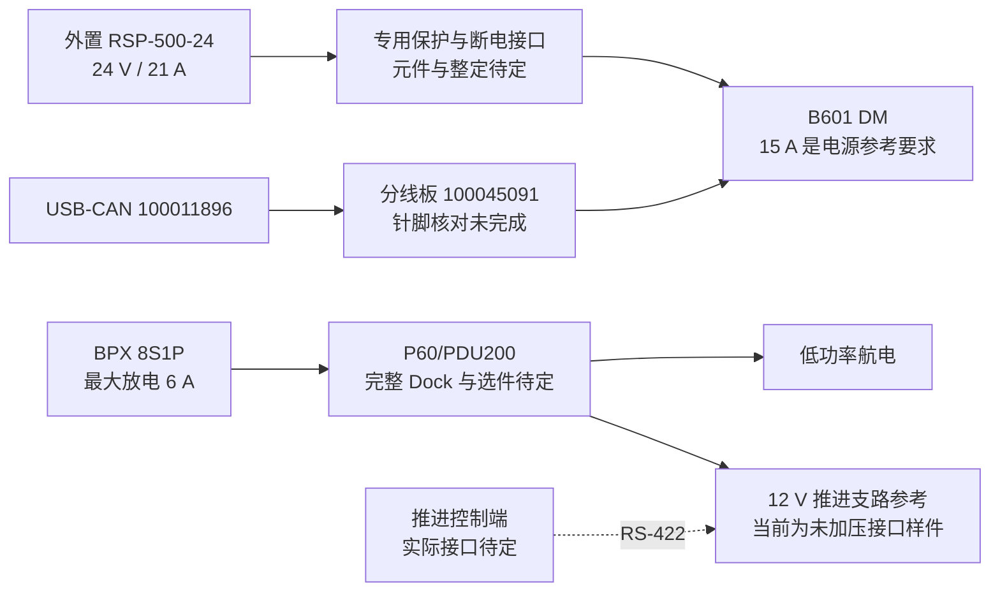

# DM 工程样机供电架构

用户确认 DM 后，采用外置 RSP-500-24 驱动机械臂；BPX 8S + P60/PDU 仅承担低功率航电与推进接口试验。所选为工程参考，已采购器件及出货修订尚未核对。

不将地面电源算作星内体积或飞行硬件；不把分开供电视作隔离已完成。电源回流、信号参考、机壳搭接与屏蔽端接分别保留设计字段。RSP 的感测/遥控 CN100 不承担主负载电流。

原厂端子组已知，但本图还不是针脚级接线图。主线两条已选需求见 `DM_SELECTED_FROM_TO.csv`；推进固定段见 `From-To.csv`、V6 路线图及预制检验单。未知单元保持空值，完整可裁线支路仍为 0。实际硬件上电、压接、采购和压力操作均未执行。

器件依据与电流反例见 [最终选型研究](../research/FINAL_SELECTION_DM_ZH.md)。当前 82 个几何实例覆盖推进支架、供电托盘、舱板与预布线；不因此获得实际 PCB、推进电连接器或线夹应力释放完成信用。
