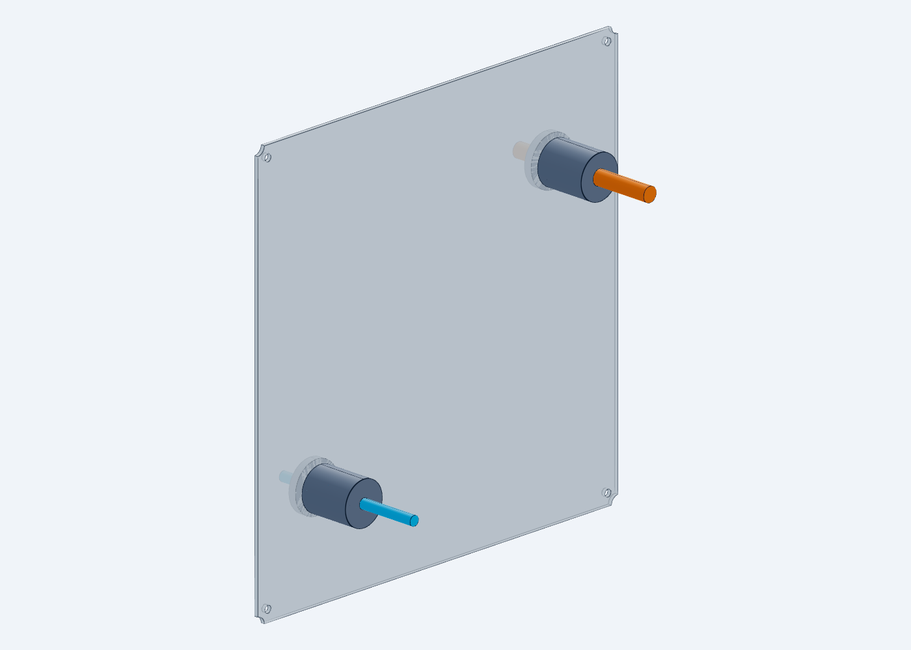

# WP09F 样机电气与推进候选交付

2026-09-07。按用户确认的 B601 DM 与 Seeed 官方 reBot-DevArm 开源器件建立候选基线。本轮交付具体接线设计、条件计算、局部机械装配和可复现的离线检查；实物通电与推进任务能力仍未验证。

## 直接查看

- [完整设计报告：选型、针位、保护、供电与推进](docs/FUNCTIONAL_DESIGN_REPORT_ZH.md)
- [SolidWorks 端口原生装配：5 组件 / 5 实际实体](native/WP09F_GSE_PORTS.SLDASM)，依赖本目录 `native/parts/` 的 5 个 SLDPRT；当前工作区内已冷回读，不是自包含 Pack-and-Go。
- [局部 STEP 装配](candidate/functional_ports.step) 与 [前盖增量尺寸图](candidate/PORT_DIMENSION_DRAWING.svg)
- [交互三维查看](http://127.0.0.1:3245/F:/China%20Graduate%20Future%20Flight%20Vehicle%20Innovation%20Competition/01_project/competition/SERVICE_ROBOT_MECHANICAL_CONSOLIDATION_20260905/runs/wp09_interfaces_20260907_1525?file=functional_closure%2Fcandidate%2Ffunctional_ports.step.py)
- [推进参数、受约束分配与负结果](docs/PROPULSION_CAPABILITY_ZH.md)
- [端口安装与停止控制说明](docs/PORT_INSTALLATION_AND_CONTROL_ZH.md)

彩色直段仅显示电缆直径和方向，不代表完成了全长线束布线；四个深色接头/锁母为简化包络。原生装配只含五个机械件，未加入彩色线段。

## 电气文件

| 文件 | 内容 |
|---|---|
| [机械臂供电图](ecad/SCHEMATIC_arm.svg) | RSP → ESX10 → 待选 K1 → 回生夹钳 → 原厂 DM 线束；含独立回流与制动电阻 |
| [DM CAN 图](ecad/SCHEMATIC_dm_can.svg) | 保留 100011896 USB-CAN 和 100045091 分线板，实际 V4 插孔待绑定 |
| [A3200 供电图](ecad/SCHEMATIC_obc.svg) | PDU TFM.9/10 → A3200 P1.2/1 |
| [RS-422 图](ecad/SCHEMATIC_rs422_loop.svg) | 两只 FTDI 的地面自有协议回环针线映射 |
| [功能 From–To](ecad/FUNCTIONAL_FROM_TO.csv) / [BOM](ecad/ELECTRICAL_BOM.csv) | 23 条导体、候选料号、未闭合字段、未批准裁线 |
| [电路源](ecad/CIRCUIT_MODEL.json) / [针位图网表](ecad/NETLIST.json) | 与四张图同源；不是原生 EDA/ERC |

## 已验证和未完成

已完成：5 个局部零件 STEP→SLDPRT→STEP 材料等价检查；5 件局部 SLDASM 冷回读；新增端口在父版三态的局部相交检查；15 项电路负控及独立复核；19 项自有协议内存测试；16 项推进计算自检。详见 [交付状态](results/DELIVERY_STATUS.json) 和 [完整性检查](results/FINAL_INTEGRITY.json)。这些检查覆盖不同对象，不合并成“整星通过率”。

整星本轮预计为 705 组件 / 1086 实体，但没有通过完整原生增量验收：`native/WP09F_SERVICE.SLDASM` 是中断时保存的未验收文件，冷回读恢复受内存保护阻断；本轮 PARKING / RELEASED 尚未生成。使用已验证整星请仍从 [父版交付入口](../README.md) 打开 701 组件三态。中断与资源记录已保留，不能把局部装配成功替代整星成功。

当前已放行接线电路 0，实物检查 0/24。推进器编号喷口 ICD、整星质量/惯量、任务角动量向量及推进供电仍未绑定；假设阵列 LP 结果不能作为真实 MiPS/C-POD 可行性结论。K1、DM V4 针位、断电回生、电源瞬态与热条件仍须完成，电气和推进系统不能宣布全部完成。

## 复现与来源

使用项目 Python 执行 `tools/electrical_design.py`、`tools/propulsion_screen.py`、`tools/offline_protocol.py` 可重建各自离线结果；它们不连接硬件。重新执行会改变本轮封存文件，先复制工作目录再重跑。CAD 工具由 `run_guard.py` 约束单进程、1400 MiB 子进程上限和 512 MiB 全机可用内存下限；整星恢复应先确认资源，不重复修改已保存装配。

官方开源基线：[Seeed reBot-DevArm](https://github.com/Seeed-Projects/reBot-DevArm)，锁定提交见报告。本地原始资料、版本冲突和下载失败记录保留在 `inputs/vendor_sources/`、`research/`。文件哈希见 `results/OUTPUT_SHA256.csv`；活动查看器日志及渲染缓存不纳入封存。
