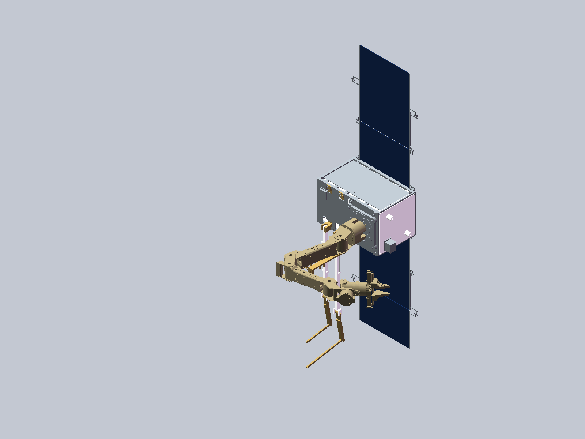

# WP09R：服务星机器人结构与机电复用候选交付

2026-09-07。本轮完成了**三态原生数字装配的增量验收，并将成熟模块复用落实为原生电气工程、真实协议适配及推进需求判断**。可以据此冻结本轮固定姿态结构候选，停止没有新接口依据的整星外形重建；“全部结构强度、连续动作、机电功能和飞行设计完成”仍不成立。

先看 [可视化交付页](REVIEW.html)（在线查看：<http://127.0.0.1:3251/REVIEW.html>）。机器状态：[DELIVERY_STATUS](results/DELIVERY_STATUS.json)；完整性：[FINAL_INTEGRITY](results/FINAL_INTEGRITY.json)。

## 五组实际交付

|交付|入口|已取得的证据|
|---|---|---|
|实际复用来源|[来源与许可](sources/REUSE_PACKAGE.md)|锁定MotorBridge、OreSat、ATMOS/PX4真实文件；厂商资料按版本引用。|
|原生电气工程|[电气说明](ecad/README.md)|70连接记录、117端点、47网络；原23行全部映射；真实KiCad网表精确对应。独立22个拓扑反例通过。|
|供电与真实DM协议|[电源设计](power/POWER_DESIGN_ZH.md)、[DM适配](software/README.md)|19项电源参数反例与29项实际协议离线测试。K1实选、完整EPS模式/能量阈值；无物理I/O。|
|推进源基准和能力|[推进设计](propulsion/PROPULSION_REUSE_ZH.md)|实际ATMOS八路构型、36项离线检查；1069个三态来源路径哈希匹配；候选质量账和精确ICD缺项。|
|机械增量|下列三套总装、独立测试板|三态各705组件身份/文件/变换冷读通过；新增5实体实际读取；继承1081旧实体的父本证据。|

## 可以直接打开的实体

- [SERVICE总装](mechanical/native/WP09R_SERVICE.SLDASM)
- [PARKING总装](mechanical/native/WP09R_PARKING.SLDASM)
- [RELEASED总装](mechanical/native/WP09R_RELEASED.SLDASM)
- [独立RS-422地面转接板SLDPRT](mechanical/native/RS422_GSE_SPLICE_BOARD.SLDPRT)、[PCB导出的STEP](mechanical/RS422_GSE_SPLICE_BOARD.step)
- [沿用的5件端口局部原生装配](../functional_closure/native/WP09F_GSE_PORTS.SLDASM)、[端口尺寸和装入说明](../functional_closure/docs/PORT_INSTALLATION_AND_CONTROL_ZH.md)

这些SLDASM使用原工作区内的已验收零件引用，不是Pack-and-Go。705组件=父本701删除旧前盖1、加入修改前盖及4件接头/锁母。1086为每态预期实体总数，当前实读的是新5实体，旧1081按父本冷读回执及哈希继承；不能写成当前三态全部1086实体重新解析。机械板件是地面独立件，不改变整星计数。

SERVICE原生文件来自上一轮保存件，另外两态本轮实际新增保存。恢复时发现验收脚本把规范化原生件坐标误当STEP源坐标：82项 `native_T_local_to_S` 应优先于 `T_S_local`。本轮改正的是对比合同，没有移动原部件。失败回执 `NATIVE_SERVICE_RECOVERY.json` 和诊断保留；有效回执为 `NATIVE_SERVICE_RECOVERY_V2.json`、`NATIVE_PARKING.json`、`NATIVE_RELEASED.json`。独立机械审查前两态33/33通过，第三态由最终交付核对绑定。

## 本轮选型结论

机械臂样机保留原厂DM链与外置RSP-500-24。K1采用GX11CAB正线切断、连续回流，线圈/监视控制与掉电回生仍有具体责任项。不能把正线切断称为全系统电隔离；USB/CAN回路及机械承托要一起验证。

EPS采用P60 ACU X1 / PDU X2、8S BPX、正常24–32 V；Dock4 A比BPX6 A更严格。BPX14针与Dock旧表冲突按当前BPX版保持NC，不猜线束。A3200地面P1支路采用76.2 mm短线候选，要求源3.29–3.32 V、瞬态±20 mV、总热态回路≤180 mΩ，得条件端压3.2197–3.34 V；这些是验收需求，不是现货已经达到的保证。P1/FSI禁双供电。

太阳阵列明确提出6×7S2P/84CIC参考配置、至少0.318016 m²安装面积条件；未替换现有太阳翼或把CIC质量当完整翼质量。按360 W臂负载筛查，现有低功率EPS不能承担在轨机械臂供电。

推进保留整模块外部集成。新的必要条件表明：若喷口都在完整MiPS包络内，并以瞬时零合力力偶卸载，44 Ns对应角冲量上界2.846647799 N·m·s，小于历史3.65099 N·m·s。C-POD只剩10%冲量时也不满足该条件。两结论不否定允许平移和姿态时变的其他策略，且不替代实际喷口ICD。候选质量20.012432095 kg只覆盖701父本部分对象，496实例仍未独立分配；不是705整星质量、COM或惯量。

## 结构主线如何收束

本轮固定姿态候选验收后，仅由下面有具体输入的对象触发修改。现有231个实物几何、434个简化代理、40个功能包络，具体记录以DELIVERY_STATUS为准；代理不是已完成制造细节。

|剩余对象|必须取得或完成的内容|影响|
|---|---|---|
|DM原厂链、K1停止/回生|出货板卡腔位/端接；GX11监视最低5 V/0.1 mA、控制硬件；失电/过温能量去路、机械保持|接头、GSE保护安装和可操作性；系统ERC仍1项开放。|
|P60/BPX/A3200同配置|BPX14针与线束修订；PGND断路；单体保护；PDU源端上下限与保护I²t；X3去VBAT母板选项|母板/短线二选一的实际安装；当前X1/X2是电气配置要求，不伪称P60内部代理模型已经逐板重建。|
|新GSE机械责任件|市电/PE完整防护、FPP电阻和金属罩、地面PCB绝缘与线缆卸载|目前只有接口合同和外部测试板，未装入整星。|
|端口与活动线束|锁母4 mm厚度仍待实配；7.5 mm电缆不能继承旧6 mm/R21路由；弯曲/夹持/拆盖工具/下料长度|局部几何通过不等于全路线、寿命或夹紧拉脱通过。|
|推进安装与能源能力|实际喷口坐标/方向、模块安装变换、允许并发、阀功耗、命令/遥测、羽流和失效态ICD|决定完整RCS候选取舍及支撑/线束增量；不能直接把ATMOS配置灌入VACCO。|
|全星材料与验证|未分配对象、真实材料与设备质量；三态变化/热/载荷/强度；工作羽流、连续运动|真实整星质量/COM/惯量及结构功能验收，不能用代理统一密度补零。|

原24项物理检查仍NOT_EXECUTED；未采购、制造、上电、驱动、校准、写固件或充压。原accepted URDF、历史科学Gate、WP06–WP09负结果均不据本轮离线结果升级。此次交付的诚实边界是**本轮固定姿态装配增量已完成；完整机器人硬件功能仍待上述对象闭合**。
