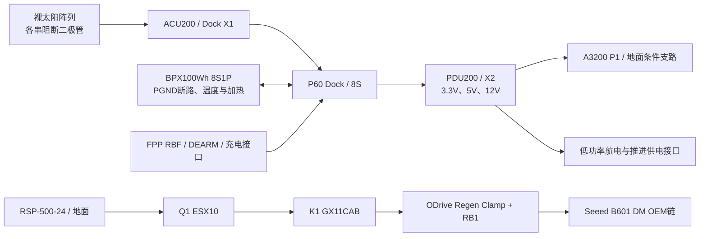

# WP-E2：成熟 EPS 与 DM 地面停止回生候选收口

2026-09-07；父本为 WP09 V6，继承 `functional_closure`，本文件是本轮电源设计说明。机器输入以 `POWER_CONTRACT.json` 为准，端点以 `POWER_ENDPOINT_CONTRACT.json` 为准。计算在 `../results/POWER_CALCULATIONS.json`，运行 `python -X utf8 power/power_closure.py` 可复算。**完成的是带明确验收条件的工程候选；实物供电、充电、运动和制造放行均为零。**

本轮把原来空缺的 K1 选为 **Sensata GIGAVAC GX11CAB**，保持地面臂供电与星上 EPS 分立；为现行 P60/BPX 定义完整能源路径、60 条端点/禁接记录、模式预算和 19 个真实参数反例；A3200 支路同时检查低压和高压边界。实际出货版本、源端电压筛选、接点电阻、回生掉电和电池单体保护尚不能由目录代替验证。

## 1. 采用一个 EPS 配置

| 对象 | 锁定版本与配置 | 本轮裁决 |
|---|---|---|
| P60 Dock | DS1013119 3.1；OSF1014114 5.2；8S 24–33.6 V | ACU 放 X1，PDU 放 X2；纠正旧候选 PDU X1。正常运行采用 24–32 V 交集。 |
| ACU200 | DS1014406 2.3；OSF1014027 4.0；8S | 输入裸 PV，经串保护二极管；原厂内部 MPPT，不再叠加另一 MPPT。 |
| PDU200 | DS1014111 2.6；OSF1021197 4.5；8S | Reg0=12 V，仅 CH1/CH6 使用高压选项；Reg1=3.3 V、CH2 OBC；Reg2=5 V，CH0/3/5 候选低压负载。 |
| BPX 100 Wh | DS1076870 1.1.0，8S1P | 通过原厂分线接口与 Dock 相连；采用该版 500 g、93×86×41 mm；不把早期 BPX 参数混入。 |
| A3200 | DS1006901 2.0 | 本轮数值闭合对象为独立地面 P1 支路；整合母板选项只能装 Dock X3，并由原厂配置去除不相容的 VBAT 网络。 |

选项来自 [P60 产品及原厂下载入口](https://gomspace.com/product/nanopower-p60/)、[Dock OSF5.2](https://gomspace.com/wp-content/uploads/2025/09/gs-osf-nanopower-p60-dock-52.pdf) 和缓存的各版 PDF。模块是商用文档开放对象，不是取得内部 PCB 开源许可。已有原厂环境试验不能转移为本项目集成通过。

RSP 不接 BPX、不并联 EPS，也不进入星上能源预算。外置臂 24 V×15 A 建议值不是实测任务功率；若按 360 W 负载、80% 转换下界，24 V 电池侧约需 **18.8125 A**，超出 Dock 4 A，当前 EPS 不能承诺在轨带臂供电。

## 2. 端点、充电与电池保护

`POWER_FROM_TO.csv` 中 60 行是接口合同，包括明确 NC 与尚未选实物的控制端口，**不是 60 条可制造导线**；L01/L02 对应旧有两条 OBC 记录，其余是 EPS 边界增量。

- BPX.PBAT2.1–4 → Dock.P4.5–8；PBAT2.5–8 → P4.1–4；PBAT2.9/10/11/12 → P5.2/4/3/1，分别为 SCL/高有效 EN/SDA/GND。四个电源针并用，总电流不按针数乘额定。PBAT2.13/14 保持 NC。
- **原厂表间冲突已记录**：Dock3.1 §12 把 PBAT2.14 当 kill-switch 接 P5.7；BPX100Wh1.1.0 §3.4 将 14 明确标 NC。因此 P5.7 不接本版 BPX，P5.5/6 也绝缘保留。需要原厂确认“本版 BPX + 此 Dock + 分线束”的实配修订；不得直接照旧表压接。
- BPX 的 PBAT1/2 是裸电池端，**无短路保护**；ENA 只控制监测、加热等板上功能。两处都不能当主电隔离。主保护采用 Dock PIPS，整链电池电流 ≤4 A；单 PDU 输入 ≤3.75 A；BPX 本体 6 A 不提升整链能力。[Dock 与 BPX 官方入口](https://gomspace.com/product/nanopower-p60/)
- 正常充电提出 CV **31.9 V±0.1 V**、太阳充电电流上限 **3.0 A** 的工程要求，低于 BPX 8S 3.4 A 上限。该设定的原厂命令、容差和低温禁止充电路径尚须配置回执；ACU 默认超压后备 2–3 V 超过最大电池电压，不能替代 32 V 正常终止控制。Dock 33.6 V OV/24 V UV 是硬件边界，运行调度以低于 24.5 V 退出非必要负载作为需求，不能等硬 UV 才停止服务任务。[ACU 选项表4.0](https://gomspace.com/wp-content/uploads/2025/09/gs-os-nanopower-p60-acu200-401014027.pdf)
- FPP 充电只定义 Dock.P13.1/2 回流、.3 远端采样、.4 充电输入，**该接口上限1 A**。外接充电器须为有 UV/OV/OC 与独立 sense 的 8S CC/CV 成品；RSP 直接代充电器不成立。关星充电不接 P13.5 VBAT_DIRECT。实际充电器型号仍未绑定，不能给它制造放行。
- BPX 四个温度读数全部有效时，提出充电允许 5–40 °C；传感器全误差须 ≤±2 °C，才留在原厂 0–45 °C 充电区间内。温度缺测/超差/通信过期→禁止充电。加热需求为低于8 °C 开、高于12 °C 关，35 °C 独立异常停止；6 W 计入生存预算。BPX 默认加热软件为 manual，不能写成出厂已实现自动温控。
- 该版公开 BPX 只明确整包电压和四路温度，没有足够的单体均衡电流、单体OV/UV及故障隔离保证。**逐单体保护/均衡及失联充电禁止机制是原厂责任确认项**。工程要求：任一单体达到原厂允许极限之前终止充电；不能只用总压32 V证明八节都安全。没有单体数据时不自制旁路平衡板。

FPP 的 RBF 是 P14.6 低有效，DEARM 是 .7 低有效。Dock3.1要求 RBF 的 2 MΩ 上拉靠 FPP、220 Ω 串阻靠 Dock、≥1 mm 金属接地罩；该罩/电阻/原厂接口适配是新责任对象。P10 双开关并联与 P11 串联是两种原厂配置，**当前地面合同不声明部署开关实物闭合**，P14.4 override 禁用。BPX PGND1四个 Battery GND 与四个 System GND 的断路器也需同时纳入部署/FPP线束，不能由数据屏蔽跨接绕过。对应源为缓存 Dock3.1 §3–5 与 BPX1.1.0 §3.5。

上电依赖顺序已定：RBF/DEARM保持抑制且推进断电 → 检查电池保护、四温、总压、断路器 → 启动 Dock/ACU 管理及 OBC 单一电源 → 核对遥测/支路设置与稳定电压 → 分批启用5 V感知/通信 → 最后开放12 V推进供电许可。推进实际命令仍等待厂商 ICD。掉电退出顺序相反，故障支路隔离、不自动重试。Dock序号≥300才可参考§9高电容支路软启动时序；旧序号不能套用3.75 V/ms典型值。没有过流最大切断时间与负载电容时，不能把软件上电顺序当浪涌实测。

## 3. A3200：两端最坏电压一起闭合

选定 L01=PDU.X2.TFM.9 → A3200.P1.2；L02=TFM.10 → P1.1。采用 **SFSD-15-28-G-03.00-S** 单端组件（76.2±3.18 mm 目录长度）与 **Molex510210400/500798000** 端接；不选要求 TFM-WT 的 -SR 锁扣。有效每根铜线长度≤80 mm；确认实际绝缘外径0.5–1.04 mm后才允许压接。P1.3/4不接、不将RS422电平送进去。来源：[Samtec SFSD](https://suddendocs.samtec.com/catalog_english/sfsd.pdf)、[Molex PS-51021-024 AD](https://www.molex.com/content/dam/molex/molex-dot-com/products/automated/en-us/productspecificationpdf/510/51021/PS-51021-024-001.pdf?inline=)。

本轮并未把旧70 mΩ分配当成厂家保证。Molex源给初始配对20 mΩ、压接5 mΩ，规定环境/30次插拔后40 mΩ；正式26/28AWG额定1 A，2 A只是特定两针温升参考。按75 °C、28AWG铜线筛查46.116 mΩ，加两路Molex后试验80 mΩ与压接10 mΩ，Samtec两路含端接提出≤40 mΩ需求，合计176.116 mΩ。**总热态回路验收≤180 mΩ**；Samtec实际低电平/热态上限尚未取到，Molex环境后上限也不等于在75 °C原位保证，最终须四线法绑定；这是一项明确接受阈值。

源端稳态要求 **3.29–3.32 V**，另留瞬态 **±20 mV**。源端须在实际24–32 V输入、温度和所有共载工况下满足；不是对 PDU 目录所作的新保证，也不假设它能任意软件调压。将0.9 W视为常功率最坏负载，解 `Vload²−Vs_min·Vload+Pmax·Rloop=0`；上界取无负载而不是只算额定负载。结果随机器JSON给出，当前约 **3.2197–3.3400 V**，均在A3200的3.2–3.4 V内。状态为 **CONDITIONAL_DESIGN_PASS**，不是现货模块已满足。

比较结果：原254 mm长线加大热态阻抗；短线能减损，但增加测试点PCB/连接器会增加电阻，须计入同一个180 mΩ总额，不能另开免费余量。母板路径优先用于最终整合、减少线缆；但Dock目录3.20 V下界若再有FSI压降，不能单凭“原厂配套”证明A3200下界。正确X3选项、厂家共同装测、端到端电压验收依然必需，**P1和FSI同时供电禁止**。

1 A PDU支路设置是候选要求，旧0.4 A没有已绑定的可编程范围。源限流容差、短路切断I²t与Molex/导线耐受尚未闭合，故电压条件通过不升级成故障保护或实物上电许可。

## 4. 太阳阵列与模式能量：从空字段变成可核查阈值

采用 [AZUR81442 3G30A-Advanced 4×8 CIC，DB00010891-01，2025-04-11](https://www.azurspace.com/media/uploads/file_links/file/bdb_00010891-01-00_tj3g30-advanced_4x8.pdf) 作为**完整光电组件参考**；不把它认作已装太阳翼。ACU2.3是升压拓扑，PV开路必须低于电池电压；输入工作4.5–25 V、每路2 A，且并联引脚内无各串隔离二极管。[ACU2.3](https://gomspace.com/wp-content/uploads/2025/09/gs-ds-nanopower-p60-acu200-23.pdf)

本轮候选为6个独立MPPT通道，各 **7S2P**，共84个CIC。取电池最小24 V并预留1 V升压余量，要求整串最坏冷Voc **<23 V**，即7串时单CIC冷Voc上界 **<3.285714 V**。在−40 °C温度外推加3%公差的筛查值为22.506736 V；8串失败。**原厂温度系数仅声明28–140 °C，−40 °C外推没有资格认证信用**，冷Voc需厂商包络或热真空/I-V数据确认。

热端80 °C、1e15 e/cm²参考辐照档、5%电压分散、串二极管0.8 V和线束0.2 V分配下，热MPP为11.33974 V；照度增大10%的每路短路电流筛查1.174184 A，4并联失败。84CIC占玻璃矩形面积0.270314 m²，按85%填充要求安装面积 **≥0.318016 m²**。CIC参考质量0.3024 kg仅含CIC，不含基板、铰链、布线、防护或胶。此面积和质量不改写已接受太阳翼/URDF。

模型使用ηACU≥0.80、ηPDU≥0.80、平均投影系数0.65及组件折减0.90作为设计条件；ACU原厂效率曲线在7/8 V电池测得，不能套成8S保证。阵列热端条件下送入母线31.495549 W。

| 需求模式 | 窗口 | 稳压负载 | 电池等效功率，含损耗/加热/1.5 W EPS预留 |
|---|---:|---:|---:|
| 生存阴影 | 35 min | 2.9 W | 11.125 W |
| 向日补能 | 45 min | 8.9 W | 12.625 W |
| 服务感知 | 10 min | 18.9 W | 25.125 W |
| 推进窗口 | 5 min | 20.9 W，其中推进分配10 W | 27.625 W |

这是95 min示例需求窗，未伪装成已传播轨道或实测任务。每窗需求22.447917 Wh；阴影6.489583 Wh；计90%充电效率后，向日期间母线平均需≥23.168981 W；所选条件余8.326568 W，平均投影系数须≥0.478158。原厂87 Wh只对应23.6–32 V参考容量，本设计24–32 V窗口再乘0.95、温度0.80、老化0.90、DOD0.60，分配35.7048 Wh；这些系数待任务/电池曲线绑定，不能当实测容量。

峰值稳压负载42.9 W（5 V感知/通信/辅助各6/7/5 W、12 V推进24 W、3.3 V OBC0.9 W）、加热6 W时，24 V电池约2.546875 A、PDU输入2.234375 A，低于4/3.75 A目录边界。12 V推进单支路上限取24 W（2 A），只是接口分配，不是任意MiPS/C-POD峰值已兼容。所有共用同一稳压器的支路电流和≤4.5 A。实际任务替换模式表后必须复算；加入360 W臂、严重遮阴、增大串并联、低温充电等反例均保留失败。

## 5. DM 停止与回生：确定料号和责任边界

比较范围严格为下列两种供应商候选。没有以500 A宣传额定代替24 V动态分断试验。

| 候选 | 事实与适用性 | 选择 |
|---|---|---|
| Sensata GX11CAB | 24 V单线圈、38 cm引线、NO辅助；主端A2→A1，线圈X1+/X2−，辅助T1/T2；0.46 kg参考质量。25 °C线圈0.28 A/6.8 W；内置抑制，禁止外加续流二极管。 | **选作地面K1候选**，正常单极切正线，连续回流；不宣称全电气隔离。 |
| TE EV200HAANA / 1-1618002-8 | NO主触点+NO辅助、9–36 V线圈，内置经济器型号；旧原厂目录辅助最小100 mA@8 V，对低电流输入不如GX11直接。 | 不采用；较大电流能力不解决本臂回生或焊死检测。当前产品页与2013目录分开记录，须订单确认。 |

依据：[GX11官方Rev6/2015主体+2023附页](https://www.sensata.com/sites/default/files/a/sensata-gigavac-gx11-series-open-contactors-datasheet.pdf)、[TE原厂目录7-21/22](https://www.te.com/content/dam/te-com/documents/aerospace-defense-and-marine/aerospace/global/hpg/5-1773450-5editable_section7.pdf)、[TE现行型号入口](https://www.te.com/en/product-1-1618002-8.html)。两家PDF本机HTTP403，保存的是官方网页工具提取回执，不伪称已下载原始PDF。GX11的0.4 mΩ最大接触阻在>100 A条件下测得，15 A不能直接继承；提出15 A低电流≤1 mΩ接受要求，对应损耗≤0.225 W。

拓扑改动：取消旧图中K1的“第二极负线切断”假定；正线为RSP→Q1→K1→U1→OEM臂，ARM_RET连续，PE接地保护独立，EPS_RET不跨接；USB/CAN屏蔽或逻辑地不得被当成动力回流。USB适配板内部返供/隔离仍未知，所以K1开断只能声明**正线功率切断**，断线安全和可触及端无电需要另验。

K1线圈取自上游、独立受保护的停止控制24 V；提出输出可承受0.5 A及≥100 V关断瞬态的要求（GX11参考反电动势55 V）。必须由硬件停止触点/监控回路撤掉线圈；线圈断线会释放，焊死/反馈断线/辅助接点状态不符均锁止重启。NO辅助只作状态观测，不是已认证镜像接点；需要独立负载侧母线电压观测才能区分辅助错误与主触点焊死。停止控制器、双通道回路及输入电路仍未选定，不把这些要求画成已落地元件。

Q1仍用ESX10-105-DC24V-16A-E独立25 °C安装；其18.4 A/100 ms是典型，RSP105%×504W/24V=22.05 A也是额定点换算，不是短路下界。K1分断验收要求覆盖33 V、50 A、线感≤27 µH、0.1 s故障包络，**这是要求，非实测/目录保证**。带电容必须限涌或预充；此轮不增加未知预充旁路，K1不得在未知母线电容与两侧压差下被软件自动闭合。线圈与主触点来源不构成一个已认证机器人急停系统。

[ODrive Regen Clamp 0.6.12官方资料](https://docs.odriverobotics.com/v/latest/hardware/regen-clamp-datasheet.html) 给出它吸收下游回生并阻断回灌上游的正常作用；K1保留在U1上游。**意外断电后U1输入失电的吸收保证仍未提供，过温会关闭吸收且降温后自行恢复。** 因此正常停止需求是供电保持→受控降能→独立机械支撑接管→确认可切断条件→撤K1；意外掉电/急切靠已验证机械承托限制下落与运动，不能把“去使能”解释为抱闸。任何未验证步骤都不能生成 `motion_permit=true`。

RB1保留2 Ω/50 W参考，增加±5%阻值与25 W重复功率降额条件。在电压全开关范围内，电阻导通功率280.2608–376.3303 W、最高14.0737 A；50 J/0.25 s、10 s一回的需求对应200 W与5 W平均，算术允许。但供应电阻脉冲曲线、安装散热和DM母线动态上限未取得，**仍不能释放运动**。200 J/0.25 s或50 J每秒反例失败。120 °C最低OTP不等于线缆/外壳允许温度，须让外部温度监控提前禁止新动作，不能依赖OTP替系统停车。

## 6. 已关闭与必须保留的对象

已关闭的设计工作：版本/位置纠错、裸PV—充电—电池—配电链定义、OBC两端条件计算、K1实际候选比较、停止/回生需求拓扑、模式/面积/电力阈值、19个参数反例。每个反例实际修改合同再运行验算，未用修改PASS标签代替测试。它们不替代根任务的真实EDA网表与连线图反例。

剩余字段限定为：①同版BPX/Dock分线14针冲突与单体保护/均衡；②PDU实配输出电压动态与1 A保护公差/切断曲线；③Samtec端接热态/老化电阻和绝缘外径；④真实太阳翼冷Voc、面积/投影、8S效率与热安装；⑤停止控制器、K1故障分断与预充、机械承托、U1失电与RB1脉冲、DM母线耐压；⑥实际推进供电/命令ICD。未完成项保留 `physical_tests=0`、`build_approved=false`，不能因条件数值通过改成整星电气完成。

机械交接仅三类：地面GSE需要K1/Q1/U1/RB1绝缘支撑与散热，不计星上；低功率测试点板/线缆增加的接点计入180 mΩ总额；最终母板A3200只接受原厂X3安装选项和实际支撑，不能通过现有浮空代理宣称已经装好。太阳翼≥0.318016 m²为本示例需求交接，不授权重建已接受结构。所有模块质量应替换对应设备预算一次，不重复添加。
