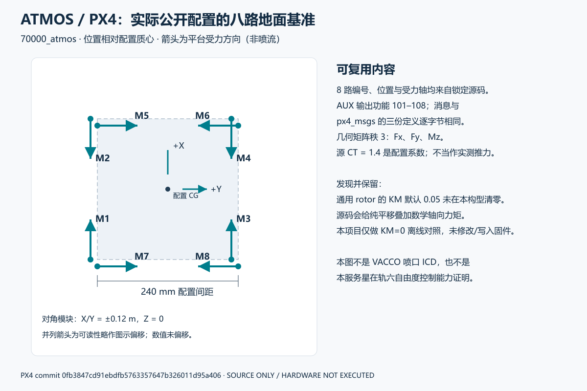

# 推进成熟模块复用与当前工程候选质量收束

本轮完成了**实际 ATMOS/PX4 源配置基准、V6 701 实例的工程质量覆盖账、同版本商业推进模块外部合同，以及与历史 3.65099 N·m·s 任务量级相连的必要条件计算**。36 项离线检查通过，三态1069 个当前 STEP/原生源文件路径的哈希匹配；执行峰值工作集约 64.3 MiB。没有运行历史仿真、CAD、固件或推进硬件。实际飞行候选的完整喷口/命令 ICD 和完整质量、质心、惯量仍为 UNKNOWN。

可以关闭“重复自造八喷口数学阵列、仅凭模块外观选推进器”的工作方式：地面软件接口直接以本包锁定的真实配置作参考；旧 MiPS 保持现有机械接口基线；**捕获后严格平衡力偶卸载不宜继续默认旧 MiPS 能完成**。C-POD 可保留完整 RCS 研究候选，但没有足够证据冻结其飞行选型、安装孔或实际指令。

## 1. 实际取得的源码与可用范围

[来源锁](../sources/atmos_px4/SOURCE_LOCK.json)包含 27 个实际文件，212759 字节；另有三个远端目录树元数据。源文件按原样保存，Git blob 和本地 SHA256 均已核对。

| 来源 | 固定提交 | 实际内容与许可 |
|---|---|---|
| DISCOWER/w3_atmos | `b8f9da43eb70deb497738c202054618889db4b85` | PX4 安装文档、航电组织、DDS 主题、README、GPL-3.0 许可；文档中的系统安装、刷写和压力操作未执行 |
| PX4/PX4-Autopilot | `0fb3847cd91ebdfb5763357647b326011d95a406` | 70000_atmos、Gazebo 参考构型、sc defaults、Spacecraft/Rotors 分配有效性、顺序去饱和/伪逆分配源码、参数表、消息、DDS 与板级配置；BSD-3-Clause 及原文件署名保留 |
| PX4/px4_msgs | `dfdaf94cb574e4ec344753c1eb83aa1560f069b2` | VehicleThrustSetpoint、VehicleTorqueSetpoint、ActuatorMotors 与许可；三份消息与所锁 Autopilot 逐字节一致 |

来源：[ATMOS 当前 PX4 指南](https://atmos.discower.io/pages/PX4/)、[本次采用的 70000 源文件](https://github.com/PX4/PX4-Autopilot/blob/0fb3847cd91ebdfb5763357647b326011d95a406/ROMFS/px4fmu_common/init.d/airframes/70000_atmos)。源码复用只到数字接口与核对层，没有编译全 PX4、安装 ROS/Gazebo、启动节点或连接设备。



## 2. 有真实来源的地面数字基准

8 路配置均给出实际**软件默认位置**，不再缺坐标；其单位是 m，相对配置质心，沿 PX4 机体系。未断言实物测量、存储参数或与本星 S 系的安装变换。

| Motor / AUX function | 源位置 X,Y,Z / m | 平台受力方向 |
|---|---|---|
| 1 / 101 | −0.12, −0.12, 0 | +X |
| 2 / 102 | +0.12, −0.12, 0 | −X |
| 3 / 103 | −0.12, +0.12, 0 | +X |
| 4 / 104 | +0.12, +0.12, 0 | −X |
| 5 / 105 | +0.12, −0.12, 0 | +Y |
| 6 / 106 | +0.12, +0.12, 0 | −Y |
| 7 / 107 | −0.12, −0.12, 0 | +Y |
| 8 / 108 | −0.12, +0.12, 0 | −Y |

对应源码给出 CT=1.4、8 路不可反向、AUX 输出映射；该系数没有当成全工况实测推力。论文描述的地面阀平台采用 24 cm 方形布置、10 Hz 名义 PWM，并明确共享供给耦合；这支撑地面基准的身份，不能把它移植为本星压力或真空系统的参数。[ATMOS 论文 v2，§3-C](https://arxiv.org/html/2501.16973v2)

本项目提取的几何矩阵采用 `[F;M]`，列为 `[d_i; r_i×d_i]`，而 PX4 有效性源码矩阵按 `[M;F]` 排列。两者明确分开。[ATMOS_GROUND_BASELINE.json](ATMOS_GROUND_BASELINE.json)保存完整矩阵及 6 个轴向基向量用例；几何矩阵秩为 3，仅支持 Fx/Fy/Mz。Motor1 故障关闭后，使用 Motor5+8 可构造另一正偏航纯力偶；这只证明该指定静态替代例，不声称所有故障及任务可恢复。

还保留一项真实源码问题：所读 `70000_atmos` 和 `rc.sc_defaults` 未重设通用 rotor 的 KM，参数默认 0.05；Spacecraft 使用 Rotors 有效性，后者包含 `−CT·KM·axis`。**如果没有其他参数覆盖**，Motor1/3 各 0.5 的配置系数输入会给出 X 向推力系数 1.4，同时带 −0.07 的滚转力矩系数。本包展示 KM=0 的离线对照；未修改上游文件、未生成设备参数写入动作。实机已存参数未知，不能据此断言现有 ATMOS 实物故障。Spacecraft 源码对多阀同时开启的非线性仍有 TODO，也不能把静态矩阵检查升级成供给动态验证。

消息边界直接沿用真实字段：两个控制输入均含 `timestamp`、`timestamp_sample` 和归一化 `xyz[3]`；ActuatorMotors 使用 12 位控制数组，8 路映射到本构型，NaN 表示停用语义。**归一化设定不是 N/N·m 指令，发布消息不是推进阀动作证明。** 三份消息字节一致仅限所锁提交，不构成任意版本兼容保证。上游默认中包含面向气浮台/mocap 的检查配置，未照搬为本星运行参数。

## 3. 当前 V6 的质量：从逐实例来源重新覆盖

[质量 CSV](CURRENT_V6_MASS_LEDGER.csv)逐行绑定当前 701 实例、STEP/native 路径和哈希、源字段、质量 owner、来源类型；[完整 JSON](CURRENT_V6_MASS_LEDGER.json)另含三态几何和原生坐标变换、质量子集边界。当前工程质量完全独立于 accepted URDF 与科学 Gate。

| 当前账项 | 本轮确定的候选量 | 适用性 |
|---|---:|---|
| 154 件继承 CAD_ESTIMATE + 16 项继承 BUDGET | 13.4108210274 kg | 当前 V6 源字段之和；其中预算不是实测质量 |
| 24 件改孔/接口金属件 | 2.1016110677 kg | 8 件 WP06 改孔件与 16 件 V6 托板/柱/隔片；用已记录真实体积与明确的 AL_CANDIDATE=2700 kg/m³；具体牌号、状态、公差与真实质量待定 |
| 完整 B601 DM 组 | 4.5 kg 名义 | 厂家整臂产品资料；10 个现有 CAD link 归入一个 owner，不重复加其内部电机、夹爪或旧 URDF 质量 |
| 已分配候选小计 | **20.0124320951 kg** | **不是完整整星质量，也不是实物质量下界或误差区间** |

4.5 kg 来自 [Seeed B601-DM 原厂产品页 PDF](https://files.seeedstudio.com/wiki/robotics/reBot_Arm_B601_DM_Physical_AI_Robotics_Arm.pdf)，本地 PDF/文本及哈希位于 `vendor/`。该产品页没有清楚的出货修订及质量公差，采用它作厂家名义整组参考；没有把 4.6955559493 kg 历史数字臂张量覆盖为新值，也没有将整组质量按几何比例分给各 link。

新铝候选分配只用于显式列出的 PHYSICAL_GEOMETRY；**所有 SIMPLIFIED_PROXY/功能包络均未赋统一密度**。软护圈、线夹材料、热界面、内部线束、商业机构和大量紧固件仍保留缺项。496 个实例没有独立数值或经绑定的组内质量覆盖；其中也有功能预留、尚待所有权拆分项，所以该数目不能解读为“缺 496 个实体零件”。完整质量、质心与惯量保持 null。

避免重复质量的处理：

- 旧 `equipment_adcs_propulsion_allocation` 的 3 kg 是聚合预算。MiPS 湿名义 0.542 kg 挂在其中，余下 2.458 kg 是待分配预算，未再次增加 0.542 kg。
- P60 Dock/ACU/PDU 同版本参考 80/54/57 g 合计 191 g，登记到 `P60_REFERENCE_B` 的配置参考；该代理的配置/真实实例尚未绑定，暂不并入小计。采用 PDU DS2.6 的 57 g，没有拼入产品页 47 g。
- BPX100Wh 500 g 和 A3200 24 g 分别记录在原 1.6 kg 电池预算与 0.5 kg计算通信预算的覆盖说明中，没有再叠加；A3200 只有一块。
- 新 PV 配置尚为规划，不把 84 个参考 CIC 质量加进当前太阳翼预算；外置地面电源和接触器不进星上质量。

三态结果仅提供**已分配子集**的 COM 包围盒与关于 S 原点的惯量对角上界，使用“每项质量位于其本身 AABB 内”的条件，不作均匀盒密度假设。这些范围不含未分配质量，不能作为整星 COM/I 输入。后续确定一个零件/组的质量和分布即可增量更新该行，毋须等待全星称重或重新开全装配。

## 4. 商业推进的保留型号和更明确的能力结论

[外部 ICD 候选合同](FLIGHT_CANDIDATE_EXTERNAL_ICD.json)保留两套原版本，各项空字段均有名称和责任边界。

| 参数 | MiPS X14029003-1 / Rev6/15 | C-POD X13003000-01 / PDF Rev7/14 |
|---|---:|---:|
| 喷口 / 名义推力 | 5 / 10 mN | 8 / 10±2 mN |
| **共享**总冲量 | 44 N·s | 174 N·s |
| 湿质量 | 0.542 kg | 1.330 kg |
| 完整外形包络 | 89.0016×89.0016×30 mm | 98.5012×94.488×101.473 mm |
| 工作电压 | 9–12.6 V | 9–12.6 V |
| 公开功耗 | 10 W 最大稳态，喷口组合未定 | **两喷口**工况 5 W |
| MIB / 响应 | 0.00005 N·s / 未绑定 | 0.0005 N·s / <10 ms |

采用：[MiPS 原厂 PDF](https://www.vacco.com/images/uploads/pdfs/MiPS_standard_0714.pdf)、[C-POD 原厂 PDF](https://cubesat-propulsion.com/wp-content/uploads/2022/04/X13003000-01_RCM_2016update.pdf)。旧 PDF 及先前检查结果均保持哈希绑定；没有拼入网页的 186 N·s/1244 g/<2 ms。C-POD 三个边长均大于 75 mm，仍不能直接替入旧 110×160×75 mm 舱内分配；当前 V6 的 +X 旧 MiPS 机械安装仍是另一对象。

**不需要猜喷口方向，也能缩小严格平衡力偶路线的范围。** 若所有作用点在完整模块包络内，而且在每个时刻保持合力为零，则关于包络中心的角冲量满足 `|ΔH| ≤ R·ΣJ_i`，其中 R 为包络半对角。把参考点换成组合体质心时，因合力为零，平移项消失。这也适用于固定姿态的积分零净力模型。

| 模块和冲量状态 | R / m | 该条件下角冲量模上界 / N·m·s | 对历史 3.65099 的必要条件 |
|---|---:|---:|---|
| MiPS，全 44 N·s | 0.06469654 | **2.84664780** | 不满足 |
| C-POD，全 174 N·s | 0.08504005 | 14.79696815 | 仅通过此必要量级筛查 |
| C-POD，剩 17.4 N·s | 0.08504005 | **1.47969682** | 不满足 |

因此，在“完整单模块、喷口位于给定包络内、瞬时平衡力偶”条件下，旧 MiPS 的总冲量与模块尺寸组合不足以卸载该历史角动量。**将整个模块移到 +X 侧不能增加此界**。这不是所有机动策略的普遍不可行证明：允许非零合力、平移偏离和姿态变化时需另建受约束动力学，不能套用本界；本轮也没有发明该机动来绕过缺失 ICD。

## 5. 已反推到供应商可回答的需求字段

[可复算需求 JSON](PROPULSION_REQUIREMENTS.json)含 6 档有效力臂×3 档时窗、两型号×3档剩余冲量，以及当前已分配质量加未知质量参数的 Δv 敏感性。没有重跑上轮任意数学阵列 LP。

按双喷口平衡力偶定义 `τ=2Fr`、共享冲量 `J=H/r`，只取历史模长 H=3.65099 N·m·s；3600 s 为历史 PROVISIONAL 窗口。实际捕获后方向、参考点姿态、当前窗口与 Δv 任务仍未给定。

| 每喷口有效力臂 / m | 必需共享冲量 / N·s | 3600 s 内每喷口必需推力 / mN | 每喷口10 mN 理想开阀总时长 / s |
|---:|---:|---:|---:|
| 0.05 | 73.019800 | 10.141639 | 3650.990 |
| 0.10 | 36.509900 | 5.070819 | 1825.495 |
| 0.17 | 21.476412 | 2.982835 | 1073.821 |

r=0.10 或 0.17 m 是需求研究值，**超过某些完整模块包络的可用内力臂**，不能当成当前模块已拥有的性能。对任意方向，若独立正交三轴力偶都真实可用且等力臂 r，则 `J=||H||₁/r`，其解析上界为 `√3|H|/r`。r=0.10 m 时最佳单向需求36.5099 N·s，等效正交理想系统全方向资源上界63.237002 N·s 的精确数值见 JSON；这条解析不等式不代表当前 C-POD 确有独立三轴力偶。

供电需求也不再只列器件名：9 V 负载端下 MiPS 10 W 参考需1.111 A，C-POD 两喷口5 W参考需0.556 A；PDU源端要在压降、纹波及瞬态后仍保证负载9–12.6 V。C-POD r=0.10 m、每喷口10 mN、3600 s 的理想工况，按0.25 W待机和5 W两喷口功耗线性混合，需要约 **2.65864 Wh**，参考动作功率5 W；没有计入未知阀启动、加热和供给降额，不能把它认作实际EPS充足证明。外置 RSP 不参与星载预算。

合同当前精准缺少 20 类字段：编号喷口位置/对星受力轴、厂家系到S系安装变换、基准和安装孔公差、并发组合、推力随压力/温度/并发降额、最短命令脉冲、MIB工况、延迟抖动、阀峰值/保持电流、热控、RS-422连接器针位、命令遥测修订、失电/常开泄漏/故障关闭行为、余量曲线、喷流定义及湿干质心惯量。MiPS 当前包络在 S 系中心 `[155,0,-49.6492] mm` 已绑定 CAD；该中心不是厂商CG或厂家坐标原点。工作喷流、维护棱柱与装配工具通道仍分开。

## 6. 复算与本轮退出状态

```powershell
& 'G:/Windows_program_file/Anaconda/python.exe' -X utf8 'F:/China Graduate Future Flight Vehicle Innovation Competition/01_project/competition/SERVICE_ROBOT_MECHANICAL_CONSOLIDATION_20260905/runs/wp09_interfaces_20260907_1525/reuse_closure/propulsion/close_propulsion.py'
```

该脚本只用标准库；读取锁定文件，计算矩阵、范围与账目，流式核验源文件哈希。36 项检查包括真实通道映射、矩阵轴序/秩、六个方向用例、指定单故障替代、默认KM问题、三消息字节对应、701三态身份、禁止代理统一密度、未知量不补零、MiPS不双计、源文件不变、包络必要条件及小于250 MiB峰值工作集。结果见 [PROP_REUSE_CLOSURE.json](../results/PROP_REUSE_CLOSURE.json)。图像已打开视读。

**本对象完成：**成熟模块源包与地面接口参考、当前工程质量覆盖账、推进能力必要条件及字段级ICD。**本对象未关闭：**完整整星质量/质心/惯量、厂家实际喷口/命令/瞬态热功率/羽流条件以及实际任务验证。所有硬件动作次数仍为0；没有生成制造放行或设备操作许可。当前结果足以决定后续只对真实接口缺口做增量，不再为了“整星完成”的字样重复画内部罐阀或假定均匀密度。
