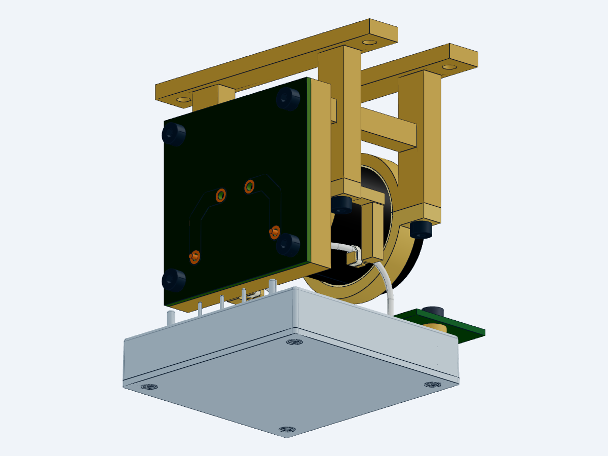

# WP10 V21 当前线束固定结构工作件

已清理内存并恢复串行工程化。当前是同一候选的局部固定结构增量；整机详细设计仍有开放项，最后封装发布保持 V18。

- 三态各 974 行：保留 V20 父清单的 971 行，替换 C203 下夹环 B，增加两条绑扎带。
- 生成 27 个源实例的局部装配，原生检查 34 个层级实例、0 失败。
- 每态 17 组精确邻件检查通过；六处鞍座／带环／导线名义接触无体积穿透。
- 原下夹环材料移除 0 mm³，新增 747.067937 mm³。新增结构到夹紧螺钉头最小名义间隙 0.559017 mm。
- 33 行 C203 安装 BOM 已覆盖当前板、夹环、两根导线及两段绑扎带，路径和 SHA256 重新绑定。
- 原理图与 PCB 源保持；沿用源哈希一致的 V20 ERC 0 错误／0 警告、C203 DRC 0 违规。V21 没有重跑电气检查。

[交互查看](http://127.0.0.1:3245/F:/China%20Graduate%20Future%20Flight%20Vehicle%20Innovation%20Competition/01_project/competition/SERVICE_ROBOT_MECHANICAL_CONSOLIDATION_20260905/runs/wp10_mechatronic_closure_20260908/implementation?file=mechanical%2Fcap_harness_retained_assembly_v21.step.py) · [装配 STEP](mechanical/cap_harness_retained_assembly_v21.step) · [固定座 STEP](mechanical/cap_harness_lower_retained_v21.step) · [安装 BOM](mechanical/CAP_HARNESS_BOM_V21.csv) · [当前机器证据](results/CAP_RETENTION_WORKING_STATUS_V21.json)

可用直段长约 3.985 mm，通道宽 2.1 mm，对 1.78 mm 最大宽度绑扎带留出 0.32 mm 总名义余量。已将通道底部接触边建为圆角。绑扎带采用 [HellermannTyton LTHT3A4NA 的公开尺寸](https://www.hellermanntyton.com/products/cable-ties-without-serration/ltht3a4na/174-00011)建立安装路径包络；它不是厂家提供的带结实体。每段 150 mm 是项目试制下料余量，不是实测结长或采购数量。

**尚未闭合的工程条件：** 5 N 假设载荷下窄桥的单梁筛查名义应力约 67.6 MPa；材料许用值、真实载荷、蠕变、疲劳与安装张力未确定，不判强度通过。目录 66 N 为带材拉力参数，不能作为带结强度或导线抗拉脱能力。带结包络和一小段螺丝刀轴包络只验证了局部空间，未验证实际结头、完整工具路径或操作手部空间。

主供电故障保护、停止／回生动态、热路径、电池／PMM及推进接口、整机公差与连续动作仍需继续。原 37 行闭环表、873／99 父本及历史 Gate 未因本轮局部检查升级。STEP 为可供 SolidWorks 导入的几何，本轮未生成新的原生 SLDASM。
