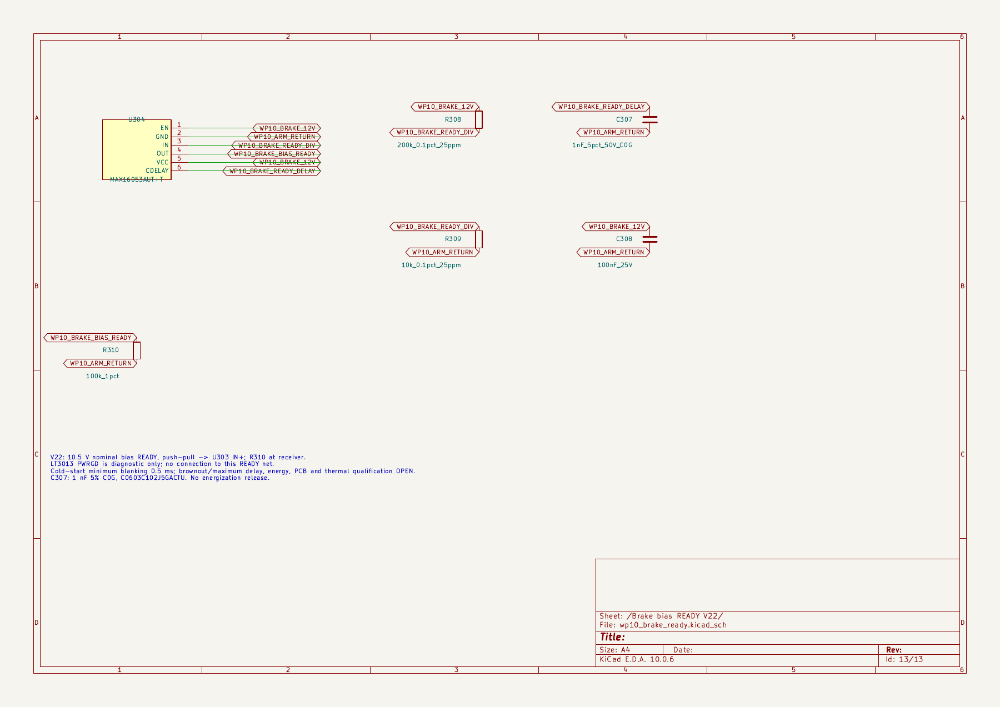

# WP10 V22：制动偏置 READY 接口已改件

2026-09-10 · 同一活动候选 · 机电整机闭环仍开放

内存清理后恢复工程检查。已关闭闲置 Windows 小组件，回收42个闲置工具及13个Claude进程的驻留页；Claude会话、Codex、系统服务保留。清理后连续可用内存为2.67/2.95/3.06GiB，超过2GiB启动门槛。原生任务采用串行内存保护。

本轮已通过KiCad MCP实际改动原生源：U303改为MAX5048CAUT+T；增加U304 MAX16053AUT+T、200k/10k分压、接收端100k下拉及延时/旁路电容，共新增6位号。LT3013 PG只作独立诊断，READY由偏置电压监测产生。绝对过压和独立STOP热故障连接保留。

|验证|本轮结果|范围|
|---|---|---|
|原生层级/网表|13页、207符号、521项通过|原99位号保留；原引脚仅U303.6改网|
|ERC|0错误、0警告；原4项忽略不变|首次误连/库路径问题已修复，失败记录保留|
|制动接口计算|124项通过|含5个数值反例；静态条件转用明列|
|启动与完整故障网|50项＋8项通过|同当前XML重新计算；不替代硬件试验|
|READY释放阈值|10.220577–10.782587V|名义10.5V，电阻/输入电流敏感性|
|READY高/低电平|≥10.367559V / ≤0.4V|输入负载条件转用；接收阈值2.0/0.8V|

[查看完整原生电气图纸，第13页为新增接口](ecad/wp10_system_v22.pdf) · [新增/变更器件表](ecad/BRAKE_ENABLE_BOM_DELTA_V22.csv) · [机器记录](results/WORKING_STATUS_V22.json)

C302改为22µF名义、要求有效≥10µF；C305改为2.2µF名义、要求有效≥1µF。有效电容、物料、偏压、温度及布局资格仍待核验。C307选定KEMET C0603C102J5GACTU。新增监测约8.246mW为32V声明场景下的敏感性账，计入原有未验证1W制动偏置预留；机械臂360W未降低。

首次连续冷启动的0.5ms禁止期与TLV6700的450µs有效等待分别绑定原厂条款。延时电容参数给出2.999–5.528ms敏感性范围，不能当作保证最大延时；暖启动残压、实际回生轨迹、驱动器热关断、总线寄生与电容仍开放。

机械模型保留V21每状态974实例；新增电气器件尚未布板或加入CAD。V18封存页和原37行表保持原样，旧XML绑定证据不冒充V22整机验收。下一项优先工作为主保护三类故障过程和SOA配合，并继续完成制动驱动/PCB与热路径验证。

依据：[MAX5048C Rev1](https://www.analog.com/media/en/technical-documentation/data-sheets/MAX5048C.pdf)、[MAX16053 Rev7](https://www.analog.com/media/en/technical-documentation/data-sheets/MAX16052-MAX16053.pdf)、[KEMET电容规格](https://search.kemet.com/component-documentation/download/specsheet/C0603C102J5GACTU)。ADI原厂正文已在线核阅，本地PDF下载超时，未编造归档哈希。
