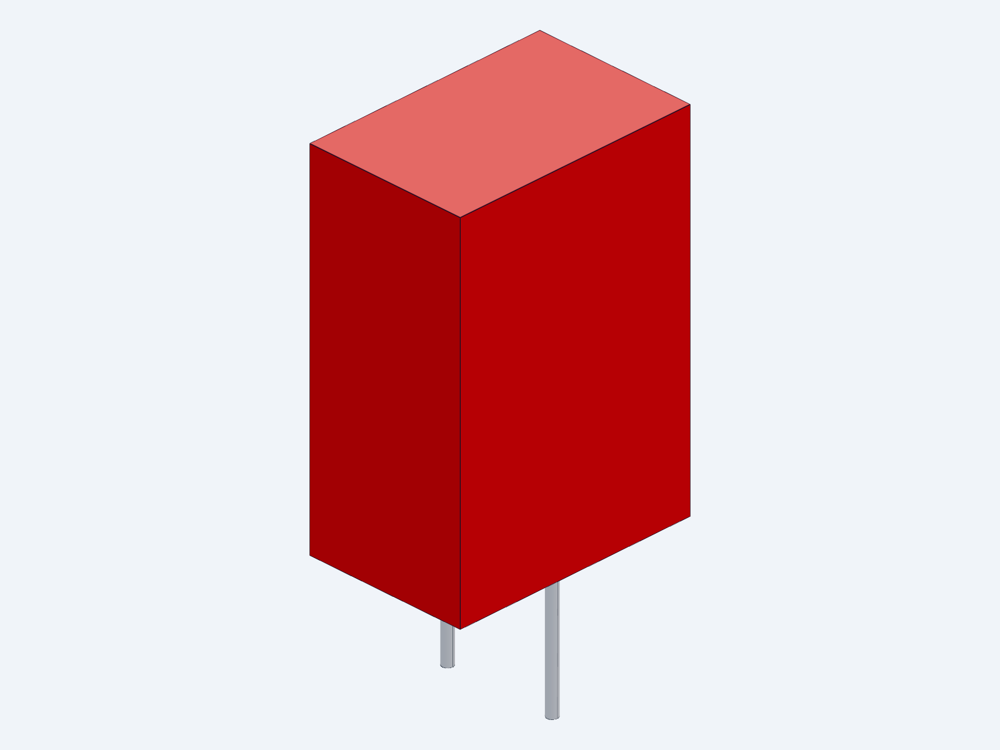

# WP10 V24：内存达标并恢复电气工程化

2026-09-10 · 同一活动候选 · 整机详细设计仍开放

本轮关闭1个空闲Windows小组件进程，回收13个桌面进程和42个工具进程的驻留页。最后连续可用内存为2.97 / 2.94 / 2.93GiB，高于2GiB启动门槛。驻留页可能随使用重新载入；原生检查仍逐次重查内存，并保留512MiB运行保护。

当前清理入口已改为核验同一用户与会话、CPU和I/O样本、真实进程句柄的创建时间与程序路径。结束范围仅为无可见窗口和子进程的已知后台小组件/预加载器；其他命中工具只回收驻留页。重复回执在动作前拒绝，回归检查已执行。旧V21/V22基础脚本仅留作历史，不应直接运行。

本轮已修改真实KiCad原理图、物料表、针脚表来源与生成器，完成以下6个具体型号绑定：

|位号|候选型号|名义规格|
|---|---|---|
|R203|TNPW060347K5BEEA|47.5kΩ，0.1%，25ppm/K|
|R204|TNPW06035K90BEEA|5.9kΩ，0.1%，25ppm/K|
|R205|TNPW0603120KBEEA|120.0kΩ，0.1%，25ppm/K|
|R206|TNPW060310K0BEEA|10.0kΩ，0.1%，25ppm/K|
|R207|TNPW060330K1BEEA|30.1kΩ，0.1%，25ppm/K|
|C201|MKP2C041001N00JSSD|1µF，初始±5%，63VDC|

C201封装采用Ø0.9圆孔加2.0×0.9镀槽，5mm中心距；原厂引出点节距为5±0.5mm。按明确的板孔/孔位/线径公差分配，计算剩余0.10mm节距余量。板厂公差和引脚实际公差尚未绑定，因此不授予制造合格结论。名义壳体7.2×11×16mm及两根引脚STEP已关联到封装，尚未加入974组件整机布置。

原生导出核验636项通过：207符号、13页、ERC 0错误/0警告，4项既有忽略规则未放宽，全部导出网络保持不变。首次MCP操作遗漏了不存在的Footprint字段，源文件已补齐，原失败证据已归档并重跑通过。原生KiCad也读取了实际圆孔、镀槽和3D模型引用。两页原理图与STEP快照已查看。

器件初始公差条件下，C201到故障阈值的计算时间为29.767–85.647ms；上电插入阈值时间为446.500–1456.010ms。上限使用原厂20°C/50V绝缘电阻向定时电压转用的欧姆模型，板面污染漏电和全温电容仍未验证。0.9–1.1µF是保留的有效电容设计要求，不因初始±5%料号确定而自动满足。

独立审阅指出的两处问题已修正：封装检查现在拒绝槽旋转90°、孔位移到6mm和圆孔过小；初始公差与温度变化采用乘法包络，同时更新UVLO、OVLO和采样电阻敏感性。新384工况复算仍为192冷态欠压、172退出限幅阶段、20预充中欠压。最慢已完成限幅前缀细化为13.626ms，不是完整上电时间上界。

Q201仍保留IXTH75N10L2。公开相近IXTH110N10L2材料也属Advance技术文件，不能据此解决保证SOA与实际壳温缺口。热保护、真实门极动态、完整PCB布置、物理试验以及推进同修订接口仍需继续；本轮没有把整机标为完成。

[查看13页原理图](ecad/wp10_system_v24.pdf) · [器件和定时计算](power/TIMER_PASSIVE_CALCULATIONS_V24.json) · [384工况](power/HOTSWAP_TRANSIENT_CALCULATIONS_V24.json) · [当前机器记录](results/WORKING_STATUS_V24.json) · [C201参数模型](mechanical/c201_mkp2_body_v24.step.py)

依据：[WIMA MKP2 03.26原厂目录](https://www.wima.de/wp-content/uploads/media/e_WIMA_MKP_2.pdf)、[Vishay TNPW e3 Rev10-Apr-2026](https://www.vishay.com/docs/28758/tnpw_e3.pdf)、[TI LM5069 RevG](https://www.ti.com/lit/ds/symlink/lm5069.pdf)。所有数值按报告声明条件使用。
