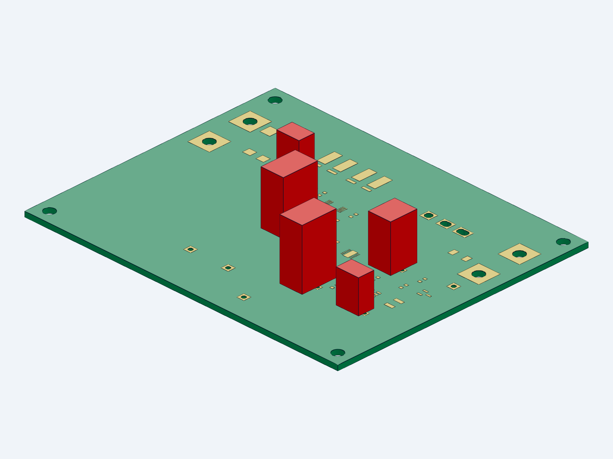

# WP10 V25：内存达标，输入保护板进入实际 PCB 布置

2026-09-10 · 同一活动候选 · **整机尚未交付，板件尚未制板放行**

本轮释放53个进程的驻留内存，未结束可见应用。没有找到符合关闭条件的闲置后台小组件或预加载器。清理后约3.15GiB；结束前连续可用内存为2.75 / 2.75 / 2.76GiB，2GiB启动门槛仍由每次原生启动重新核查。

已经把主输入保护、预充定时及CHB启动监督组成同一31位号PCB模块：100×80×1.6mm，4个M3安装孔，8个明确标为项目定义的线缆焊接/测试落点。模块直接读取当前207位号系统XML；没有另建原理图项目，C203和CHB既有端接板保持外部实例，独立辅助供电仍在主保险之前。

11个启动电阻和4个电容落实到完整料号；R215选0805、R218选1210以满足阻值系列范围。过时的MBR3100替换为原厂标为Active的STPS3H100U。两只二极管保持项目1=A、2=K，阴极标记明确靠pad2。新件的3A和75A/10ms规格不是整机钳位验证。

WSLP2726落实分开的功率盘和Kelvin盘，R201/R202本体高度分别为2.90/3.81mm。两条感测铜从外端窄盘独立接入U201，未取串联中点。Q201保留IXTH75N10L2，改用圆孔和横槽容纳引脚截面与节距分配；板厂公差、引脚整形、带电Drain散热片和SOA仍待完成。

原生原理图导出：207符号、13页、ERC 0错误/0警告，全部针脚网络与V24相同。启动和故障网复算50+8项通过，门极静态敏感性为5.337664–6.461819V；制动接口124项检查通过。以上不是整机功能试验。

C211为1.5µF/100V；C212由10µF名义占位改为4.7µF/100V，初始下限4.465µF大于3.3µF要求。已更新容量和ESR口径，未继承旧10µF掉电储能。全温有效容量、ESR及启动动态仍开放。

首次PCB检查发现R218与C213短路，以及U205地线靠近ADJ，均已改源重跑并保留失败证据。当前报告为**70项未连接错误＋1项丝印警告**；其余几何/短路错误0项。默认忽略规则为5项，报告已完整保留。不得把原理图ERC清零称作PCB布线完成。

[查看原生原理图](ecad/wp10_system_v25.pdf) · [PCB源](ecad/wp10_main_input.kicad_pcb) · [31位号布局表](power/MAIN_BOARD_PLACEMENT_V25.csv) · [实际DRC报告](results/MAIN_INPUT_BOARD_DRC_V25.json)

三维视图含真实板形/孔槽、矩形铜盘包络及5个薄膜电容名义外形；**没有包含半导体/电阻本体、Q201散热组件或线束**。铜盘仅作矩形包络，不能导出替代CAM。模型尚未装入974组件总装，873父本和原37行闭环表未改写。

下一步继续完成70项连接的布线、铜厚和高电流端接/Q201热支撑，并完成供电侧缓冲与热短路验证，再将此板实际装入当前整机布置。

资料：[STPS3H100U原厂状态](https://www.st.com/en/diodes-and-rectifiers/stps3h100.html)、[ST数据表](https://www.st.com/resource/en/datasheet/stps3h100.pdf)、[WIMA MKS2](https://www.wima.de/wp-content/uploads/media/e_WIMA_MKS_2.pdf)、[TNPW e3](https://www.vishay.com/docs/28758/tnpw_e3.pdf)。ST二进制本地下载超时；使用已读取的原厂在线资料，不填造本地PDF哈希。
