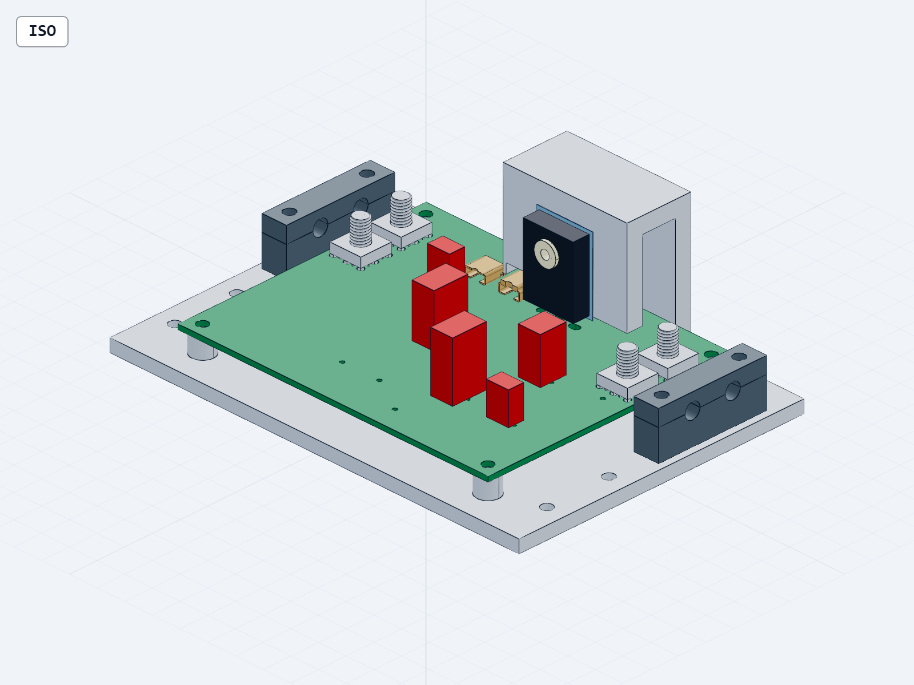

# WP10 V29 端接与载板改件

本轮已落实四个主电源实物端子、相关PCB改线和载板退让口，整机详细设计仍未闭环。原873组件/99位号父本、37行闭环表和V28整星974实例计划保留；未安装的主输入模块没有计入整星实例数。

- 系统211位号、677针脚网络记录；原207器件和673记录保持，新增J204–J207。
- ERC 0错误/0警告；DRC仍有4项分流电阻Kelvin分离焊盘未连接，其余错误/警告0。没有隐藏或短接这些焊盘。
- 四个74651195R真实九针端子；F201右移2mm、D202左移2mm并重布钳位线；B面回流走廊改为x18/82。
- 端子OEM模型安装偏移+0.5mm，修正支脚插入PCB的问题。R202原厂STEP与旧载板交叠16.3145mm³→0；最大包络间隙1.0mm。载板切除136.5mm³，未给额外散热信用。
- 局部模块24个有效实体、20个部件实例，已导出可供SolidWorks导入的STEP；没有生成原生SLDASM/SLDPRT。板上仍有23个位号未建机械实体，整舱位置未接纳。

15项电气审计、6项针对性几何检查、6项同版数值检查通过。只读复审提出的外包框假连通和DRC身份漏洞已修复。原联合包35项测试属于旧版本，没有复用为本轮测试数量。

全模块拓扑、闭合和方向检查通过；全模块布尔自交检查达到240秒超时，未取得通过信用。另对改动的载板和PCB做了包含自交的专项检查，两件均通过。

## 同版连续热工况

保持V28局部加厚散热板、25.2V/360W机械臂输出场景、原10mΩ线束与接点电阻分配及原示例环境。只将已记账损耗在板上和板外重新分配，没有重复增加电阻。+Y热连接仍为未实现的边界假设。

| 既有接点/线束损耗分到本板的比例 | 本板热耗W | CHB壳温°C | 105°C裕度°C |
|---:|---:|---:|---:|
| 0% | 18.53780 | 106.23286 | -1.23286 |
| 25% | 19.33415 | 106.58100 | -1.58100 |
| 50% | 20.13050 | 106.92731 | -1.92731 |
| 100% | 21.72319 | 107.61453 | -2.61453 |

以上均未通过连续运行要求。零比例不代表真实接点没有发热。任务轨道、接点电阻、热路径、臂/电池/回生热量尚未完全绑定。

## 原厂限制与剩余改件

[Wurth原厂PDF](https://www.we-online.com/components/products/datasheet/74651195R.pdf) Rev002.001（2022-02-21）的85A仅为20°C条件，受PCB、线耳和线径影响，不能作为本系统额定电流。9针同属一个实体电极。板厚1.6–2.0mm、2.2N·m安装要求需落实；专属条款不适用波峰焊。当前还需M5线耳/螺母/绝缘罩、抗扭支撑、成品板厚与铜厚、焊接和温升验证。项目保留工程样机候选性质。

还需补齐板上实体、重新收敛整舱位置和Q201真实热支撑；核验降损MOSFET的热态SOA与驱动后方可替换。推进仍缺同修订受控ICD，当前全臂逐关节质量惯量未绑定。未开展采购、接电、运动、充装或承压。

## 查看与复现

[交互CAD](http://127.0.0.1:3245/F:/China%20Graduate%20Future%20Flight%20Vehicle%20Innovation%20Competition/01_project/competition/SERVICE_ROBOT_MECHANICAL_CONSOLIDATION_20260905/runs/wp10_mechatronic_closure_20260908/implementation/coupled_closure?file=main_input_terminals_v29.step.py) · [主输入板SVG](MAIN_INPUT_BOARD_V29.svg) · [STEP](main_input_terminals_v29.step) · [完整电气BOM](ACTIVE_ELECTRICAL_BOM_V29.csv) · [针脚网络](PIN_NETWORKS_V29.csv)

入口CANDIDATE_V29.json绑定59项源；SOURCE_ACTIVATION_V29.json记录实际源替换。旧联合包40个文件保持原哈希，旧输入76文件快照保存在 implementation/history/20260910_V29_before_terminals/。旧CANDIDATE.json应按该历史快照复现，不能据当前已修改的原理图静默更新它的锁。

交付ZIP是当前WP10工作区的增量，依赖既有WP10源与本机受控运行环境。只校验文件可运行 tools/verify_terminal_delivery_v29.py；CAD重建应经现有run_cap19_serial.py守护运行CAD gen命令。不要再次执行prepare/activate脚本覆盖历史。

四视图已由根代理逐张查看。发布时可用内存2684.4MiB；原生任务串行，240秒超时与清理记录均保留。

