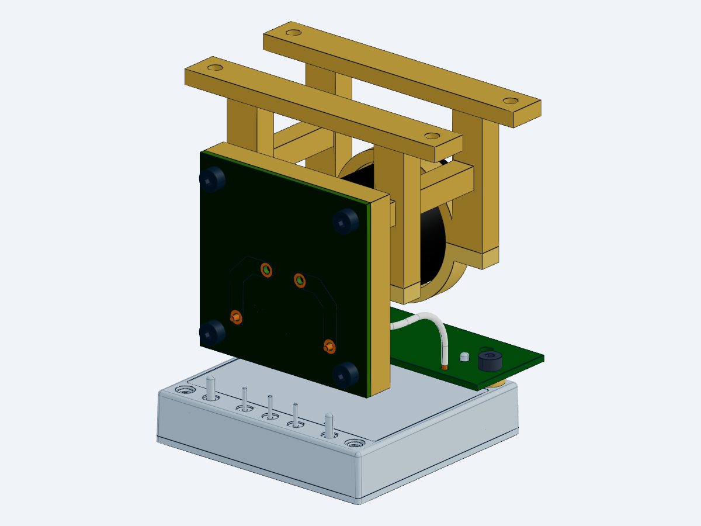

# WP10 V19 当前工作件：C203端接板与线束

本轮局部名义几何检查已完成；整机设计仍未完成。最后封装发布保持V18，原873组件／99位号父本及37行责任表保留。

| 当前对象 | 实际结果 |
|---|---|
| 原生PCB | WIRE两孔改为PTH；DRC从12降为6，余4项孔距与2项阻焊桥，均属于两处CAP孔群 |
| 分层STEP | PCB及两根导线已重生成，绑定同版本源和实际完成回执 |
| 螺钉与剥线 | 4颗M3×8头下平面X=-5.54；剥线4.2/3.6mm；C203端突出1.59mm |
| 当前集成 | 三态各972行：965行不变、5行修改、新增2线 |
| 精确几何 | 三态各31组邻件检查通过；每态9处名义接触通过 |
| 源检查 | 表面38项／14反例；线束22项／10反例；铜连接20项／5反例 |
| 电热计算 | 384状态、4800行替代热账，10反例通过；真实纹波仍未知 |

[打开可视化工作件](WORKING_V19.html) · [局部装配STEP](mechanical/cap_harness_assembly.step) · [PCB STEP](mechanical/input_cap_pcb.step)

[正线STEP](mechanical/cap_harness_plus.step) · [回线STEP](mechanical/cap_harness_minus.step) · [972行清单](mechanical/CAP_HARNESS_INSTANCE_PLAN_V19.json)

[精确检查](results/CAP_HARNESS_EXACT_V19.json) · [原生DRC](results/CAP_TERMINAL_DRC_NATIVE_V19.json) · [当前工作状态](results/CAP_HARNESS_WORKING_STATUS_V19.json)

这是17个源实例的局部装配视图。原生检查跳过全局自交扫描；干涉证据限定本轮5改件和2导线、三种静态状态，未重复资格化其余965行。接触为名义几何，真实密封胶、板平整度、孔桶、焊点及预紧未资格化。

仍需完成：两处CAP孔的工艺一致性；线束卡箍／应变释放和焊接工具空间；CHB板局部表面；整机热路径、电池／PMM、推进同修订接口及任务能力。尚不能交付制造或据此宣称整星飞行设计完成。

首遍exact与assembly有8.813819秒排程重叠，已保留记录并完成串行重跑。后续本任务只经tools/run_cap19_serial.py入口启动原生作业；该入口保留2GiB启动、512MiB下限、自有子树1400MiB上限，不宣称能阻止所有外部直接启动入口。详见[排程修正记录](results/C203_NATIVE_SERIAL_CORRECTION_V19.json)。
