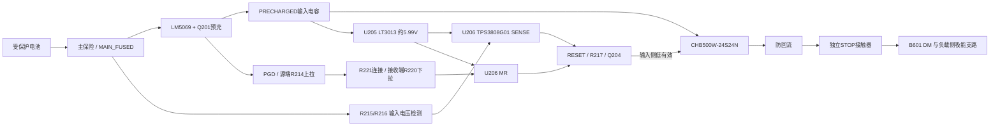

# WP10 输入侧启动与完整故障网预算

本轮新增17个器件，保持原99位号。已接入真实KiCad源和BOM；物理启动、掉电、停止与制造验收尚未完成。

U205接预充电容，U206检测主保险之后、预充开关之前的电压。已充电的电容不代替输入电源有效证明。CHB启动不读取自己的输出、机械臂母线或RUN_LATCH；其输出建立不代表K1闭合。J201只是测试点，不配置短接跳线。

|对象|同源计算结果|适用范围|
|---|---|---|
|启动偏置|名义5.990349V，敏感性5.763940–6.220681V|LT偏流和电阻条件见JSON|
|输入欠压|下降15.128097–15.980952V；释放上界筛选16.460099V|独立于预充PGD，不是主功率UVLO替代|
|PGD低态|最大下拉筛选1.882697mA|含MR内部最小70k上拉；2mA测试条件迁移仍有界|
|PGD连接开路|MR最高0.784380V|R221或其下游断开；不覆盖U201内部开漏失效|
|门极与RESET共网|5.338939–6.462169V|同时核对5V导通电阻测试点与RESET6.5V工作上限|
|完整故障网|11个开漏＋输入，9.7µA合计；RAW最低3.103610V|静态敏感性清点；连续阈值、低态、时延和线缆漏电未形成保证|

Q204选择Diodes Incorporated的2N7002K-7。没有混用Nexperia旧器件参数：采用10µA门漏电与5V门驱下3Ω规格，重新调整R211=38.3k、R217=33k。门漏电正负角点都保留；原56k导致RESET过压的反例已留在计算JSON。器件电流与温度测试点的迁移是敏感性分析，不是厂家对本电路的新保证。

TPS3808的CT悬空12–28ms是规定负载下的释放延迟，不能作为关断最长时间。MR关断150ns、SENSE关断20µs只有典型值；实际MOS负载和POR15µA条件不匹配。低偏置而输入电容有电、门极耦合及关态漏电仍需继续设计与验证。

输入侧新增0.25W预留在主输入电流增量场景单独计入，不经过CHB效率重复折算；臂任务360W、制动输出偏置1W预留和独立STOP16.8W保持。预留不冒称器件最大功耗保证。

V22制动侧保持LT3013偏置及TLV6700绝对过压检测，新增MAX16053偏置监测并改用MAX5048C分立源/灌驱动。PG诊断网已从IN+断开。接口预算见BRAKE_READY_CALCULATIONS_V22.json；首次冷启动与静态电平预算不能代替掉电重启、最坏回生等待和热关断验证。此前TPS3760比较中，27.44V阈值下20%过驱为32.928V；该历史反例保留。

结果：50项启动静态/原生反例检查和8项故障网清点通过。完整机电设计仍开放。复建tools/build_power.py，原生导出tools/verify_power_loop.py，再运行tools/verify_startup_and_fault.py；封存父本保持不变。

来源：[Cincon数据表](../sources/cincon_chb500w.pdf)、[Cincon应用说明](https://www.cincon.com/productdownload/CHB500W-series-application-note.pdf)、[LT3013](https://www.analog.com/media/en/technical-documentation/data-sheets/3013fe.pdf)、[TPS3808](https://www.ti.com/lit/ds/symlink/tps3808.pdf)、[LM5069](https://www.ti.com/lit/ds/symlink/lm5069.pdf)、[Diodes 2N7002K](https://www.diodes.com/datasheet/download/2N7002K.pdf)、[TPS3431](https://www.ti.com/lit/ds/symlink/tps3431.pdf)、[TPS3760](https://www.ti.com/lit/ds/symlink/tps3760.pdf)。已归档文件SHA见sources/STARTUP_SOURCE_MANIFEST.json。Diodes官方PDF在线正文已核阅，本地下载403；不填造二进制归档哈希。
