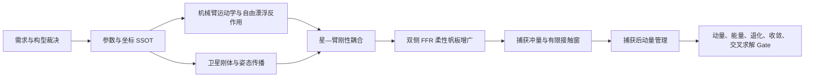

# 当前任务动力学建模与验证全过程逻辑梳理

> 审计日期：2026-08-12  
> 审计基线：Git `5c5addea00ddb70d86a5cc37a88bbcda50350e43`  
> 对象：12U 服务航天器、B601 六自由度机械臂、双侧柔性帆板及捕获目标  
> 范围：模型选择、方程建立、模块演化、场景连接、机器验证、控制接口与当前限制  
> 总体状态：`LIMITED + FROZEN`；现有冻结结果可在原合同内引用，但当前工作树存在路径和冻结哈希漂移，不能表述为“已在当前 HEAD 重新复现”

## 0. 核心结论

当前项目的动力学主线已经从早期平面两杆模型，发展为“中心刚体—B601 六自由度机械臂—双侧 FFR 柔性帆板—捕获目标”的统一最小坐标模型。其逻辑可以归纳为五层：

1. 用 B601 接受版 URDF 建立机械臂运动学、质量惯量与自由漂浮反作用模型；
2. 用六自由度刚体方程描述服务星本体，并以动量守恒建立捕获前后状态映射；
3. 用分块质量矩阵把卫星、机械臂和柔性帆板装配为统一双向耦合系统；
4. 用柔性 Delassus 算子和有限接触窗把捕获冲量接入耦合系统；
5. 用动量、能量、退化、收敛和交叉求解五类 Gate 验证模型内部一致性。

当前最重要的状态判断为：

\[
\boxed{
\begin{aligned}
&\text{已建立：星体刚体—6R 机械臂—双 FFR 帆板—捕获目标双向耦合模型},\\
&\text{已通过：暂定参数合同内的 }G1\text{--}G5,\\
&\text{尚未完成：硬件参数冻结、连续接触认证、整星 ANCF 认证和柔性安全域认证}.
\end{aligned}}
\]

必须始终区分：

\[
\boxed{
\text{冻结 Gate 通过}
\neq
\text{当前 HEAD 可复跑通过}
\neq
\text{硬件有效}
\neq
\text{在轨安全已证明}}
\]

## 1. 全过程逻辑主线

### 1.1 关键建模裁决

- 中心航天器采用六自由度刚体，不采用质点。原因是质点会消除机械臂安装偏置的力矩通道，无法表达已冻结的基座反作用。
- 机械臂作为浮动基座树形多体系统的一条分支嵌入，不作为独立外载荷附加。
- 作业段柔性采用浮动坐标法与截断模态；捕获瞬态保留 ANCF 组件级对标，但当前整星主线仍为 FFR。
- 主线采用最小坐标 ODE；NCF 与 ANCF 的绝对坐标 DAE 路线保留为后续独立交叉验证，不是当前批量求解器。

### 1.2 模块演化

| 阶段 | 模块 | 解决的问题 | 当前角色 |
|---|---|---|---|
| 早期反作用 | `sim_03_arm_reaction` | 平面两杆机械臂引起的基座转动 | `SUPERSEDED`，历史对照 |
| 真实 6R 刚性锚 | `sim_05_free_floating_arm` | B601 六自由度自由漂浮反作用与广义雅可比 | `VERIFIED + FROZEN`，刚性退化锚 |
| 捕获冲量 | `common/capture_impulse.py`、`sim_06_capture_impulse` | 完全塑性捕获后的组合动量与角速度 | 冻结矢量冲量锚，但捕获栈仍为旧两杆构型 |
| 柔性组件 | `sim_07_ancf_flexible` | 帆板捕获激振与组件级 ANCF 响应 | `LIMITED`，组件退化对标 |
| 消旋预算 | `sim_08_detumble_actuator_budget` | 轮组储能和推力器外移角动量预算 | `LIMITED + FROZEN` |
| 全耦合主线 | `sim_11_coupled_dynamics` | 星体、B601、双 FFR 帆板与目标统一动力学 | `SIM11_GATES_PASS_WITH_PROVISIONAL_PARAMS` |
| 基座控制 | `control_02_base_attitude` | 反作用轨迹、轮组分配和暂定执行器时窗 | 冻结 `PASS`，对外限于 `PASS_WITH_PROVISIONAL_SCOPE` |

## 2. 坐标系、符号与统一约定

### 2.1 坐标系

| 符号 | 含义 |
|---|---|
| \(I\) | 惯性坐标系 |
| \(S\) | 服务星本体系，基座动力学表达系 |
| \(M\) | 机械臂安装面坐标系 |
| \(A_0\) | B601 `base_link` 坐标系，名义上与 \(M\) 重合 |
| \(E\) | 末端任务坐标系，轴向与 `link6` 对齐 |
| \(F_L,F_R\) | 左、右帆板根部坐标系 |
| \(T\) | 捕获目标本体系 |
| \(C\) | 组合系统质心 |
| \(O_I\) | 惯性系原点 |

冻结安装变换为

\[
{}^{S}\mathbf t_M=
\begin{bmatrix}
0.18525&0&0
\end{bmatrix}^{T}\ \mathrm m,
\]

\[
{}^{S}\mathbf R_M
=\mathbf R_y\!\left(90^{\circ}\right)
=
\begin{bmatrix}
0&0&1\\
0&1&0\\
-1&0&0
\end{bmatrix},
\qquad
{}^{M}\mathbf T_{A_0}=\mathbf I_4.
\]

因此

\[
+Z_M=+X_S,
\qquad
+Y_M=+Y_S,
\qquad
+X_M=-Z_S.
\]

末端原点相对 `link6` 为

\[
{}^{6}\mathbf p_E=
\begin{bmatrix}
0&0&0.15971
\end{bmatrix}^{T}\ \mathrm m.
\]

### 2.2 叉乘矩阵

对任意向量

\[
\mathbf a=
\begin{bmatrix}
a_x&a_y&a_z
\end{bmatrix}^{T},
\]

定义

\[
[\mathbf a]_{\times}=
\begin{bmatrix}
0&-a_z&a_y\\
a_z&0&-a_x\\
-a_y&a_x&0
\end{bmatrix},
\qquad
[\mathbf a]_{\times}\mathbf b=\mathbf a\times\mathbf b.
\]

### 2.3 统一广义坐标与拟速度

全耦合模型采用

\[
\mathbf q=
\begin{bmatrix}
{}^{I}\mathbf r_b\\
{}^{I}\mathbf q_b\\
\boldsymbol\theta\\
\boldsymbol\eta_L\\
\boldsymbol\eta_R
\end{bmatrix},
\]

\[
\mathbf u=
\begin{bmatrix}
{}^{S}\mathbf v_b\\
{}^{S}\boldsymbol\omega_b\\
\dot{\boldsymbol\theta}\\
\dot{\boldsymbol\eta}_L\\
\dot{\boldsymbol\eta}_R
\end{bmatrix}.
\]

其中

\[
\boldsymbol\theta=
\begin{bmatrix}
\theta_1&\theta_2&\cdots&\theta_6
\end{bmatrix}^{T},
\]

\[
\boldsymbol\eta_p=
\begin{bmatrix}
\eta_{p,1}&\eta_{p,2}&\cdots&\eta_{p,m}
\end{bmatrix}^{T},
\qquad p\in\{L,R\}.
\]

四元数采用标量在前形式

\[
{}^{I}\mathbf q_b=
\begin{bmatrix}
q_0&q_1&q_2&q_3
\end{bmatrix}^{T},
\qquad
{}^{I}\mathbf q_b^{T}{}^{I}\mathbf q_b=1.
\]

基座运动学为

\[
{}^{I}\dot{\mathbf r}_b
=
{}^{I}\mathbf R_S\,{}^{S}\mathbf v_b,
\]

\[
{}^{I}\dot{\mathbf q}_b
=
\frac{1}{2}
{}^{I}\mathbf q_b\otimes
\begin{bmatrix}
0\\
{}^{S}\boldsymbol\omega_b
\end{bmatrix}.
\]

## 3. 分层假设与适用域

### 3.1 共同假设

- 研究对象从终端接近与捕获阶段开始，完整轨道交会动力学不是当前 Gate 的组成部分。
- 短时自由漂浮段忽略环境外力与外力矩；捕获窗和推力器工作段再显式加入外部广义力或外部角冲量。
- 服务星中心体按刚体处理，机械臂连杆按刚体处理。
- 抓取准备状态下夹爪两指锁定，并刚性并入 `link6`。
- 机械臂质量惯量采用混合 URDF，置信度为 medium；整星和目标质量惯量采用低置信度冻结预算，不是实测飞行真值。

### 3.2 分阶段模型边界

| 阶段 | 机械臂 | 帆板 | 接触 | 执行器 |
|---|---|---|---|---|
| 慢速臂机动 | 6R 刚体，规定轨迹 | 线性 FFR | 无 | 关节力矩仅回算 |
| 理想捕获瞬间 | 关节抱闸 | FFR 模态参与冲量分配 | 完全塑性 6D 或 3D 冲量 | 无 |
| 有限接触窗 | 关节抱闸 | FFR | 规定半正弦等冲量窗 | 无闭环接触控制 |
| 捕获后自由运动 | 关节与目标刚性锁定 | FFR | 已锁定 | 无外力矩 |
| 捕获后动量管理 | 组合刚体账本 | 正式判据中仍为未知 | 不再求接触力 | 轮组储能、推力器外移 |

## 4. 机械臂动力学模型

### 4.1 B601 拓扑与惯性边界

B601 动力学链为六个转动关节：

\[
\mathcal J_{\mathrm{arm}}
=
\{J_1,J_2,J_3,J_4,J_5,J_6\}.
\]

局部关节轴为

\[
\mathbf a_2=
\begin{bmatrix}
0&0&-1
\end{bmatrix}^{T},
\]

\[
\mathbf a_i=
\begin{bmatrix}
0&0&1
\end{bmatrix}^{T},
\qquad i\in\{1,3,4,5,6\}.
\]

夹爪刚性并入 `link6` 后，末端复合质量为

\[
m_{6c}
=0.3663
+0.181800159145243
+0.0423278952416158
+0.0423278949561274
=0.6327559493429862\ \mathrm{kg}.
\]

机械臂总动力学质量为

\[
m_{\mathrm{arm}}=4.695555949342986\ \mathrm{kg}.
\]

冻结刚性模型的基座和系统质量为

\[
m_{\mathrm{base}}=24.0+1.2=25.2\ \mathrm{kg},
\]

\[
m_{\mathrm{sys}}=m_{\mathrm{base}}+m_{\mathrm{arm}}
=29.895555949342986\ \mathrm{kg}.
\]

### 4.2 正运动学

URDF 固定轴 RPY 约定为

\[
\mathbf R_{\mathrm{rpy}}
=\mathbf R_z(\psi)\mathbf R_y(\vartheta)\mathbf R_x(\phi).
\]

绕关节轴的旋转采用 Rodrigues 公式：

\[
\mathbf R(\mathbf a_i,\theta_i)
=\mathbf I_3
+\sin\theta_i[\mathbf a_i]_{\times}
+\left(1-\cos\theta_i\right)[\mathbf a_i]_{\times}^{2}.
\]

第 \(i\) 个连杆的位姿递推为

\[
{}^{S}\mathbf T_i
=
{}^{S}\mathbf T_{i-1}
{}^{i-1}\mathbf T_{J_i}
\begin{bmatrix}
\mathbf R(\mathbf a_i,\theta_i)&\mathbf 0\\
\mathbf 0^{T}&1
\end{bmatrix}.
\]

末端位姿为

\[
{}^{S}\mathbf T_E
=
{}^{S}\mathbf T_6
\begin{bmatrix}
\mathbf I_3&{}^{6}\mathbf p_E\\
\mathbf 0^{T}&1
\end{bmatrix}.
\]

### 4.3 末端几何雅可比

令第 \(i\) 个关节在 \(S\) 系中的轴和原点为 \(\mathbf a_i\) 与 \(\mathbf o_i\)，末端原点为 \(\mathbf p_E\)，则

\[
\mathbf J_m(\boldsymbol\theta)
=
\begin{bmatrix}
\mathbf a_1\times(\mathbf p_E-\mathbf o_1)&\cdots&
\mathbf a_6\times(\mathbf p_E-\mathbf o_6)\\
\mathbf a_1&\cdots&\mathbf a_6
\end{bmatrix}.
\]

固定基座时

\[
{}^{S}\mathbf V_E
=
\mathbf J_m\dot{\boldsymbol\theta}.
\]

位置任务雅可比为

\[
\mathbf J_p=\mathbf J_m(1\!:\!3,:).
\]

对五维轴对称任务，工具轴为

\[
\mathbf a={}^S\mathbf R_E\mathbf e_z,
\]

轴对齐误差为

\[
\mathbf e=\mathbf a\times\mathbf a_d.
\]

若

\[
\mathbf N=
\begin{bmatrix}
\mathbf n_1^{T}\\
\mathbf n_2^{T}
\end{bmatrix},
\qquad
\mathbf n_1,\mathbf n_2\perp\mathbf a_d,
\]

则当前实现的五维任务雅可比为

\[
\mathbf J_5=
\begin{bmatrix}
\mathbf J_p\\
\mathbf N[\mathbf a_d]_{\times}[\mathbf a]_{\times}\mathbf J_{\omega}
\end{bmatrix}.
\]

### 4.4 连杆质心与惯量递推

对第 \(k\) 个连杆，质心和惯量在 \(S\) 系中为

\[
\mathbf c_k
=
\mathbf p_k+\mathbf R_k\,{}^{k}\mathbf c_k,
\]

\[
{}^{S}\mathbf I_k
=
\mathbf R_k{}^{k}\mathbf I_k\mathbf R_k^{T}.
\]

其质心部分速度雅可比满足

\[
\mathbf J_{v,k}^{(:,i)}
=
\mathbf a_i\times(\mathbf c_k-\mathbf o_i),
\qquad i\leq k,
\]

\[
\mathbf J_{\omega,k}^{(:,i)}=\mathbf a_i,
\qquad i\leq k,
\]

且对 \(i>k\) 有

\[
\mathbf J_{v,k}^{(:,i)}=\mathbf 0,
\qquad
\mathbf J_{\omega,k}^{(:,i)}=\mathbf 0.
\]

多个刚体的质量、质心和质心惯量合成为

\[
m=\sum_i m_i,
\qquad
\mathbf c=\frac{\sum_i m_i\mathbf c_i}{m},
\]

\[
\mathbf I_c
=
\sum_i
\left[
\mathbf I_i
+m_i
\left(
\|\mathbf d_i\|^2\mathbf I_3
-\mathbf d_i\mathbf d_i^{T}
\right)
\right],
\qquad
\mathbf d_i=\mathbf c_i-\mathbf c.
\]

### 4.5 自由漂浮动量方程

对第 \(k\) 个刚体，质心速度与角速度为

\[
\mathbf v_{c,k}
=
\mathbf v_b
+\boldsymbol\omega_b\times\mathbf c_k
+\mathbf J_{v,k}\dot{\boldsymbol\theta},
\]

\[
\boldsymbol\omega_k
=
\boldsymbol\omega_b
+\mathbf J_{\omega,k}\dot{\boldsymbol\theta}.
\]

系统线动量和关于 \(S\) 原点的角动量为

\[
\mathbf P
=
\sum_k m_k\mathbf v_{c,k},
\]

\[
\mathbf L_S
=
\sum_k
\left(
\mathbf I_k\boldsymbol\omega_k
+m_k\mathbf c_k\times\mathbf v_{c,k}
\right).
\]

定义空间动量

\[
\mathbf h_S=
\begin{bmatrix}
\mathbf P\\
\mathbf L_S
\end{bmatrix},
\]

\[
\boxed{
\mathbf h_S
=
\mathbf H_{bb}(\boldsymbol\theta)\mathbf V_b
+\mathbf H_{bm}(\boldsymbol\theta)\dot{\boldsymbol\theta}}
\]

其中

\[
\mathbf V_b=
\begin{bmatrix}
\mathbf v_b\\
\boldsymbol\omega_b
\end{bmatrix}.
\]

`sim_05` 采用单位速度法逐列装配

\[
\begin{bmatrix}
\mathbf H_{bb}&\mathbf H_{bm}
\end{bmatrix}
\in\mathbb R^{6\times12}.
\]

零初始动量、无外部冲量时

\[
\mathbf h_S=\mathbf 0,
\]

故

\[
\boxed{
\mathbf V_b
=
-\mathbf H_{bb}^{-1}\mathbf H_{bm}\dot{\boldsymbol\theta}}
\]

机械臂耦合动量

\[
\mathbf h_m=\mathbf H_{bm}\dot{\boldsymbol\theta}
\]

是空间动量项，不是关节力矩或安装点反力旋量。

### 4.6 广义雅可比

基座速度到末端速度的映射为

\[
\mathbf J_b=
\begin{bmatrix}
\mathbf I_3&-[\mathbf r_E]_{\times}\\
\mathbf 0&\mathbf I_3
\end{bmatrix}.
\]

末端速度满足

\[
{}^{S}\mathbf V_E
=
\mathbf J_b\mathbf V_b
+\mathbf J_m\dot{\boldsymbol\theta}.
\]

代入零动量约束，得到

\[
\boxed{
\mathbf J_g
=
\mathbf J_m
-\mathbf J_b\mathbf H_{bb}^{-1}\mathbf H_{bm}}
\]

以及

\[
{}^{S}\mathbf V_E
=
\mathbf J_g\dot{\boldsymbol\theta}.
\]

### 4.7 基座位姿积分与基准轨迹

最小跃度形函数为

\[
\xi=\frac{t}{T},
\qquad
s(\xi)=10\xi^3-15\xi^4+6\xi^5,
\]

\[
\dot s(\xi)
=
\frac{30\xi^2-60\xi^3+30\xi^4}{T}.
\]

关节轨迹为

\[
\boldsymbol\theta(t)
=
\boldsymbol\theta_0
+s(\xi)
\left(
\boldsymbol\theta_f-\boldsymbol\theta_0
\right).
\]

基准工况为

\[
\theta_2:0\rightarrow60^{\circ},
\qquad
\theta_3:0\rightarrow-40^{\circ},
\qquad
T=8\ \mathrm s,
\]

其余关节保持为零，随后保持至

\[
t=12\ \mathrm s.
\]

基座位姿采用 DOP853 积分，容差为

\[
\mathrm{rtol}=10^{-11},
\qquad
\mathrm{atol}=10^{-13}.
\]

### 4.8 机械臂冻结结果与边界

冻结 `sim_05` 基准结果为

\[
\Delta\theta_{b,\max}=19.199852^{\circ},
\]

\[
\boldsymbol\Theta_{b,f}
=
\begin{bmatrix}
0.027908^{\circ}&19.199832^{\circ}&0.001089^{\circ}
\end{bmatrix}^{T},
\]

\[
\max
\left\|
\left(
\mathbf H_{bm}\dot{\boldsymbol\theta}
\right)_{\mathrm{linear}}
\right\|
=0.1601588\ \mathrm{kg\,m/s},
\]

\[
\max
\left\|
\left(
\mathbf H_{bm}\dot{\boldsymbol\theta}
\right)_{\mathrm{angular}}
\right\|
=0.089133\ \mathrm{kg\,m^2/s}.
\]

闭合关节循环产生非零几何相位：

\[
\Delta\phi_b=2.6168^{\circ}.
\]

惯性系总动量残差为

\[
\varepsilon_h=7.290\times10^{-17}.
\]

需保留以下限制：

- `sim_05` 只计算动量级反作用，不建立电机、减速器、关节柔性和摩擦模型；
- `sim_05` 不求完整关节驱动力矩；
- \(\theta_2=60^{\circ}\) 超出当前 URDF 中 `joint2` 的飞行限位，仅为动力学对比工况；
- 冻结输出中的 `max_base_CoM_shift` 实际为 \(S\) 原点平移，正确物理名称应为

\[
\max_t\left\|{}^{I}\mathbf r_b(t)\right\|
\approx4.94\ \mathrm{mm};
\]

- `sim_03` 方程中真正参与动力学的两杆质量为

\[
m_1+m_2=0.8+0.5=1.3\ \mathrm{kg},
\]

而历史比较文字使用的

\[
1.6\ \mathrm{kg}
\]

还包含未进入 `sim_03` 方程的基座连杆质量，因而旧、新模型倍率不能解释为严格同口径质量缩放。

## 5. 卫星刚体动力学模型

### 5.1 平动、转动与姿态

卫星刚体状态可写为

\[
\mathbf x_S=
\begin{bmatrix}
{}^{I}\mathbf r_b\\
{}^{I}\mathbf v_b\\
{}^{I}\mathbf q_b\\
{}^{S}\boldsymbol\omega_b
\end{bmatrix}.
\]

其中 \({}^{I}\mathbf q_b\) 表示从 \(S\) 系到 \(I\) 系的单位四元数，与第 2 节的统一记号相同。

平动方程为

\[
{}^{I}\dot{\mathbf r}_b={}^I\mathbf v_b,
\qquad
m_S{}^{I}\dot{\mathbf v}_b={}^I\mathbf F_{\mathrm{ext}}.
\]

转动方程为

\[
\boxed{
\mathbf I_S{}^S\dot{\boldsymbol\omega}_b
+{}^S\boldsymbol\omega_b\times
\left(
\mathbf I_S{}^S\boldsymbol\omega_b
\right)
=
{}^S\boldsymbol\tau_{\mathrm{ext}}}
\]

无外力矩时

\[
{}^S\dot{\boldsymbol\omega}_b
=
-\mathbf I_S^{-1}
\left[
{}^S\boldsymbol\omega_b\times
\left(
\mathbf I_S{}^S\boldsymbol\omega_b
\right)
\right].
\]

姿态运动学为

\[
{}^I\dot{\mathbf q}_b
=
\frac{1}{2}
{}^I\mathbf q_b\otimes
\begin{bmatrix}
0\\
{}^S\boldsymbol\omega_b
\end{bmatrix}.
\]

惯性系角动量和转动动能为

\[
{}^I\mathbf H
=
{}^I\mathbf R_S({}^I\mathbf q_b)
\mathbf I_S{}^S\boldsymbol\omega_b,
\]

\[
T_R
=
\frac{1}{2}
{}^S\boldsymbol\omega_b^{T}
\mathbf I_S
{}^S\boldsymbol\omega_b.
\]

无外力矩时

\[
\frac{\mathrm d}{\mathrm dt}\|{}^I\mathbf H\|=0,
\qquad
\frac{\mathrm dT_R}{\mathrm dt}=0.
\]

基座相对初始姿态的误差四元数为

\[
\mathbf q_e(t)
=
\left({}^I\mathbf q_b(0)\right)^{-1}
\otimes{}^I\mathbf q_b(t).
\]

对归一化后的误差四元数

\[
\mathbf q_e=
\begin{bmatrix}
q_{e,0}&\mathbf q_{e,v}^{T}
\end{bmatrix}^{T},
\]

基座总姿态偏差采用四元数主转角：

\[
\theta_{\mathrm{dev}}
=
2\arccos
\left[
\operatorname{clip}
\left(
|q_{e,0}|,0,1
\right)
\right].
\]

### 5.2 冻结整星参数与柔性质量拆分

冻结整星刚体行为

\[
m_S=24.0\ \mathrm{kg},
\]

\[
\mathbf r_{c,S}
=
\begin{bmatrix}
-0.00242&0&0.00057
\end{bmatrix}^{T}\ \mathrm m,
\]

\[
\mathbf I_S=
\begin{bmatrix}
0.227567&0&-0.000745\\
0&0.353651&0\\
-0.000745&0&0.386162
\end{bmatrix}
\ \mathrm{kg\,m^2}.
\]

柔性主线采用质量拆分

\[
m_{\mathrm{bus}}+2m_{\mathrm{panel}}
=23.3032134+2(0.3483933)
=24.0\ \mathrm{kg}.
\]

上述数字属于低置信度冻结仿真参数；现行 V2 机械设计包尚未获得动力学质量惯量权威，因此不能称为硬件最终值。

### 5.3 内外动量分账原则

为避免“星体本体”和“除轮组外全部刚体”混用，统一定义非轮组角动量

\[
{}^I\mathbf H_{\mathrm{nonwheel}}
=
{}^I\mathbf H_{\mathrm{bus}}
+{}^I\mathbf H_{\mathrm{arm}}
+{}^I\mathbf H_{\mathrm{flex}}
+{}^I\mathbf H_{\mathrm{target}},
\]

其中捕获前若目标不属于追踪星控制系统，则相应目标项不计入该系统边界。组合系统总角动量为

\[
{}^I\mathbf H_{\mathrm{tot}}
=
{}^I\mathbf H_{\mathrm{nonwheel}}
+{}^I\mathbf h_w.
\]

内部构件只重新分配总角动量：

\[
\Delta{}^I\mathbf H_{\mathrm{tot}}
=\mathbf 0
\qquad
\text{若}
\qquad
\Delta{}^I\mathbf H_{\mathrm{ext}}=\mathbf 0.
\]

只有外部力矩满足

\[
\Delta{}^I\mathbf H_{\mathrm{tot}}
=
\int_{t_0}^{t_1}
{}^I\boldsymbol\tau_{\mathrm{ext}}(t)\,\mathrm dt.
\]

若改用本体系分量，则输运项不可省略：

\[
{}^S\dot{\mathbf H}_{\mathrm{tot}}
+{}^S\boldsymbol\omega_b\times{}^S\mathbf H_{\mathrm{tot}}
=
{}^S\boldsymbol\tau_{\mathrm{ext}}.
\]

因此反作用轮可以存储或转移动量，但不能从封闭系统中移除总角动量；推力器角冲量可以改变总角动量。

## 6. 捕获前后刚体动力学

### 6.1 捕获前状态

冻结捕获工况把目标质心置于惯性系原点：

\[
\mathbf r_t^{-}=\mathbf 0,
\qquad
\mathbf v_t^{-}=\mathbf 0.
\]

目标翻滚角速度为

\[
\boldsymbol\omega_t^{-}
=
\omega_t\hat{\mathbf a}_t,
\]

其中

\[
\hat{\mathbf a}_t
=
\frac{
\begin{bmatrix}
1&0.15&0.4
\end{bmatrix}^{T}}
{\left\|
\begin{bmatrix}
1&0.15&0.4
\end{bmatrix}^{T}
\right\|}.
\]

追踪星接近状态为

\[
\mathbf v_c^{-}
=
-v_{\mathrm{app}}\hat{\mathbf e}_x,
\qquad
\boldsymbol\omega_c^{-}=\mathbf 0.
\]

### 6.2 六自由度完全塑性刚性锁定

对捕获前的 \(N\) 个刚体，组合质量、质心和质心速度为

\[
M=\sum_{i=1}^{N}m_i,
\]

\[
\mathbf r_C
=
\frac{1}{M}
\sum_{i=1}^{N}m_i\mathbf r_i,
\qquad
\mathbf v_C
=
\frac{1}{M}
\sum_{i=1}^{N}m_i\mathbf v_i.
\]

令

\[
\mathbf d_i=\mathbf r_i-\mathbf r_C,
\]

则线动量守恒为

\[
\mathbf P^{-}
=
\sum_i m_i\mathbf v_i^{-}
=
M\mathbf v_C
=
\mathbf P^{+}.
\]

关于组合质心的捕获前角动量为

\[
\mathbf H_C^{-}
=
\sum_i
\left[
\mathbf I_i\boldsymbol\omega_i^{-}
+m_i\mathbf d_i\times
\left(
\mathbf v_i^{-}-\mathbf v_C
\right)
\right].
\]

组合惯量为

\[
\mathbf I_C^{+}
=
\sum_i
\left[
\mathbf I_i
+m_i
\left(
\|\mathbf d_i\|^2\mathbf I_3
-\mathbf d_i\mathbf d_i^{T}
\right)
\right].
\]

捕获后共同角速度为

\[
\boxed{
\boldsymbol\omega^{+}
=
\left(
\mathbf I_C^{+}
\right)^{-1}
\mathbf H_C^{-}}
\]

各刚体捕获后的质心速度为

\[
\mathbf v_i^{+}
=
\mathbf v_C
+\boldsymbol\omega^{+}\times\mathbf d_i.
\]

各体所受线冲量和对质心角冲量为

\[
\mathbf J_i
=
m_i
\left(
\mathbf v_i^{+}-\mathbf v_i^{-}
\right),
\]

\[
\Delta\mathbf L_{i,c}
=
\mathbf I_i
\left(
\boldsymbol\omega^{+}-\boldsymbol\omega_i^{-}
\right).
\]

映射到物理抓取点 \(\mathbf p\) 的力偶为

\[
\boxed{
\mathbf L_i(\mathbf p)
=
\Delta\mathbf L_{i,c}
-
\left(
\mathbf p-\mathbf r_i
\right)
\times\mathbf J_i}
\]

因此柔性附件的正确激励接口为

\[
\left(
\mathbf J_i,
\mathbf L_i(\mathbf p)
\right),
\]

而不是单一能量标量。

捕获前后动能为

\[
T^{-}
=
\sum_i
\left[
\frac{1}{2}m_i\mathbf v_i^{-T}\mathbf v_i^{-}
+\frac{1}{2}
\boldsymbol\omega_i^{-T}
\mathbf I_i
\boldsymbol\omega_i^{-}
\right],
\]

\[
T^{+}
=
\frac{1}{2}M\mathbf v_C^{T}\mathbf v_C
+\frac{1}{2}
\boldsymbol\omega^{+T}
\mathbf I_C^{+}
\boldsymbol\omega^{+}.
\]

完全塑性捕获的耗散为

\[
\Delta T_{\mathrm{diss}}
=
T^{-}-T^{+}
\geq0.
\]

但无外部角冲量时仍有

\[
\mathbf H_{\mathrm{sys}}^{+}
=
\mathbf H_{\mathrm{sys}}^{-}.
\]

因此

\[
\boxed{
\text{捕获可以耗散机械能，但捕获不等于消旋}}
\]

### 6.3 三自由度点捕获

令接触点为 \(\mathbf p\)，并定义

\[
\mathbf d_i=\mathbf p-\mathbf r_i.
\]

单个刚体在接触点的 Delassus 矩阵为

\[
\mathbf K_i
=
\frac{1}{m_i}\mathbf I_3
-[\mathbf d_i]_{\times}
\mathbf I_i^{-1}
[\mathbf d_i]_{\times}.
\]

纯力冲量满足

\[
\left(
\mathbf K_1+\mathbf K_2
\right)
\mathbf J
=
\mathbf v_{p,2}^{-}-\mathbf v_{p,1}^{-}.
\]

速度跃变为

\[
\Delta\mathbf v_i
=
s_i\frac{\mathbf J}{m_i},
\]

\[
\Delta\boldsymbol\omega_i
=
s_i\mathbf I_i^{-1}
\left(
\mathbf d_i\times\mathbf J
\right),
\qquad
s_1=1,
\quad
s_2=-1.
\]

该模型只约束接触点平动速度：

\[
\mathbf v_{p,1}^{+}=\mathbf v_{p,2}^{+},
\]

但不强制

\[
\boldsymbol\omega_1^{+}=\boldsymbol\omega_2^{+}.
\]

## 7. 机械臂—卫星—柔性帆板耦合动力学

### 7.1 统一运动学

对本体系坐标为 \(\mathbf x_i\) 的任一质点或刚体质心，其速度为

\[
\mathbf v_i^{S}
=
\mathbf v_b^{S}
+\boldsymbol\omega_b^{S}\times\mathbf x_i
+\dot{\mathbf x}_{i,\mathrm{rel}}.
\]

其加速度为

\[
\begin{aligned}
\mathbf a_i^{S}
={}&
\dot{\mathbf v}_b^{S}
+\boldsymbol\omega_b^{S}\times\mathbf v_b^{S}
+\dot{\boldsymbol\omega}_b^{S}\times\mathbf x_i\\
&+\boldsymbol\omega_b^{S}\times
\left(
\boldsymbol\omega_b^{S}\times\mathbf x_i
\right)
+2\boldsymbol\omega_b^{S}\times\dot{\mathbf x}_{i,\mathrm{rel}}
+\mathbf a_{i,\mathrm{rel}}.
\end{aligned}
\]

其中输运项

\[
\boldsymbol\omega_b^{S}\times\mathbf v_b^{S}
\]

不可省略。它在零动量约简流形上的虚功率可能为零，因此仅检查约简模型不足以发现漏项；当前模型另用全量积分模式检查动量漂移。

### 7.2 刚体部分速度与质量阵装配

对刚体 \(i\)，定义平动和转动部分速度矩阵

\[
\mathcal V_i=
\begin{bmatrix}
\mathbf I_3&-[\mathbf c_i]_{\times}&\mathbf J_{v,i}&\mathbf 0
\end{bmatrix},
\]

\[
\mathcal W_i=
\begin{bmatrix}
\mathbf 0&\mathbf I_3&\mathbf J_{\omega,i}&\mathbf 0
\end{bmatrix}.
\]

刚体对系统质量阵的贡献为

\[
\boxed{
\mathbf M_i
=
\mathcal V_i^{T}m_i\mathcal V_i
+\mathcal W_i^{T}\mathbf I_i\mathcal W_i}
\]

其动能为

\[
T_i
=
\frac{1}{2}m_i\mathbf v_i^{T}\mathbf v_i
+\frac{1}{2}
\boldsymbol\omega_i^{T}\mathbf I_i\boldsymbol\omega_i.
\]

### 7.3 完整分块方程

全系统采用 Kane 投影形式，等价于最小坐标拉格朗日方程：

\[
\boxed{
\mathbf M(\mathbf q)\dot{\mathbf u}
+\mathbf c(\mathbf q,\mathbf u)
=
\mathbf Q}
\]

按基座、机械臂和柔性模态分块后：

\[
\boxed{
\begin{bmatrix}
\mathbf M_{bb}&\mathbf M_{b\theta}&\mathbf M_{b\eta}\\
\mathbf M_{b\theta}^{T}&\mathbf M_{\theta\theta}&\mathbf 0\\
\mathbf M_{b\eta}^{T}&\mathbf 0&\mathbf M_{\eta\eta}
\end{bmatrix}
\begin{bmatrix}
\dot{\mathbf V}_b\\
\ddot{\boldsymbol\theta}\\
\ddot{\boldsymbol\eta}
\end{bmatrix}
+
\begin{bmatrix}
\mathbf c_b\\
\mathbf c_{\theta}\\
\mathbf c_{\eta}
\end{bmatrix}
=
\begin{bmatrix}
\mathbf Q_b^{\mathrm{ext}}\\
\boldsymbol\tau+\mathbf Q_{\theta}^{\mathrm{ext}}\\
\mathbf Q_{\eta}^{\mathrm{ext}}
-\mathbf K_{\eta}\boldsymbol\eta
-\mathbf D_{\eta}\dot{\boldsymbol\eta}
\end{bmatrix}}
\]

其中

\[
\boldsymbol\eta=
\begin{bmatrix}
\boldsymbol\eta_L\\
\boldsymbol\eta_R
\end{bmatrix}.
\]

由于机械臂速度和帆板模态速度均相对基座定义，当前拟速度下存在结构性零：

\[
\mathbf M_{\theta\eta}=\mathbf 0.
\]

这不表示二者物理上不耦合。消去基座后，等效机械臂—柔性耦合块为

\[
\boxed{
\overline{\mathbf M}_{\theta\eta}
=
\mathbf M_{\theta\eta}
-\mathbf M_{\theta b}
\mathbf M_{bb}^{-1}
\mathbf M_{b\eta}
=
-\mathbf M_{\theta b}
\mathbf M_{bb}^{-1}
\mathbf M_{b\eta}}
\]

一般有

\[
\overline{\mathbf M}_{\theta\eta}\neq\mathbf 0.
\]

因此机械臂与帆板通过浮动基座形成双向间接耦合。

### 7.4 规定关节轨迹时的求解结构

当前 A1 场景规定

\[
\boldsymbol\theta(t),
\qquad
\dot{\boldsymbol\theta}(t),
\qquad
\ddot{\boldsymbol\theta}(t).
\]

令待求自由度集合为

\[
R=\{b,\eta\},
\]

则基座和柔性加速度由

\[
\boxed{
\mathbf M_{RR}\dot{\mathbf u}_{R}
=
\mathbf Q_R
-\mathbf c_R
-\mathbf M_{R\theta}\ddot{\boldsymbol\theta}}
\]

求解，关节力矩由

\[
\boxed{
\boldsymbol\tau
=
\mathbf M_{\theta,:}\dot{\mathbf u}
+\mathbf c_{\theta}
-\mathbf Q_{\theta}^{\mathrm{ext}}}
\]

回算。因此当前关节力矩是“实现规定轨迹所需的模型力矩”，不是含电机电气环、齿轮传动、摩擦和关节柔性的硬件闭环输出。

## 8. 柔性帆板 FFR 模型

### 8.1 挠度场与模态形函数

对左右帆板

\[
p\in\{L,R\},
\]

法向挠度写为

\[
\boxed{
w_p(s,t)
=
\sum_{i=1}^{m}
\phi_i(s)\eta_{p,i}(t)}
\]

悬臂 Euler–Bernoulli 特征根满足

\[
\cosh(\beta_iL)\cos(\beta_iL)+1=0.
\]

未归一模态形函数为

\[
\widetilde\phi_i(s)
=
\cosh(\beta_i s)-\cos(\beta_i s)
-\sigma_i
\left[
\sinh(\beta_i s)-\sin(\beta_i s)
\right],
\]

其中

\[
\sigma_i
=
\frac{
\cosh(\beta_iL)+\cos(\beta_iL)
}{
\sinh(\beta_iL)+\sin(\beta_iL)
}.
\]

质量归一后

\[
\phi_i(s)=\frac{\widetilde\phi_i(s)}{N_i},
\]

并满足

\[
\int_0^L
\mu\phi_i(s)\phi_j(s)\,\mathrm ds
=
\delta_{ij}.
\]

### 8.2 模态质量、刚度与阻尼

质量归一后

\[
\mathbf M_{\eta\eta}=\mathbf I_{2m}.
\]

单侧模态刚度为

\[
K_{ij}
=
\int_0^L
EI\phi_i''(s)\phi_j''(s)\,\mathrm ds
\approx
\omega_i^2\delta_{ij}.
\]

模态阻尼为

\[
\mathbf D
=
\operatorname{diag}
\left(
2\zeta\omega_1,
2\zeta\omega_2,
\ldots,
2\zeta\omega_m
\right).
\]

左右两侧组成

\[
\mathbf K_{\eta}
=
\operatorname{blkdiag}
\left(
\mathbf K_L,
\mathbf K_R
\right),
\]

\[
\mathbf D_{\eta}
=
\operatorname{blkdiag}
\left(
\mathbf D_L,
\mathbf D_R
\right).
\]

### 8.3 模态动量系数与基座耦合

平动模态动量系数为

\[
\boxed{
B_{t,i}
=
\int_0^L
\mu\phi_i(s)\,\mathrm ds}
\]

转动模态动量系数为

\[
\boxed{
B_{r,i}
=
\int_0^L
\mu s\phi_i(s)\,\mathrm ds}
\]

离散节点位置和相对速度为

\[
\mathbf x_k
=
\mathbf r_F+s_k\mathbf e_2
+\left(
\boldsymbol\Phi_k\boldsymbol\eta
\right)
\mathbf e_3,
\]

\[
\mathbf v_{k,\mathrm{rel}}
=
\left(
\boldsymbol\Phi_k\dot{\boldsymbol\eta}
\right)
\mathbf e_3.
\]

平动耦合块为

\[
\mathbf M_{b\eta}^{\mathrm{trans}}
=
\mathbf e_3\mathbf B_t^{T}.
\]

第 \(i\) 个模态的转动耦合列为

\[
\mathbf M_{b\eta}^{\mathrm{rot}}(:,i)
=
\sum_k
m_k\phi_i(s_k)
\left(
\mathbf x_k\times\mathbf e_3
\right).
\]

当前模型用展向 Gauss–Legendre 质点切片表示分布质量，并另加基座固连转动惯量块，使

\[
\boldsymbol\eta=\mathbf 0
\]

时的刚化惯量闭合到冻结平板惯量。模态转动惯量被忽略，其估计量级为

\[
\frac{1}{12}\left(\frac{t}{L}\right)^2
\approx7.5\times10^{-5}.
\]

### 8.4 当前暂定柔性参数

当前单侧帆板几何和质量为

\[
L=0.200\ \mathrm m,
\qquad
b=0.227\ \mathrm m,
\qquad
t=0.006\ \mathrm m,
\]

\[
m_{\mathrm{panel}}=0.3483933\ \mathrm{kg}.
\]

默认每侧模态数为

\[
m=3.
\]

名义三阶频率为

\[
\mathbf f=
\begin{bmatrix}
1.000204&6.268169&17.551056
\end{bmatrix}^{T}\ \mathrm{Hz}.
\]

对应模态动量系数为

\[
\mathbf B_t=
\begin{bmatrix}
0.46215971&0.25613001&0.15017415
\end{bmatrix}^{T},
\]

\[
\mathbf B_r=
\begin{bmatrix}
0.06714971&0.01071499&0.00382674
\end{bmatrix}^{T}.
\]

这些参数均不能视为实测值。特别是当前存在三套阻尼语境：

\[
\zeta_{\mathrm{sim11}}=0.005,
\qquad
\zeta_{\mathrm{sim07}}=0.01,
\qquad
\zeta_{\mathrm{SSOT}}=0.01\ \text{且状态为待引用}.
\]

因此数值引用必须跟随具体模块，不能合并成一个“真实阻尼”。

## 9. 耦合系统的动量、广义雅可比与能量

### 9.1 动量映射

全系统动量映射为

\[
\mathbf h_S
=
\mathbf A(\mathbf q)\mathbf u.
\]

将非基座速度写为

\[
\dot{\mathbf q}_m=
\begin{bmatrix}
\dot{\boldsymbol\theta}\\
\dot{\boldsymbol\eta}
\end{bmatrix},
\]

则

\[
\boxed{
\mathbf h_S
=
\mathbf H_{bb}\mathbf V_b
+\mathbf H_{bm}\dot{\mathbf q}_m}
\]

其中 \(\mathbf H_{bm}\) 同时含有关节列和模态列。

惯性系与本体系动量关系为

\[
\mathbf P_I
=
{}^{I}\mathbf R_S\mathbf P_S,
\]

\[
\mathbf L_{O_I}^{I}
=
{}^{I}\mathbf r_b\times\mathbf P_I
+{}^{I}\mathbf R_S\mathbf L_S.
\]

### 9.2 常动量约简模式

已知常惯性动量

\[
\mathbf h_I=
\begin{bmatrix}
\mathbf P_I\\
\mathbf L_{O_I}^{I}
\end{bmatrix},
\]

对应的本体系动量为

\[
\mathbf h_S(t)
=
\begin{bmatrix}
{}^{I}\mathbf R_S^{T}\mathbf P_I\\
{}^{I}\mathbf R_S^{T}
\left(
\mathbf L_{O_I}^{I}
-{}^{I}\mathbf r_b\times\mathbf P_I
\right)
\end{bmatrix}.
\]

基座速度由代数约束得到

\[
\boxed{
\mathbf V_b
=
\mathbf H_{bb}^{-1}
\left(
\mathbf h_S
-\mathbf H_{bm}\dot{\mathbf q}_m
\right)}
\]

零动量自由漂浮只是其中的特例：

\[
\mathbf h_I=\mathbf 0.
\]

### 9.3 全量积分模式

全量模式把

\[
\mathbf V_b
\]

直接作为状态，并求解

\[
\dot{\mathbf V}_b.
\]

该模式不强制动量代数约束，因此其动量漂移可用于检查质量阵、偏置项和输运项装配是否自洽。约简模式是主证据，全量模式是独立交叉证据。

### 9.4 柔性增广广义雅可比

末端固定基座雅可比增广为

\[
\mathbf J_{m,\mathrm{aug}}
=
\begin{bmatrix}
\mathbf J_m&\mathbf 0
\end{bmatrix}.
\]

柔性增广广义雅可比为

\[
\boxed{
\mathbf J^{*}
=
\mathbf J_{m,\mathrm{aug}}
-\mathbf J_b
\mathbf H_{bb}^{-1}
\mathbf H_{bm}}
\]

零动量流形上的末端速度为

\[
{}^{S}\mathbf V_E
=
\mathbf J^{*}
\begin{bmatrix}
\dot{\boldsymbol\theta}\\
\dot{\boldsymbol\eta}
\end{bmatrix}.
\]

该式显式表示：帆板模态通过动量守恒改变基座速度，再间接改变末端速度。

### 9.5 能量定理

系统动能为

\[
T
=
\frac{1}{2}
\mathbf u^{T}
\mathbf M(\mathbf q)
\mathbf u.
\]

帆板应变能为

\[
U
=
\frac{1}{2}
\boldsymbol\eta^{T}
\mathbf K_{\eta}
\boldsymbol\eta.
\]

完整功率平衡为

\[
\boxed{
\frac{\mathrm d}{\mathrm dt}(T+U)
=
\boldsymbol\tau^{T}\dot{\boldsymbol\theta}
-\dot{\boldsymbol\eta}^{T}
\mathbf D_{\eta}
\dot{\boldsymbol\eta}
+\mathbf u^{T}\mathbf Q^{\mathrm{ext}}}
\]

无外力时定义

\[
W_j(t)
=
\int_{0}^{t}
\boldsymbol\tau^{T}\dot{\boldsymbol\theta}\,\mathrm dt,
\]

\[
E_d(t)
=
\int_{0}^{t}
\dot{\boldsymbol\eta}^{T}
\mathbf D_{\eta}
\dot{\boldsymbol\eta}\,\mathrm dt.
\]

能量审计残差为

\[
\varepsilon_E
=
\frac{
\max_t
\left|
W_j(t)-\Delta T(t)-\Delta U(t)-E_d(t)
\right|
}{E_{\mathrm{scale}}}.
\]

## 10. 耦合捕获动力学

### 10.1 末端部分速度

末端空间速度写为

\[
\mathbf V_E
=
\boldsymbol\Phi_E\mathbf u,
\]

其中

\[
\boldsymbol\Phi_E=
\begin{bmatrix}
\mathbf I_3&-[\mathbf p_E]_{\times}&\mathbf J_v&\mathbf 0\\
\mathbf 0&\mathbf I_3&\mathbf J_{\omega}&\mathbf 0
\end{bmatrix}.
\]

捕获瞬间关节抱闸，只保留基座与柔性模态速度集合

\[
R_L=\{b,\eta\}.
\]

### 10.2 追踪星柔性 Delassus 算子

追踪星侧广义速度跃变满足

\[
\mathbf M_{R_LR_L}
\Delta\mathbf u_{R_L}
=
\boldsymbol\Phi_{R_L}^{T}\boldsymbol\lambda.
\]

追踪星侧 Delassus 算子为

\[
\boxed{
\mathbf G_c
=
\boldsymbol\Phi_{R_L}
\mathbf M_{R_LR_L}^{-1}
\boldsymbol\Phi_{R_L}^{T}}
\]

由于 \(R_L\) 中包含柔性模态，冲量向基座和帆板模态的分配由统一质量阵自动决定。

### 10.3 目标侧 Delassus 算子

令

\[
\mathbf d=\mathbf p_E-\mathbf c_t,
\qquad
\mathbf D=[\mathbf d]_{\times},
\]

则目标刚体六维 Delassus 算子为

\[
\boxed{
\mathbf G_t=
\begin{bmatrix}
\mathbf I_3/m_t
-\mathbf D\mathbf I_t^{-1}\mathbf D
&
-\mathbf D\mathbf I_t^{-1}\\
\mathbf I_t^{-1}\mathbf D
&
\mathbf I_t^{-1}
\end{bmatrix}}
\]

### 10.4 六自由度刚性锁定

定义捕获前相对空间速度

\[
\mathbf v_{\mathrm{rel}}^{-}
=
\begin{bmatrix}
\mathbf v_E^{-}-\mathbf v_{p,t}^{-}\\
\boldsymbol\omega_E^{-}-\boldsymbol\omega_t^{-}
\end{bmatrix}.
\]

六维冲量旋量为

\[
\boldsymbol\lambda=
\begin{bmatrix}
\mathbf J\\
\mathbf L
\end{bmatrix}.
\]

刚性锁定要求

\[
\mathbf v_{\mathrm{rel}}^{+}=\mathbf 0,
\]

因此

\[
\boxed{
\boldsymbol\lambda
=
-\left(
\mathbf G_c+\mathbf G_t
\right)^{-1}
\mathbf v_{\mathrm{rel}}^{-}}
\]

追踪星和目标速度跃变分别为

\[
\Delta\mathbf u_{R_L}
=
\mathbf M_{R_LR_L}^{-1}
\boldsymbol\Phi_{R_L}^{T}
\boldsymbol\lambda,
\]

\[
\Delta\mathbf v_t
=
-\frac{\mathbf J}{m_t},
\]

\[
\Delta\boldsymbol\omega_t
=
-\mathbf I_t^{-1}
\left(
\mathbf d\times\mathbf J+\mathbf L
\right).
\]

### 10.5 三自由度点捕获

点捕获只求纯力冲量：

\[
\mathbf L=\mathbf 0.
\]

其解为

\[
\boxed{
\mathbf J
=
-\left[
\left(
\mathbf G_c+\mathbf G_t
\right)_{vv}
\right]^{-1}
\mathbf v_{\mathrm{rel},v}^{-}}
\]

该模式只强制平动相对速度为零，角速度差保留为未约束物理量。

### 10.6 捕获后的目标并体

六自由度锁定后，目标相对 `link6` 的固连参数为

\[
{}^{6}\mathbf c_t
=
{}^{S}\mathbf R_6^{T}
\left(
{}^{S}\mathbf c_t-{}^{S}\mathbf p_6
\right),
\]

\[
{}^{6}\mathbf I_t
=
{}^{S}\mathbf R_6^{T}
{}^{S}\mathbf I_t
{}^{S}\mathbf R_6.
\]

此后目标作为 `link6` 的固连刚体参与质量阵、动量和能量装配。

## 11. 有限接触带宽模型

### 11.1 建模动机

理想冲量持续时间为

\[
\Delta t=0,
\]

其频谱不带限。第 \(i\) 阶模态注入能量的主要尺度为

\[
E_i^{\mathrm{imp}}
\propto
\left(
\mathbf B_{t,i}^{T}\mathbf J
\right)^2.
\]

由于悬臂模态动量系数衰减较慢，理想冲量下模态能量随截断阶数呈慢收敛。当前模型因此增加有限接触窗，但该接触窗仍是规定载荷形状，不是闭环接触本构。

### 11.2 半正弦等冲量窗

接触旋量采用

\[
\mathbf w_I(t)
=
\boldsymbol\lambda_I s(t),
\]

\[
s(t)
=
\frac{\pi}{2T_c}
\sin\left(
\frac{\pi t}{T_c}
\right),
\qquad
0\leq t\leq T_c.
\]

该归一化满足

\[
\int_0^{T_c}s(t)\,\mathrm dt=1,
\]

因此

\[
\int_0^{T_c}\mathbf w_I(t)\,\mathrm dt
=
\boldsymbol\lambda_I.
\]

追踪星侧外部广义力为

\[
\boxed{
\mathbf Q_{\mathrm{ext}}
=
\boldsymbol\Phi_E^{T}\mathbf w_S}
\]

目标侧受同点反向作用：

\[
m_t\dot{\mathbf v}_t=-\mathbf F_I,
\]

\[
\mathbf I_t\dot{\boldsymbol\omega}_t
=
-\left(
\mathbf d\times\mathbf F_I+\mathbf L_I
\right)
-\boldsymbol\omega_t\times
\left(
\mathbf I_t\boldsymbol\omega_t
\right).
\]

窗末再用一次小 Delassus 冲量消除残余相对速度，模拟夹爪最终锁死。

### 11.3 接触窗审计

组合动量为

\[
\mathbf h_{\mathrm{tot}}(t)
=
\mathbf h_c(t)+\mathbf h_t(t).
\]

动量漂移指标为

\[
\varepsilon_h^{\mathrm{window}}
=
\max_t
\left\|
\mathbf h_{\mathrm{tot}}(t)
-\mathbf h_{\mathrm{tot}}(0)
\right\|_{\infty}.
\]

接触功为

\[
W_{\mathrm{ext}}(t)=W_c(t)+W_t(t).
\]

能量窗审计为

\[
\varepsilon_{E}^{\mathrm{window}}
=
\frac{
\max_t
\left|
W_{\mathrm{ext}}
-\Delta E_c
-\Delta T_t
-E_d
\right|
}{E_{\mathrm{scale}}}.
\]

当前名义接触时长为

\[
T_c=20\ \mathrm{ms},
\]

扫掠范围为

\[
T_c\in
\{5,10,20,50,100\}\ \mathrm{ms}.
\]

上述全部时长均为参数化研究量；名义值尚未由 B601 夹爪实测闭合时间标定。

## 12. 两个顶层耦合场景及其冻结结果

### 12.1 场景 A1：机械臂展开引起的星—臂—帆板响应

场景 A1 以零总动量、零模态初值起步：

\[
\mathbf h(0)=\mathbf 0,
\qquad
\boldsymbol\eta_L(0)=\boldsymbol\eta_R(0)=\mathbf0,
\qquad
\dot{\boldsymbol\eta}_L(0)=\dot{\boldsymbol\eta}_R(0)=\mathbf0.
\]

机械臂初、末关节角分别为

\[
\boldsymbol\theta_0=
\begin{bmatrix}
0&0&0&0&0&0
\end{bmatrix}^{T},
\]

\[
\boldsymbol\theta_f=
\begin{bmatrix}
0&60^{\circ}&-40^{\circ}&0&0&0
\end{bmatrix}^{T}.
\]

在

\[
0\le t\le 8\ \mathrm s
\]

内采用五次轨迹

\[
\xi=\frac{t}{8\ \mathrm s},
\qquad
s(\xi)=10\xi^3-15\xi^4+6\xi^5,
\]

\[
\boldsymbol\theta(t)
=
\boldsymbol\theta_0
+s(\xi)
\left(
\boldsymbol\theta_f-\boldsymbol\theta_0
\right),
\]

\[
\dot{\boldsymbol\theta}(t)
=
\frac{30\xi^2-60\xi^3+30\xi^4}{8\ \mathrm s}
\left(
\boldsymbol\theta_f-\boldsymbol\theta_0
\right),
\]

\[
\ddot{\boldsymbol\theta}(t)
=
\frac{60\xi-180\xi^2+120\xi^3}{(8\ \mathrm s)^2}
\left(
\boldsymbol\theta_f-\boldsymbol\theta_0
\right).
\]

此后保持至

\[
t_f=12\ \mathrm s.
\]

冻结主结果为

\[
\theta_{b,\max}=19.1998856^{\circ},
\]

\[
w_{L,\max}=0.1064\ \mathrm{mm},
\qquad
w_{R,\max}=0.1054\ \mathrm{mm},
\]

\[
E_{\eta,f}=9.00\times10^{-10}\ \mathrm J,
\]

\[
\max_t\|\Delta\mathbf P_I\|_{\infty}
=7.57\times10^{-17}\ \mathrm{kg\,m/s},
\]

\[
\max_t\|\Delta\mathbf L_{O}^{I}\|_{\infty}
=5.03\times10^{-17}\ \mathrm{N\,m\,s}.
\]

将帆板全部刚化后，同一场景得到

\[
\theta_{b,\max}^{\mathrm{rigid}}
=19.1998508^{\circ}.
\]

因此当前参数下柔性对该基准姿态峰值影响很小，但只允许写成

\[
\boxed{
\left.
\Delta\theta_{b,\max}
\right|_{\text{当前暂定模态、阻尼与轨迹}}
\ \text{很小}}
\]

而不能推广为“柔性在所有任务中均可忽略”。此外，

\[
\theta_2=60^{\circ}
\]

超出当前 URDF 中该关节的实际限位方向，因此 A1 是动力学回归基准，不是可直接执行的飞行轨迹。

### 12.2 场景 A2：捕获冲量激发柔性响应

A2 继承 A1 的末状态。目标质量、接近速度和初始翻滚角速度为

\[
m_t=150\ \mathrm{kg},
\qquad
v_{\mathrm{app}}=0.01\ \mathrm{m/s},
\qquad
\|\boldsymbol\omega_t^{-}\|=3^{\circ}/\mathrm s.
\]

接近方向沿末端轴：

\[
\mathbf v_{\mathrm{rel}}^{-}
=v_{\mathrm{app}}\,\mathbf e_{z,E}.
\]

当前 A2 在捕获前已经把机械臂保持在 A1 末位形，并在冲量求解中锁定关节：

\[
\dot{\boldsymbol\theta}^{-}
=
\dot{\boldsymbol\theta}^{+}
=
\mathbf0.
\]

因此现有捕获求解器不包含“非零关节速度下瞬时抱闸”产生的附加约束冲量；若未来允许

\[
\dot{\boldsymbol\theta}^{-}\ne\mathbf0,
\]

则必须扩展冲量约束方程。

主场景采用六自由度锁定，副场景采用三自由度点捕获。六自由度理想冲量冻结结果为

\[
\|\mathbf J\|=0.859025\ \mathrm{N\,s},
\qquad
\|\mathbf L\|=0.517636\ \mathrm{N\,m\,s},
\]

\[
\Delta T_{\mathrm{diss}}
=2.00878\times10^{-2}\ \mathrm J,
\]

\[
\Delta E_{\eta}
=1.29421\times10^{-5}\ \mathrm J,
\]

\[
w_{L,\max}=2.0749\ \mathrm{mm},
\qquad
w_{R,\max}=1.5981\ \mathrm{mm},
\]

\[
\omega_{b,\max}=2.47351^{\circ}/\mathrm s,
\]

\[
\max_t\|\Delta\mathbf P_I\|_{\infty}
=2.49\times10^{-15}\ \mathrm{kg\,m/s},
\]

\[
\max_t\|\Delta\mathbf L_O^I\|_{\infty}
=6.22\times10^{-15}\ \mathrm{N\,m\,s}.
\]

冻结文件给出的

\[
\theta_b(40\ \mathrm s)=97.23^{\circ}
\]

只是未施加后续消旋控制时的窗口末快照，不是最终稳定姿态，也不是安全姿态指标。

三自由度点捕获结果为

\[
\|\mathbf J\|=0.09259\ \mathrm{N\,s},
\qquad
\mathbf L=\mathbf0,
\]

\[
\Delta T_{\mathrm{diss}}
=1.46144\times10^{-3}\ \mathrm J,
\]

\[
\|\Delta\boldsymbol\omega_{\mathrm{rel}}^{+}\|
=0.08031\ \mathrm{rad/s}.
\]

后一非零量不是求解误差，而是三自由度点捕获本来就没有约束相对角速度。

### 12.3 二十毫秒有限接触窗

对

\[
T_c=20\ \mathrm{ms}
\]

的暂定半正弦接触窗，冻结结果为

\[
E_{\eta,\max}^{\mathrm{window}}
=1.26882\times10^{-5}\ \mathrm J,
\]

\[
w_{L,\max}^{\mathrm{window}}
=0.10046\ \mathrm{mm},
\qquad
w_{R,\max}^{\mathrm{window}}
=0.08059\ \mathrm{mm},
\]

\[
\frac{\|\lambda_{\mathrm{lockup}}\|}
{\|\lambda_{\mathrm{main}}\|}
=3.5336\times10^{-4},
\]

\[
\varepsilon_h^{\mathrm{window}}
=2.7346\times10^{-14},
\qquad
\varepsilon_E^{\mathrm{window}}
=8.4597\times10^{-11}.
\]

接触窗结束后的柔性峰值仍接近理想冲量主案：

\[
w_{L,\max}^{\mathrm{post}}
\approx2.0707\ \mathrm{mm},
\qquad
w_{R,\max}^{\mathrm{post}}
\approx1.5987\ \mathrm{mm}.
\]

这说明有限带宽主要改变窗内载荷时程与模态收敛口径，并没有把捕获后的自由振动消除。

## 13. 从捕获动力学到消旋与基座控制

### 13.1 刚性捕获基准与构型边界

冻结 `sim_06` 名义碎片工况给出

\[
\|\boldsymbol\omega^{+}\|
=3.06333^{\circ}/\mathrm s,
\qquad
\|\mathbf H_c\|
=3.65099\ \mathrm{N\,m\,s}.
\]

另一目标卫星工况给出

\[
\|\boldsymbol\omega^{+}\|
=1.38721^{\circ}/\mathrm s,
\qquad
\|\mathbf H_c\|
\approx0.01495\ \mathrm{N\,m\,s}.
\]

这些结果建立在旧两杆捕获栈上：

\[
L_1=0.30\ \mathrm m,
\qquad
L_2=0.25\ \mathrm m,
\]

\[
m_1=0.80\ \mathrm{kg},
\qquad
m_2=0.50\ \mathrm{kg},
\]

\[
m_{\mathrm{chaser}}\approx26.5\ \mathrm{kg}.
\]

现行 B601 耦合主线的组合质量为

\[
m_{\mathrm{B601}}
=4.695555949\ \mathrm{kg},
\]

\[
m_{\mathrm{ledger}}
=23.3032134
+2(0.3483933)
+1.2
+4.695555949
=29.895555949\ \mathrm{kg}.
\]

所以 `sim_06` 的矢量动量方程是严格的，但其参数构型不是当前 B601 全构型；它只能作为算法与历史工况锚。

### 13.2 轮组只重新分配内部角动量

捕获后总角动量账本为

\[
{}^I\mathbf H_{\mathrm{tot},f}
=
{}^I\mathbf H_0+\Delta{}^I\mathbf H_{\mathrm{ext}},
\]

\[
{}^I\mathbf H_{\mathrm{nonwheel},f}
=
{}^I\mathbf H_{\mathrm{tot},f}-{}^I\mathbf h_w,
\]

\[
{}^I\boldsymbol\omega_f
=
\left({}^I\mathbf I_c\right)^{-1}
{}^I\mathbf H_{\mathrm{nonwheel},f}.
\]

当

\[
\Delta{}^I\mathbf H_{\mathrm{ext}}=\mathbf0
\]

时，轮组只能在星体与轮组之间重新分配角动量。逐轴可行性必须满足

\[
|H_i|\le h_{w,i,\max},
\qquad
i\in\{x,y,z\},
\]

不能仅用总模长或各轴容量之和代替逐轴盒约束。

### 13.3 推力器偶的外部角动量卸载

`sim_08` 把双推力器偶中的单台推力记为

\[
F_{\mathrm{each}}.
\]

理想卸载首先应满足矢量角冲量关系

\[
\Delta{}^I\mathbf H
=
\int_0^{t_d}
{}^I\boldsymbol\tau(t)\,\mathrm dt
=
-{}^I\mathbf H_c.
\]

只有在力矩大小恒定、方向始终与待移除角动量反向，并忽略姿态相关推力几何时，才可退化为以下标量资源预算：

\[
\tau_{\mathrm{req}}
=
\frac{\|\mathbf H_c\|}{t_d},
\]

\[
F_{\mathrm{each}}
=
\frac{\tau_{\mathrm{req}}}{2\ell_T},
\]

\[
J_{\Sigma}
=
2F_{\mathrm{each}}t_d
=
\frac{\|\mathbf H_c\|}{\ell_T},
\]

\[
m_p
=
\frac{J_{\Sigma}}{I_{\mathrm{sp}}g_0}.
\]

对名义碎片工况，取

\[
t_d=900\ \mathrm s,
\qquad
\ell_T=0.17\ \mathrm m,
\]

得到

\[
\tau_{\mathrm{req}}
=4.057\times10^{-3}\ \mathrm{N\,m},
\]

\[
F_{\mathrm{each}}
=1.1931\times10^{-2}\ \mathrm N,
\]

\[
J_{\Sigma}
=21.4764\ \mathrm{N\,s}.
\]

对应推进剂占位预算为

\[
m_p=36.4998\ \mathrm g
\]

或

\[
m_p=9.9545\ \mathrm g,
\]

两者分别对应冻结配置中的冷气与绿色单组元比冲口径。

因此上述推力、总冲量与推进剂数值是理想资源预算，不是三轴姿态闭环消旋的时域证明。

### 13.4 机械臂反作用投影与轮组分配

由星—臂动量矩阵定义基座角速度反作用映射

\[
\mathbf R_{\omega}
=
\left[
\mathbf H_{bb}^{-1}\mathbf H_{bm}
\right]_{\mathrm{angular}}.
\]

CTRL-02 的 A1 只在首段以正则化投影修正期望关节速度：

\[
0\le t\le t_{\mathrm{switch}},
\qquad
t_{\mathrm{switch}}=4.8\ \mathrm s,
\]

\[
\dot{\boldsymbol\theta}_{A1}
=
\dot{\boldsymbol\theta}_d
-
\mathbf R_{\omega}^{T}
\left(
\mathbf R_{\omega}\mathbf R_{\omega}^{T}
+\lambda^2\mathbf I_3
\right)^{-1}
\mathbf R_{\omega}\dot{\boldsymbol\theta}_d.
\]

随后在

\[
t_{\mathrm{switch}}<t\le t_m,
\qquad
t_m=8\ \mathrm s,
\]

采用与切换点位置和速度匹配的五次闭合段。令

\[
\rho=
\frac{t-t_{\mathrm{switch}}}
{t_m-t_{\mathrm{switch}}},
\qquad
\boldsymbol\theta_c(\rho)
=
\sum_{k=0}^{5}\mathbf a_k\rho^k,
\]

其系数由

\[
\boldsymbol\theta_c(0)=\boldsymbol\theta_s,
\qquad
\dot{\boldsymbol\theta}_c(0)=\dot{\boldsymbol\theta}_s,
\qquad
\ddot{\boldsymbol\theta}_c(0)=\mathbf0,
\]

\[
\boldsymbol\theta_c(1)=\boldsymbol\theta_f,
\qquad
\dot{\boldsymbol\theta}_c(1)=\mathbf0,
\qquad
\ddot{\boldsymbol\theta}_c(1)=\mathbf0
\]

唯一确定。因此 A1 的冻结结果包含“投影节省”与“闭合偿还”两部分，不能把整段轨迹都解释为反作用零空间投影。

当加入轮组动量时，零外部动量约束写为

\[
\mathbf H_{bb}\mathbf V_b
+\mathbf H_{bm}\dot{\boldsymbol\theta}
+\mathbf E_w\mathbf h_w
=\mathbf0,
\]

其中

\[
\mathbf E_w=
\begin{bmatrix}
\mathbf0_{3\times3}\\
\mathbf I_3
\end{bmatrix}.
\]

定义

\[
\mathbf W
=
\left[
\mathbf H_{bb}^{-1}\mathbf E_w
\right]_{\mathrm{angular}},
\]

理想分配为

\[
\mathbf h_w^{\star}
=
\mathbf W^{-1}\boldsymbol\omega_{b,0},
\]

随后施加逐轴饱和：

\[
h_{w,i}
=
\operatorname{clip}
\left(
h_{w,i}^{\star},
-h_{w,i,\max},
h_{w,i,\max}
\right).
\]

### 13.5 暂定执行器瞬态

轮组按最大力矩受限爬升：

\[
\mathbf h_{w,k+1}
=
\mathbf h_{w,k}
+
\operatorname{clip}
\left(
\mathbf h_w^{\star}-\mathbf h_{w,k},
-\boldsymbol\tau_{w,\max}\Delta t,
+\boldsymbol\tau_{w,\max}\Delta t
\right).
\]

当前占位量为

\[
\tau_{w,\max}=0.01\ \mathrm{N\,m},
\qquad
t_{\min}=0.02\ \mathrm s,
\]

\[
F_{\mathrm{cfg}}=0.1\ \mathrm N,
\qquad
\ell_T=0.17\ \mathrm m.
\]

CTRL-02 定义的最小角冲量量子为

\[
\Delta H_q
=
F_{\mathrm{cfg}}t_{\min}\ell_T
=3.4\times10^{-4}\ \mathrm{N\,m\,s}.
\]

完整脉冲数与量化余量为

\[
N_p
=
\left\lfloor
\frac{\|\Delta\mathbf H_{\mathrm{ext}}\|}
{\Delta H_q}
\right\rfloor,
\]

\[
0\le\Delta H_{\mathrm{rem}}<\Delta H_q.
\]

稳定判据为存在

\[
t^{\star}\le T_w-T_h
\]

使得

\[
\|\boldsymbol\omega(t)\|
\le\omega_{\mathrm{settle}},
\qquad
\forall t\in[t^{\star},T_w],
\]

其中

\[
T_w=300\ \mathrm s,
\qquad
T_h=60\ \mathrm s,
\qquad
\omega_{\mathrm{settle}}=0.05^{\circ}/\mathrm s.
\]

两个冻结机动定义为

\[
M1:
\quad
\boldsymbol{\theta}_{\mathrm{start}}
=
\begin{bmatrix}
0&0&0&0&0&0
\end{bmatrix}^{T},
\qquad
\boldsymbol{\theta}_{\mathrm{end}}
=
\begin{bmatrix}
0&60^{\circ}&-40^{\circ}&0&0&0
\end{bmatrix}^{T},
\]

\[
M2:
\quad
\boldsymbol{\theta}_{\mathrm{start}}
=
\begin{bmatrix}
0&-15^{\circ}&-15^{\circ}&0&0&0
\end{bmatrix}^{T},
\qquad
\boldsymbol{\theta}_{\mathrm{end}}
=
\begin{bmatrix}
0&-60^{\circ}&-40^{\circ}&0&0&0
\end{bmatrix}^{T}.
\]

其中 M1 是超限的动力学锚，M2 是预注册的限位合规机动。冻结 CTRL-02 结果为

\[
\theta_{\max}^{A0}(M1)=19.19985^{\circ},
\qquad
\theta_{\max}^{A1}(M1)=18.84075^{\circ},
\]

\[
\theta_{\max}^{A0}(M2)=8.72806^{\circ},
\qquad
\theta_{\max}^{A1}(M2)=9.23735^{\circ}.
\]

可见 A1 并非全程零反作用；对 M2，投影轨迹的闭合段反而略增峰值。理想 A2 的数值零偏差只属于

\[
\mathrm{PROVISIONAL\_IDEAL\_MOMENTUM\_TRACKING},
\]

相应轮组利用率为

\[
80.20\%,
\qquad
45.56\%.
\]

冻结暂定执行器扫描结果为

\[
N_{\mathrm{STABILIZED}}=7,
\qquad
N_{\mathrm{NOT\ STABILIZED}}=9,
\qquad
N_{\mathrm{total}}=16.
\]

因此不能把控制结果概括为“所有工况均稳定”。

Stage-B 瞬态仅以冻结组合惯量作动量执行器回放：

\[
\boldsymbol\omega
=
\mathbf I_c^{-1}\mathbf H_{\mathrm{nonwheel}}.
\]

它未积分欧拉陀螺耦合，未加入姿态相关推力几何，也不是闭环姿态控制器。因此

\[
7/16
\]

只能解释为暂定动量执行器时窗内的冻结稳定标签，不能解释为硬件有效的闭环稳定域。

### 13.6 推力器力定义尚未闭合

`sim_08` 明确采用

\[
\tau=2F_{\mathrm{each}}\ell_T,
\]

而 CTRL-02 使用

\[
\Delta H_q=F_{\mathrm{cfg}}t_{\min}\ell_T,
\qquad
t_{\mathrm{act}}
=
\frac{\Delta H}{F_{\mathrm{cfg}}\ell_T}.
\]

若

\[
F_{\mathrm{cfg}}=F_{\mathrm{each}},
\]

则两条链的力矩与时间口径相差因子

\[
2.
\]

若

\[
F_{\mathrm{cfg}}=2F_{\mathrm{each}},
\]

则数值可一致，但配置字段仍未声明其为等效总力。现有 Gate 对拍了总冲量和推进剂账本，没有关闭这个力语义接口。

## 14. 验证逻辑：从局部单元到全耦合 Gate

### 14.1 验证链分层

验证不是单一“结果看起来合理”，而是五层递进：

1. 参数、惯量、运动学和雅可比单元测试；
2. 无外载动量与能量守恒；
3. 向刚体、刚性机械臂和组件模型退化；
4. 模态截断收敛与接触带宽扫掠；
5. 不同积分器的交叉求解一致性。

当前顶层 Gate 可写为

\[
\mathcal G
=
G_1\land G_2\land G_3\land G_4\land G_5.
\]

冻结裁决为

\[
\boxed{
\mathcal G=\mathrm{PASS}
\quad\text{且}\quad
\mathrm{PROVISIONAL\_PARAMS}=\mathrm{true}}
\]

而不是无条件认证。

### 14.2 Gate \(G_1\)：动量守恒

惯性系线、角动量残差定义为

\[
\varepsilon_P
=
\max_t
\left\|
\mathbf P_I(t)-\mathbf P_I(0)
\right\|_{\infty},
\]

\[
\varepsilon_L
=
\max_t
\left\|
\mathbf L_O^I(t)-\mathbf L_O^I(0)
\right\|_{\infty}.
\]

约简 A1、理想 A2 与二十毫秒窗均满足

\[
\varepsilon_P<10^{-12},
\qquad
\varepsilon_L<10^{-12}.
\]

全状态 A1 得到

\[
\varepsilon_P=2.65\times10^{-12},
\qquad
\varepsilon_L=1.40\times10^{-12},
\]

均低于全状态阈值

\[
10^{-9}.
\]

### 14.3 Gate \(G_2\)：能量账本

对 A1 与 A2 捕获后保持段，无外载能量账本为

\[
\varepsilon_E
=
\frac{
\max_t
\left|
W_j(t)-\Delta E(t)-E_d(t)
\right|
}{E_{\mathrm{scale}}}.
\]

无阻尼复跑取

\[
E_d(t)=0,
\]

冻结结果为

\[
\varepsilon_E^{A1}=3.96\times10^{-13},
\]

\[
\varepsilon_E^{A2,\mathrm{post}}
=5.63\times10^{-14},
\]

二十毫秒接触窗则使用显式追踪星与目标接触功账本：

\[
W_{\mathrm{window}}
=W_c+W_t,
\]

\[
\varepsilon_E^{\mathrm{window}}
=
\frac{
\max_t
\left|
W_c+W_t
-\Delta E_c
-\Delta T_t
-E_d
\right|
}{E_{\mathrm{scale}}}.
\]

该窗采用

\[
\zeta=0.005,
\]

并得到

\[
\varepsilon_E^{\mathrm{window},20\mathrm{ms}}
=8.46\times10^{-11}
<10^{-8}.
\]

### 14.4 Gate \(G_3\)：退化一致性

| 子 Gate | 对比对象 | 冻结误差 | 正确解释 |
|---|---|---:|---|
| \(G_{3a}\) | FFR 帆板与 `sim_07` ANCF | 末端峰值相对差 \(3.80\times10^{-3}\)，频率差 \(5.42\times10^{-5}\) | 仅帆板组件级对标 |
| \(G_{3b}\) | 刚化帆板 A1 与 `sim_05` | 峰值相对差 \(7.77\times10^{-6}\)，逐点差 \(1.32\times10^{-6}\,{}^{\circ}\) | 6R 刚性锚闭合 |
| \(G_{3c}\) | 全刚化组合体与单刚体无矩传播 | 姿态差 \(2.41\times10^{-6}\,{}^{\circ}\)，动量漂移 \(1.25\times10^{-16}\) | 同一 \(29.8956\ \mathrm{kg}\) 组合体内退化 |

`sim_07` 是单块帆板、平面、规定基座运动且柔性不反馈基座的单向模型。因此

\[
G_{3a}=\mathrm{PASS}
\]

不等于整星 ANCF 与 FFR 逐点等价。

### 14.5 Gate \(G_4\)：模态与接触带宽收敛

对二十毫秒有限接触窗，模态能峰值的相邻截断误差为

\[
\delta_{3\rightarrow4}=0.4803\%,
\]

\[
\delta_{4\rightarrow5}=0.0265\%
<1\%.
\]

因此在当前有限带宽口径下

\[
m=3
\]

通过暂定截断 Gate。理想冲量诊断仍保留

\[
\delta_{2\rightarrow3}=2.78\%,
\qquad
\delta_{3\rightarrow4}=1.269\%,
\]

说明理想冲量对高阶模态更敏感；该诊断没有被删除或改写成通过。

### 14.6 Gate \(G_5\)：求解器交叉验证

Radau 与 BDF 的最大已列相对差来自二十毫秒带宽 A2 中左帆板“接触窗与窗后传播合并峰值”响应：

\[
\delta_{\mathrm{solver},\max}
=1.5586\times10^{-3}
<5\%.
\]

所以当前数值结果没有显示求解器依赖性失稳。

### 14.7 ANCF 认证仍未闭合

独立 e15 认证链的历史跨解算器诊断最大相对差为

\[
\delta_{\mathrm{ANCF},\max}=5.637\%>5\%,
\]

该数字不是最终候选的认证误差。当前最终候选状态为

\[
\mathrm{available}=\mathrm{false},
\qquad
\delta_{\mathrm{candidate}}=\mathrm{null},
\]

且安全候选数为

\[
N_{\mathrm{safe\ candidate}}=0.
\]

因此最终裁决仍为

\[
\mathrm{REPEAT\_ANCF\_CERTIFICATION}.
\]

故当前不能表述为

\[
\text{“ANCF 整星柔性模型已经认证”}.
\]

## 15. 模型之间的逻辑关系与物理接口

### 15.1 已经闭合的模型内主链

当前主链中，以下关系已经形成可追溯闭环：

| 上游模型 | 传递量 | 下游模型 | 当前闭合程度 |
|---|---|---|---|
| B601 URDF | 连杆质量、质心、惯量、关节轴和位姿 | `sim_05`、`sim_11` | 冻结参数下闭合 |
| `sim_05` | \(\mathbf H_{bb}\)、\(\mathbf H_{bm}\)、\(\mathbf J_g\) 与刚性 A1 基准 | `sim_11` 的刚化退化 | \(G_{3b}=\mathrm{PASS}\) |
| 卫星刚体账本 | \(m_S\)、\(\mathbf r_{c,S}\)、\(\mathbf I_S\) | `sim_11` 基座块 | 暂定质量账本下闭合 |
| 双侧 FFR | \(\mathbf M_{b\eta}\)、\(\mathbf K_\eta\)、\(\mathbf D_\eta\) | `sim_11` | 结构闭合，参数暂定 |
| 柔性 Delassus | \(\boldsymbol\lambda\)、\(\Delta\boldsymbol\nu\) | A2 捕获后传播 | 动量与能量审计闭合 |

其中冻结 \(G_{3b}\) 的实际刚化实现是删除模态自由度，同时保留帆板的刚体质量与转动惯量块：

\[
\mathcal R_{\mathrm{rigid}}:
\quad
n_{\mathrm{mode}}=0,
\qquad
\dim(\boldsymbol\eta)=0,
\qquad
\mathbf M_{\mathrm{panel}}
=
\mathbf M_{\mathrm{panel}}^{\mathrm{rigid}}.
\]

该实现使

\[
\mathcal R_{\mathrm{rigid}}
\left(
\mathcal M_{\mathrm{sim11}}
\right)
\simeq
\mathcal M_{\mathrm{sim05}}.
\]

形式上的

\[
\mathbf K_{\eta}\rightarrow\infty
\]

只能作为刚化概念极限，不能用来描述冻结 \(G_{3b}\) 的代码实现。

### 15.2 尚未闭合的连续物理链

`sim_11` A2 组合状态到 CTRL-02 消旋初始化目前只有目标接口方程，并没有形成已闭合的数据链。CTRL-02 的 Stage A 使用现行 B601 反作用模型，而 Stage B 的捕获状态来自旧两杆捕获栈。两段的物理对象满足

\[
\mathcal P_A:
\quad
m_{\mathrm{B601}}=4.695555949\ \mathrm{kg}
\]

\[
\mathcal P_B:
\quad
m_1+m_2=1.30\ \mathrm{kg}
\]

因而

\[
\boxed{
\mathcal P_A\ne\mathcal P_B}.
\]

这意味着 Stage A 与 Stage B 是两个分别冻结的证据段，不是同一物理 plant 的连续时域仿真。要形成真正连续链，应由同一状态与参数集合

\[
\mathcal X^{+}_{\mathrm{capture}}
=
\left\{
\mathbf r_b,
\mathbf q_b,
\boldsymbol\theta,
\boldsymbol\eta,
\boldsymbol\nu^{+},
\mathbf I_c,
\mathbf H_c
\right\}
\]

直接初始化捕获后控制，而不是重新用旧构型计算捕获状态。

### 15.3 柔性与安全域之间仍无正式映射

当前 `sim_10` 与 `sim_12` 对柔性影响的裁决仍为

\[
\mathrm{FLEX}
=
\mathrm{UNKNOWN\_NOT\_IN\_CRITERIA}.
\]

因此尚不能建立

\[
\Delta\Omega_{\mathrm{safe}}
=
\Omega_{\mathrm{safe}}^{\mathrm{flex}}
-
\Omega_{\mathrm{safe}}^{\mathrm{rigid}},
\]

也不能断言

\[
\Delta\Omega_{\mathrm{safe}}>0
\quad\text{或}\quad
\Delta\Omega_{\mathrm{safe}}<0.
\]

## 16. 文献依据在本项目中的正确位置

本次只使用本地已核验论文卡作理论定位，不用文献替代项目参数、Gate 或硬件证据。

### 16.1 自由漂浮机械臂

Wilde 等的教程在本地论文卡标注的第 \(14\) 页、式 \(107\) 至式 \(111\) 支持广义雅可比结构

\[
\mathbf J_g
=
\mathbf J_m
-
\mathbf J_b\mathbf H_{bb}^{-1}\mathbf H_{bm}.
\]

其适用条件必须与本项目一起写出：

\[
\mathbf h(0)=\mathbf0,
\qquad
\mathbf W_{\mathrm{ext}}=\mathbf0.
\]

文献不能证明 B601 参数正确，也不能替代 `sim_05` 与 `sim_11` 的机器回归。

### 16.2 捕获冲量

Nenchev 等关于自由漂浮捕获的论文卡在第 \(3\) 页式 \(1\) 至式 \(3\)、第 \(5\) 页式 \(11\) 至式 \(16\) 支持用广义惯量和接触冲量描述速度跃变。项目中的对应关系是

\[
\Delta\boldsymbol\nu
=
\mathbf M^{-1}\boldsymbol\Phi^{T}\boldsymbol\lambda,
\]

\[
\mathbf v_{\mathrm{rel}}^{+}
=
\mathbf v_{\mathrm{rel}}^{-}
+
\mathbf G\boldsymbol\lambda.
\]

Yoshida 等的阻抗与碰撞研究只支持“有限接触带宽会改变冲击载荷时程”的方法动机，不能给出本项目的

\[
T_c=20\ \mathrm{ms}
\]

或夹爪峰值载荷。

### 16.3 刚柔耦合与抑振

Liu 等关于柔性空间机械臂捕获的论文卡支持“刚柔耦合与连续接触应联合建模”的方法背景。其结构尺度、接触参数与本项目不同，所以不能用该论文中的数值替换

\[
\mathbf K_{\eta},
\qquad
\mathbf D_{\eta},
\qquad
T_c.
\]

反作用零空间与振动抑制文献只支持条件性方法：

\[
\mathbf R_{\omega}\dot{\boldsymbol\theta}=\mathbf0
\]

存在非零解的前提是实际矩阵满足相应秩与任务可行性条件。不能由文献直接推出当前 B601 对任意末端轨迹均存在零反作用解。

### 16.4 文献知识库当前边界

本地文献总控当前统计为

\[
N_{\mathrm{manifest}}=45,
\qquad
N_{\mathrm{PDF}}=44,
\qquad
N_{\mathrm{complete\ cards}}=34.
\]

轻量与完整哈希校验均得到

\[
\mathrm{PAPER\_KNOWLEDGE\_READY}.
\]

但 `gerstmayr2013ancfreview` 没有本地全文，状态为

\[
\mathrm{BLOCKED\_NO\_LOCAL\_PDF}.
\]

所以只能登记该缺口，不能转述或引用其未核验全文结论。

## 17. 当前工作树的可复现性审计

冻结结果可读，不代表当前检出版本能够原样从头运行。当前已核实的断点如下。

| 断点 | 当前实现 | 实际位置或期望 | 直接后果 |
|---|---|---|---|
| B601 URDF 路径 | `b601_model.py` 解析仓库根级 `cad/...` | `20_engineering/cad/...` | `sim_05` 与依赖它的 `sim_11` 新复跑阻塞 |
| 质量账本路径 | `rigid_body.py` 解析仓库根级 `docs/...` | `20_engineering/stage1_spacecraft_layout/...` | `sim_03`、`sim_05`、`sim_06`、`sim_08` 相关加载阻塞 |
| A1/A2 配置路径 | 场景脚本解析根级 `config/coupled_scene/...` | `20_engineering/config/coupled_scene/...` | `sim_11` 场景新复跑阻塞 |
| 目标刚体加载 | 捕获求解器未显式传入已解析质量表 | 应使用同一已冻结 SSOT 实例 | 可再次落入旧默认路径 |
| `sim_07` 配置 | 根级配置失败后使用冻结回退值 | 当前配置在 `20_engineering/config/...` | 可运行不等于读取了当前 SSOT |
| CTRL-02 哈希 | 首个冻结哈希即失配 | 需经配置管理重新冻结 | 当前 Gate 管线会主动拒绝运行 |

CTRL-02 首项哈希关系为

\[
h_{\mathrm{expected}}
=
\texttt{400bced\ldots},
\]

\[
h_{\mathrm{current}}
=
\texttt{75af082\ldots},
\]

故

\[
h_{\mathrm{expected}}\ne h_{\mathrm{current}}.
\]

此外，当前 `sim_11` 测试源码中有

\[
N_{\mathrm{test,source}}=27
\]

个测试函数，而历史归档日志记录的是

\[
N_{\mathrm{pass,archive}}=22.
\]

在未重新运行之前，只能写“旧留档为 \(22/22\)”，不能写“当前 HEAD 已 \(27/27\) 通过”。同理，CTRL-02 的冻结工件可以引用

\[
24/24\ \mathrm{PASS},
\]

但其审阅状态仍为

\[
\mathrm{PENDING\_REVIEW}.
\]

当前证据语义必须保持为

\[
\boxed{
\mathrm{PASS}_{\mathrm{frozen\ artifact}}
\ne
\mathrm{PASS}_{\mathrm{rerun\ on\ current\ HEAD}}}.
\]

## 18. 现阶段允许与禁止的技术表述

### 18.1 允许表述

- 已建立中心刚体、B601 六自由度机械臂和双侧 FFR 帆板的统一双向耦合最小坐标模型。
- 已建立六自由度锁定、三自由度点捕获和暂定有限接触窗三种捕获接口。
- 在冻结暂定参数合同内，`sim_11` 的 \(G_1\) 至 \(G_5\) 通过。
- `sim_05` 是现行 B601 刚性动力学锚；`sim_03` 仅为已替代的平面历史模型。
- A1 的小柔性影响和 A2 的毫米级捕获响应都是具体场景结果，不是全任务包络。
- 对追踪星与目标构成的封闭组合系统，在无外部角冲量条件下，捕获前后总角动量守恒；本模型中的轮组只作内部动量重分配，推力器偶通过外部角冲量改变系统总角动量。

### 18.2 禁止升级的表述

当前不得写成：

\[
\text{“已完成硬件级刚柔耦合认证”},
\]

\[
\text{“已建立真实连续接触模型”},
\]

\[
\text{“ANCF 整星模型已认证”},
\]

\[
\text{“柔性已经扩大或缩小正式安全域”},
\]

\[
\text{“CTRL-02 所有工况均稳定”},
\]

\[
\text{“当前 HEAD 已重新复跑全部冻结结论”}.
\]

## 19. 参数与证据闭合的下一步顺序

以下是从当前状态走向可复现、可校准和可认证模型的逻辑顺序，不表示本次已经执行。

### 19.1 先恢复可复现性

1. 统一 URDF、质量账本和场景配置的仓库重组后路径；
2. 让所有模块显式接收同一参数对象，取消关键物理量的静默回退；
3. 经配置管理重新计算并审阅冻结哈希；
4. 在干净环境中重跑单元测试、场景与 Gate。

接受条件应为

\[
\mathrm{SHA}_{\mathrm{input}}
=
\mathrm{SHA}_{\mathrm{approved}},
\]

\[
N_{\mathrm{pass}}=N_{\mathrm{test}},
\]

并且新工件带有当前提交号、输入哈希和求解器版本。

### 19.2 再统一物理 plant

使用 B601 全构型替换旧两杆捕获栈，使捕获前后满足同一质量与惯量映射：

\[
\mathcal P^{-}
=
\mathcal P^{+}
\setminus
\left\{
\text{锁定拓扑变化}
\right\}.
\]

捕获后状态必须由 `sim_11` 直接传给控制链：

\[
\mathbf x_{\mathrm{CTRL}}(0)
=
\mathbf x_{\mathrm{A2}}(T_c^{+}).
\]

同时冻结推力器字段语义，使

\[
\tau_{\mathrm{pair}}
=
2F_{\mathrm{each}}\ell_T
=
F_{\mathrm{equiv}}\ell_T.
\]

### 19.3 然后替换暂定硬件参数

需要由实物、供应商或试验闭合：

\[
\left\{
m_i,
\mathbf r_{c,i},
\mathbf I_i,
EI,
\zeta,
\omega_i,
T_c,
\tau_{w,\max},
h_{w,\max},
F,
t_{\min},
I_{\mathrm{sp}}
\right\}.
\]

尤其要消除帆板阻尼口径冲突：

\[
\zeta_{\mathrm{sim11}}=0.005,
\qquad
\zeta_{\mathrm{SSOT/sim07}}=0.01.
\]

在没有试验或正式设计裁决前，两者只能作为不同场景参数，不能合并成“真实阻尼”。

### 19.4 最后扩展认证范围

后续连续接触模型至少需要引入相对压入量

\[
\delta_n,
\]

法向接触力

\[
F_n=\mathcal F(\delta_n,\dot\delta_n),
\]

摩擦切向力

\[
\mathbf F_t=\mathcal T(\mathbf v_t,F_n),
\]

以及多点接触、恢复、卡滞与锁紧拓扑。ANCF 解锁则必须先产生满足安全筛选的最终候选：

\[
N_{\mathrm{safe\ candidate}}\ge1,
\qquad
\mathrm{available}_{\mathrm{candidate}}=\mathrm{true},
\]

再对该最终候选完成跨解算器认证：

\[
\delta_{\mathrm{ANCF},\max}<5\%,
\]

并把柔性指标正式写入安全判据：

\[
\mathcal C_{\mathrm{safe}}
=
\left\{
d_{\min},
\theta_b,
\omega_b,
w_{\mathrm{tip}},
\sigma_{\max},
F_{\mathrm{contact}},
h_w,
m_p
\right\}.
\]

## 20. 全过程核心方程的统一汇总

机械臂独立运动学接口为

\[
{}^{S}\mathbf V_E
=
\mathbf J_m(\boldsymbol\theta)
\dot{\boldsymbol\theta}.
\]

自由漂浮刚性星—臂动量接口为

\[
\mathbf h_S
=
\mathbf H_{bb}\mathbf V_b
+\mathbf H_{bm}\dot{\boldsymbol\theta},
\]

\[
\mathbf V_b
=
\mathbf H_{bb}^{-1}
\left(
\mathbf h_S
-
\mathbf H_{bm}\dot{\boldsymbol\theta}
\right).
\]

卫星刚体转动方程为

\[
\mathbf I_S\dot{\boldsymbol\omega}_S
+
\boldsymbol\omega_S\times
\left(
\mathbf I_S\boldsymbol\omega_S
\right)
=
\boldsymbol\tau_{\mathrm{ext}}.
\]

星—臂—柔性统一方程为

\[
\boxed{
\begin{bmatrix}
\mathbf M_{bb}&\mathbf M_{b\theta}&\mathbf M_{b\eta}\\
\mathbf M_{b\theta}^{T}&\mathbf M_{\theta\theta}&\mathbf0\\
\mathbf M_{b\eta}^{T}&\mathbf0&\mathbf I
\end{bmatrix}
\begin{bmatrix}
\dot{\mathbf V}_b\\
\ddot{\boldsymbol\theta}\\
\ddot{\boldsymbol\eta}
\end{bmatrix}
+
\begin{bmatrix}
\mathbf c_b\\
\mathbf c_{\theta}\\
\mathbf c_{\eta}
\end{bmatrix}
=
\begin{bmatrix}
\mathbf Q_b^{\mathrm{ext}}\\
\boldsymbol\tau+\mathbf Q_{\theta}^{\mathrm{ext}}\\
\mathbf Q_{\eta}^{\mathrm{ext}}
-
\mathbf K_{\eta}\boldsymbol\eta
-
\mathbf D_{\eta}\dot{\boldsymbol\eta}
\end{bmatrix}}
\]

捕获速度跃变为

\[
\boxed{
\boldsymbol\lambda
=
-
\left(
\mathbf G_c+\mathbf G_t
\right)^{-1}
\mathbf v_{\mathrm{rel}}^{-}},
\]

\[
\Delta\mathbf u_{R_L}
=
\mathbf M_{R_LR_L}^{-1}
\boldsymbol\Phi_{R_L}^{T}\boldsymbol\lambda,
\qquad
R_L=\{b,\eta\},
\qquad
\Delta\dot{\boldsymbol\theta}=\mathbf0.
\]

捕获后的控制分账为

\[
\boxed{
{}^I\mathbf H_{\mathrm{tot}}
=
{}^I\mathbf H_{\mathrm{nonwheel}}
+
{}^I\mathbf h_w,
\qquad
{}^I\dot{\mathbf H}_{\mathrm{tot}}
=
{}^I\boldsymbol\tau_{\mathrm{ext}}}.
\]

当前已经闭合的 `sim_11` 模型内因果链为

\[
\boxed{
\left\{
\boldsymbol\theta(t),
\boldsymbol\eta(t),
\mathbf M,
\boldsymbol\Phi,
\mathbf v_{\mathrm{rel}}^{-}
\right\}
\longrightarrow
\boldsymbol\lambda_{\mathrm{capture}}
\longrightarrow
\mathcal X_{\mathrm{A2}}^{+}}.
\]

控制侧的目标接口是

\[
\mathcal X_{\mathrm{A2}}^{+}
\dashrightarrow
\left(
\mathbf H_c,
\mathbf I_c,
\mathbf h_w,
\Delta\mathbf H_{\mathrm{ext}}
\right),
\]

其中虚线箭头表示当前冻结工件尚未接通的状态初始化接口；CTRL-02 Stage B 仍使用旧两杆捕获栈，不能把两式合写成已验证的连续因果链。

## 21. 主要证据索引

- 动力学主线与状态：`01_project/PL1_MAINLINE_20260808/PL1-C/DYNAMICS_MAINLINE.md`、`01_project/PL1_MAINLINE_20260808/PL1-C/SIMULATION_TRUTH_HIERARCHY.md`、`PROJECT_CURRENT_STATUS.md`。
- 机械臂刚性锚：`30_simulation/sim_05_free_floating_arm/b601_model.py`、`dynamics.py`、`README_sim_05.md` 及冻结结果目录。
- 卫星刚体与捕获锚：`30_simulation/common/rigid_body.py`、`capture_impulse.py`、`30_simulation/sim_06_capture_impulse`。
- 柔性组件：`30_simulation/sim_07_ancf_flexible/ancf_beam.py` 及其 README。
- 顶层耦合：`30_simulation/sim_11_coupled_dynamics/src/coupled_dynamics.py`、`ffr_panel.py`、`capture_solver.py`、`contact_window.py`。
- 顶层场景与 Gate：`30_simulation/sim_11_coupled_dynamics/src/scene_a1_arm_slew.py`、`src/scene_a2_capture.py`、`20_engineering/config/coupled_scene`、`results/sim_11_gate_check.json`、`results/sim_11_scene_A1_summary.json`、`results/sim_11_scene_A2_summary.json`、`results/sim_11_scene_A2_summary_bw20.json`。
- 消旋与控制：`30_simulation/sim_08_detumble_actuator_budget`、`30_simulation/control_02_base_attitude`。
- 暂定配置：`20_engineering/config/coupled_scene`、`20_engineering/config/geometry`、`20_engineering/config/attitude_stab`。
- 文献卡：`50_literature/references/notes` 中的自由漂浮机械臂、捕获冲量、柔性耦合与抑振条目。

## 22. 最终结论

整个动力学工作已经形成从“局部模型—统一方程—场景传播—捕获跃变—控制分账—机器 Gate”的完整逻辑框架。当前最准确的工程结论是

\[
\boxed{
\begin{aligned}
&\text{已建立并冻结：中心刚体—B601 机械臂—双 FFR 帆板—目标的双向最小坐标模型};\\
&\text{已证明：在现有暂定质量、模态、阻尼与接触时长合同内满足动量、能量、退化、收敛和求解器 Gate};\\
&\text{尚未证明：现行硬件参数有效、连续接触有效、整星 ANCF 认证、控制全域稳定及柔性安全域有效};\\
&\text{当前证据状态：}\mathrm{LIMITED+FROZEN}.
\end{aligned}}
\]

后续工作的关键不是增加更多孤立场景，而是先让参数、构型、路径、哈希与状态接口统一，再在同一 B601 物理 plant 上完成从捕获到消旋的连续复跑和硬件参数闭合。
