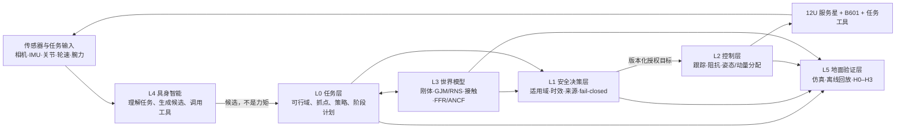
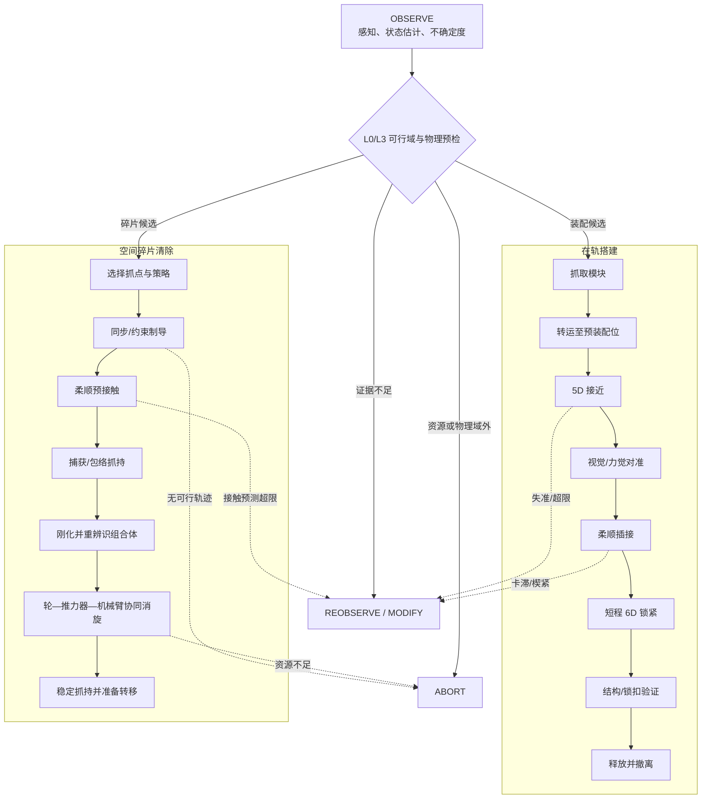

# 航天工程与空间具身智能机械臂研究进度与文献综合汇报

**物理约束空间具身任务智能：面向在轨搭建与空间碎片清除的共平台方案及当前证据进展**

> 面向：课题组汇报、导师沟通、竞赛答辩与新成员入门  
> 日期：2026-07-22  
> 当前 Git HEAD：`b4dd48a`（`feat/sim09-grasp-evaluator`）  
> 文档性质：`EVIDENCE_BOUNDED_CURRENT_STATE_REPORT`  
> 研究对象：12U 服务星 + B601 六自由度机械臂；空间碎片清除 / 在轨搭建双任务  
> 证据顺序：机器 Gate JSON > 原始 CSV/JSON > 测试 > Git > 当前报告 > 旧报告 > 设想  
> 重要边界：**测试通过不等于科学 Gate 通过；规划完成不等于实验完成；离线回放不等于实时数字孪生。**

---

## 0. 一页结论

### 0.1 一句话说明项目

本项目研究的不是“让一只机械臂在太空里完成动作”这么简单，而是让一颗自由漂浮的服务航天器在面对翻滚目标或待装配模块时，能够依次回答：

1. **物理上能不能做；**
2. **应该选哪一种抓取、接触或动量管理策略；**
3. **现有证据是否足以允许执行；**
4. **如果不能做，能否给出可追溯的修改或中止原因。**

项目由此形成“具身智能提出候选—物理模型计算—安全核授权—控制器执行—证据链复核”的总体路线。这里的具身智能不是让大模型直接输出关节力矩，而是让智能层负责理解任务、组织技能和提出候选，确定性的动力学与安全层负责最终裁决。

### 0.2 当前综合判断

本报告给出的综合判断不是新的机器 Gate，而是对现有证据的汇总：

> **已完成捕获任务的仿真—可行域—策略—安全—参数受限控制主干；文献归档已经统一；比赛离线证据演示在本地已就绪；在轨装配 Wave A 仍被接口参数、原始哈希和人工授权阻塞。**

可以诚实汇报的成果：

- 已建立自由漂浮星—臂耦合、捕获冲量、执行器资源、柔性附件与有限接触带宽模型；
- 已完成 9002 个物理点的任务可行域，以及 16 个策略证明单元；
- SAFE-00 在冻结合同下实现 UNKNOWN 不放行和绕过 fail-closed；
- 已获得一组有价值的真实负结果：e15 柔性认证、CTRL-01 和 Wave1 均未被包装成 PASS；
- 文献已归一为 45 条题录、44 份有效本地 PDF，且没有字节级重复；
- 本地 Competition Demo 已通过 17/17 机器检查、19/19 自动测试和 15/15 红队攻击，形成 9 页 PPT 与离线视频。

仍不能声称的事项：

- 已完成自主在轨搭建或空间碎片清除；
- ASM-00 接口资格已通过，或 ASM-01/02 已经启动；
- 已形成实时数字孪生、自由漂浮硬件闭环、微重力验证或飞行资格；
- VLA 已实现并可输出飞行控制量；
- CTRL-01、Wave1 或 e15 已经 PASS；
- Competition Demo 中显示的 `EXECUTE` 是真实设备执行授权。

### 0.3 当前成果的三种“状态层级”

| 层级 | 当前内容 | 汇报口径 |
|---|---|---|
| 已提交、可追溯基线 | sim_01–12、e15/e16、SAFE/CTRL/Wave1、六层架构、45 条文献 manifest | 可以称“当前 Git 主线证据” |
| 本地最新、尚未提交 | ASM-00 前检、Competition Convergence、PPT/视频 | 只能称“本地待纳入成果” |
| 计划或协议 | ASM-01/02、ROM、Physics Tools、V2.5/VLA、H0–H3、DT3/DT4 | 只能称“已规划/未实施” |

---

## 1. 零基础概念：为什么空间机械臂比地面机械臂难

### 1.1 地面机械臂与空间机械臂的根本区别

地面机械臂通常固定在地基上。电机让机械臂向一个方向转动时，反作用力由地面吸收。空间机械臂则安装在自由漂浮的航天器上，没有地面可以“借力”。机械臂一动，航天器基座就会反向运动；机械臂抓住一个翻滚目标后，目标原有的线动量和角动量还会重新分配到整个组合体中。

因此，空间机械臂必须同时处理：

- 机械臂末端是否到达目标；
- 服务星基座是否被带偏；
- 反作用轮是否饱和；
- 推力器和推进剂是否够用；
- 接触是否产生过大冲击、反弹或滑移；
- 太阳帆板、柔性臂或目标结构是否被激振；
- 抓住后是否还能稳定、消旋或继续装配；
- 感知、模型和参数不确定时是否应拒绝执行。

### 1.2 关键术语表

| 术语 | 零基础解释 | 本项目中的含义 |
|---|---|---|
| 服务星 | 主动接近并执行任务的航天器 | 12U 平台，搭载 B601 机械臂 |
| 非合作目标 | 不提供标记、姿态配合或标准接口的目标 | 翻滚碎片、失效卫星或上面级 |
| 自由漂浮 | 航天器不主动用推力器固定基座 | 臂的运动与基座反作用强耦合 |
| 捕获 | 从未连接变成稳定机械约束 | 不等于消旋，也不等于后续安全转移 |
| 消旋 | 降低目标或组合体的角速度 | 需要轮、推力器、机械臂协同并记账 |
| 在轨搭建 | 在空间抓取、转运、对准、插接并锁紧模块 | 当前只到规划与 ASM-00 前检 |
| GJM | 广义雅可比矩阵 | 把关节速度与自由漂浮末端速度联系起来 |
| RNS | 反作用零空间 | 在不改变主任务时利用真实冗余降低基座反作用 |
| 阻抗控制 | 不只追位置，还规定机器人对外力表现得多“软/硬” | 用于柔顺预接触、插接和捕获 |
| FFR | 浮动坐标系柔性模型 | 用少量模态描述帆板等柔性附件 |
| ANCF | 绝对节点坐标法 | 用于大变形柔性多体和高保真交叉验证 |
| 具身智能 | 智能系统通过感知、动作和物理反馈完成任务 | 只产生候选和解释，不绕过安全核 |
| VLA | 视觉—语言—动作模型 | 后续候选方案；当前未训练、未部署 |
| Gate | 预先定义、由机器执行的合格判据 | PASS/REPEAT/BLOCKED 等不能被报告文字改写 |
| 数字孪生 | 模型与真实对象之间持续的数据对应关系 | 当前最高仅为范围受限的离线 DT2 回放 |

### 1.3 状态词的严格含义

| 状态 | 正确理解 | 常见误读 |
|---|---|---|
| PASS | 在冻结输入、模型、阈值和适用域内通过 | “系统已经全面成熟” |
| PASS_WITH_PROVISIONAL_PARAMS | 数值 Gate 通过，但部分参数仍为占位或待实测 | “已经完成硬件认证” |
| REPEAT | 实验做过，但至少一个强制科学 Gate 未满足 | “代码没跑起来” |
| BLOCKED | 缺少授权、输入或可验证依赖，不能合法继续 | “结果不好看所以暂停” |
| SCREENING_ONLY | 只适合候选筛选，不足以作最终安全结论 | “已经可以执行” |
| PENDING_REVIEW | 机器结果存在，但独立审查或授权未完成 | “只是形式问题，可先执行” |
| NOT_EVALUATED | 尚未进行对应评价 | “默认没有问题” |
| UNKNOWN | 证据不足或模型域外 | 在本项目中必须 fail-closed，不能解释为安全 |

---

## 2. 科学问题与双任务边界

### 2.1 三个递进问题

项目把复杂任务压缩成三个可检验的科学问题：

1. **存在性问题：**给定目标质量、惯量、转速、抓点、接触时间与执行器预算，任务是否存在物理解？
2. **选择问题：**若存在多种策略，应该直接捕获、先速度匹配、先预置轮动量，还是中止？
3. **授权问题：**即使仿真显示可行，当前感知、参数来源、模型适用域与控制资源是否足以允许执行？

### 2.2 两类任务共用什么、不同在哪里

| 维度 | 空间碎片清除 | 在轨搭建 | 共用部分 |
|---|---|---|---|
| 目标 | 非合作、翻滚、参数不确定 | 通常合作、接口已设计但有公差 | 状态估计、质量惯量、坐标系 |
| 接触前 | 跟踪翻滚目标并选择抓点 | 抓取模块并转运到接口附近 | 可达、碰撞、基座反作用 |
| 接触过程 | 柔顺捕获、避免推离或滑移 | 对准、插入、避免卡滞或楔紧 | 阻抗、力/位混合、有限带宽接触 |
| 接触后 | 刚化、组合体重辨识、消旋 | 锁紧、连接确认、释放 | 动量、能量、柔性、资源账本 |
| 任务终点 | 稳定抓持并为转移/离轨做准备 | 模块装配成功并验证结构状态 | 安全核、故障恢复、证据链 |

由此得到最适合本项目的总体方案：

> **一套服务星—机械臂—世界模型—安全核共平台，两套可换末端工具，两条任务状态机。**

---

## 3. 六层系统架构

合法执行链固定为：

`L4 候选 → L0/L3 物理求值 → L1 安全授权 → L2 实时控制 → 执行机构`。

各层当前成熟度如下：

| 层 | 当前证据 | 状态 |
|---|---|---|
| L0 任务层 | sim_10 可行域、sim_12 策略 | 已完成并冻结；FLEX 边界必须随行说明 |
| L1 安全层 | SAFE-00 | 模块 PASS，但 `PENDING_REVIEW` 且不自动授权 |
| L2 控制层 | CTRL-01/02 | 一个真实负结果 REPEAT；一个参数受限 PASS |
| L3 世界模型 | 刚体、有限带宽 FFR、ANCF 对照 | sim_11 参数受限 PASS；e15 认证 REPEAT |
| L4 具身智能 | VLA 协议、工具合约草案 | 计划态，未实现 |
| L5 地面验证 | DT0/DT1、旧 campaign 与本地 competition 离线回放 | DT2 离线范围受限；H0–H3 未启动 |

---

## 4. 研究进度：从基础物理到当前主链

### 4.1 总览表

| 模块 | 做了什么 | 机器状态 | 关键结果 | 严格限制 |
|---|---|---|---|---|
| sim_01–04 | 自由飞行、目标翻滚、早期反冲、捕获走廊 | 冻结资产，无独立科学 Gate | 形成基础时序与筛选样本 | 不能逐个写成 scientific PASS |
| sim_05 | B601 6R 自由漂浮反冲 | 被 sim_11 交叉复核 | 峰值基座偏转约 19.20° | 是动力学锚，不是飞行轨迹 |
| sim_06 | 完全塑性捕获冲量矩阵 | 被 sim_10 X1 复核 | 150 kg、3°/s 锚点捕获后约 3.0633°/s | 捕获不等于消旋；无连续接触 |
| sim_07 | ANCF 柔性组件响应 | 组件完成，候选认证未闭合 | 名义 6D 锁定与点接触激振约相差 92.4 倍 | 不能外推为整星柔性认证 |
| sim_08 | 轮组/推力器/推进剂预算 | 被 sim_10 X3 复核 | 3°/s 碎片约 3.65099 N·m·s，约为轮组容量模型的 12 倍 | 执行器档仍为 placeholder |
| sim_09/E1 | 多层抓点评价 | campaign 完成，无全局 PASS | 72 例、69 IK 可行、24 admissible、Pareto 16 | admissible 不等于 formal safe |
| e15 core | 刚体核心证据覆盖 | 覆盖 PASS；科学 REPEAT | 72/72 有结果，但安全候选为 0 | 覆盖完整不等于任务安全 |
| e15 ANCF | 候选级柔性认证 | `REPEAT_ANCF_CERTIFICATION` | 历史跨解算器最大差 5.637% > 5% | 无最终候选，不得用低幅锚替代 |
| e16 | 同步捕获扩展 campaign | `PASS_WITH_GEOMETRY_AND_FLEX_LIMITATIONS` | 216 例完整；18 动态例；formal safe=0 | 198 上游拒绝；柔性 UNKNOWN |
| sim_10 | 任务可行域 | `SIM10_GATES_PASS` | 9002 个物理点，四类区域 | 刚体边界；执行器/时限含暂定值 |
| sim_11 | 自由漂浮刚柔耦合与有限接触带宽 | `SIM11_GATES_PASS_WITH_PROVISIONAL_PARAMS` | G1–G5 通过；解决理想冲量下模态能不适定问题 | 帆板参数与 `T_c=20 ms` 待实测 |
| sim_12 Phase 1 | 策略可行性与 binding-gate 选择 | `SIM12_PHASE1_GATES_PASS` | 16 个证明单元；守恒、分化和主张审计通过 | FLEX 未入判据；仅 Phase 1 |
| SAFE-00 | fail-closed 运行时安全核 | `PASS` | 47/47 测试；UNKNOWN→ALLOW=0；绕过成功=0 | `next_stage_authorized=false` |
| CTRL-01 | 末端跟踪、前馈与 RNS 对照 | `REPEAT` | 18 场景；实现缺陷已修；真实负结果保留 | 严格 6D 下任务零空间真零 |
| CTRL-02 | 基座姿态与动量/资源分账 | 模块 `PASS`，外部口径为参数受限 PASS | GC0–GC7 通过；7/16 在暂定执行器时窗内稳定 | 9/16 未稳定；硬件有效性未评估 |
| Wave1 | SAFE/CTRL 联合集成 | `WAVE1_REPEAT` | 实现缺陷清零，真实负结果经治理收口 | verdict 不变；下一 Wave 不自动授权 |
| Wave A 规划 | ASM-00/01/02 与人工 Gate | `READY_WITH_INTERFACE_BLOCKERS` | 任务卡、风险、Gate 边界齐备 | `PLANNED_NOT_AUTHORIZED` |
| ASM-00 本地前检 | 授权预检、RF-1/2/3 与九项 evaluator | `ASM00_AG0_BLOCKED_BY_INTERFACE` | 已形成确定性前检和负结果 | 本地未提交；无 physics/Monte Carlo |
| Competition Demo 本地包 | 三场景离线证据回放 | `COMPETITION_DEMO_READY` | 17/17 检查、19/19 测试、15/15 红队 | 本地未提交；不实时、不发命令 |

### 4.2 sim_01–08：为什么这些基础资产仍然重要

早期模块没有各自独立的科学 Gate，但它们为后续可验证主链提供了锚点：

- sim_05 证明了自由漂浮基座反作用不是小量；约 19.20° 的冻结动作锚点后来被 sim_11 的刚化退化链复核。
- sim_06 说明“抓住”不会自动“停住”。150 kg、3°/s 目标在冻结完全塑性模型下，捕获后仍约 3.0633°/s。
- sim_07 表明接触约束方式会显著改变柔性激振，名义 6D 锁定与 3D 点接触峰值挠度约相差 92.4 倍。
- sim_08 显示重型翻滚目标的角动量远超轮组存储能力，机械臂内部运动和反作用轮不能凭空消除总角动量。

这些结果的正确用法是“作为经下游 Gate 复核的物理锚点”，而不是把八个早期模块写成八个独立 PASS。

### 4.3 抓点评价与 e15/e16：有结果不等于有安全候选

sim_09/E1 在 72 个工况中得到 69 个 IK 可行样本、24 个 admissible 样本和 16 个 Pareto 点。更重要的发现是：同一几何操纵度下，捕获后角速度可从约 1.489°/s 变化到 3.070°/s，约相差 2.06 倍。这说明“几何上好抓”不等于“系统动力学上安全”。

随后更严格的认证没有粉饰负结果：

- e15 core 的 72/72 覆盖完整，但 66 例几何不可达、6 例刚体核心不安全，安全候选为 0；
- e15 ANCF 的历史最大跨解算器差为 5.637%，高于 5% 门槛，且没有最终安全候选可供真实幅值认证；
- e16 的 216 例全部有终态记录，但 198 例在上游被拒绝，18 个动态例全部为 CORE_UNSAFE，formal safe 仍为 0。

因此 e15/e16 的科学价值是：证明评价链能拒绝不安全候选，而不是证明系统已经找到可飞候选。

### 4.4 sim_10：从单个算例升级为任务可行域

sim_10 不再只问“某一个目标能否抓”，而是在目标质量、惯量、转速、抓取杠杆和执行器预算构成的空间中扫描 9002 个物理点。默认执行器档下的分类为：

| 区域 | 点数 | 含义 |
|---|---:|---|
| `WHEELS_ONLY_FEASIBLE` | 6323 | 轮组资源足以覆盖冻结判据 |
| `INFEASIBLE_RATE` | 1858 | 捕获后/任务角速度越界 |
| `THRUSTER_REQUIRED_FEASIBLE` | 730 | 需要外部推力器角冲量 |
| `INFEASIBLE_RESOURCE` | 91 | 推进剂、时间或其他资源仍不足 |

X1–X4 与哈希门全部通过，最终为 `SIM10_GATES_PASS`。但它是刚体可行域：FLEX 明确为 `UNKNOWN_NOT_IN_CRITERIA`，执行器档和 3600 s 等任务时限仍是暂定假设。

### 4.5 sim_11：为什么“瞬间碰撞”对柔性振动不够好

理想冲量把接触时间设为零，频谱近似覆盖无限高频。对于柔性帆板，随着加入更多模态，模态能量可能出现慢收敛尾，导致“继续加模态仍在改变结果”。sim_11 把接触改为具有有限时间带宽的过程，使高频激励得到物理过滤，再用动量、能量、退化、前向加密和跨解算器五类 Gate 检查。

结果为 G1–G5 通过和 `SIM11_GATES_PASS_WITH_PROVISIONAL_PARAMS`。它证明了模型结构和数值闭合，但不等于真实硬件预测，因为帆板模态、刚度、阻尼与名义接触时间 `T_c=20 ms` 仍待参数转正。

### 4.6 sim_12：没有“永远最优”的捕获策略

sim_12 比较四类思路：被动捕获、速度匹配、轮动量预置，以及无法满足条件时的中止/后续外部消旋。16 个证明单元得到三个重要结论：

1. 策略优劣取决于当前先饱和的是接触、转速、轮容量、推进剂还是时间约束；
2. 速度匹配可以降低接触冲量，但外部预操作可能增加系统角动量负担和资源成本；
3. 对 `B_anchor` 与极端案例，正确答案是 ABORT，而不是为了演示成功强行选策略。

因此本项目的核心科学叙事是“binding-gate dependent strategy selection”，即由当前绑定约束决定策略，而不是宣称某种动量整形永远更好。

### 4.7 SAFE、CTRL 与 Wave1：把失败结果变成设计边界

SAFE-00 在冻结合同与案例下做到 UNKNOWN 永不 ALLOW、绕过成功为 0、provenance 完整。但其机器文件同时写明 `PENDING_REVIEW` 和 `next_stage_authorized=false`，因此它是安全决策核的证据，不是飞行许可。

CTRL-01 修复了三个实现/记账问题，并把能量账本残差从约 `7.90e-2` 降至 `5.63e-12`；但 A2/D/E/F 等强制子 Gate 仍为真实负结果。特别是 B601 6R 在严格 6D 任务下没有可利用的任务零空间，隔离的 RNS 增益约为零。这一负结果直接支持后续“5D 接近保留一维冗余—短程 6D 锁紧—基座执行器协同”的分阶段装配设计。

CTRL-02 的 GC0–GC7 通过，但只有 7/16 工况在暂定执行器及时窗模型下满足稳定判据，9/16 未满足；硬件有效稳定性仍是 `NOT_EVALUATED_NO_ACTUATOR_DYNAMICS`。

Wave1 因 CTRL-01 的强制 Gate 仍为 REPEAT，机器裁决保持 `WAVE1_REPEAT`。CP6 只关闭了继续“修到 PASS”的治理循环，没有把负结果改名为 PASS。

---

## 5. 本地最新进展：ASM-00 与 Competition Demo

### 5.1 为什么要单独列出

当前 Git HEAD 为 `b4dd48a`，但以下目录仍为未跟踪本地材料：

- `30_simulation/asm_00_interface_preflight/`
- `10_research/competition_convergence/`
- `40_evidence/artifacts/competition_convergence/`

它们比 2026-07-20 的已提交状态报告更新，能够作为“当前本地证据”阅读，但尚未进入版本历史，因此不能写成主线已经正式交付。

### 5.2 ASM-00 前检实际做到了什么

ASM-00 已完成：

- HAG-A/HAG-B/HAG-I 授权存在性检查；
- 九项 single-source success evaluator 的结构冻结与验证；
- RF-1、RF-2、RF-3 的机器分类；
- 输入原始字节哈希、归一化哈希与 owned scope 检查；
- 确定性结果与 evidence manifest。

最新机器结果为：

- `raw_verdict = ASM00_AG0_BLOCKED_BY_INTERFACE`
- `external_status = ASM00_BLOCKED_BY_MISSING_PARAMETERS`
- `scientific_execution_authorized = false`
- `next_stage_authorized = false`

三个具体阻塞：

| 阻塞 | 机器证据 | 工程含义 |
|---|---|---|
| RF-1 导向聚拢 | 名义聚拢量约 2.1436 mm，小于所需 4.9 mm；缺口/喉半径 | 不能证明粗误差可被导向结构收敛到精定位范围 |
| RF-2 楔紧/摩擦 | `tan(15°)=0.2679 < μ=0.3`；缺材料对、表面、引用和裕度 | 当前几何可能进入自锁/楔紧风险区 |
| RF-3 间隙语义 | 0.1 mm 未说明是径向还是直径间隙 | 两种解释都无法形成合格裕度 |

共享缺口还包括销距、倒角宽度以及来源等级。HAG-A/B/I 均不存在；三个输入文件虽然 LF 归一化内容一致，但原始字节哈希不同，而合同要求 raw hash，因此 Gate 正确地 fail-closed。

本轮没有运行 physics solver、Monte Carlo、ASM-01 或 ASM-02。

### 5.3 Competition Demo 实际证明了什么

本地 Competition Convergence 包给出：

- 17/17 集成检查通过；
- 19/19 自动测试通过；
- 15/15 红队攻击被 fail-closed 拒绝；
- 三个冻结场景两次构建位级一致；
- 9 页 PPT、9 张渲染图和约 55 s 的 1920×1080 H.264 视频；
- `final_verdict = COMPETITION_DEMO_READY`。

三场景用于解释：

| 场景 | 显示动作 | 正确含义 |
|---|---|---|
| A_low | `EXECUTE` | 仅表示离线证据链中的解释性推荐；没有设备命令 |
| B_anchor | `ABORT` | 上游速率不可行，安全链不创建执行请求 |
| C_transition | `MODIFY` | 候选绑定缺失，应修改候选并重新进入安全授权链 |

演示包同时明确：`offline_replay=true`、`real_time_synchronization=false`、`command_emitted=false`、`B601_MOTION=PROHIBITED`。所以它证明的是“基于已验证工件的确定性离线证据回放可用于比赛演示”，而不是实时孪生、硬件闭环或自主在轨作业。

---

## 6. 文献整理方法与当前库存

### 6.1 本次综合的范围

本报告使用仓库中已经完成 DOI/官方元数据核验和本地文件校验的 45 条题录。它是**本地证据受限的叙事综合**，不是本轮重新执行的 PRISMA 系统综述，也没有把“有 PDF”自动当成“已经精读”。

单一真值源为：

- [文献 manifest](../../50_literature/references/manifest.yaml)
- [阅读卡索引](../../50_literature/references/notes/INDEX.md)
- [REORG-01-R 报告](../../50_literature/references/reorg01r_report.md)
- [双任务文献综合](../../10_research/on_orbit_assembly/dual_mission_literature_synthesis.md)

### 6.2 归档完成度

| 项目 | 数量 | 解释 |
|---|---:|---|
| 总题录 | 45 | manifest 中的论文记录 |
| 有效本地 PDF | 44 | 页数与 SHA-256 均已校验 |
| 完整阅读卡 | 23 | 已完成逐篇结构化阅读 |
| 仅题录级归档 | 21 | 有全文，但还不能按已精读引用细节 |
| 唯一缺全文 | 1 | `gerstmayr2013ancfreview` |
| DOI 主记录 | 38 | 33 VERIFIED + 2 VERIFIED_AFTER_ADJUDICATION + 3 Crossref NOT_FOUND |
| arXiv 主记录 | 7 | 元数据已验证 |
| 手工补充并校验 | 21 | 已全部并入统一 `50_literature/pdf/` 路径 |
| 开放获取下载并校验 | 23 | 已落盘 |

三个 `CROSSREF_NOT_FOUND` 记录为中文来源，均已由官方元数据核验，不应误写成 DOI 错误；两个 `VERIFIED_AFTER_ADJUDICATION` 记录保留裁决轨迹。

### 6.3 分类与任务线分布

| 文献主题 | 条目 | 本地全文 | 主要作用 |
|---|---:|---:|---|
| 总体综述 | 6 | 6 | 任务阶段、机械臂构型、工程对标 |
| GJM/RNS | 6 | 6 | 自由漂浮动力学、反作用与零空间 |
| 接触捕获 | 11 | 11 | 阻抗、柔顺腕、抓持、制导与消旋 |
| 柔性/ANCF | 5 | 4 | 柔性梁、求解器、振动与高保真验证 |
| 具身/VLA/感知 | 9 | 9 | 位姿域差、视觉伺服、技能与工具调用 |
| 在轨搭建 | 3 | 3 | 装配序列、接口和大型结构 |
| 平台/HIL | 2 | 2 | 整器仿真与地面试验台 |
| 中文工程综述 | 3 | 3 | 国内工程语境与路线 |

| mission_line | 数量 | 含义 |
|---|---:|---|
| `debris_removal` | 13 | 碎片清除专用证据 |
| `on_orbit_assembly` | 3 | 在轨搭建专用证据 |
| `both` | 9 | 直接服务两条任务线 |
| `platform_common` | 20 | 共用动力学、柔性、感知、智能和平台基础 |

这组统计说明：共平台路线有充分依据，但两条任务成熟度不同。碎片清除的接触、跟踪和消旋专线较丰富；在轨搭建只有 3 条直接专线文献，当前主要是架构与方法证据。

---

## 7. 文献主题综合与工程映射

### 7.1 总体综述：建立任务全景，但不提供本机参数

[Rybus 2024](https://doi.org/10.1016/j.paerosci.2024.101055)、[Papadopoulos et al. 2021](https://doi.org/10.3389/frobt.2021.686723)、[Alizadeh et al. 2024](https://doi.org/10.3389/frobt.2024.1470950) 等综述说明，在轨服务与主动碎片清除需要把机械臂构型、末端工具、接近、抓取、接触后稳定和地面验证作为一条完整链考虑。它们适合回答“系统有哪些模块”，不适合直接给出 B601 的质量、刚度或阈值。

工程映射：六层架构、双任务共平台、可换末端与分级验证。

### 7.2 GJM/RNS：当前最强的理论主干

[Wilde et al. 2018](https://doi.org/10.3389/frobt.2018.00041) 提供自由漂浮星—臂方程和 GJM 工程推导；[Yoshida et al. 2001](https://doi.org/10.1109/ROBOT.2001.932590) 给出 ETS-VII 零反作用机动飞行对标；[Xu et al. 2017](https://doi.org/10.1016/j.cja.2017.02.021) 讨论反作用力矩与 RNS；[Nenchev & Yoshida 1999](https://doi.org/10.1109/70.768186) 连接冲量与捕获后运动。

最重要的边界是：RNS 的收益依赖真实任务零空间。文献中 7R 或任务降维的冗余不能直接移植到 B601 6R 严格 6D 任务。CTRL-01 的真实负结果与文献并不矛盾，反而支持“5D 接近—短程 6D 锁紧”的分阶段路线。

### 7.3 接触、阻抗与消旋：不能简单追求“越软越好”

[Yoshida et al. 2004](https://doi.org/10.1163/156855304322758015) 的虚拟质量/阻抗匹配、[Uyama et al. 2012](https://doi.org/10.1109/IROS.2012.6386082) 的柔顺腕、[Palma et al. 2022](https://doi.org/10.3390/aerospace9080406) 的选择性柔顺移动副共同说明：合理柔顺可以降低冲击，但过软也会导致反弹、推离、定位误差或卡滞。正确问题是寻找虚拟质量、阻尼与刚度的可行区间。

[Virgili-Llop & Romano 2019](https://doi.org/10.3389/frobt.2019.00014) 支持同时捕获—消旋候选，[Uyama et al. 2016](https://doi.org/10.1016/j.ifacol.2016.09.040) 和 [Vijayan et al. 2022](https://doi.org/10.1109/ICRA46639.2022.9812067) 支持分阶段或抓后消旋。两类路线不是绝对优劣关系，应由目标转速、接触限制、抓持稳定、柔性响应和执行器预算裁决。

工程映射：sim_11 有限带宽接触、sim_12 策略选择、未来 ADR-CAP/DET 与 ASM-01/02。

### 7.4 柔性/ANCF：理论和工具具备，项目认证仍未闭合

[Gerstmayr & Irschik 2008](https://doi.org/10.1016/j.jsv.2008.04.019) 说明 ANCF 弹性线中弯曲与轴向变形的正确表示；[Gerstmayr et al. 2023](https://doi.org/10.1007/s11044-023-09937-1) 提供 Exudyn 柔性多体框架；[Liu et al. 2022](https://doi.org/10.3390/app12030984) 讨论柔性空间机器人捕获。

[Yoshida et al. 1999](https://doi.org/10.1088/0964-1726/8/6/312) 是当前文献库中 RNS 与柔性振动抑制的唯一直接桥接文献，manifest 将其主分类置于 GJM/RNS，并交叉映射到柔性/ANCF。

这些文献不会自动把 e15 的 5.637% 跨解算器差变成 PASS。缺失的 [Gerstmayr et al. 2013](https://doi.org/10.1115/1.4023487) 主要阻塞 ANCF 单元族、锁死、应变度量和 FFR/ANCF 取舍的权威来源闭环；它不是当前数值 REPEAT 的直接原因。

### 7.5 在轨搭建：架构证据足够，接口资格证据不足

[Li et al. 2022](https://doi.org/10.34133/2022/9849170) 系统梳理装配规划、柔顺、振动与地面验证；[Lee et al. 2016](https://doi.org/10.1117/1.JATIS.2.4.041207) 给出模块化空间望远镜装配架构；[Hu et al. 2025](https://doi.org/10.6052/1000-0992-24-044) 强调极大结构的时变构型和密模态问题。

这三条专线足以支撑“为什么要做模块化接口、分阶段控制和柔性验证”，却不能提供本项目缺失的导向锥半径、销距、倒角、间隙语义、材料摩擦对和锁紧力。文献不能替代 ASM-00 的 RF-1/2/3 资格化。

### 7.6 感知与具身智能：适合高层候选，不承担飞行安全证明

[SPEED+](https://arxiv.org/abs/2110.03101) 与 [Park et al. 2024](https://doi.org/10.1016/j.asr.2023.03.036) 支持合成—真实域差、位姿估计和在线修正；[SpaceMind](https://arxiv.org/abs/2604.14399)、[VLA 综述](https://doi.org/10.1109/ACCESS.2025.3609980) 与 [OpenVLA](https://arxiv.org/abs/2406.09246) 支持技能、工具调用、任务理解和学习型候选生成。

这些论文不提供本项目的自由漂浮方程、接触安全律或执行授权。当前最稳妥的系统边界是：

- VLA/智能体理解任务并生成离散候选；
- 物理工具返回适用域、置信度和 reason code；
- SAFE-00 检查候选、来源、时效和资源；
- 实时控制器消费已授权目标；
- 任一 UNKNOWN 都不能被语言模型解释成可以执行。

### 7.7 平台与 HIL：开源存在不等于项目已集成

[Basilisk](https://doi.org/10.2514/1.I010762) 可作为轨道—姿态—GNC 整器交叉验证框架；[Alali et al. 2024](https://doi.org/10.3390/aerospace11110877) 提供 6DOF 地面 HIL 试验台参考。当前项目即使已有源码或文献，也只能称“候选平台已识别/已归档”，不能称“已集成、已复现或已完成 HIL”。

---

## 8. 双任务完整技术路线

### 8.1 在轨搭建控制方案

1. **抓取模块：**确认工具身份、质量惯量和标定哈希；
2. **转运：**采用 GJM/基座反作用约束，避免轮组和关节超限；
3. **5D 接近：**释放绕插接轴的一维约束，以保留真实冗余用于减反作用和避限位；
4. **对准：**视觉伺服提供位姿，腕部 F/T 提供接触前判据；
5. **柔顺插接：**按单边接触、摩擦、滑移、卡滞/楔紧状态机运行；
6. **短程 6D 锁紧：**仅在接触模型、接口 SSOT 和安全 Gate 允许后建立全约束；
7. **验证与释放：**九项 single-source evaluator 必须来自一个版本化、哈希绑定的实现。

当前缺口：ASM-00 未合格，ASM-01/02 未启动，目标侧 FFR/AG4 未闭合，因此不能声称装配闭环已经实现。

### 8.2 空间碎片清除控制方案

1. **目标估计：**输出位姿、角速度、质量惯量置信区间与数据时效；
2. **抓点与末端选择：**比较包络夹爪、适配环/喷管探针或柔性工具；
3. **策略选择：**在直接捕获、速度匹配、轮动量预置与 ABORT 间由 binding gate 裁决；
4. **同步/制导：**满足碰撞、末端相对速度和执行器限幅；
5. **柔顺捕获：**使用有限带宽接触和阻抗匹配，控制峰值力、反弹和基座扰动；
6. **组合体重辨识：**抓住后重新估计质量、惯量、柔性和抓持稳定域；
7. **消旋：**机械臂负责内部重分配，轮组负责存储，推力器负责移除外部角动量；
8. **安全转移：**轨道转移、离轨许可和再入风险属于后续独立任务包。

当前缺口：项目尚未形成 ADR-PER/GRASP/SYNC/CAP/DET 的统一闭环 Gate；现有成果覆盖其中的局部物理和策略证据。

---

## 9. 当前研究贡献、潜在论文贡献与边界

### 9.1 已有证据支持的贡献

1. **机器审计的任务可行域：**用 9002 个物理点和 fail-closed Gate 区分轮组可行、需推力器、速率不可行和资源不可行。
2. **binding-gate 策略判据：**用 16 个证明单元说明策略取决于当前绑定物理约束，而不存在无条件最优策略。
3. **有限接触带宽的保真度纪律：**指出理想冲量下柔性模态能指标可能不适定，并用有限带宽恢复前向收敛。
4. **几何指标致盲证据：**同一操纵度下捕获后角速度约相差 2.06 倍，说明抓点评价必须包含系统动力学与资源。
5. **真实负结果治理：**e15、CTRL-01 和 Wave1 的负结果保留在机器裁决中，避免阈值软化和设计到 PASS。
6. **安全与证据分层：**明确候选生成、物理求值、安全授权、控制与离线演示之间的不可跨越边界。

### 9.2 有潜力但尚未被证明的贡献

- 分阶段 `5D→6D` 装配控制相对全程 6D 的优势；
- 单源九项装配成功评价器与卡滞/楔紧状态机；
- ROM 保真度选择器及误差证书；
- V2.5 确定性 FSM 与 VLA 的同工具配对收益；
- markerless 位姿/角速度估计在本项目 HIL 中的域外检测；
- 统一 ADR 与装配的当前化 DT2 回放链；
- B601 H0–H3 地面组件闭环。

### 9.3 适合当前 Paper 1 的主线

现有证据最适合形成：

> **动量与稳定约束下非合作航天器捕获的策略选择：可行域图与 binding-gate 判据。**

正文可由 sim_09、sim_10、sim_11 和 sim_12 支撑；ASM、VLA 与硬件只应出现在讨论与展望。Paper 2 可在 Wave A 完成后考虑多保真接触/柔性与分阶段装配控制。

---

## 10. 当前缺口与风险排序

| 优先级 | 缺口 | 为什么关键 | 不解决时的上限 |
|---|---|---|---|
| P0 | ASM-00 HAG-A/B/I 缺失 | 人工授权不可由 Agent 代签 | ASM-01/02 不得启动 |
| P0 | 导向锥、销距、倒角、间隙、摩擦 provenance 缺失 | 接口物理不可求值 | 只能 `BLOCKED` |
| P0 | raw-byte 哈希不一致 | 执行输入不能与冻结合同精确绑定 | Gate 必须 fail-closed |
| P0 | B601 `T_c`、轮力矩、最小脉冲与帆板参数未实测 | 影响 sim_11 与 CTRL-02 外推 | 只能参数受限 PASS |
| P0 | e15 无安全刚体候选，跨解算器超 5% | 没有最终候选可做 ANCF 认证 | 柔性仅筛选/参数受限 |
| P1 | 21 篇新 PDF 尚无完整阅读卡 | 参数、假设和局限不能精确到页 | 只能题录级综合 |
| P1 | Gerstmayr 2013 全文缺失 | ANCF 模型选型来源链不闭合 | 理论依据仍有硬缺口 |
| P1 | 装配专线只有 3 篇 | 端到端实验对标薄弱 | 装配成熟度低于 ADR |
| P1 | ADR 没有统一闭环 Gate | 分散证据不能证明全链 | 不能称完成碎片清除 |
| P2 | V2.5/VLA 未实施 | 无法归因智能层收益 | 只能称协议/候选架构 |
| P2 | H0–H3 未启动 | 无硬件资格与安全链 | 不能称地面闭环或 HIL |

---

## 11. 推荐下一阶段：按 Gate 推进，不按乐观日历推进

### WP0：证据治理与文献精读

- 由用户/PI 决定是否把本地 ASM-00 与 Competition Demo 正式纳入版本控制；
- 更新现行状态报告，使其区分“已提交基线”和“本地待纳入成果”；
- 完成 21 篇题录级论文的阅读卡，优先 V2 接触捕获、V1 柔性 RNS 和装配接口；
- 获取 `gerstmayr2013ancfreview` 全文并补理论选型卡；
- 从论文提取参数时记录材料对、表面、实验条件、单位、参考系和适用域，不直接复制单一数值。

停止条件：任何全文身份、页码或参数来源不可验证时，保持“未核验”，不补写推测值。

### WP1：合法解除 ASM-00 阻塞

- HAG-A 必须由 PI/受信主体签发，Agent 不得创建或修改批准记录；
- 固化 task card、gate registry、接口草案和九项 evaluator 的唯一 raw-byte 哈希；
- 补齐导向锥口/喉半径、销距、倒角、间隙语义、摩擦材料对/表面与楔紧裕度；
- 关闭 RF-1/2/3 和共享关键字段后，才运行接口物理资格化与 Monte Carlo；
- AG0 结果可以是 PASS、REPEAT 或 BLOCKED，不能为进度放宽阈值。

### WP2：执行唯一 Assembly Wave A

- ASM-01：连续接触、触离/滑移/卡滞状态机、动量/能量账本、目标侧 FFR 与单源成功评价；
- ASM-02：全程 6D 公平基线与 `5D→6D` 分阶段控制；
- 三卡各自到 Gate 后停止，经 HAG-I 才允许唯一集成；
- 目标侧 FFR/AG4 未通过时，上限仍为 `SCREENING_ONLY`。

### WP3：ADR 最小闭环

- 不重做 sim_10/11/12，而是把它们作为冻结基线；
- 新建版本化 ADR-PER/GRASP/SYNC/CAP/DET 合同；
- 先选一个低速可行目标与一个域外 ABORT 目标；
- 形成“感知—抓点—有限带宽捕获—组合体重辨识—消旋”最小闭环；
- 转移/离轨另立任务，不混入捕获 Gate。

### WP4：Physics Tools、V2.5 与 VLA

- 先实现确定性的工具接口和 FSM/V2.5；
- 工具输出必须包含适用域、置信度、来源、输入哈希和 reason code；
- 再做 VLA 与 V2.5 的同工具配对实验；
- VLA 只能产生候选，不能输出未经 L1 授权的力矩或轨迹。

### WP5：参数转正、H0–H3 与统一 DT2

- 实测 B601 夹爪闭合时间、轮力矩/轮动量、推力器最小脉冲和帆板参数；
- 参数到位后从单一 SSOT 触发受影响 Gate 重跑，不修改旧 verdict；
- H0 前禁止移动 B601；H1 只称固定基座组件验证；H2 从合作标记开始；H3 只称地面决策—执行闭环；
- 只有真实新结果存在后，才把它们编入当前化统一 DT2；DT3/DT4 必须另立 Gate。

---

## 12. 零基础阅读路线

1. **先建立全局认识：**`liu2021spacemanipulator` → `papadopoulos2021survey` → `rybus2024manipulators`。
2. **理解自由漂浮物理：**`ellery2019tutorial` → `wilde2018tutorial` → `yoshida2001zrm` → `xu2017reactiontorque`。
3. **理解接触与柔顺：**`nenchev1999impact` → `yoshida2004impedance` → `uyama2012compliantwrist` → `palma2022compliantjoint`。
4. **学习翻滚目标抓取/消旋：**`lampariello2018tracking` → `virgilillop2019convexguidance` → `virgilillop2019simultaneous` → `vijayan2022detumbling` → `mavrakis2021rocketstage`。
5. **补刚柔耦合：**`yoshida1999vibrationsuppression` → `nenchev1999flexiblerns` → `gerstmayr2008elasticline` → `gerstmayr2023exudyn` → `liu2022flexiblecapture`；取得 Gerstmayr 2013 后放在本阶段开头。
6. **分任务线：**装配读 `li2022assemblysurvey` → `lee2016modulartelescope` → `hu2025ultralarge`；ADR 读 `zhang2022adcr` 与接触/制导组。
7. **最后读感知与 VLA：**`park2021speedplus` → `park2024poseestimation` → `visualservoing2024survey` → `spacemind2026` → VLA 综述 → `kim2024openvla`。

先物理、再智能的顺序十分重要：只有先理解动量、接触、柔性和安全边界，才能正确判断 VLA 的职责上限。

---

## 13. 竞赛/导师汇报建议：12 页结构

| 页 | 标题 | 讲述重点 |
|---:|---|---|
| 1 | 项目要解决什么 | 空间机械臂不是地面机械臂；三问：能否做、怎么做、是否允许 |
| 2 | 双任务与共平台 | ADR 与装配共用平台、不同状态机 |
| 3 | 六层架构 | AI 候选不能绕过物理与安全核 |
| 4 | 基础物理证据 | 19.20° 反冲、3.0633°/s 捕获后、3.65099 N·m·s 资源压力 |
| 5 | 抓点评价为何不能只看几何 | 同操纵度下动力学结局约差 2.06 倍 |
| 6 | sim_10 可行域 | 9002 点、四区域、ABORT 是合法答案 |
| 7 | sim_11 接触/柔性 | 理想冲量问题与有限带宽修复；参数仍 provisional |
| 8 | sim_12 策略选择 | binding gate 决定策略，无万能方案 |
| 9 | 安全与控制 | SAFE PASS 不自动授权；CTRL-01/Wave1 真实负结果 |
| 10 | 装配 Wave A | ASM-00 当前 BLOCKED，展示具体 RF-1/2/3 |
| 11 | 文献与证据基础 | 45/44/23/21；ADR 13 vs 装配 3 |
| 12 | 下一 Gate 与比赛边界 | 本地离线 Demo 就绪；不实时、不发命令；下一步先参数和授权 |

推荐汇报开场：

> 我们不是先让 AI 控制机械臂，而是先让系统学会在动手之前证明任务物理可行、策略合适并且证据足以授权。这个顺序使项目既具有空间具身智能的前沿性，也保留航天工程所要求的可追溯、可拒绝和可复核。

---

## 14. 评委可能追问与回答边界

### Q1：你们是不是已经完成在轨装配？

不是。当前完成的是规划包、三张任务卡和本地 ASM-00 fail-closed 前检。ASM-00 因参数、哈希与人工授权缺失而 BLOCKED；ASM-01/02 尚未启动。项目的价值在于已经把“为什么不能合法继续”转化为可计算、可追溯的机器结果。

### Q2：为什么 SAFE-00 PASS 还不能执行？

因为安全核 PASS 只说明冻结规则和案例下的 fail-closed 行为正确。真实执行还要求候选绑定、参数时效、模型适用域、执行器与人工批准都有效。机器文件明确写着 `next_stage_authorized=false`。

### Q3：CTRL-01 REPEAT 是否说明控制失败？

它说明冻结增益和预注册轨迹没有满足全部强制 Gate，而不是代码没运行。实现缺陷已修，剩余结果是真实设计边界，尤其 6R 严格 6D 下零空间为零，直接推动分阶段 5D/6D 控制设计。

### Q4：为什么不用 VLA 直接控制？

VLA 在任务理解和候选生成上有价值，但当前文献和项目都没有给出飞行级接触安全证明。让其直接输出力矩会绕过适用域、资源、接触和 provenance 检查。最安全可验证的架构是 VLA 提候选，确定性工具求值，SAFE-00 授权，实时控制器执行。

### Q5：9002 点扫描是否只是工程枚举？

贡献不只在点数，而在统一动量账本、四门 fail-closed 判据、锚点对拍、局部单调假设被证伪以及 binding-gate 策略选择。扫描把“某个算例能否做”提升为具有边界和拒绝机制的任务地图。

### Q6：有 Exudyn 和 ANCF 文献，为什么 e15 仍是 REPEAT？

理论和软件不能替代项目自己的网格、积分、退化链和跨求解器认证。e15 的历史最大差 5.637% 高于 5%，且当前没有安全刚体候选可做最终幅值认证，必须保留 REPEAT。

### Q7：视频是否证明实时数字孪生？

不证明。视频来自已验证工件的确定性离线回放，明确 `offline_replay=true`、无实时同步、无命令输出。它适合解释证据，不代表模型与硬件实时双向闭环。

### Q8：两条任务线是否成熟度相同？

不同。共用动力学、安全与平台基础较强；碎片清除专线有 13 篇，装配专线只有 3 篇。装配当前主要是架构、规划和接口阻塞识别，尚未达到 ADR 局部物理证据的成熟度。

---

## 15. 可用与禁用的最终表述

### 15.1 可用表述

- “已完成自由漂浮捕获任务的可行域、策略选择、安全核和参数受限控制证据链。”
- “sim_11 在占位帆板参数与名义接触时间下通过 G1–G5，结论为 `PASS_WITH_PROVISIONAL_PARAMS`。”
- “CTRL-01 与 Wave1 已执行并形成真实负结果，机器裁决仍为 REPEAT。”
- “本地已形成不发命令的确定性离线 Competition Demo；当前尚未纳入 Git 主线。”
- “ASM-00 前检已执行，因接口参数、授权和 raw hash 阻塞而 fail-closed。”
- “具身智能层用于候选生成与解释，不能绕过物理模型和 SAFE-00。”
- “文献归档有 45 条题录、44 份有效全文和 23 篇完整阅读卡。”

### 15.2 禁用表述

- “所有仿真全部 PASS。”
- “已完成自主在轨装配/碎片清除。”
- “SAFE-00 已经授权真实执行。”
- “CTRL-02 已证明硬件稳定。”
- “机械臂或轮组消除了系统总角动量。”
- “VLA 已经实现飞行控制。”
- “已有实时数字孪生/HIL/微重力验证。”
- “安装了 Exudyn/Basilisk 就完成了独立复现。”
- “44 份 PDF 都已逐篇精读。”

---

## 16. 关键证据入口

### 16.1 项目真值与架构

- [状态真值报告](../../10_research/framework_convergence/state_truth_report.md)
- [六层唯一架构](../../10_research/framework_convergence/canonical_architecture.md)
- [数值/数字孪生成熟度](../../10_research/framework_convergence/numerical_twin_status.md)
- [下一研究计划](../../10_research/framework_convergence/next_research_plan.md)
- [现行项目总览](./项目现状总览_20260720.md)

### 16.2 机器 Gate

- [sim_10 Gate](../../30_simulation/sim_10_mission_feasibility/results/sim_10_gate_check.json)
- [sim_11 Gate](../../30_simulation/sim_11_coupled_dynamics/results/sim_11_gate_check.json)
- [sim_12 Gate](../../30_simulation/sim_12_strategy_feasibility/results/sim_12_gate_check.json)
- [SAFE-00 Gate](../../30_simulation/safety_00_runtime_gate/results/safety_00_gate_check.json)
- [CTRL-01 Gate](../../30_simulation/control_01_end_effector_tracking/results/control_01_gate_check.json)
- [CTRL-02 Gate](../../30_simulation/control_02_base_attitude/results/control_02_gate_check.json)
- [Wave1 Gate](../../10_research/partner_requirement_closure/wave1_results/wave1_gate_check.json)
- [e15 ANCF Gate](../../30_simulation/e15_ancf_certification/results/gate_summary.json)
- [e16 Gate](../../30_simulation/e16_sync_capture/results/gate_check.json)

### 16.3 本地待纳入证据

- [ASM-00 Gate](../../30_simulation/asm_00_interface_preflight/results/asm_00_gate_check.json)
- [Competition Gate](../../10_research/competition_convergence/competition_gate_check.json)
- [Competition 执行报告](../../10_research/competition_convergence/competition_execution_report.md)

### 16.4 文献

- [文献 manifest](../../50_literature/references/manifest.yaml)
- [阅读卡索引](../../50_literature/references/notes/INDEX.md)
- [REORG-01-R 报告](../../50_literature/references/reorg01r_report.md)
- [双任务完整方案与 21 篇补充论文映射](../../10_research/on_orbit_assembly/dual_mission_literature_synthesis.md)

---

## 17. 方法、局限与 AI 使用说明

### 17.1 方法

本报告按以下步骤形成：

1. 读取当前 Git HEAD、状态报告、六层架构和现行项目总览；
2. 直接解析 sim_09、e15、e16、sim_10–12、SAFE、CTRL、Wave1、ASM-00 与 Competition 的机器 JSON；
3. 以 `manifest.yaml` 重新统计 45 条论文的类别、任务线、DOI、归档与阅读卡状态；
4. 由三个只读子 Agent 分别执行进度审计、文献主题综合和报告红队；
5. 主 Agent 将机器证据、文献证据、工程推断和建议行动分开书写。

### 17.2 局限

- 本轮没有重新执行外部系统综述检索，结论受当前 45 条本地语料范围限制；
- 21 篇新增全文仍为题录级归档，因此本报告不对其细节作超出 manifest 与现有综合文档的断言；
- ASM-00 与 Competition Demo 是本地未跟踪材料，虽然机器工件存在，但尚未获得 Git 提交级可追溯性；
- 本报告没有运行新的科学实验，也没有改变任何已有 verdict；
- 未来实测参数可能触发 sim_11、CTRL-02、ASM 和下游 Gate 的重跑。

### 17.3 AI 使用说明

本报告由 Codex 在 `academic-research-suite` 与 `literature-review` 工作流约束下，结合多 Agent 只读审计生成。AI 负责证据定位、统计、结构化综合和主张边界检查；科学裁决仍以仓库机器 Gate 与原始数据为准，人工授权、参数资格、论文最终引用和对外发布由项目负责人负责。

---

## 附录 A：45 条文献题录总表

任务线缩写：`ADR`=碎片清除独有，`ASM`=在轨搭建独有，`BOTH`=直接覆盖两任务，`COMMON`=共用平台基础。下表是题录总览，不代表 45 篇均已完成逐页精读；精读状态以阅读卡索引为准。

### A.1 总体综述（6）

| # | bibkey / 本地全文 | 年 | 题名 | DOI | 任务线 |
|---:|---|---:|---|---|---|
| 1 | [rybus2024manipulators](../../50_literature/pdf/01_survey/rybus2024manipulators.pdf) | 2024 | Robotic manipulators for in-orbit servicing and active debris removal: Review and comparison | [10.1016/j.paerosci.2024.101055](https://doi.org/10.1016/j.paerosci.2024.101055) | BOTH |
| 2 | [papadopoulos2021survey](../../50_literature/pdf/01_survey/papadopoulos2021survey.pdf) | 2021 | Robotic manipulation and capture in space: A survey | [10.3389/frobt.2021.686723](https://doi.org/10.3389/frobt.2021.686723) | BOTH |
| 3 | [alizadeh2024comprehensive](../../50_literature/pdf/01_survey/alizadeh2024comprehensive.pdf) | 2024 | A comprehensive survey of space robotic manipulators for on-orbit servicing | [10.3389/frobt.2024.1470950](https://doi.org/10.3389/frobt.2024.1470950) | BOTH |
| 4 | [sst2024autonomous](../../50_literature/pdf/01_survey/sst2024autonomous.pdf) | 2025 | Review of Autonomous Space Robotic Manipulators for On-Orbit Servicing and Active Debris Removal | [10.34133/space.0291](https://doi.org/10.34133/space.0291) | BOTH |
| 5 | [zhang2022adcr](../../50_literature/pdf/01_survey/zhang2022adcr.pdf) | 2022 | Review of On-Orbit Robotic Arm Active Debris Capture Removal Methods | [10.3390/aerospace10010013](https://doi.org/10.3390/aerospace10010013) | ADR |
| 6 | [ellery2019tutorial](../../50_literature/pdf/01_survey/ellery2019tutorial.pdf) | 2019 | Tutorial Review on Space Manipulators for Space Debris Mitigation | [10.3390/robotics8020034](https://doi.org/10.3390/robotics8020034) | ADR |

### A.2 GJM / RNS / 冲量与柔性抑振（6）

| # | bibkey / 本地全文 | 年 | 题名 | DOI | 任务线 |
|---:|---|---:|---|---|---|
| 7 | [wilde2018tutorial](../../50_literature/pdf/02_gjm_rns/wilde2018tutorial.pdf) | 2018 | Equations of Motion of Free-Floating Spacecraft-Manipulator Systems: An Engineer's Tutorial | [10.3389/frobt.2018.00041](https://doi.org/10.3389/frobt.2018.00041) | COMMON |
| 8 | [yoshida2001zrm](../../50_literature/pdf/02_gjm_rns/yoshida2001zrm.pdf) | 2001 | Zero Reaction Maneuver: Flight Validation with ETS-VII Space Robot and Extension to Kinematically Redundant Arm | [10.1109/ROBOT.2001.932590](https://doi.org/10.1109/ROBOT.2001.932590) | COMMON |
| 9 | [xu2017reactiontorque](../../50_literature/pdf/02_gjm_rns/xu2017reactiontorque.pdf) | 2017 | Analysis of reaction torque-based control of a redundant free-floating space robot | [10.1016/j.cja.2017.02.021](https://doi.org/10.1016/j.cja.2017.02.021) | COMMON |
| 10 | [nenchev1999impact](../../50_literature/pdf/02_gjm_rns/nenchev1999impact.pdf) | 1999 | Impact analysis and post-impact motion control issues of a free-floating space robot subject to a force impulse | [10.1109/70.768186](https://doi.org/10.1109/70.768186) | ADR |
| 11 | [yoshida1999vibrationsuppression](../../50_literature/pdf/02_gjm_rns/yoshida1999vibrationsuppression.pdf) | 1999 | Vibration suppression and zero reaction maneuvers of flexible space structure mounted manipulators | [10.1088/0964-1726/8/6/312](https://doi.org/10.1088/0964-1726/8/6/312) | COMMON |
| 12 | [nenchev1999flexiblerns](../../50_literature/pdf/02_gjm_rns/nenchev1999flexiblerns.pdf) | 1999 | Reaction null-space control of flexible structure mounted manipulator systems | [10.1109/70.817666](https://doi.org/10.1109/70.817666) | COMMON |

### A.3 接触、抓持、捕获与消旋（11）

| # | bibkey / 本地全文 | 年 | 题名 | DOI | 任务线 |
|---:|---|---:|---|---|---|
| 13 | [yoshida2004impedance](../../50_literature/pdf/03_contact_capture/yoshida2004impedance.pdf) | 2004 | Dynamics, control and impedance matching for robotic capture of a non-cooperative satellite | [10.1163/156855304322758015](https://doi.org/10.1163/156855304322758015) | ADR |
| 14 | [uyama2012compliantwrist](../../50_literature/pdf/03_contact_capture/uyama2012compliantwrist.pdf) | 2012 | Impedance-based contact control of a free-flying space robot with a compliant wrist for non-cooperative satellite capture | [10.1109/IROS.2012.6386082](https://doi.org/10.1109/IROS.2012.6386082) | ADR |
| 15 | [uyama2016hybrid](../../50_literature/pdf/03_contact_capture/uyama2016hybrid.pdf) | 2016 | Hybrid Impedance/Position Control of a Free-Flying Space Robot for Detumbling a Noncooperative Satellite | [10.1016/j.ifacol.2016.09.040](https://doi.org/10.1016/j.ifacol.2016.09.040) | ADR |
| 16 | [fujii2024gripping](../../50_literature/pdf/03_contact_capture/fujii2024gripping.pdf) | 2024 | Comparative analysis of robotic gripping solutions for cooperative and non-cooperative targets | [10.1109/AERO58975.2024.10520942](https://doi.org/10.1109/AERO58975.2024.10520942) | BOTH |
| 17 | [vijayan2022detumbling](../../50_literature/pdf/03_contact_capture/vijayan2022detumbling.pdf) | 2022 | A Detumbling Strategy for an Orbital Manipulator in the Post-Grasp Phase | [10.1109/ICRA46639.2022.9812067](https://doi.org/10.1109/ICRA46639.2022.9812067) | ADR |
| 18 | [palma2022compliantjoint](../../50_literature/pdf/03_contact_capture/palma2022compliantjoint.pdf) | 2022 | Impedance Control Using Selected Compliant Prismatic Joint in a Free-Floating Space Manipulator | [10.3390/aerospace9080406](https://doi.org/10.3390/aerospace9080406) | BOTH |
| 19 | [liu2022flexiblecapture](../../50_literature/pdf/03_contact_capture/liu2022flexiblecapture.pdf) | 2022 | Capturing a Space Target Using a Flexible Space Robot | [10.3390/app12030984](https://doi.org/10.3390/app12030984) | ADR |
| 20 | [virgilillop2019simultaneous](../../50_literature/pdf/03_contact_capture/virgilillop2019simultaneous.pdf) | 2019 | Simultaneous Capture and Detumble of a Resident Space Object by a Free-Flying Spacecraft-Manipulator System | [10.3389/frobt.2019.00014](https://doi.org/10.3389/frobt.2019.00014) | ADR |
| 21 | [mavrakis2021rocketstage](../../50_literature/pdf/03_contact_capture/mavrakis2021rocketstage.pdf) | 2021 | On-Orbit Robotic Grasping of a Spent Rocket Stage: Grasp Stability Analysis and Experimental Results | [10.3389/frobt.2021.652681](https://doi.org/10.3389/frobt.2021.652681) | ADR |
| 22 | [lampariello2018tracking](../../50_literature/pdf/03_contact_capture/lampariello2018tracking.pdf) | 2018 | Tracking Control for the Grasping of a Tumbling Satellite With a Free-Floating Robot | [10.1109/LRA.2018.2855799](https://doi.org/10.1109/LRA.2018.2855799) | ADR |
| 23 | [virgilillop2019convexguidance](../../50_literature/pdf/03_contact_capture/virgilillop2019convexguidance.pdf) | 2019 | A convex-programming-based guidance algorithm to capture a tumbling object on orbit using a spacecraft equipped with a robotic manipulator | [10.1177/0278364918804660](https://doi.org/10.1177/0278364918804660) | ADR |

### A.4 柔性 / ANCF（5）

| # | bibkey / 本地全文 | 年 | 题名 | DOI | 任务线 |
|---:|---|---:|---|---|---|
| 24 | `gerstmayr2013ancfreview`（全文缺失） | 2013 | Review on the Absolute Nodal Coordinate Formulation for Large Deformation Analysis of Multibody Systems | [10.1115/1.4023487](https://doi.org/10.1115/1.4023487) | COMMON |
| 25 | [gerstmayr2008elasticline](../../50_literature/pdf/04_flexible_ancf/gerstmayr2008elasticline.pdf) | 2008 | On the correct representation of bending and axial deformation in the absolute nodal coordinate formulation with an elastic line approach | [10.1016/j.jsv.2008.04.019](https://doi.org/10.1016/j.jsv.2008.04.019) | COMMON |
| 26 | [gerstmayr2023exudyn](../../50_literature/pdf/04_flexible_ancf/gerstmayr2023exudyn.pdf) | 2023 | Exudyn - a C++-based Python package for flexible multibody systems | [10.1007/s11044-023-09937-1](https://doi.org/10.1007/s11044-023-09937-1) | COMMON |
| 27 | [tayebi2025vibrationeditorial](../../50_literature/pdf/04_flexible_ancf/tayebi2025vibrationeditorial.pdf) | 2025 | Editorial: Advancements in vibration control for space manipulators: actuators, algorithms, and material innovations | [10.3389/frobt.2025.1681168](https://doi.org/10.3389/frobt.2025.1681168) | COMMON |
| 28 | [ma2025latticemeta](../../50_literature/pdf/04_flexible_ancf/ma2025latticemeta.pdf) | 2025 | Multi-Physical Lattice Metamaterials Enabled by Additive Manufacturing | [10.1002/advs.202405835](https://doi.org/10.1002/advs.202405835) | COMMON |

### A.5 感知、具身智能与 VLA（9）

| # | bibkey / 本地全文 | 年 | 题名 | DOI / arXiv | 任务线 |
|---:|---|---:|---|---|---|
| 29 | [spacemind2026](../../50_literature/pdf/05_embodied_vla/spacemind2026.pdf) | 2026 | SpaceMind: A Modular and Self-Evolving Embodied Vision-Language Agent Framework for Autonomous On-orbit Servicing | [arXiv:2604.14399](https://arxiv.org/abs/2604.14399) | COMMON |
| 30 | [kawaharazuka2025vlareview](../../50_literature/pdf/05_embodied_vla/kawaharazuka2025vlareview.pdf) | 2025 | Vision-Language-Action Models for Robotics: A Review Towards Real-World Applications | [10.1109/ACCESS.2025.3609980](https://doi.org/10.1109/ACCESS.2025.3609980) | COMMON |
| 31 | [ma2024vlasurvey](../../50_literature/pdf/05_embodied_vla/ma2024vlasurvey.pdf) | 2024 | A Survey on Vision-Language-Action Models for Embodied AI | [arXiv:2405.14093](https://arxiv.org/abs/2405.14093) | COMMON |
| 32 | [kim2024openvla](../../50_literature/pdf/05_embodied_vla/kim2024openvla.pdf) | 2024 | OpenVLA: An Open-Source Vision-Language-Action Model | [arXiv:2406.09246](https://arxiv.org/abs/2406.09246) | COMMON |
| 33 | [rodriguez2024lmspacecraft](../../50_literature/pdf/05_embodied_vla/rodriguez2024lmspacecraft.pdf) | 2024 | Language Models are Spacecraft Operators | [arXiv:2404.00413](https://arxiv.org/abs/2404.00413) | COMMON |
| 34 | [park2021speedplus](../../50_literature/pdf/05_embodied_vla/park2021speedplus.pdf) | 2021 | SPEED+: Next-Generation Dataset for Spacecraft Pose Estimation across Domain Gap | [arXiv:2110.03101](https://arxiv.org/abs/2110.03101) | COMMON |
| 35 | [orsula2025srb](../../50_literature/pdf/05_embodied_vla/orsula2025srb.pdf) | 2025 | Space Robotics Bench: Robot Learning Beyond Earth | [arXiv:2509.23328](https://arxiv.org/abs/2509.23328) | COMMON |
| 36 | [visualservoing2024survey](../../50_literature/pdf/05_embodied_vla/visualservoing2024survey.pdf) | 2024 | Visual Servoing for Robotic On-Orbit Servicing: A Survey | [arXiv:2409.02324](https://arxiv.org/abs/2409.02324) | COMMON |
| 37 | [park2024poseestimation](../../50_literature/pdf/05_embodied_vla/park2024poseestimation.pdf) | 2024 | Robust multi-task learning and online refinement for spacecraft pose estimation across domain gap | [10.1016/j.asr.2023.03.036](https://doi.org/10.1016/j.asr.2023.03.036) | COMMON |

### A.6 在轨搭建（3）

| # | bibkey / 本地全文 | 年 | 题名 | DOI | 任务线 |
|---:|---|---:|---|---|---|
| 38 | [li2022assemblysurvey](../../50_literature/pdf/06_on_orbit_assembly/li2022assemblysurvey.pdf) | 2022 | A Survey of Space Robotic Technologies for On-Orbit Assembly | [10.34133/2022/9849170](https://doi.org/10.34133/2022/9849170) | ASM |
| 39 | [hu2025ultralarge](../../50_literature/pdf/06_on_orbit_assembly/hu2025ultralarge.pdf) | 2025 | 极大空间结构在轨组装的动力学与控制 | [10.6052/1000-0992-24-044](https://doi.org/10.6052/1000-0992-24-044) | ASM |
| 40 | [lee2016modulartelescope](../../50_literature/pdf/06_on_orbit_assembly/lee2016modulartelescope.pdf) | 2016 | Architecture for in-space robotic assembly of a modular space telescope | [10.1117/1.JATIS.2.4.041207](https://doi.org/10.1117/1.JATIS.2.4.041207) | ASM |

### A.7 平台与 HIL（2）

| # | bibkey / 本地全文 | 年 | 题名 | DOI | 任务线 |
|---:|---|---:|---|---|---|
| 41 | [kenneally2020basilisk](../../50_literature/pdf/07_platform/kenneally2020basilisk.pdf) | 2020 | Basilisk: A Flexible, Scalable and Modular Astrodynamics Simulation Framework | [10.2514/1.I010762](https://doi.org/10.2514/1.I010762) | COMMON |
| 42 | [alali2024hiltestbed](../../50_literature/pdf/07_platform/alali2024hiltestbed.pdf) | 2024 | Development of 6DOF Hardware-in-the-Loop Ground Testbed for Autonomous Robotic Space Debris Removal | [10.3390/aerospace11110877](https://doi.org/10.3390/aerospace11110877) | ADR |

### A.8 中文工程综述（3）

| # | bibkey / 本地全文 | 年 | 题名 | DOI | 任务线 |
|---:|---|---:|---|---|---|
| 43 | [ding2025spacerobotops](../../50_literature/pdf/08_chinese/ding2025spacerobotops.pdf) | 2025 | 空间机器人操作技术研究现状与展望 | [10.7527/S1000-6893.2024.31556](https://doi.org/10.7527/S1000-6893.2024.31556) | BOTH |
| 44 | [liu2021spacemanipulator](../../50_literature/pdf/08_chinese/liu2021spacemanipulator.pdf) | 2021 | 空间机械臂技术综述及展望 | [10.7527/S1000-6893.2020.24164](https://doi.org/10.7527/S1000-6893.2020.24164) | BOTH |
| 45 | [sscae2024strategy](../../50_literature/pdf/08_chinese/sscae2024strategy.pdf) | 2024 | 面向航天器自主维护的空间机器人发展战略研究 | [10.15302/J-SSCAE-2024.01.014](https://doi.org/10.15302/J-SSCAE-2024.01.014) | BOTH |

题录、作者、venue、页数、SHA-256、访问状态、阅读模式、why 和 figure role 的完整字段仍以 [manifest](../../50_literature/references/manifest.yaml) 为准。
