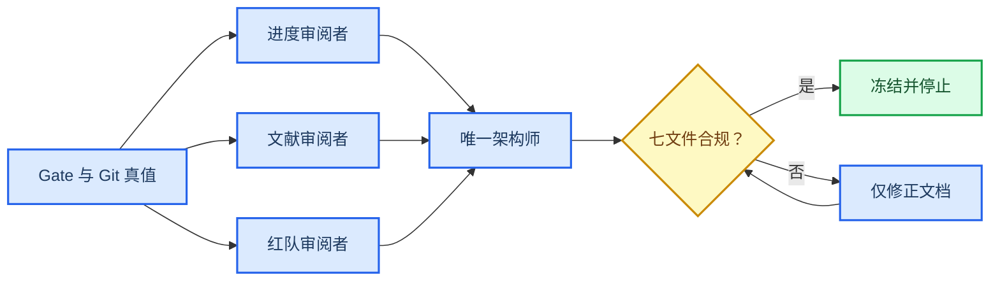

# Agent 管理计划冻结

_任务类型：DOCS_ONLY_ARCHITECTURE_FREEZE；本文件规定 Agent 权限、所有权、交接、红队和停止条件，不授予科学实施或硬件控制权限。_

---

## 📋 当前任务合同

### Allowlist

当前任务只允许创建以下七个文件：

1. `10_research/00_project_architecture/system_architecture.md`
2. `10_research/00_project_architecture/competition_storyline.md`
3. `10_research/00_project_architecture/paper_structure_plan.md`
4. `10_research/00_project_architecture/simulation_scenario_map.md`
5. `10_research/00_project_architecture/digital_twin_plan.md`
6. `10_research/00_project_architecture/experiment_roadmap.md`
7. `10_research/00_project_architecture/agent_management_plan.md`

不得创建 README、第八份报告、脚本、图片、数据或结果目录。

### Denylist

以下资产在本任务中只读：

- `30_simulation/`、`40_evidence/`、`20_engineering/config/`、`20_engineering/cad/`
- `30_simulation/e15_core_coverage/`、`30_simulation/e15_ancf_certification/`、`30_simulation/e16_sync_capture/`
- `40_evidence/tables/`、`40_evidence/artifacts/visualization/`
- `10_research/on_orbit_assembly/`
- `10_research/partner_requirement_closure/`
- 所有 Gate JSON、阈值、几何、SSOT 与授权记录
- `30_simulation/asm_00_interface_preflight/` 和 `10_research/competition_convergence/` 的用户现有未跟踪资产

禁止启动仿真、VLA、装配、HIL、B601 或其他硬件动作。

## 🎯 管理原则

1. **唯一写入者**：七份文件由 Project Chief Architect 单点集成
2. **审阅者只读**：进度、文献和红队 Agent 只能返回意见
3. **Gate 真值优先**：机器 Gate 高于报告、PPT、测试与记忆
4. **证据层隔离**：`LOCAL_ONLY_UNTRACKED` 不得被文档 Agent升级为 committed
5. **负结果冻结**：REPEAT/无安全候选不得被弱化或删除
6. **授权外部化**：Agent 不得创建、修改或自签 HAG
7. **每门即停**：完成约定 Gate 或文档验收后，不自动进入下一任务

## 🏗️ Agent 工作流

该流程不包含 Implementation Agent。审阅 Agent 无权直接改文件，唯一架构师无权运行科学或硬件工具。

## 👥 角色与责任

| 角色 | 允许 | 必须交付 | 禁止 | 当前状态 |
| --- | --- | --- | --- | --- |
| Project Chief Architect | 整合七份 allowlist 文档 | 一致的架构冻结包 | 改科学资产或自启下一阶段 | `ACTIVE_FOR_FREEZE_ONLY` |
| Progress Auditor | 只读 Gate/Git/状态复核 | exact verdict 与错分清单 | 写文件、运行仿真 | `READ_ONLY_REVIEW_COMPLETE` |
| Literature Synthesizer | 只读 manifest/阅读卡/论文结构 | 文献成熟度和引文边界 | 联网补文献、改 manifest | `READ_ONLY_REVIEW_COMPLETE` |
| Report Red Team | 只读主张与证据层审查 | 越界清单和冻结验收 | 提升 local-only 状态 | `READ_ONLY_REVIEW_COMPLETE` |
| Future Implementer | 无当前权限 | 无 | 仿真、装配、VLA、HIL、硬件 | `BLOCKED` |
| Human Gate Authority | 审批明确 HAG | 可验证授权记录 | 把口头同意代替机器记录 | `EXTERNAL` |

### 文件所有权

| 文件 | 唯一 owner | 审阅角色 | 写入并发 | 冻结后 |
| --- | --- | --- | --- | --- |
| `system_architecture.md` | Chief Architect | Progress + Red Team | 1 | 只读 |
| `competition_storyline.md` | Chief Architect | Red Team | 1 | 只读 |
| `paper_structure_plan.md` | Chief Architect | Literature + Red Team | 1 | 只读 |
| `simulation_scenario_map.md` | Chief Architect | Progress | 1 | 只读 |
| `digital_twin_plan.md` | Chief Architect | Progress + Red Team | 1 | 只读 |
| `experiment_roadmap.md` | Chief Architect | Progress + Red Team | 1 | 只读 |
| `agent_management_plan.md` | Chief Architect | Red Team | 1 | 只读 |

任何时候不得有两个 Agent 同时写同一文件。

## 📂 现有 Agent 资产分类

仓库现有 Agent 配置只作为未来角色说明，不构成当前授权。

| Agent 配置 | 既有用途 | 主状态 | 当前处置 | 禁止 |
| --- | --- | --- | --- | --- |
| [sim12-strategy-agent](../../.codex/agents/sim12-strategy-agent.md) | sim_12 Phase 1 设计 | `VERIFIED + FROZEN` | 任务已完成，归档 | 重跑或扩展 9000×4 |
| [sim11-independent-audit-agent](../../.codex/agents/sim11-independent-audit-agent.md) | 可选独立复核 | `PLANNED` | 未授权启动 | 另建平行 sim_11 |
| [paper-review-agent](../../.codex/agents/paper-review-agent.md) | 论文审稿红队 | `PLANNED` | 未来只读审查 | 夸大创新或改 Gate |
| [panel-param agent](../../.codex/agents/panel-param-qualification-agent.md) | 帆板参数转正 | `BLOCKED` | 等待真实参数 | 估算替代实测 |
| [physics-agent architect](../../.codex/agents/physics-agent-architect.md) | 候选工具架构 | `PLANNED` | `DRAFT_NOT_IMPLEMENTED` | 直接力矩/VLA 绕过 SAFE |
| [ground-experiment-agent](../../.codex/agents/ground-experiment-agent.md) | H0–H3 地面路线 | `BLOCKED` | 等 HAG-E 与硬件资格 | 驱动 B601、称微重力 |

sim_12 配置的“任务完成”只证明既有 Phase 1 资产；不授权继续策略全域扫描。panel、ground、physics Agent 的计划文字不能被当成参数、实验或实现结果。

## 🔐 权限模型

### 文档 Agent

可以：

- 读取 Gate、结果、配置、manifest 与报告
- 计算只读文件清单、哈希和链接完整性
- 在 allowlist 内修正架构文档

不可以：

- 运行科学求解器或重建结果
- 改阈值、几何、SSOT、Gate 或 manifest
- 接受 local-only 资产进入 committed baseline
- 创建 HAG 或宣布执行授权

### 科学 Agent

当前全部 `BLOCKED`。未来获得单独任务后仍必须：

- 使用预注册问题、固定输入和唯一输出根
- 在 Gate 后停止
- 保留 PASS、REPEAT、BLOCKED、UNKNOWN 原始语义
- 将新实验与旧冻结结果分开

### 硬件 Agent

当前全部 `BLOCKED`。HAG-E、H0 急停和安全区未通过前，不得连接或驱动 B601。

### Human Gate Authority

HAG-A/B/I/E 必须由外部受信任人类签发，并绑定：

- approved commit
- task card
- success schema
- threshold/SSOT
- ownership
- 哈希与有效期

Agent 不能代签、补签或“按计划推定已同意”。

## 🧾 任务卡最低合同

任何未来 Agent 任务必须包含：

| 字段 | 必填内容 | 缺失时 |
| --- | --- | --- |
| objective | 单一可证伪目标 | `BLOCKED` |
| allowlist | 允许读取/写入路径 | `BLOCKED` |
| denylist | 冻结路径与禁止动作 | `BLOCKED` |
| source revision | HEAD 与 Git 证据层 | `BLOCKED` |
| inputs | 文件、schema、哈希、provenance | `BLOCKED` |
| Gate | exact verdict 字段与停止条件 | `BLOCKED` |
| outputs | 唯一输出根和文件清单 | `BLOCKED` |
| claims | 允许与禁止措辞 | `BLOCKED` |
| authorization | HAG/用户授权路径 | `BLOCKED` |
| rollback | 仅文档或新实验的恢复方式 | `BLOCKED` |

## 🔄 标准交接包

每次 Agent 交接必须报告：

1. 当前 HEAD 与分支
2. `git status --short` 的相关路径
3. evidence tier：committed、dirty、local-only 或 historical
4. 读取的权威来源路径
5. exact machine verdict
6. 主证据状态与 `FROZEN` 标记
7. 允许主张与禁止主张
8. 未解决冲突、UNKNOWN 和 provisional 字段
9. 是否发生写入、运行或外部动作
10. 明确的 STOP/下一授权门

“测试通过”“看起来一致”或“计划完整”不能替代这些字段。

## 🛡️ 红队检查

### 科学红队

- 是否把 coverage PASS 写成 scientific PASS
- 是否弱化 CTRL-01、e15 或 Wave1 的 REPEAT
- 是否隐藏 sim_11/CTRL-02 provisional
- 是否把 SAFE PASS 写成执行授权
- 是否把 UNKNOWN 填成 0 或 SAFE

### 版本红队

- 是否把 `LOCAL_ONLY_UNTRACKED` 写成 HEAD 基线
- 是否引用被 superseded 的历史报告作为当前 Gate
- 是否修改用户已有未跟踪材料
- 是否在 allowlist 外创建文件

### 主张红队

- 是否声称 VLA、装配、实时孪生或硬件已实现
- 是否把捕获、消旋、转移和离轨合成一个完成状态
- 是否把文献或开源仓库写成项目验证
- 是否出现未经查新的“首次”主张

## 🛑 强制停止条件

出现任一情况，Agent 必须停止并报告 `BLOCKED`：

- 请求越过 allowlist 或要求修改 denylist
- 需要运行仿真、装配、VLA、HIL 或硬件
- Gate 字段冲突且无法由最终 JSON 裁决
- 来源、hash 或 provenance 缺失
- 要求 Agent 创建或自签 HAG
- local-only 资产被要求提升为 committed
- 需要放宽阈值、删除 FAIL 或修改旧结果
- 两个 Agent 同时写同一文件
- 七文件之外出现本任务新增文件
- 完成七文件验收后仍要求自动继续

## ✅ 架构冻结验收

验收必须同时满足：

- 恰好七份 Markdown
- 七份都声明 `DOCS_ONLY_ARCHITECTURE_FREEZE`
- 本任务只修改这七份文件
- 冻结科学路径零变化
- exact verdict 与 Git 证据层跨文件一致
- 没有新参数、阈值、结果或科学主张
- 没有仿真、VLA、Assembly、HIL 或 B601 动作
- 内部链接可解析
- 最终裁决只描述架构冻结

验收后：

> `AGENT_WORK_STOPPED_AFTER_ARCHITECTURE_FREEZE`

不得自动提交、启动下一 goal、派发 Implementation Agent 或进入任何实验路线，除非用户另行明确授权。
