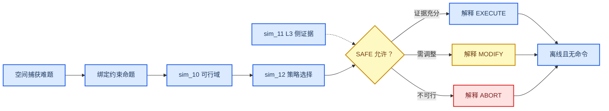

# 竞赛汇报主叙事冻结

_任务类型：DOCS_ONLY_ARCHITECTURE_FREEZE；叙事对象：评委、非本领域工程人员与零基础听众；所有结论受当前 Gate 约束。_

---

## 📋 一句话主张

本项目研究的不是“让 AI 直接控制空间机械臂”，而是让系统先用冻结物理证据回答 **能不能做、应该选哪种策略、证据是否足以允许继续**，并且在证据不足时可靠地拒绝任务。

推荐题目：

> 物理约束空间具身任务智能：面向非合作目标捕获的可行域、策略选择与安全证据链

在轨搭建可以作为共平台远期应用背景，但不得进入“已经实现”的标题或成果清单。

### 汇报水印

只要使用当前本地三场景演示，PPT、视频和口头说明必须同时保留：

- `OFFLINE EVIDENCE REPLAY`
- `NO REAL-TIME SYNCHRONIZATION`
- `NO COMMAND OUTPUT`

本地 [competition Gate](../competition_convergence/competition_gate_check.json) 为 `LOCAL_ONLY_UNTRACKED`。其 `COMPETITION_DEMO_READY` 只说明离线演示包在当前工作区通过 17/17 检查，不属于 HEAD `b4dd48a` 的 committed baseline，也不表示飞行系统、硬件系统或最终参赛包已就绪。

## 🎯 评委应带走的三个认识

1. 空间机械臂没有固定地基，机械臂动作会反过来推动服务航天器，因此抓取问题同时是动力学、接触、姿态和资源问题。
2. 没有一种策略在所有目标上都最好；真正决定策略的是当前最先饱和的物理约束，即 binding gate。
3. 可信的空间智能不仅要会提出动作，还要会在证据不足、资源不够或模型不适用时选择 `MODIFY` 或 `ABORT`。

## 🏗️ 叙事骨架

### 问题

非合作目标可能翻滚、缺少标准接口，质量和惯量也可能不确定。抓住它会交换动量并产生冲击，服务星的反作用轮、推力器、姿态速率和柔性结构都可能先达到限制。

### 核心命题

项目当前最强、且由现有证据支持的命题是：

> 策略选择不能只看末端是否能到达，而应由动量、姿态速率、执行器资源、接触与证据状态中最先绑定的 Gate 决定。

这不是“某个控制算法永远最好”的主张，也不是实时自主飞行主张。

### 证据

- [sim_10 Gate](../../30_simulation/sim_10_mission_feasibility/results/sim_10_gate_check.json)：9002 个冻结工况，`SIM10_GATES_PASS`；FLEX 未入判据
- [sim_11 Gate](../../30_simulation/sim_11_coupled_dynamics/results/sim_11_gate_check.json)：`SIM11_GATES_PASS_WITH_PROVISIONAL_PARAMS`
- [sim_12 Gate](../../30_simulation/sim_12_strategy_feasibility/results/sim_12_gate_check.json)：16 个 Phase 1 单元，`SIM12_PHASE1_GATES_PASS`
- [SAFE-00 Gate](../../30_simulation/safety_00_runtime_gate/results/safety_00_gate_check.json)：决策核 `PASS`，`review_status=PENDING_REVIEW`，且 `next_stage_authorized=false`
- [CTRL-01 Gate](../../30_simulation/control_01_end_effector_tracking/results/control_01_gate_check.json)：`REPEAT`，保留为真实负结果
- [CTRL-02 Gate](../../30_simulation/control_02_base_attitude/results/control_02_gate_check.json)：模块 `PASS`，`review_status=PENDING_REVIEW`，对外只能称 `PASS_WITH_PROVISIONAL_SCOPE`

## 🎤 三分钟口头稿

### 0:00–0:35：为什么这件事难

“地面机械臂通常固定在地面，但空间机械臂安装在自由漂浮航天器上。机械臂一动，服务星会反向运动；抓取翻滚目标时，还会发生冲击、动量交换和柔性振动。所以，‘手能不能碰到目标’远远不够，我们还要问姿态会不会超限、轮组会不会饱和、是否需要推力器，以及证据是否足够可靠。”

### 0:35–1:15：项目真正解决什么

“我们的核心不是让大模型直接发关节命令，而是建立一个不可绕过的物理裁决链。sim_10 像任务交通灯地图，先划分冻结条件下的可行区；sim_12 比较不同策略由哪条约束先卡住；sim_11 作为独立的 L3 世界模型支路，检查瞬时冲量与有限接触带宽的模型边界；SAFE-00 在证据缺失或冲突时默认拒绝。”

### 1:15–2:05：已经得到什么证据

“sim_10 已完成 9002 个工况并通过其冻结 Gate；sim_11 在 provisional 参数范围内通过；sim_12 Phase 1 的 16 个证明单元通过。与此同时，我们没有隐藏负结果：CTRL-01 仍为 REPEAT，Wave 1 仍为 WAVE1_REPEAT，e15 也没有安全候选。这些结果共同告诉我们，可靠系统必须知道什么时候不能做。”

### 2:05–2:40：三场景如何解释

“A 场景展示低负载条件下的 EXECUTE explanation only；B 场景是故意设置的不可行锚点，系统输出 ABORT；C 场景位于策略切换附近，输出 MODIFY 并要求重新进入授权链。三者都只是确定性离线证据回放，没有实时同步，也没有向设备发命令。”

### 2:40–3:00：诚实结论

“因此，当前成果应称为物理约束任务决策与证据治理原型，而不是已经闭环运行的空间具身机械臂。在轨搭建、硬件闭环、实时数字孪生和 VLA 仍待未来 Gate。我们的工程价值在于：系统不仅会解释可行动作，也能基于证据可靠地拒绝危险动作。”

## 📊 十二页比赛汇报结构

| 页 | 标题 | 核心信息 | 证据与状态 | 必须保留的边界 |
| ---: | --- | --- | --- | --- |
| 1 | 项目一句话 | 先证明，再选择，再授权 | 本架构冻结包 | 非飞行系统 |
| 2 | 为什么空间机械臂不同 | 动臂会带动基座 | sim_05/sim_11，`VERIFIED/LIMITED` | 非硬件验证 |
| 3 | 任务问题 | 非合作目标、接触、资源耦合 | 文献与场景定义 | 不声称真实在轨目标 |
| 4 | 六层架构 | 候选不能绕过物理与 SAFE | [系统架构](./system_architecture.md) | VLA `PLANNED` |
| 5 | 可行域地图 | sim_10 给出四类资源区域 | `SIM10_GATES_PASS` | FLEX 未入判据 |
| 6 | 接触与柔性边界 | 有限接触带宽恢复可审计模型 | sim_11 `LIMITED` | 参数 provisional |
| 7 | 策略为何切换 | binding gate 决定策略 | sim_12 Phase 1 `VERIFIED` | 只限 16 单元 |
| 8 | 安全门 | UNKNOWN 不能当 SAFE | SAFE `VERIFIED` | 不授权执行 |
| 9 | 真实负结果 | CTRL-01/e15/Wave1 保留 REPEAT | `NEGATIVE_RESULT` | 不粉饰 |
| 10 | A/B/C 离线演示 | 解释执行、修改和终止 | `LOCAL_ONLY_UNTRACKED` | 三条水印 |
| 11 | 当前缺口 | 装配、硬件、实时、VLA 未完成 | 装配/硬件/实时 `BLOCKED`；VLA `PLANNED` | 不承诺 PASS |
| 12 | 结论 | 安全智能会拒绝无证据动作 | 冻结证据链 | 架构冻结后 STOP |

### 可直接使用的已有素材

| 素材 | 路径 | 状态 | 推荐用途 |
| --- | --- | --- | --- |
| 系统装配等轴测图 | [fig_v01](../../40_evidence/artifacts/visualization/figures/fig_v01_system_assembly_isometric.png) | `LIMITED + FROZEN` | 第 2–3 页几何说明 |
| 参考系与安装图 | [fig_v04](../../40_evidence/artifacts/visualization/figures/fig_v04_mount_and_frames.png) | `LIMITED + FROZEN` | 第 4 页接口说明 |
| Gate 原因分解 | [fig_v07](../../40_evidence/artifacts/visualization/figures/fig_v07_gate_reason_breakdown.png) | `LIMITED + FROZEN` | 第 8–9 页 |
| 绑定约束地图 | [fig_v10](../../40_evidence/artifacts/visualization/figures/fig_v10_binding_constraint_map.png) | `LIMITED + FROZEN` | 第 7 页 |
| 抓取候选相图 | [fig_e1_phase_map](../../30_simulation/sim_09_grasp_evaluator/figures/fig_e1_phase_map.png) | `LIMITED + FROZEN` | 技术附录 |
| 离线 Gate 解释动画 | [anim_v06](../../40_evidence/artifacts/visualization/videos/anim_v06_gate_explanation.mp4) | `LIMITED + FROZEN` | 无 local package 时的保守回放 |

## 🧪 三场景叙事合同

三场景只在本地未跟踪 competition package 被单独验收后使用。

| 场景 | 演示标签 | 合法解释 | 禁止解释 |
| --- | --- | --- | --- |
| A_low | `EXECUTE explanation only` | 冻结证据允许解释候选路径 | 已发命令、已执行抓取 |
| B_anchor | `ABORT` | 不可行锚点验证系统会拒绝 | 任务失败、控制器已执行反事实 |
| C_transition | `MODIFY and re-enter authorization` | 接近切换边界，需要调整后重新审查 | 已选择并授权新策略 |

### 三场景共同事实

- `command_emitted=false`
- `real_time_synchronization=false`
- SAFE-00 `next_stage_authorized=false`
- B601 设备运动未被当前架构授权
- 演示不能证明捕获、消旋、转移和离轨处置已经完成

## 🛡️ 评委追问口径

### “你们的具身智能在哪里？”

当前具身智能贡献是任务理解、候选生成、物理工具调用和证据解释的架构；执行前必须经过确定性模型与安全核。没有声称端到端 VLA 已实现。

### “为什么 PASS 还不能执行？”

模块 Gate 只验证各自冻结合同。真实执行还需要有效场景绑定、硬件资格、人工授权和上游 Gate；SAFE-00 本身明确给出 `next_stage_authorized=false`。

### “为什么展示 REPEAT？”

CTRL-01、e15 和 Wave 1 的负结果揭示了 6D 零空间、柔性认证和执行器资格的真实边界。保留这些结果比把它们调成 PASS 更符合航天工程的可审计性。

### “装配做到哪一步？”

规划和评价合同已经形成；当前本地 ASM-00 前检为 `ASM00_BLOCKED_BY_MISSING_PARAMETERS`，且尚未纳入 HEAD。ASM-01/02 未授权、未实施。

### “这是实时数字孪生吗？”

不是。当前最高只能称为确定性、受限的 DT2 离线证据回放；没有统一实时状态流、双向设备命令或 HIL Gate。

## 🚫 禁止主张

- “已完成自主在轨搭建/空间碎片清除”
- “已实现空间具身智能机械臂闭环”
- “实时数字孪生”
- “A 场景已经获得真实执行授权”
- “CTRL-01、Wave 1 或 e15 基本通过”
- “CTRL-02 已证明硬件稳定”
- “44 篇论文均已深入精读”
- “开源仓库已集成并独立验证项目结果”
- “国内首创”或“世界首次”

## ✅ 叙事冻结验收

- [x] 主线围绕现有非合作目标捕获证据，不依赖装配 PASS
- [x] 三场景被限定为 `LOCAL_ONLY_UNTRACKED` 离线解释
- [x] `EXECUTE`、`MODIFY`、`ABORT` 语义互不混淆
- [x] PASS、provisional、PENDING_REVIEW 与 REPEAT 全部保留
- [x] 没有新增科学数字、策略结论或仿真结果
- [x] 没有把架构冻结表述成系统研发完成

叙事被冻结后，任何新 PPT、视频或讲稿只能引用本文件及 [system_architecture.md](./system_architecture.md) 中允许的措辞；不得自动启动下一阶段。
