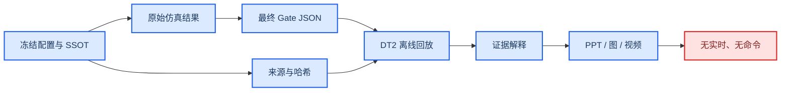

# 数字孪生架构计划冻结

_任务类型：DOCS_ONLY_ARCHITECTURE_FREEZE；本文件定义成熟度、证据流和升级门，不实现新的孪生、同步、遥测或硬件接口。_

---

## 📋 当前裁决

当前最高允许称为：

> `DT2_SCOPE_LIMITED_OFFLINE_REPLAY`

这表示可以用冻结输入、原始结果、Gate 和哈希确定性重建一段证据解释。它不表示实时状态同步、在线估计、硬件双向闭环或自主在轨执行。

当前成熟度不是一个单一“PASS”：

- committed baseline 已有 CAD、可执行动力学和历史/局部 DT2 资产
- 当前工作区另有 `LOCAL_ONLY_UNTRACKED` 的三场景离线回放 Gate
- DT3、DT4 与 ASM-TWIN 均未获得实施证据

## 🎯 DT0–DT4 定义

| 等级 | 项目内定义 | 当前资产 | 主状态 | 当前裁决 |
| --- | --- | --- | --- | --- |
| DT0 | 几何、质量、接口与参考系数字样机 | CAD/URDF/几何 v0/v1 | `LIMITED + FROZEN` | 存在，但参数不全是实测 |
| DT1 | 可执行的确定性动力学与 Gate | sim_01–12、SAFE、CTRL | 混合 | 存在；按模块 exact verdict |
| DT2 | 由冻结证据驱动的确定性离线回放 | visualization、70_tools/research_dashboard、competition local | `LIMITED` | 当前最高成熟度 |
| DT3 | 真实状态流、统一时钟与在线估计 | 无 | `BLOCKED` | 未实现、未启动 |
| DT4 | 硬件双向命令、遥测、急停与 HIL | 无 | `BLOCKED` | 未实现、未启动 |

`FROZEN` 只表示基线不可改动；例如 DT1 同时包含 `VERIFIED`、`LIMITED` 和 `NEGATIVE_RESULT` 模块。

## 🏗️ 当前孪生证据流

视频、PPT 和动画是显示层，不是科学真值源。显示层不能反向修改 Gate 或把解释性 `EXECUTE` 变成真实授权。

## 📦 数字孪生资产登记

### DT0：数字样机

| 资产 | Git 证据层 | 主状态 | 可用范围 | 不能证明 |
| --- | --- | --- | --- | --- |
| [12U servicer v0](../../20_engineering/cad/spacecraft_layout/servicer_12U_v0/) | `COMMITTED_BASELINE` | `LIMITED + FROZEN` | 竞赛几何基线 | 制造、质量或热结构资格 |
| [B601 arm v1](../../20_engineering/cad/spacecraft_layout/arm_b601_v1/) | `COMMITTED_BASELINE` | `LIMITED + FROZEN` | 运动链与可视化 | 实测关节、摩擦和柔顺 |
| [target models](../../20_engineering/cad/spacecraft_layout/target_debris_v0/) | `COMMITTED_BASELINE` | `LIMITED + FROZEN` | 冻结目标几何 | 真实碎片不确定性 |
| [frame tree](../../20_engineering/config/geometry/frame_tree_v1.yaml) | `COMMITTED_BASELINE` | `VERIFIED + FROZEN` | 名义参考系接口 | 硬件标定误差 |
| capture/interface geometry | `COMMITTED_BASELINE` | `LIMITED + FROZEN` | 规划与前检 | ASM 接口资格 |

### DT1：可执行模型

| 资产 | 精确科学状态 | 孪生角色 | 主状态 | 不能证明 |
| --- | --- | --- | --- | --- |
| sim_05/06 | 下游锚点复核 | 自由漂浮与捕获冲量基线 | `VERIFIED + FROZEN` | 真实硬件 |
| sim_10 | `SIM10_GATES_PASS` | 任务可行域 | `VERIFIED + FROZEN` | FLEX 或硬件可行 |
| sim_11 | `SIM11_GATES_PASS_WITH_PROVISIONAL_PARAMS` | 有限带宽/柔性模型 | `LIMITED + FROZEN` | 参数已转正 |
| sim_12 | `SIM12_PHASE1_GATES_PASS` | 策略 binding gate | `VERIFIED + FROZEN` | 完整策略全域 |
| SAFE-00 | `PASS`；`PENDING_REVIEW`；next=false | fail-closed 决策核 | `VERIFIED + FROZEN` | 执行授权 |
| CTRL-01 | `REPEAT` | 控制负结果 | `NEGATIVE_RESULT + FROZEN` | 通用轨迹控制闭合 |
| CTRL-02 | 模块 `PASS`；`PENDING_REVIEW`；对外 `PASS_WITH_PROVISIONAL_SCOPE` | provisional 资源检查 | `LIMITED + FROZEN` | 硬件稳定 |
| e15 core | `REPEAT_CORE_NO_SAFE_CANDIDATE` | 核心安全负结果 | `NEGATIVE_RESULT + FROZEN` | coverage PASS 等于科学 PASS |
| e15 ANCF | `REPEAT_ANCF_CERTIFICATION` | 柔性认证负结果 | `NEGATIVE_RESULT + FROZEN` | ANCF 已认证 |
| Wave 1 | `WAVE1_REPEAT` | 集成负结果 | `NEGATIVE_RESULT + FROZEN` | scientific PASS |

### DT2：离线证据回放

| 资产 | Git 证据层 | 主状态 | 支持的主张 | 必须水印 |
| --- | --- | --- | --- | --- |
| [visualization assets](../../40_evidence/artifacts/visualization/) | `COMMITTED_BASELINE` | `LIMITED + FROZEN` | 冻结结果离线可视化 | 非实时、非硬件 |
| [research dashboard](../../70_tools/research_dashboard/) | `COMMITTED_BASELINE` | `NEGATIVE_RESULT + FROZEN` | 确定性整合与 `REPEAT_CORE` | 不授权 E2/G3/HIL |
| [numerical twin status](../framework_convergence/numerical_twin_status.md) | `COMMITTED_BASELINE` | `LIMITED + FROZEN` | 旧基线成熟度说明 | 带日期阅读 |
| [competition local Gate](../competition_convergence/competition_gate_check.json) | `LOCAL_ONLY_UNTRACKED` | `LIMITED` | 当前工作区三场景 17/17 | offline、no command |
| competition PPT/video/artifacts | `LOCAL_ONLY_UNTRACKED` | `LIMITED` | 比赛演示候选 | 不属于 HEAD |

[numerical_twin_status.md](../framework_convergence/numerical_twin_status.md) 早于当前本地 ASM-00 前检和 competition replay。它仍是 committed 历史快照，但不能覆盖更新的本地观察；本地观察也不能反向升级 committed baseline。

## 🔐 离线回放合同

每次合法 DT2 回放必须能回答：

| 合同字段 | 必须内容 | 缺失时 |
| --- | --- | --- |
| evidence ID | 模块、场景、Gate 路径 | `BLOCKED` |
| source revision | HEAD、工作区证据层 | `BLOCKED` |
| input binding | 配置/SSOT 路径与哈希 | `BLOCKED` |
| artifact binding | 原始结果和 Gate 哈希 | `BLOCKED` |
| exact verdict | 原始机器字符串 | `BLOCKED` |
| limitations | provisional、UNKNOWN、适用域 | `BLOCKED` |
| output semantics | explanation only / no command | `BLOCKED` |
| timestamp semantics | 生成时间与科学时间分离 | `BLOCKED` |

缺失值不得填成 0；`UNKNOWN` 不得解释为 SAFE；历史快照不得覆盖最终 Gate。

## 🚦 DT2 → DT3 升级门

DT3 只有在以下条件全部完成后才可从 `BLOCKED` 变为候选：

1. 存在真实、连续、带来源的状态流
2. 相机、IMU、关节、腕力和平台状态使用统一时钟
3. 有在线状态估计、时间对齐和坐标系版本
4. 定义陈旧数据、丢包、乱序与传感器失效的 fail-closed 规则
5. 回放模型能与真实流双向对时，而不是播放预生成文件
6. 状态同步误差和延迟有冻结 Gate
7. 权限仍限制为观察，不自动发设备命令

当前这些条件没有项目级 Gate，因此 DT3 保持 `BLOCKED`。

## 🛑 DT3 → DT4 升级门

DT4 还必须新增：

1. H0 设备清单、急停、速度/力矩限制和安全区
2. 版本化的命令接口与双向遥测
3. 硬件在环时基和超时策略
4. 人工授权 HAG-E
5. H0/H1/H2/H3 的顺序 Gate
6. 命令回路与 SAFE/AG5 的不可绕过绑定
7. 断链、传感失真和执行器饱和的安全停机证明

固定基座 B601 演示不能等价为自由漂浮或微重力验证。当前 B601 运动未被本架构授权，DT4 保持 `BLOCKED`。

## 🧩 装配数字孪生支路

`ASM-TWIN-00` 的主证据状态为 `PLANNED`，执行授权为 `BLOCKED`。其合法输入必须来自正式的：

1. ASM-00 接口资格结果
2. ASM-01 连续接触结果
3. ASM-02 分阶段控制结果
4. 唯一集成 Gate
5. 对应 HAG 授权、哈希与 provenance

本地 ASM-00 preflight 没有进行物理解算或 Monte Carlo，其 raw verdict 为 `ASM00_AG0_BLOCKED_BY_INTERFACE`，external status 为 `ASM00_BLOCKED_BY_MISSING_PARAMETERS`。因此不得构造“已完成装配孪生”的叙事。

## 🤖 具身智能与孪生的权限边界

| 组件 | 可读取 | 可输出 | 禁止 |
| --- | --- | --- | --- |
| VLA/FSM 候选层 | 只读状态摘要、任务语义 | 候选技能、解释、重观测建议 | 直接命令和自签授权 |
| Physics Tools | 版本化状态与候选 | 确定性求值、证据字段 | 覆盖 Gate 真值 |
| SAFE | 完整证据包 | ALLOW/MODIFY/ABORT 语义 | 忽略 UNKNOWN |
| DT2 | 冻结证据 | 离线回放与审计记录 | 声称实时同步 |
| DT3/DT4 | 当前无合法输入 | 无 | 启动实现或硬件 |

VLA 与 Physics Tools 当前都是 `PLANNED`；本文件不实现它们。

## 🚫 禁止主张

- “当前已经是实时数字孪生”
- “e16 sync 等于实时状态同步”
- “动画或视频就是 DT3”
- “competition demo 已进入 committed baseline”
- “装配数字孪生已经完成”
- “固定基座 B601 等价于自由漂浮硬件闭环”
- “DT2 的 EXECUTE 标签已经发出命令”
- “VLA 已接入数字孪生并控制设备”

## ✅ 计划冻结验收

- [x] DT0–DT4 定义与当前状态已统一
- [x] committed baseline 与 local-only replay 已分离
- [x] 当前最高成熟度限定为受限 DT2 离线回放
- [x] DT3/DT4 执行保持 `BLOCKED`；ASM-TWIN 主证据为 `PLANNED`、执行授权为 `BLOCKED`
- [x] 显示层与科学 Gate 真值源已分离
- [x] 没有实现遥测、同步、VLA、装配或硬件接口

本计划冻结后状态为 `STOP_AFTER_ARCHITECTURE_FREEZE`；升级只能由新的明确任务和满足全部前置 Gate 的证据触发。
