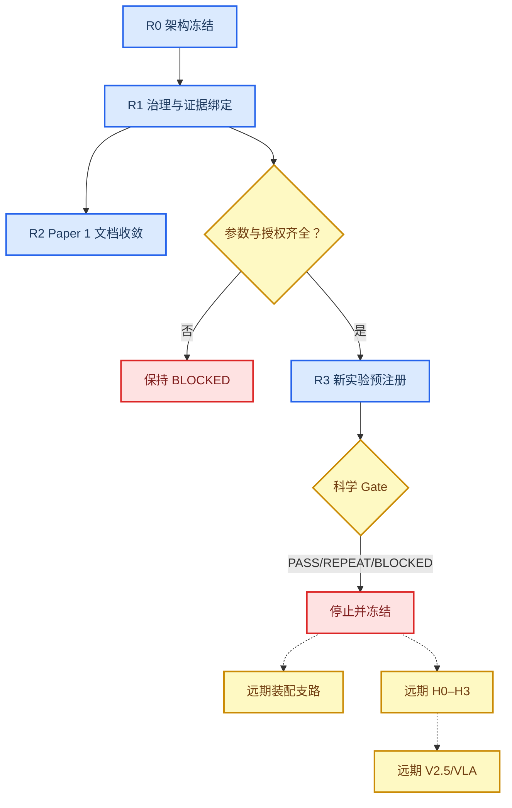

# 实验路线图冻结

_任务类型：DOCS_ONLY_ARCHITECTURE_FREEZE；本路线图只定义未来 Gate 顺序、输入和停止条件，当前不运行仿真、装配、VLA、HIL 或硬件。_

---

## 📋 当前总状态

唯一已经完成的阶段是：

> `R0_ARCHITECTURE_FREEZE_COMPLETE`

所有后续阶段均为 `PLANNED` 或 `BLOCKED`，并统一处于 `NOT_AUTHORIZED_TO_START`。本路线图不提供预计 PASS，不用日期替代授权，也不因为上游计划完整就默认下游会启动。

### 路线原则

1. 先闭合证据、参数和授权，再谈新实验
2. 每个科学 Gate 后立即停止，不自动进入下一阶段
3. 负结果原样冻结，不在旧问题上调参修成 PASS
4. 新增益、新几何、新场景或新模型必须注册为新实验
5. 竞赛叙事与 Paper 1 可以基于现有证据推进，不依赖装配或 VLA
6. 当前任务在七份架构文件验收后停止

## 🏗️ 门控路线总图

虚线只表示远期依赖，不表示自动授权。

## 🎯 R0：架构冻结

| 项目 | 输入 | 输出 | 状态 | 停止条件 |
| --- | --- | --- | --- | --- |
| 七份架构文档 | 当前 Gate、状态报告、manifest | 本目录七份 Markdown | `VERIFIED + FROZEN + LOCAL_ONLY_UNTRACKED` | 未进入 HEAD；七文件验收后 STOP |
| 状态分类 | 全部资产与 Git 证据层 | 双轴状态协议 | `VERIFIED + FROZEN` | 不改科学 Gate |
| 边界冻结 | 用户禁令与仓库规则 | no simulation/VLA/assembly | `VERIFIED + FROZEN` | 任一越界即 BLOCKED |

本阶段不提交、不运行科学工具、不修改用户已有未跟踪材料。

## 📑 R1：治理与证据绑定

这是未来最先允许考虑的工作，但当前仍未授权执行。

| 工作包 | 入门条件 | 计划输出 | 主状态 | 失败/停止裁决 |
| --- | --- | --- | --- | --- |
| 状态入口一致性复核 | `research_state_v4.md` 与已有总览 | 保持现行薄指针，不创建平行 SSOT | `VERIFIED + FROZEN` | 指定缺失路径仅登记 |
| local-only 验收决策 | 用户决定是否纳入版本基线 | competition/ASM 采用或拒绝记录 | `PLANNED` | 未决定前保持 local-only |
| Paper 1 状态冲突清理 | 只读核对 sim_12 与 manifest | 一致的结构和引用口径 | `PLANNED` | 不改结果或 Gate |
| 核心 M2 文献精读 | 现有合法 PDF | 新阅读卡 | `PLANNED` | 不把题录级内容写成已精读 |
| 参数 provenance 表 | 真实来源和版本 | 可审计参数台账 | `BLOCKED` | 来源缺失即 UNKNOWN |

## 📚 R2：现有证据的论文与比赛包装

R2 只允许文档工作，不允许科学重跑。

### Paper 1

- 以 [paper_structure_plan.md](./paper_structure_plan.md) 为唯一结构
- 逐主张绑定 sim_10/11/12、SAFE、CTRL 和负结果
- 消除旧“59 条语料”与当前 45 条 manifest 冲突
- 不生成无法绑定到机器字段的新数字
- 不把 assembly、VLA 或 local-only Gate 写成当前贡献

### 比赛材料

- 以 [competition_storyline.md](./competition_storyline.md) 为唯一叙事
- committed baseline 与 local-only 演示分栏
- 三条水印长期保留
- 采用现有图、表和视频，不重算科学结果

R2 当前为 `PLANNED`；架构冻结不会自动启动它。

## ⚙️ R3：参数转正与重跑触发器

只有真实参数进入唯一 SSOT、完成 provenance 和版本绑定后，才允许申请新实验。

| 触发器 | 当前缺口 | 受影响资产 | 未来合法动作 | 当前状态 |
| --- | --- | --- | --- | --- |
| 帆板质量、模态、刚度实测 | sim_11 provisional | sim_11 与下游 | 新版本预注册重跑 | `BLOCKED` |
| B601 夹爪闭合/接触时间 | `T_c=20 ms` provisional | sim_11、接触支路 | 新版本预注册重跑 | `BLOCKED` |
| 轮力矩与轮动量 | 暂定 L1/口径冲突 | sim_10、CTRL-02、ASM-02 | 资源 Gate 复核 | `BLOCKED` |
| 推力器最小脉冲量 | W1-R13 敏感性 | sim_10/CTRL/Wave | 新版本敏感性实验 | `BLOCKED` |
| 新的核心安全刚体候选 | e15 safe=0 | e15 core/ANCF | 新候选 Radau/BDF 认证 | `PLANNED` |
| markerless 状态估计流 | 无项目级 Gate | ADR/DT3 | 新感知 Gate 预注册 | `BLOCKED` |

旧 sim_11、CTRL-02、e15 和 Wave 1 结果继续 `FROZEN`，不能原地覆盖。

## 🧩 远期 Assembly Wave A

装配路线只保留门序，不实施。

### A0：HAG-A 与合同一致性

入门条件：

- 8/9 success schema 冲突闭合
- 唯一九项 evaluator 完成版本和哈希绑定
- HAG-A 由外部受信任的人类签发
- protected inputs 的 raw-byte 哈希一致

当前状态：`BLOCKED`。

### A1：ASM-00 接口资格

入门条件：

- A0 全部通过
- RF-1/2/3、销距、倒角、clearance 语义和摩擦 provenance 完整
- 接口关键字段可机器求值

输出只能是正式 `PASS/REPEAT/BLOCKED`。任一结果后立即停止；`PASS` 也不自动进入 ASM-01/02。

当前本地 preflight 为 `LOCAL_ONLY_UNTRACKED`，raw verdict 为 `ASM00_AG0_BLOCKED_BY_INTERFACE`，external status 为 `ASM00_BLOCKED_BY_MISSING_PARAMETERS`。

### A2：HAG-B 与 SSOT v1

只有 ASM-00 正式 Gate 被接受后，HAG-B 才能批准参数消费。缺失或哈希不符时保持 `BLOCKED`。

### A3：ASM-01 连续接触

入门条件：

- HAG-B 有效
- 连续接触、卡滞/锁紧状态机和 UNKNOWN fail-closed 语义冻结
- 目标侧 FFR/AG4 合格

否则最高只能 `SCREENING_ONLY`。当前状态：`BLOCKED`。

### A4：ASM-02 分阶段控制

入门条件：

- ASM-01 达到规定 Gate
- W1-R12/R13 的执行器参数闭合
- 5D 接近与短程 6D 锁紧接口冻结

当前状态：`BLOCKED`。

### A5：唯一集成

只有 HAG-I 接受 AG0–AG4、哈希和 provenance 后，才允许一次唯一物理集成。HAG-C 只能接受机器原始 verdict，不能人工翻转。当前状态：`BLOCKED`。

`ASM-TWIN-00` 必须等待 A1–A5 的正式结果；主证据状态为 `PLANNED`，执行授权为 `BLOCKED`。

## 🛰️ 远期 ADR 专用 Gate

现有捕获主链还不能等价为完整空间碎片清除。未来独立 ADR Gate 应按任务阶段拆分：

| 阶段 | 计划 Gate | 必须证明 | 当前状态 |
| --- | --- | --- | --- |
| 表征 | ADR-PER | 位姿/角速度与不确定性 | `BLOCKED` |
| 抓点 | ADR-GRASP | 抓点可达、稳定和接触证据 | `PLANNED` |
| 同步 | ADR-SYNC | 相对运动进入捕获窗口 | `PLANNED` |
| 捕获 | ADR-CAP | 柔顺抓持且不推离目标 | `PLANNED` |
| 消旋 | ADR-DET | 组合体重构、资源与稳定 | `PLANNED` |
| 转移/处置 | 未来任务 Gate | 推进、轨道与法规边界 | `BLOCKED` |

捕获不等于消旋，消旋也不等于转移或离轨完成。当前不实施这些 Gate。

## 🧪 远期 H0–H3

| 阶段 | 目的 | 前置条件 | 当前状态 | 禁止 |
| --- | --- | --- | --- | --- |
| H0 | 设备清单、安全区、急停和静态资格 | HAG-E | `BLOCKED` | 驱动 B601 |
| H1 | 固定基座组件测试 | H0 PASS | `BLOCKED` | 称微重力验证 |
| H2 | 受控闭环/HIL | H1 与时基/遥测 Gate | `BLOCKED` | 跳过急停和 SAFE |
| H3 | 更高保真/自由漂浮候选 | H2 与专用平台 | `BLOCKED` | 称在轨验证 |

任何固定基座结果都不能直接等价为空间自由漂浮结果。

## 🤖 远期 V2.5 与 VLA

顺序必须为：

1. 先建立确定性 FSM/工具调用基线 V2.5
2. 冻结同场景、同输入、同 Gate 的配对实验
3. VLA 只输出候选与解释
4. Physics Tools 与 SAFE 完成确定性求值
5. 比较任务收益、错误类型和拒绝行为

当前 V2.5、VLA、OpenVLA/openpi 集成均为 `PLANNED`。没有硬件/任务 Gate 前不得把 VLA 接入设备命令链。

## 🛡️ 统一停止条件

任一阶段出现以下情况立即 `STOP/BLOCKED`：

- HAG 缺失、过期或与 HEAD/hash 不符
- SSOT、阈值、几何或输入 raw hash 不一致
- provenance 缺失
- UNKNOWN 被要求当作 0 或 SAFE
- 接触未收敛
- 上游 scientific verdict 为 REPEAT/BLOCKED
- local-only 结果被要求冒充 committed baseline
- 需要修改旧 Gate、删除 FAIL 或放宽阈值才能通过
- 任务请求越过用户明确禁止的仿真、装配、VLA 或硬件边界

## ✅ 路线冻结验收

- [x] 当前只完成 R0 架构冻结
- [x] 后续阶段均未被自动授权
- [x] 竞赛/Paper 1 与装配/VLA/硬件支路解耦
- [x] 重跑只由真实参数和新预注册实验触发
- [x] 每个 Gate 后都有强制停止
- [x] 没有运行实验、仿真、装配或硬件动作

本路线图冻结后裁决为 `ROADMAP_FROZEN_NOT_AUTHORIZED_TO_EXECUTE`。
