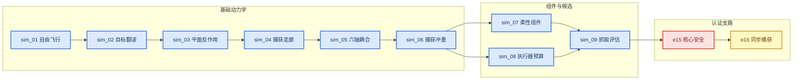
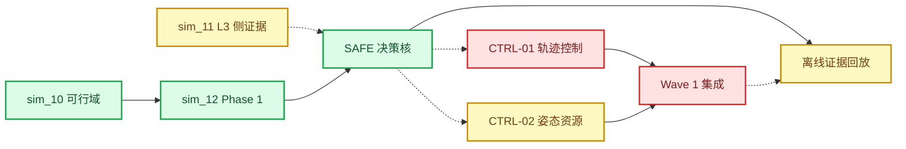

# 仿真场景与 Gate 地图冻结

_任务类型：DOCS_ONLY_ARCHITECTURE_FREEZE；本文件只索引既有场景、结果和裁决，不运行、重算或修改任何仿真。_

---

## 📋 总裁决

仿真资产不是一串“全部 PASS”的模块，而是三类证据的组合：

- 在冻结适用域内通过的证据：sim_10、sim_12 Phase 1、SAFE 决策核
- 带参数/适用域限制的证据：sim_09、sim_11、e16、CTRL-02
- 已完成并冻结的负结果：E1.5、e15、CTRL-01、Wave 1

运行状态统一为：

> `NO_NEW_SIMULATION — STOP_AFTER_ARCHITECTURE_FREEZE`

`FROZEN` 表示不改动；`VERIFIED/LIMITED/NEGATIVE_RESULT/PLANNED/BLOCKED` 表示证据状态。两者不能互相替代。

## 🏗️ 证据演化关系

### 基础资产到抓取候选

### 当前竞赛科学脊柱

实线 `SAFE→离线证据回放` 是竞赛必经主边；sim_11、CTRL-01/02 与 Wave 1 的虚线只提供侧证据或负结果边界，不是回放的前置 Gate。

## 📊 sim_01–sim_09 场景登记

| 模块 | 科学问题与既有输出 | 主状态 | 可引用主张 | 禁止外推 |
| --- | --- | --- | --- | --- |
| sim_01 | 120 s 自由飞行姿态/角速度时序 | `LIMITED + FROZEN` | 早期场景资产完成 | 独立 scientific PASS |
| sim_02 | 翻滚目标与抓取点运动时序 | `LIMITED + FROZEN` | 目标运动学输入已生成 | 真实相机或在线估计 |
| sim_03 | 平面臂—基座反作用趋势 | `LIMITED + FROZEN` | 早期耦合趋势 | 当前 6R 主模型 |
| sim_04 | 1620 个早期走廊工况；历史 SAFE 312 | `LIMITED + FROZEN` | 早期 reaction-aware 筛选 | 当前统一安全 Gate |
| sim_05 | 6R 自由漂浮基线；被 sim_11 G3b 退化复核 | `VERIFIED + FROZEN` | 数值锚点被下游交叉核对 | 真实航天器验证 |
| sim_06 | 40 个捕获冲量工况；被 sim_10 X1 复核 | `VERIFIED + FROZEN` | 冲量锚点可复查 | 捕获等于消旋 |
| sim_07 | ANCF 组件响应与模式对比 | `LIMITED + FROZEN` | 组件级响应已计算 | 候选级柔性认证 |
| sim_08 | 960 个执行机构预算工况；被 sim_10 X3 对拍 | `LIMITED + FROZEN` | 预算账本可复查 | placeholder 等于硬件选型 |
| sim_09/E1 | 72 例；69 IK；24 admissible；16 Pareto | `LIMITED + FROZEN` | 候选评估 campaign 完成 | admissible 等于 formal safe |
| sim_09/E1.5 | SAFE=0、UNKNOWN=3、UNSAFE=69 | `NEGATIVE_RESULT + FROZEN` | `REPEAT_E1_5` | “基本通过” |

早期模块没有独立最终科学 Gate 的，不因“结果文件存在”而补造 PASS。关键结果可从 [状态真值报告](../framework_convergence/state_truth_report.md)和各模块 `results/` 目录追溯。

## 📈 e15、e16 与当前主链

| 模块 | 规模与判据 | 精确 verdict | 主状态 | 边界 |
| --- | --- | --- | --- | --- |
| e15 core | 72/72 覆盖；66 几何无效；6 CORE_UNSAFE；0 safe | `REPEAT_CORE_NO_SAFE_CANDIDATE` | `NEGATIVE_RESULT + FROZEN` | coverage PASS 不是科学 PASS |
| e15 ANCF | 候选级 Radau/BDF 认证；历史最大差 5.637% | `REPEAT_ANCF_CERTIFICATION` | `NEGATIVE_RESULT + FROZEN` | 无最终安全候选 |
| e16 sync | 216 总计；198 上游拒绝；18 动力学；formal safe=0 | `PASS_WITH_GEOMETRY_AND_FLEX_LIMITATIONS` | `LIMITED + FROZEN` | sync 是离线扫描，ANCF 未运行 |
| sim_10 | 9002 点；6323 wheel only、1858 rate infeasible、730 thruster required、91 resource infeasible | `SIM10_GATES_PASS` | `VERIFIED + FROZEN` | FLEX=UNKNOWN_NOT_IN_CRITERIA |
| sim_11 | 浮动基座、机械臂、柔性帆板、有限接触带宽；G1–G5 | `SIM11_GATES_PASS_WITH_PROVISIONAL_PARAMS` | `LIMITED + FROZEN` | 帆板参数与 `T_c=20 ms` provisional |
| sim_12 Phase 1 | 16 个策略证明单元；三门与声明审计 | `SIM12_PHASE1_GATES_PASS` | `VERIFIED + FROZEN` | 只限 Phase 1；FLEX 未入判据 |
| SAFE-00 | UNKNOWN→ALLOW=0；绕过成功=0；误停率=0 | `PASS` | `VERIFIED + FROZEN` | `PENDING_REVIEW`；next=false |
| CTRL-01 | 18 场景；A2/D/E/F 未闭合 | `REPEAT` | `NEGATIVE_RESULT + FROZEN` | 旧冻结问题不调到 PASS |
| CTRL-02 | 16 瞬态中 7 个在 provisional 时窗稳定 | 模块 `PASS` | `LIMITED + FROZEN` | 对外 `PASS_WITH_PROVISIONAL_SCOPE` |
| Wave 1 | 实现缺陷关闭；科学结果保留 | `WAVE1_REPEAT` | `NEGATIVE_RESULT + FROZEN` | next wave=false；merge=false |

## 🧾 全部 Gate JSON 登记

冻结时共发现 15 个名称或用途属于 Gate 的 JSON。14 个是当前/历史权威入口，1 个是明确的中间 partial。任何摘要文件都不能覆盖其对应最终 Gate。

| Gate JSON | Git 证据层 | 精确裁决 | 主状态 | 权威说明 |
| --- | --- | --- | --- | --- |
| [E1](../../30_simulation/sim_09_grasp_evaluator/results/e1_gate_check.json) | `COMMITTED_BASELINE` | 无全局 verdict；`condition3_any_bucket_pass=true` | `LIMITED + FROZEN` | 不从文件名推导 PASS |
| [E1.5 历史快照](../../40_evidence/artifacts/visualization/e15_gate_evidence_snapshot_20260714/results__sim_09_grasp_evaluator__e15_gate_check.json) | `COMMITTED_BASELINE` | `REPEAT_E1_5` | `NEGATIVE_RESULT + FROZEN` | 历史冻结结果 |
| [e15 core](../../30_simulation/e15_core_coverage/results/core_gate_check.json) | `COMMITTED_BASELINE` | coverage `P0_A_CORE_COVERAGE_PASS`；science `REPEAT_CORE_NO_SAFE_CANDIDATE` | `NEGATIVE_RESULT + FROZEN` | 科学 verdict 优先 |
| [e15 ANCF](../../30_simulation/e15_ancf_certification/results/gate_summary.json) | `COMMITTED_BASELINE` | `REPEAT_ANCF_CERTIFICATION` | `NEGATIVE_RESULT + FROZEN` | 最终候选 Gate 不可用 |
| [e16](../../30_simulation/e16_sync_capture/results/gate_check.json) | `COMMITTED_BASELINE` | `PASS_WITH_GEOMETRY_AND_FLEX_LIMITATIONS` | `LIMITED + FROZEN` | formal safe=0 |
| [sim_10](../../30_simulation/sim_10_mission_feasibility/results/sim_10_gate_check.json) | `COMMITTED_BASELINE` | `SIM10_GATES_PASS` | `VERIFIED + FROZEN` | 仅其冻结适用域 |
| [sim_11 partial](../../30_simulation/sim_11_coupled_dynamics/results/gates_inline_partial.json) | `COMMITTED_BASELINE` | 无全局 verdict | `LIMITED + FROZEN` | 只含中间 G3 诊断 |
| [sim_11 final](../../30_simulation/sim_11_coupled_dynamics/results/sim_11_gate_check.json) | `COMMITTED_BASELINE` | `SIM11_GATES_PASS_WITH_PROVISIONAL_PARAMS` | `LIMITED + FROZEN` | 覆盖 partial 的当前裁决 |
| [sim_12](../../30_simulation/sim_12_strategy_feasibility/results/sim_12_gate_check.json) | `COMMITTED_BASELINE` | `SIM12_PHASE1_GATES_PASS` | `VERIFIED + FROZEN` | Phase 1 |
| [SAFE-00](../../30_simulation/safety_00_runtime_gate/results/safety_00_gate_check.json) | `COMMITTED_BASELINE` | `PASS`；next=false；`PENDING_REVIEW` | `VERIFIED + FROZEN` | 模块证据与执行授权分离 |
| [CTRL-01](../../30_simulation/control_01_end_effector_tracking/results/control_01_gate_check.json) | `COMMITTED_BASELINE` | `REPEAT`；next=false | `NEGATIVE_RESULT + FROZEN` | 真实负结果 |
| [CTRL-02](../../30_simulation/control_02_base_attitude/results/control_02_gate_check.json) | `COMMITTED_BASELINE` | 模块 `PASS` | `LIMITED + FROZEN` | 外部口径 provisional |
| [Wave 1](../partner_requirement_closure/wave1_results/wave1_gate_check.json) | `COMMITTED_BASELINE` | `WAVE1_REPEAT`；next=false；merge=false | `NEGATIVE_RESULT + FROZEN` | CP6 不翻转 verdict |
| [ASM-00 preflight](../../30_simulation/asm_00_interface_preflight/results/asm_00_gate_check.json) | `LOCAL_ONLY_UNTRACKED` | raw `ASM00_AG0_BLOCKED_BY_INTERFACE`；external `ASM00_BLOCKED_BY_MISSING_PARAMETERS` | `BLOCKED` | 无物理解算/Monte Carlo |
| [Competition Demo](../competition_convergence/competition_gate_check.json) | `LOCAL_ONLY_UNTRACKED` | `COMPETITION_DEMO_READY` | `LIMITED` | offline=true；real-time=false；next=false |

### 非 Gate 摘要

以下资产可解释结果，但不拥有最终裁决权：

- [research integration summary](../../70_tools/research_dashboard/results/research_integration_summary.json)
- `control_01_run_summary.json`、`experiment_summary.json`
- stage/timing summaries
- `research_state_v4.md` 与竞赛叙述报告

其中 research integration 的综合裁决为 `REPEAT_CORE`，应标 `NEGATIVE_RESULT + FROZEN`，但不能覆盖 e15/e16 原始 Gate。

## 🧪 三类场景语义

### 可行锚点

用途：验证模型和 Gate 能在明确适用域内给出非空可行证据。

禁止：把单点或有限网格可行外推为整个任务域、硬件或在轨可行。

### 不可行锚点

用途：验证系统能识别资源或稳定性边界并给出 `ABORT`。

禁止：把 `ABORT` 写成控制器执行失败；不可行锚点本来就是安全拒绝测试。

### 过渡锚点

用途：验证 binding gate 变化时系统能给出 `MODIFY` 并要求重新授权。

禁止：把修改建议写成已选定、已运行或已授权的新策略。

## 🔒 冻结与重跑规则

### 当前禁止

- 不重跑 sim_01–12、e15、e16、SAFE、CTRL 或 Wave 1
- 不修改阈值、几何、配置、Gate JSON 或原始结果
- 不把 UNKNOWN 填为 0、SAFE 或 N/A
- 不合并不同 campaign 后重算成功率
- 不通过放宽阈值、删除 FAIL 或更换口径获得 PASS

### 未来唯一合法触发器

| 触发器 | 受影响模块 | 未来动作类型 | 当前状态 |
| --- | --- | --- | --- |
| 实测帆板质量/模态/刚度 | sim_11 与受影响下游 | 新版本预注册重跑 | `BLOCKED` |
| 实测 B601 夹爪 `T_c` | sim_11 与接触支路 | 新版本预注册重跑 | `BLOCKED` |
| 轮力矩/轮动量/最小脉冲量转正 | sim_10、CTRL-02、Wave/ASM | 新版本资源复核 | `BLOCKED` |
| 新的核心安全刚体候选 | e15 core/ANCF | 新候选认证 | `PLANNED` |
| HAG-A 与接口 SSOT v1 | ASM-00 | 正式资格化 | `BLOCKED` |

这些触发器只定义未来门，不构成当前执行授权。

## 🚫 统一禁止措辞

- “全部仿真均已 PASS”
- “e15 coverage PASS 证明存在安全候选”
- “e16 同步捕获已实时实现”
- “sim_11 已完成硬件级柔性认证”
- “SAFE PASS 已授权执行”
- “CTRL-02 已证明真实硬件稳定”
- “CTRL-01/Wave1/e15 基本通过”
- “测试 PASS 等于科学 Gate PASS”
- “ASM-00 已运行装配物理仿真”

## ✅ 地图冻结验收

- [x] sim_01–12、e15、e16、SAFE、CTRL 与 Wave 1 均已登记
- [x] 15 个 Gate JSON 全部列出，partial 与 final 已区分
- [x] committed 与 local-only Gate 已隔离
- [x] exact verdict、主状态和禁止外推一致
- [x] 所有负结果均原样保留
- [x] 未运行或修改任何仿真

本地图冻结后只允许只读引用；任何新科学场景必须另立预注册实验并获得明确授权。
