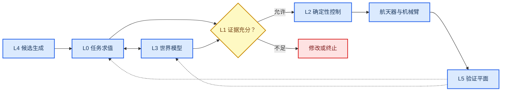
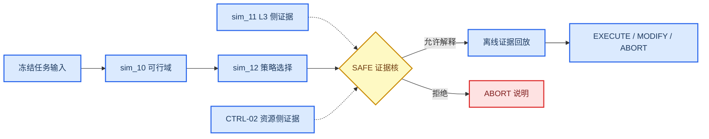

# 竞赛级项目系统架构冻结

_任务类型：DOCS_ONLY_ARCHITECTURE_FREEZE；冻结编号：PAF-20260722；本文件只重组现有证据，不产生新仿真或新科研结论。_

---

## 📋 冻结结论

本项目已经形成一条可用于竞赛陈述的“任务可行域—策略选择—安全裁决—离线证据回放”主链，并由有限带宽耦合模型提供 L3 世界模型侧证据；但尚未形成自主在轨搭建、硬件闭环、实时数字孪生或 VLA 控制系统。

架构治理裁决为：

> `ARCHITECTURE_FROZEN_WITH_INTERFACE_AND_VALIDATION_BLOCKERS`

该裁决只表示七份架构文档已经冻结，不改变任何科学 Gate。项目科学总状态仍沿用 [框架收敛裁决](../framework_convergence/state_truth_report.md)：`FRAMEWORK_CONVERGED_WITH_INTERFACE_BLOCKERS`。

### 冻结快照

| 项目 | 冻结值 | 解释 |
| --- | --- | --- |
| Git HEAD | `b4dd48a` | 当前提交为文献归一；本次不提交、不改写历史 |
| 分支 | `feat/sim09-grasp-evaluator` | 仅作为当前证据快照标识 |
| 架构日期 | 2026-07-22 | 所有状态均以该日磁盘与 Gate 为准 |
| 科学主链 | sim_10 → sim_12 → SAFE；sim_11 为 L3 侧证据 | 结论强度由各自 Gate 单独决定 |
| 竞赛交付主链 | 可行域 → 策略 → 安全解释 → 离线回放 | 不发设备命令，不声称实时 |
| 装配实施 | `BLOCKED` | ASM-00 接口与人工授权未闭合 |
| VLA 实施 | `PLANNED` | 本次明确禁止实现 |
| 架构后动作 | `STOP` | 冻结后不得自动启动仿真、装配或 VLA |

### 输入完整性说明

任务指定的 `01_project/competition/project_status_latest.md` 在冻结时不存在。因此，本架构没有伪造该文件，也没有用旧记忆冒充“latest”。当前状态由以下材料共同重建：

1. [CLAUDE.md](../../CLAUDE.md)
2. [10_research/README.md](../README.md)
3. [research_state_v4.md](../research_state_v4.md)
4. [项目现状总览 2026-07-20](../../01_project/competition/项目现状总览_20260720.md)
5. 当前工作区全部 15 个 Gate JSON
6. [文献 manifest](../../50_literature/references/manifest.yaml)

该缺失路径只登记为 `BLOCKED_INPUT_REFERENCE`，不规划为新的 canonical SSOT。现行薄状态指针仍是 [research_state_v4.md](../research_state_v4.md)，并由它指向已有总览；缺失输入不阻塞本次架构冻结。

## 🎯 状态分类协议

`FROZEN` 与其余五类不是同一维度。`FROZEN` 表示“不得改动的基线”，其余标签表示“证据成熟度”。每项资产采用一个主证据状态，并可附加 `FROZEN` 变更控制标记。

| 标签 | 精确定义 | 可以说什么 | 不能说什么 |
| --- | --- | --- | --- |
| `FROZEN` | 哈希、结果、阈值或接口在当前基线内只读 | 可复查、可引用、可离线回放 | 不得为得到 PASS 而修改 |
| `VERIFIED` | 在明确适用范围内有最终机器 Gate 或完整性核验 | “在冻结范围内已验证” | 不得外推到硬件、在轨或更高保真 |
| `LIMITED` | 资产存在且可用，但含 provisional、待审或覆盖缺口 | “可用于限定范围的证据” | 不得简写为全系统 PASS |
| `NEGATIVE_RESULT` | 实验完成且最终机器裁决为 REPEAT/无安全候选 | “获得了有效负结果” | 不得改写成失败未做或隐藏 |
| `PLANNED` | 只有方案、任务卡、协议或候选工具 | “已有计划或架构” | 不得说已经实现或集成 |
| `BLOCKED` | 缺参数、授权、接口、硬件或上游 Gate | “已定位阻塞条件” | 不得绕过门禁启动下游 |

### Git 证据层

| 证据层 | 定义 | 在本架构中的用法 |
| --- | --- | --- |
| `COMMITTED_BASELINE` | 路径存在于 HEAD，工作区字节未修改 | 可作为冻结版本锚点 |
| `TRACKED_DIRTY_OVERRIDE` | HEAD 中存在，但工作区已修改 | 只能作为待验收观察 |
| `LOCAL_ONLY_UNTRACKED` | 当前存在但 HEAD 中不存在 | 可报告，不得提升总体成熟度 |
| `HISTORICAL_SUPERSEDED` | 已被更新 Gate 或报告取代 | 只解释历史，不裁决当前状态 |

### 证据优先级

发生冲突时按以下顺序裁决：

1. 最终机器 Gate JSON、原始结果与绑定哈希
2. 冻结配置、接口 SSOT 与授权记录
3. [状态真值报告](../framework_convergence/state_truth_report.md)和证据矩阵
4. 文献 manifest、阅读卡与本地 PDF 完整性
5. 本地未跟踪产物；必须附 `LOCAL_ONLY_UNTRACKED`
6. 叙述性报告、PPT、视频与历史记忆

测试 `PASS` 只证明软件合同，不自动构成科学 Gate `PASS`。历史快照与 `partial` Gate 不能覆盖同一模块的最终 Gate。

## 🏗️ 六层唯一架构

### L0：任务与可行性

- sim_10 提供冻结假设下的任务可行域和资源分区
- sim_12 Phase 1 提供四类策略的绑定约束选择证据
- sim_09/e15/e16 提供抓取候选、核心安全与同步捕获的受限/负结果
- 装配任务状态机只保留为规划支路，不进入当前竞赛科学主链

### L1：安全证据核

- SAFE-00 验证 `UNKNOWN` 不被误放行为 `ALLOW`
- `PASS` 与 `next_stage_authorized=false` 可以同时成立
- 安全核不能由 VLA、PPT 或人工口头说明绕过

### L2：确定性控制

- CTRL-01 为真实 `REPEAT`，揭示严格 6D 任务零空间收益不足
- CTRL-02 只在 provisional 执行器范围内模块通过
- 当前不存在飞行级或硬件级控制资格

### L3：世界模型

- 包括自由漂浮刚体、GJM/RNS、接触冲量、有限接触带宽、柔性 FFR/ANCF、轮组和推力器账本
- sim_11 的柔性参数与 `T_c=20 ms` 仍为 provisional
- e15 ANCF 跨解算器最大差超过冻结阈值，保持 `NEGATIVE_RESULT`

### L4：具身智能候选层

- 允许的当前角色：任务解释、候选技能、工具调用计划、失败恢复建议
- 当前状态：`PLANNED`
- 禁止直接输出关节力矩、推进器命令或安全授权

### L5：验证平面

- 当前最高成熟度：受限的 DT2 确定性离线证据回放
- H0–H3、实时同步、双向硬件命令、微重力或自由漂浮实物验证均未完成

## 🔗 竞赛证据主链

竞赛主链与装配实施支路解耦，避免被尚未授权的 ASM-00 阻塞。

`EXECUTE` 在当前演示中只是解释标签；它不等于命令已发出，也不等于下一阶段获得授权。

## 📦 全项目资产登记

### 科学计算与 Gate 资产

| 资产族 | 变更控制 | 主证据状态 | 权威裁决或用途 | 边界 |
| --- | --- | --- | --- | --- |
| sim_01–04 | `FROZEN` | `LIMITED` | 早期姿态、目标、平面耦合和走廊资产 | 无独立最终科学 Gate |
| sim_05–06 | `FROZEN` | `VERIFIED` | 被 sim_11 G3b 与 sim_10 X1 精确退化复核 | 仅证明数值锚点 |
| sim_07–08 | `FROZEN` | `LIMITED` | ANCF 组件响应与执行器预算 | 组件级、参数含占位 |
| sim_09/E1 | `FROZEN` | `LIMITED` | 72 例抓取评估、16 个 Pareto 点 | 无全局最终 verdict |
| sim_09/E1.5 | `FROZEN` | `NEGATIVE_RESULT` | `REPEAT_E1_5` | SAFE=0 |
| e15 core | `FROZEN` | `NEGATIVE_RESULT` | 覆盖 PASS；科学 `REPEAT_CORE_NO_SAFE_CANDIDATE` | 0 个安全候选 |
| e15 ANCF | `FROZEN` | `NEGATIVE_RESULT` | `REPEAT_ANCF_CERTIFICATION` | 跨解算器证据未闭合 |
| e16 sync capture | `FROZEN` | `LIMITED` | `PASS_WITH_GEOMETRY_AND_FLEX_LIMITATIONS` | formal safe=0；ANCF 未运行 |
| sim_10 | `FROZEN` | `VERIFIED` | `SIM10_GATES_PASS` | 冻结刚体/资源假设；FLEX 未入判据 |
| sim_11 | `FROZEN` | `LIMITED` | `SIM11_GATES_PASS_WITH_PROVISIONAL_PARAMS` | 参数未转正 |
| sim_12 Phase 1 | `FROZEN` | `VERIFIED` | `SIM12_PHASE1_GATES_PASS` | 仅 Phase 1；FLEX 未入判据 |
| SAFE-00 | `FROZEN` | `VERIFIED` | 决策核 Gate `PASS` | `PENDING_REVIEW`；不授权下游 |
| CTRL-01 | `FROZEN` | `NEGATIVE_RESULT` | `REPEAT` | 真实 6D 零空间负结果 |
| CTRL-02 | `FROZEN` | `LIMITED` | 模块 `PASS` | 对外仅 `PASS_WITH_PROVISIONAL_SCOPE` |
| Wave 1 | `FROZEN` | `NEGATIVE_RESULT` | `WAVE1_REPEAT` | 周期已治理关闭，verdict 不变 |
| `70_tools/research_dashboard` | `FROZEN` | `NEGATIVE_RESULT` | 确定性离线整合；`REPEAT_CORE` | 摘要不覆盖原始 Gate |
| sim_11 partial Gate | `FROZEN` | `LIMITED` | 中间诊断 | 无全局 verdict |

全部 Gate 的路径与精确字段见 [simulation_scenario_map.md](./simulation_scenario_map.md)。

### 工程、演示与实现资产

| 资产族 | 变更控制 | 主证据状态 | 当前用途 | 边界 |
| --- | --- | --- | --- | --- |
| `20_engineering/config/` | `FROZEN` | `LIMITED` | 场景、阈值、几何与证据合同 | 部分参数 provisional |
| `20_engineering/cad/spacecraft_layout/` | `FROZEN` | `LIMITED` | 12U/6U、B601、目标和接口 v0/v1 | 不是制造放行或质量实测 |
| `30_simulation/sim_09_grasp_evaluator/{src,tests}/` 与 `70_tools/project_visualization/{src,tests}/` | `FROZEN` | `LIMITED` | sim_09 与可视化软件资产 | 软件测试不等于科学 Gate |
| `40_evidence/artifacts/visualization/` 与 `40_evidence/tables/` | `FROZEN` | `LIMITED` | 现有图表与回放素材 | 展示材料不能升级结论 |
| `40_evidence/artifacts/visualization/` | `FROZEN` | `LIMITED` | 离线研究仪表板与回放 | 非实时数字孪生 |
| 本地 competition package | 否，`LOCAL_ONLY_UNTRACKED` | `LIMITED` | 17/17 本地离线演示 Gate | 未纳入 HEAD；不发命令 |
| Wave A 规划包 | `FROZEN` | `VERIFIED` | 只证明规划资产完整 | 科学执行仍 `BLOCKED` |
| 本地 ASM-00 preflight | 否，`LOCAL_ONLY_UNTRACKED` | `BLOCKED` | 接口字段与九项合同前检 | 缺 HAG-A、RF/SSOT 参数 |
| ASM-01/ASM-02 | 否 | `BLOCKED` | 未来持续接触与分阶段控制 | 上游 ASM-00 未通过 |
| ASM-TWIN/ROM/Physics Tools | 否 | `PLANNED` | 后续候选路线 | 无科学结果 |
| H0–H3 硬件链 | 否 | `BLOCKED` | 未来地面资格与闭环验证 | 未启动；B601 运动未授权 |
| VLA 实体 | 否 | `PLANNED` | 未来候选生成与工具编排 | 当前无实现、无执行权 |

### 文献、数据与外部工具资产

| 资产族 | 变更控制 | 主证据状态 | 当前用途 | 边界 |
| --- | --- | --- | --- | --- |
| `manifest.yaml` 与 `refs.bib` | `FROZEN` | `VERIFIED` | 45 条题录的唯一目录 | 题录核验不等于实验复现 |
| 本地 PDF 库 | `FROZEN` | `VERIFIED` | 44 份本地文件哈希/页数完整 | 1 篇全文仍缺 |
| 23 篇完整阅读卡 | `FROZEN` | `VERIFIED` | 可直接用于受限文献论证 | 只覆盖 23 篇 |
| 21 篇 catalog-only | `FROZEN` | `LIMITED` | 题录级映射 | 不得写成已精读 |
| `gerstmayr2013ancfreview` | 否 | `BLOCKED` | e15 ANCF 理论来源闭环 | 缺全文，不是数值 REPEAT 直接原因 |
| 10 个外部仓库镜像 | `FROZEN` | `LIMITED` | 方法参考和未来复现入口 | clone/pin 不等于已集成 |
| SPEED/SPEED+ 数据登记 | 否 | `PLANNED` | 未来位姿估计评估 | `NOT_DOWNLOADED_BY_POLICY` |
| `80_third_party/vendor/` 与其他第三方资产 | `FROZEN` | `LIMITED` | 依赖与参考 | 不具有项目 Gate 权威 |
| `50_literature/README.md#legacy-supplemental` | `FROZEN` | `VERIFIED` | REORG 后的空目录指针 | PDF 已归并到 `50_literature/pdf/` |

### 文档与治理资产

| 资产族 | 变更控制 | 主证据状态 | 当前用途 | 边界 |
| --- | --- | --- | --- | --- |
| `10_research/framework_convergence/` | `FROZEN` | `VERIFIED` | 六层架构、DAG、证据矩阵 | 以当前 Gate 更新解释 |
| `10_research/on_orbit_assembly/` | `FROZEN` | `PLANNED` | 双任务综合与装配规划 | 不代表装配已实施 |
| `10_research/partner_requirement_closure/` | `FROZEN` | `NEGATIVE_RESULT` | Wave 1 需求闭环与 CP6 裁决 | `WAVE1_REPEAT` 不变 |
| `01_project/competition/` | `FROZEN` | `LIMITED` | 竞赛叙事与状态材料 | canonical latest 指针缺失 |
| `.agents/.claude/.codex/.playwright-cli` | `FROZEN` | `LIMITED` | Agent、客户端与工作流配置 | 无科学 Gate 权威 |
| `01_project/inbox/source_documents/` 与本地汇报草稿 | 否，`LOCAL_ONLY_UNTRACKED` | `LIMITED` | 用户补充参考和汇报草稿 | 不属于 HEAD 基线 |
| `project_status_latest.md` | 否 | `BLOCKED` | 任务指定但不存在的输入引用 | 不创建平行 SSOT；沿用 `research_state_v4.md` |
| 本目录七份架构文件 | `FROZEN + LOCAL_ONLY_UNTRACKED` | `VERIFIED` | 当前工作树的架构与停止边界 | 另行审查提交后才成为 HEAD 基线 |

## 🛡️ 冻结边界与接口

### 不可改动边界

本次架构冻结不修改以下路径及其结果：

- `30_simulation/`、`results/`、`config/`、`20_engineering/cad/`
- `30_simulation/e15_core_coverage/`、`30_simulation/e15_ancf_certification/`、`30_simulation/e16_sync_capture/`
- `tables/`、`10_research/on_orbit_assembly/`
- `10_research/partner_requirement_closure/`
- 所有 Gate JSON、阈值、几何和冻结哈希

### 合法接口

| 上游 | 下游 | 允许传递 | 禁止传递 |
| --- | --- | --- | --- |
| L4 候选层 | L0 任务层 | 候选动作、解释、工具请求 | 力矩或推进器命令 |
| L0/L3 | L1 SAFE | 可行性、守恒、资源和证据状态 | 缺失值伪装为零 |
| L1 SAFE | L2 控制 | 版本化、可追溯的授权目标 | 口头 PASS 或 PPT 标签 |
| L2 控制 | 数字孪生/硬件 | 已授权参考量与日志 | 未经 HAG 的设备运动 |
| L5 验证 | 所有层 | 只读证据与回放 | 反向篡改冻结结果 |

## 🚫 允许与禁止的系统主张

### 允许

- 在冻结假设下完成了 sim_10 可行域、sim_11 provisional 耦合和 sim_12 Phase 1 策略证据
- SAFE-00 验证了 fail-closed 决策合同，但没有自动授权真实执行
- CTRL-01 与 Wave 1 形成了可复查的负结果
- 当前最高数字孪生成熟度是受限 DT2 离线证据回放
- 装配接口与授权阻塞已经被明确定位
- 文献目录和本地 PDF 完整性已核验，阅读成熟度仍不均衡

### 禁止

- 已完成自主在轨搭建或空间碎片清除
- 已实现 VLA 空间机械臂闭环
- 已形成实时 DT3/DT4 数字孪生
- 已完成自由漂浮、微重力或飞行级硬件验证
- sim_10/11/12 `PASS` 等于全系统 `PASS`
- SAFE-00 `PASS` 等于获得执行授权
- 外部仓库已克隆等于完成独立复现
- 44 份 PDF 等于 44 篇已精读

## ✅ 架构冻结验收

- [x] 指定输入已核对；缺失输入已显式登记
- [x] 15 个 Gate JSON 已纳入状态地图
- [x] 全部主要资产族已按双轴协议分类
- [x] `COMMITTED_BASELINE` 与 `LOCAL_ONLY_UNTRACKED` 已分离
- [x] 竞赛主链不依赖未授权装配或 VLA
- [x] 没有创建新科研结论
- [x] 没有运行新仿真
- [x] 没有修改仿真结果、Gate、阈值或几何
- [x] 架构冻结后自动执行状态为 `STOP`

本文件与其余六份计划共同构成架构冻结包：

- [competition_storyline.md](./competition_storyline.md)
- [paper_structure_plan.md](./paper_structure_plan.md)
- [simulation_scenario_map.md](./simulation_scenario_map.md)
- [digital_twin_plan.md](./digital_twin_plan.md)
- [experiment_roadmap.md](./experiment_roadmap.md)
- [agent_management_plan.md](./agent_management_plan.md)

---

_冻结维护者：Project Chief Architect；任何解冻必须由新的明确任务、有效授权和版本化证据触发。_
