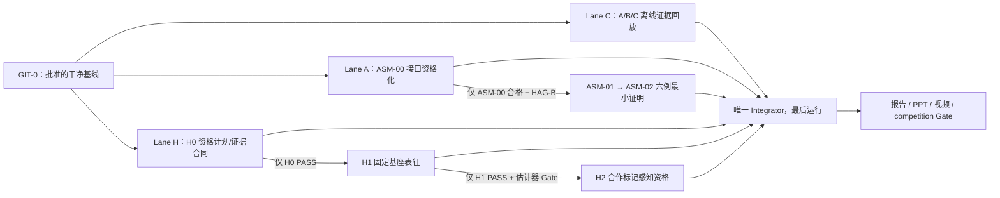

# Competition Convergence and Assembly Minimal-Proof Phase — Launch Manifest

> 日期：2026-07-20  
> 性质：**规划与授权前冻结文件；本轮不实施、不跑新科学实验、不创建 worktree。**  
> 项目根：`F:\China Graduate Future Flight Vehicle Innovation Competition`  
> 基线分支：`feat/sim09-grasp-evaluator`  
> 审计时 HEAD：`c7f09ab80580f5810d75253fd836d412aa862460`  
> 证据优先级：Machine Gate JSON > raw results > tests > Git > reports > prompt text  
> 比赛硬截止：2026-09-01  
> 本计划不自动授权 VLA、Wave B、HIL、H3 或 B601 运动。

## 0. 启动裁决与总体结构

比赛收敛 Lane C 可在冻结证据只读条件下启动；它不依赖 Assembly Wave A。
Assembly Lane A 当前只能进入 ASM-00 的授权/接口资格化入口，不能直接进入
ASM-01/02 科学实验。H0/H1/H2 当前均为 `NOT_STARTED`，只有 H0 资格计划可先冻结，
真实设备动作另需 HAG-E 与 H0 安全入口。



关键仲裁：

- 比赛演示的提交保底路径只依赖冻结的 sim_10/sim_12/SAFE-00/CTRL-02 证据和
  新建的离线编排层。
- ASM-00 失败、重复或阻塞时，Lane C 继续；ASM-01/02 停止。
- H0/H1/H2 未通过时，比赛材料退化为纯离线证据回放；不降低比赛 Gate。
- `UNKNOWN`、`NOT_EVALUATED`、`REPEAT`、`PENDING_REVIEW` 原样展示，不可被动画、
  文案或汇总层升级。

## 1. Current Git and Gate truth

### 1.1 Git 真值（写入本文件前的快照）

- 分支：`feat/sim09-grasp-evaluator`
- HEAD：`c7f09ab80580f5810d75253fd836d412aa862460`
- 工作区：**非 clean**。已有用户/协作者改动必须保留，本阶段不得覆盖或顺手提交：

```text
 M .codex/AGENTS.md
 M .codex/agents/physics-agent-architect.md
 M .codex/skills/README.md
 M CLAUDE.md
 M 01_project/competition/项目现状总览_20260720.md
 M 10_research/README.md
 M 10_research/control/attitude_stabilization_research_plan.md
 M 10_research/control/trajectory_control_research_plan.md
 M 10_research/paper1_architecture.md
 M 10_research/research_state_v4.md
?? 10_research/framework_convergence/
?? 01_project/inbox/source_documents/空间机械臂.docx
```

本文件落盘后还会新增 `?? 10_research/competition_convergence/`。因此执行轮首门
`GIT-0` 是由 PI 指定一个包含所需治理文件的**干净、可复现 approved base commit**；
任何 Agent 不得自行选择是否纳入上述未提交改动。

最近关键提交：

| Commit | 含义 |
|---|---|
| `c7f09ab` | 研究框架梳理、历史归档与六层总览 |
| `ee8ba8c` | 在轨组装规划基线，`READY_WITH_INTERFACE_BLOCKERS` |
| `dce4c08` | Wave1 证据链存档合并，原样保留 `WAVE1_REPEAT` |
| `4930f35` | CP6 方案 B：负结果治理收口 |
| `13a0c96` | CTRL-02-R 预注册整改工件 |
| `3c74c2c` | CTRL-01-R 缺陷闭合且真实负结果保留 |

### 1.2 当前 Machine Gate 快照

下列 SHA-256 为 2026-07-20 对当前文件字节重新计算的 raw hash：

| 对象 | Machine truth | 关键边界 | Raw SHA-256 |
|---|---|---|---|
| sim_10 | `SIM10_GATES_PASS` | `FLEX=UNKNOWN_NOT_IN_CRITERIA`；执行机构档与任务时限含 PROVISIONAL | `2a9024bb0f57f837e58161a0fa96660e2e237ec96ef096eba458cb0dcc4a19d4` |
| sim_11 | `SIM11_GATES_PASS_WITH_PROVISIONAL_PARAMS` | 帆板参数与 `T_c=20 ms` 为占位；只读复用，不重建 | `5bba3112a704583fecb315419c1d73848bf72fe82f89b7a8fb104abb1ea0aa47` |
| sim_12 | `SIM12_PHASE1_GATES_PASS` | 16 例策略证明集；FLEX 不入判据 | `e92ae9c2287149ff00234760cf0d3a53524fd59b71b7e93b2785e578aae91f5f` |
| SAFE-00 | `PASS` | `review_status=PENDING_REVIEW`；`next_stage_authorized=false`；唯一注册候选为 `A_low-S1_passive` | `ff56929dd8352e447afdb8b7d17c5ef0b248883c66bc4f00c16c50c6f4c46eee` |
| CTRL-01 | `REPEAT` | `next_stage_authorized=false`；冻结增益与预注册轨迹下真实负结果已收口 | `3d32f78a7cc4bf57718efb1e4ddf70cab843c4b67173833ab4aa4971735baa8a` |
| CTRL-02 | JSON 原始 `verdict=PASS` | 对外必须写 `PASS_WITH_PROVISIONAL_SCOPE`：`PENDING_REVIEW`；7/16 仅在 R5 PROVISIONAL 执行器及时窗模型下稳定；L0 硬件有效稳定性未评估 | `8d072eaeacbbdbb1bb7637434a0b5db77b6d37c42f706dc075950aa9b123a341` |
| Wave1 | `WAVE1_REPEAT` | `next_wave_authorized=false`；测试全绿不改变科学裁决 | `c8d631d68537c9edd9c3e55ec9456c5ac61474ef850e4ca6f280595de4429dae` |
| e15 ANCF | `REPEAT_ANCF_CERTIFICATION` | 最大跨解算器差 5.64% > 5%；不得称最终柔性认证 | `aab4d609e219279c2563c8a38743ac1784bbf16de399d5b8798439b0ac2dca80` |
| e16 | `PASS_WITH_GEOMETRY_AND_FLEX_LIMITATIONS` | formal safe = 0；“sync”不是实时同步 | `387256770de351d4d2d9170e984b434e20c360254e6dba37a939837a16fb5860` |

冻结 threshold registry：
`30_simulation/e15_core_coverage/config/threshold_registry_core_v1.yaml` =
`400bcedce5af6ad5c4135e67f87bb524ee2fdafb1c26aeae07e495ff387b2873`。

### 1.3 Assembly 当前入口真值

- `10_research/on_orbit_assembly/approvals/HAG-A.yaml`：不存在。
- `10_research/on_orbit_assembly/approvals/HAG-B.yaml`：不存在。
- `10_research/on_orbit_assembly/approvals/HAG-I.yaml`：不存在。
- `30_simulation/asm_00_interface_preflight/`：不存在。
- `30_simulation/asm_01_contact_dynamics/`：不存在。
- `30_simulation/asm_02_phased_control/`：不存在。
- success evaluator 仍存在八项/九项冲突；HAG-A 前必须单源化、版本化、哈希绑定。
- RF-1、RF-2、RF-3、销距、倒角与出处缺口仍未关闭。
- 当前 Assembly 状态是 `PLANNED_NOT_AUTHORIZED / READY_WITH_INTERFACE_BLOCKERS`，
  不是科学 Gate PASS。

## 2. Frozen modules and forbidden paths

### 2.1 全 Agent 只读冻结区

以下路径在本阶段不得修改、复制成平行实现、重跑后覆盖或手改 Gate：

- `30_simulation/sim_01_*` 至 `30_simulation/sim_12_*`
- `30_simulation/safety_00_runtime_gate/`
- `30_simulation/control_01_end_effector_tracking/`
- `30_simulation/control_02_base_attitude/`
- `30_simulation/e15_ancf_certification/`、`30_simulation/e15_core_coverage/`、`30_simulation/e16_sync_capture/`
- `30_simulation/sim_09_grasp_evaluator/results/`
- `20_engineering/config/geometry/`
- `20_engineering/config/mission_feasibility/`
- `20_engineering/config/strategy_feasibility/`
- `20_engineering/config/safety_gate/`
- `20_engineering/config/control_scene/`、`20_engineering/config/attitude_stab/`
- `10_research/partner_requirement_closure/wave1_results/`
- `10_research/partner_requirement_closure/wave1_repeat/`
- `10_research/on_orbit_assembly/` 现有规划、红队、Task Card 与 draft 文件
- 当前所有 `*_gate_check.json`、`gate_summary.json`、threshold registry

允许动作仅为只读加载、hash/canonical-hash 校验、行级精确抽取、引用和离线展示。

### 2.2 本轮禁止触碰的用户现有改动

第 1.1 节列出的所有 dirty/untracked 路径均视为用户所有。尤其：
`10_research/framework_convergence/` 与 `01_project/inbox/source_documents/空间机械臂.docx` 不属于本轮任何 Agent。

### 2.3 新增路径

- Competition：`10_research/competition_convergence/`；媒体包可写
  `40_evidence/artifacts/competition_convergence/`。
- ASM-00：仅在有效 HAG-A 后写
  `30_simulation/asm_00_interface_preflight/` 与 `20_engineering/config/assembly/` 的新版本。
- ASM-01：仅在 ASM-00 合格、HAG-B 与接触合同冻结后写
  `30_simulation/asm_01_contact_dynamics/`。
- ASM-02：仅在上述前置全部满足后写
  `30_simulation/asm_02_phased_control/` 与 `20_engineering/config/assembly_control/`。
- Hardware：HAG-E/H0 入口未通过前，只能写规划文件；真实证据目录预留为
  `hardware/qualification/H0/`、`H1/`、`H2/`。

## 3. Three demonstration scenarios

三个场景都从冻结配置/结果按 key 抽取，不手抄重算。质量 SSOT 的 22 kg、150 kg
均为 low-confidence v0 数字；过渡场景是冻结参数证明例，不冒充实物目标。

| Demo | 冻结 key 与输入 | 已验证上游结果 | 展示动作 | 必须同屏显示的限制 |
|---|---|---|---|---|
| A | `A_low`；`target_satellite_v0`；22 kg；0.5 deg/s；`G2_cubesat` | sim_10 卫星锚为 `WHEELS_ONLY_FEASIBLE`；sim_12 最优 `S1_passive`；SAFE-00 唯一注册候选正是 `A_low-S1_passive` | `EXECUTE` | **仅离线决策解释，不发命令**；SAFE-00 仍 `next_stage_authorized=false`；FLEX 未入判据 |
| B | `B_anchor`；`target_debris_v0`；150 kg；3 deg/s；`G1_slender` | sim_10 `INFEASIBLE_RATE`，捕获后 3.0633 deg/s；sim_12 四策略均不可行，最优为 `ABORT` | `ABORT` | CTRL-02 的 B 行全是 out-of-feasible-region counterfactual；不得播放成已执行消旋 |
| C | `C_transition` 冻结参数证明例；精确字段从 `strategies_v0.yaml:cases.C_transition` 抽取 | sim_12 中 S1 被 wheel-momentum 约束，S3a 可行并为最优；CTRL-02 仅提供同 case 的 PROVISIONAL 资源参考 | `MODIFY` | 表示“改策略为 S3a”；SAFE-00 **未注册 C 候选**，故不构成新执行授权；CTRL-02 行与 S3a 非同一阶段/策略时只能 `REFERENCE_ONLY` |

场景动作语义：

- `EXECUTE`：展板/回放的任务建议标签；`command_emitted=false`。
- `MODIFY`：必须改变候选策略并重新进入授权流程；不是“先执行再调整”。
- `ABORT`：不生成控制命令；若物理状态是 UNKNOWN，reason 必须写 UNKNOWN 来源，
  不得改写为已知不安全。

## 4. Unified digital-twin evidence contract

文件目标：`10_research/competition_convergence/mission_demo_contract.yaml`。
它定义的是 `DT2_CURRENT_SCOPE_OFFLINE_EVIDENCE_REPLAY`，不是实时数字孪生。

### 4.1 最小 schema

```yaml
schema_version: competition-twin-evidence-v1
record_id: <stable-id>
scenario_id: A_low | B_anchor | C_transition
replay_mode: OFFLINE_DETERMINISTIC
command_emitted: false

baseline:
  approved_git_commit: <sha40>
  source_worktree_clean: true
  frozen_threshold_registry_sha256: <sha256>

mission_input:
  source_path: <repo-relative path>
  source_key: <exact key path>
  raw_sha256: <sha256>
  canonical_hash_mode: <mode or NONE>
  geometry_or_case_confidence: <value>

evidence_artifacts:
  - artifact_id: <stable id>
    path: <repo-relative path>
    role: GATE | RESULT_TABLE | TIMESERIES | CONFIG | POLICY
    hash_mode: RAW_BYTES_SHA256 | CANONICAL_JSON_SHA256_V1 |
      CANONICAL_CSV_TABLE_SHA256_V1 | CANONICAL_CSV_ROW_SHA256_V1 |
      CANONICAL_YAML_SHA256_V1
    sha256: <sha256>
    verdict_key: <key or NONE>
    expected_verdict: <frozen value or NONE>
    actual_verdict: <read value or NONE>
    review_status: <value or NOT_APPLICABLE>
    provisional_fields: []

stage_records:
  - stage_id: MISSION_INPUT | SIM10 | SIM12 | SAFE00 | CTRL02 |
      OFFLINE_REPLAY | EXPLANATION
    input_refs: []
    output_ref: <artifact + key/row>
    join_keys: {}
    join_status: EXACT | GLOBAL_ONLY | REFERENCE_ONLY | NOT_APPLICABLE
    scientific_state: PASS | REPEAT | BLOCKED | UNKNOWN | NOT_EVALUATED
    decision: <source-native decision>
    reason_code: <source-native or explicit integration code>
    limitations: []

explanation:
  display_action: EXECUTE | MODIFY | ABORT
  execution_authority: false
  authorized_candidate_binding: EXACT | MISSING | NOT_APPLICABLE
  evidence_complete: true | false
  no_upward_reclassification: true
```

### 4.2 不可变规则

1. 同时保存 raw hash 与源模块要求的 canonical hash；二者不可混用。
2. Gate verdict、review status、provisional 字段、row key、case hash 与 source commit
   必须进入每条记录。
3. 只有 `join_status=EXACT` 可支撑同阶段结论；`GLOBAL_ONLY` 只证明全局 Gate，
   `REFERENCE_ONLY` 不得授权。
4. 捕获策略与捕获后控制是不同字段；不得把 sim_12 S3a 与 CTRL-02 B1/B2/B3
   静默拼成同一控制方案。
5. SAFE-00 当前只有 `A_low-S1_passive` 是 exact candidate binding。
6. 缺时序时显示 `NO_VERIFIED_TIME_HISTORY` 静态帧；禁止插值或合成“成功轨迹”。
7. Replay 只转换格式和编排，不重求解物理、不平滑负结果、不重排 Gate。
8. 任一 hash 漂移、key 多义、重复行、单位/参考系冲突、UNKNOWN 或缺 provenance，
   `evidence_complete=false` 且 `display_action` 不得为 `EXECUTE`。

### 4.3 三场景 action 规则

- A：仅当 frozen row、SAFE candidate、Gate/hash 全精确匹配时显示 `EXECUTE`；
  同时固定 `execution_authority=false`。
- B：sim_10/12 已给上游 ABORT；SAFE 阶段记录
  `NOT_APPLICABLE_UPSTREAM_ABORT`，不得伪造 signed request。
- C：显示 `MODIFY` 与 S3a 证据；SAFE 阶段记录
  `MISSING_REGISTERED_CANDIDATE`。只有未来独立授权的 SAFE 扩展才能把修改后的
  候选送入执行授权，本阶段不做该扩展。

## 5. ASM-00 entry and exit conditions

### 5.1 Entry（全部满足才允许科学实施）

1. `GIT-0`：approved base 是 clean commit，Task Card/hash 与授权记录一致。
2. 存在真实、未过期、真实性验证通过的 `HAG-A.yaml`；实施 Agent 不得创建它。
3. 八项/九项冲突已收敛为唯一 versioned success evaluator schema，路径与 SHA-256
   写入 HAG-A。
4. ASM-00 基卡 SHA-256 =
   `8cc31a7769d387c3c709b399fed086e5be10b2e464eb9ffbdbcdd8c20dabd347`。
5. `interface_ssot_draft.yaml` 当前 raw SHA-256 =
   `ff7d54b3340aa2106538f61c2a54924e795e28dc9f2b3d11b5581b6a26867929`；
   `gate_registry.yaml` 当前 raw SHA-256 =
   `cfe34358e136133f60e67b4a56d1875ad21c769af35cc7adb26a199bd5b5e235`。
6. RF-1/2/3 以独立 issue/记录进入 baseline；禁止通过放宽 5 mm/5 deg 或 Gate
   阈值消失。
7. owned/forbidden path guard 通过；冻结 sim、SAFE、CTRL、geometry 无 diff。

当前 entry 结果：**未满足**（HAG-A 不存在、success schema 未单源、RF 与字段缺口开放）。

### 5.2 Minimal scope

- RF-1：补锥口/喉半径，验证三级几何链是否闭合。
- RF-2：材料/表面/摩擦来源冻结，验证楔紧边界；深锥单独不算关闭。
- RF-3：clearance 明确定义为直径或半径口径。
- 补销距 `s`、倒角 `w_ch`、单位、出处等级。
- 同一 SSOT 上做解析公差链与**独立实现** Monte Carlo 碰撞采样对拍。
- 冻结九判据 single-source evaluator 的接口引用，但 ASM-00 不判装配成功。

### 5.3 Exit（任一裁决落盘即停止）

必须产出：

- versioned SSOT v1 或明确 BLOCKED 清单；
- RF-1/2/3 逐项 `RESOLVED / REPEAT / BLOCKED`；
- AG0-U/F/P/C/H 原始结果、输入 hash、解析/采样独立性说明；
- `asm_00_gate_check.json` 与 evidence manifest；
- 未测字段继续标 `PROVISIONAL`，CAD/实测缺口不得静默省略。

对外 ASM-00 状态映射：

| AG0 原始裁决 | 本阶段报告状态 |
|---|---|
| `ASM00_AG0_PASS_WITH_PROVISIONAL_PARAMS` | `ASM00_INTERFACE_QUALIFIED_WITH_PROVISIONAL_PARAMS` |
| 几何链/对拍/楔紧/clearance 仍不闭合 | `ASM00_REPEAT_GEOMETRY` |
| 缺字段、缺出处、缺授权或无法形成可计算 SSOT | `ASM00_BLOCKED_BY_MISSING_PARAMETERS` |

不得输出无限定的“接口已验证”。Exit 工件产生后 Agent A0 立即停止，不自动启动
ASM-01/02。

## 6. Conditional ASM-01/02 six-case matrix

### 6.1 开工硬前置

以下全部满足后才可运行六例：

- ASM-00 = `ASM00_INTERFACE_QUALIFIED_WITH_PROVISIONAL_PARAMS`；
- HAG-B 有效并绑定 SSOT v1；
- ASM-01 contact state/schema、守恒合同、single-source evaluator 已冻结；
- 目标侧 FFR 未完成时，全矩阵 headline 固定为 `SCREENING_ONLY`；
- W1-R12 使用统一 `0.01 N·m/axis` 口径完成预注册重评，但重评不关闭 W1-R12；
- AC0/AC1/AC2 共用 QP 骨架、权重、场景、随机种子和 hash。

### 6.2 两个 initial-error level

不在 RF-1 未关闭时手写 5 mm/5 deg。由 AG0 产出的有效 T1 捕获域单源解析：

- `E_LOW`：AG0 最差有效方向上，平移/角误差均取验证边界的 25%。
- `E_HIGH`：同一方向上取验证边界的 80%，仍必须位于 verified capture domain 内。

精确数值、方向、单位和 AG0 source hash 写入场景 manifest；若 AG0 无法给出有效
边界，六例整体 `BLOCKED`，不得改用经验数字。

### 6.3 六例冻结矩阵

| Case ID | Initial error | Controller | 作用 |
|---|---|---|---|
| `MP-ELOW-AC0` | `E_LOW` | AC0 全程 6D | 公平基线 |
| `MP-ELOW-AC1` | `E_LOW` | AC1 5D→位置直插→短程 6D | 相位降维增量 |
| `MP-ELOW-AC2` | `E_LOW` | AC2 5D→法向阻抗→短程 6D | 接触柔顺增量 |
| `MP-EHIGH-AC0` | `E_HIGH` | AC0 全程 6D | 近边界公平基线 |
| `MP-EHIGH-AC1` | `E_HIGH` | AC1 5D→位置直插→短程 6D | 近边界相位增量 |
| `MP-EHIGH-AC2` | `E_HIGH` | AC2 5D→法向阻抗→短程 6D | 近边界柔顺增量 |

每例输出：相位账本、single-source evaluator 九项、control failure reason、
接触状态、峰值力/冲量/卡滞、基座/轮组资源、守恒/能量、求解健康、PROVISIONAL
柔性指标。负结果原样进入 Gate。

AC3 禁止进入本矩阵。只有六例全部完成、AG1/AG2/AG3/AG4 没有 BLOCKED/UNKNOWN
上推、W1-R12 重评完成、Lane C 材料冻结无风险且 PI 另行批准时，才可登记 AC3；
本计划不自动启动它。

## 7. H0/H1/H2 component evidence plan

总命名固定为 **ground component qualification/validation**。固定基座不验证自由漂浮
动力学；AprilTag/合作标记不证明 markerless 或非合作泛化。

| Stage | Entry | 最小活动 | 必须冻结的 evidence | Gate/Stop |
|---|---|---|---|---|
| H0 硬件资格 | HAG-E + 安全规程批准；无 B601 动作前先完成只读 inventory | driver/协议/通信、关节与 encoder、相机枚举、限位/急停、重复精度、夹爪 `T_c` 实测 | `device_inventory.json`、版本/二进制 hash、`communication_roundtrip.csv`、`joint_limit_and_repeatability.csv`、`camera_inventory.json`、`estop_interlock_log.csv`、`gripper_tc_trials.csv`、`h0_evidence_manifest.json` | `h0_gate_check.json`；任一安全/协议 UNKNOWN 即 BLOCKED 并停 |
| H1 固定基座执行表征 | H0 PASS + 另批低速预存轨迹 + ground controller Gate | L5 Adapter 单位/坐标/限位转换，预存轨迹回放，遥测与夹爪时序；M2–M5 样件试验按批准范围 | `trajectory_command.csv`、`joint_telemetry.csv`、`latency_drop_log.csv`、`adapter_binding.json`、`contact_coupon_results.csv`、`h1_evidence_manifest.json` | `h1_gate_check.json`；不得把 CTRL-01 REPEAT 写成已解决 |
| H2 合作标记感知 | H1 PASS + 相机内外参 Gate + estimator preregistration | 已知运动目标 + 合作标记的 pose/rate 估计；延迟、丢帧、遮挡、时间戳陈旧测试 | `camera_intrinsics.yaml`、`camera_extrinsics.yaml`、`ground_truth_timeseries.csv`、`estimate_timeseries.csv`、`latency_dropout.csv`、`h2_evidence_manifest.json` | `h2_gate_check.json`；只称 cooperative-marker sensing |

H0/H1/H2 任一级产生 Gate 后即停，等待人工批准；不自动进入 H3、Agent 闭环或 HIL。
H1 的 `T_c`、接口与执行器实测只产生 rerun trigger，不允许原地手改 frozen Gate。

## 8. Agent ownership and worktrees

执行 worktree **当前均不创建**；先通过 GIT-0。计划目录：
`F:\codex-worktrees\future-flight-convergence-20260720\`。

| 角色 | 计划 branch / worktree | 唯一 owned outputs | 禁止 |
|---|---|---|---|
| Agent C | `codex/competition-convergence-c` / `agent-c` | `mission_demo_contract.yaml`、`three_scenario_manifest.yaml`、`competition_claim_evidence_matrix.csv`、`digital_twin_replay_plan.md`、`src/`、`tests/`、离线 replay 中间工件 | assembly、hardware、冻结 30_simulation/SAFE/CTRL、最终 Gate/报告 |
| Agent A0 | `codex/asm00-interface-a0` / `agent-a0` | `30_simulation/asm_00_interface_preflight/`、`20_engineering/config/assembly/` 新版本 | 未获 HAG-A 开工；ASM-01/02；任何冻结区 |
| Agent H | `codex/ground-components-h` / `agent-h` | `hardware_component_plan.md`；获 HAG-E 后才可写 `hardware/qualification/H0..H2/` | H3、HIL、VLA、未经 H0 的设备运动 |
| 唯一 Integrator | `codex/competition-convergence-integrator` / `integrator` | `competition_gate_check.json`、`competition_execution_report.md`、最终 hash manifest 与 `40_evidence/artifacts/competition_convergence/` | 在三写入 Agent 未 STOP 前运行；修改其科学结果；翻转 verdict |

`launch_manifest.md` 由 PI 规划轮拥有；批准后冻结，实施 Agent 不修改。

若 ASM-00 合格，Agent A0 先停止并释放 writer slot；随后才可在**新分支/新 worktree**
启动条件式 Agent A12，拥有 ASM-01/02 各自目录。它不是第四个并发 writer。
任意时刻 writing agents ≤3；Integrator 始终最后运行。

每个分支必须：

1. 记录 approved base SHA、owned paths、forbidden paths；
2. 独立 results/report，不共享可写输出；
3. 到 machine Gate 后 STOP；
4. 集成前 clean，且 diff 仅在 owned paths；
5. 负结果和 UNKNOWN 不 squash 掉、不手改。

## 9. Machine Gate commands

### 9.1 当前可执行的只读 preflight（不重跑冻结科学）

```powershell
git status --short
git rev-parse HEAD
git log --oneline -30
git diff --name-only HEAD -- sim config
Get-FileHash 30_simulation/sim_10_mission_feasibility/results/sim_10_gate_check.json -Algorithm SHA256
Get-FileHash 30_simulation/sim_11_coupled_dynamics/results/sim_11_gate_check.json -Algorithm SHA256
Get-FileHash 30_simulation/sim_12_strategy_feasibility/results/sim_12_gate_check.json -Algorithm SHA256
Get-FileHash 30_simulation/safety_00_runtime_gate/results/safety_00_gate_check.json -Algorithm SHA256
Get-FileHash 30_simulation/control_02_base_attitude/results/control_02_gate_check.json -Algorithm SHA256
```

冻结模块的 `run_gates.py` 仅作为 provenance 中的原复现命令记录；本阶段**不调用**
它们，不覆盖已有结果。

### 9.2 Lane C 计划命令（脚本由 Agent C 实现后才可执行）

```powershell
python 10_research/competition_convergence/tests/run_all.py
python 10_research/competition_convergence/src/verify_evidence_contract.py `
  --contract 10_research/competition_convergence/mission_demo_contract.yaml `
  --scenarios 10_research/competition_convergence/three_scenario_manifest.yaml
python 10_research/competition_convergence/src/build_offline_replay.py `
  --contract 10_research/competition_convergence/mission_demo_contract.yaml `
  --scenarios 10_research/competition_convergence/three_scenario_manifest.yaml `
  --output 40_evidence/artifacts/competition_convergence/replay
python 10_research/competition_convergence/src/run_competition_gate.py `
  --contract 10_research/competition_convergence/mission_demo_contract.yaml `
  --scenarios 10_research/competition_convergence/three_scenario_manifest.yaml `
  --claims 10_research/competition_convergence/competition_claim_evidence_matrix.csv `
  --output 10_research/competition_convergence/competition_gate_check.json
```

Competition Gate 决策：

- `COMPETITION_DEMO_READY`：三场景抽取/连接/哈希/动作/水印全通过，且不依赖 ASM。
- `COMPETITION_DEMO_REPEAT`：输入齐全，但 replay、asset、claim 或 deterministic Gate
  可修复失败。
- `COMPETITION_DEMO_BLOCKED`：冻结 hash 漂移、关键 Gate 缺失、scope 越界、
  无法保留 UNKNOWN/PROVISIONAL/SAFE binding 真值。

### 9.3 ASM-00 计划命令

```powershell
python 30_simulation/asm_00_interface_preflight/tests/run_all.py
python 30_simulation/asm_00_interface_preflight/src/run_gate_ag0.py `
  --ssot 20_engineering/config/assembly/interface_ssot_v1.yaml `
  --output 30_simulation/asm_00_interface_preflight/results/asm_00_gate_check.json
```

命令入口必须先验证 HAG-A、base/task-card/success-schema hash；失败时不运行科学代码。

### 9.4 条件六例与硬件命令合同

```powershell
python 30_simulation/asm_01_contact_dynamics/tests/run_all.py
python 30_simulation/asm_01_contact_dynamics/src/run_gates.py
python 30_simulation/asm_02_phased_control/src/run_minimal_proof.py `
  --matrix 30_simulation/asm_02_phased_control/config/minimal_6case.yaml
python 30_simulation/asm_02_phased_control/src/run_gates.py

python hardware/qualification/H0/run_gate.py
python hardware/qualification/H1/run_gate.py
python hardware/qualification/H2/run_gate.py
```

这些路径当前不存在，属于执行合同，不是已完成工具。任一上游 Gate 非允许状态时，
下游脚本必须拒绝启动。

## 10. Red-team coverage

本阶段新红队当前 `planned>0, completed=0`；不得把“尚无新问题列表”解释为无问题。
既有 assembly control/safety 红队发现作为必测输入复用。

| Reviewer | 必测攻击面 | 完成判据 |
|---|---|---|
| RT-P physics/provenance | row/key 错连；raw/canonical hash 混用；质量/参考系错配；sim_12 策略与 CTRL-02 controller 跨阶段拼接；缺时序合成动画 | 5/5 有机器负例，零错误上推 |
| RT-S safety/claims | C 未注册却伪装授权；B counterfactual 被播放为执行；SAFE `next_stage_authorized=false` 被省略；UNKNOWN→EXECUTE；PENDING/PROVISIONAL 水印移除 | 5/5 fail-closed |
| RT-R reproducibility/scope | dirty base 混入；冻结路径变化；重复运行不一致；媒体与源数据不一致；负结果被过滤 | 5/5 通过，scope violations=0 |
| RT-A assembly | RF-1/2/3；8/9 single-source；解析/MC 共实现假对拍；目标侧 FFR 缺口；W1-R12 0.01 N·m/axis | ASM-00/六例前逐项有 gate/reason |
| RT-H hardware | H0 前发运动命令；急停/限位失效；固定基座冒充自由漂浮；AprilTag 冒充 markerless；时间戳陈旧仍执行 | 所有负例阻断且证据落盘 |

新 competition 红队最少 15 个攻击单元，要求 `completed/planned=15/15`；
Assembly/Hardware 只计算实际启动范围，未启动项标 `NOT_EVALUATED`。

## 11. Report, PPT and video outputs

| 输出 | 计划路径 | 最小内容 | Gate |
|---|---|---|---|
| 执行报告 | `10_research/competition_convergence/competition_execution_report.md` | 当前 gate/hash；A/B/C 逐阶段链；负结果；ASM-00/H 状态；最终 verdict | claim audit + scope audit |
| 证据矩阵 | `10_research/competition_convergence/competition_claim_evidence_matrix.csv` | claim、scope、source key/hash、allowed/forbidden wording、figure/timecode | 十一字段完整、无无源 claim |
| PPT | `40_evidence/artifacts/competition_convergence/competition_mission_intelligence_demo.pptx` | 问题、冻结证据链、A/B/C、离线 twin、限制与下一步 | 每页 claim 可回溯；无旧状态横幅 |
| 主视频 | `40_evidence/artifacts/competition_convergence/competition_demo_A_B_C.mp4` | A EXECUTE、B ABORT、C MODIFY；同屏 Gate/reason/provisional | 关键帧数值逐位匹配源工件 |
| Replay 包 | `40_evidence/artifacts/competition_convergence/replay/` | manifest、frame data、source refs、hash、字幕与水印 | deterministic + portable + offline |

所有 PPT/视频固定显示：

- `OFFLINE EVIDENCE REPLAY`
- `NO REAL-TIME SYNCHRONIZATION`
- `NO COMMAND OUTPUT`
- 场景级 `PROVISIONAL / UNKNOWN / PENDING_REVIEW / COUNTERFACTUAL` 水印

视频/PPT 是证据解释层，永远不是科学 Gate 来源。若 8 月材料冻结时 ASM/H lane
没有合格结果，完全不出现“预期成功”动画，只展示其真实 planning/blocker 状态。

## 12. Exact claim boundaries

### 12.1 允许

- 已建立并机器裁决 sim_10 可行域与 sim_12 策略选择链。
- sim_11 在明确 PROVISIONAL 帆板/接触参数下通过其冻结 Gate。
- SAFE-00 在冻结合同和案例下 fail-closed 通过；唯一 exact candidate 是
  `A_low-S1_passive`。
- CTRL-02 可用于冻结 R5 PROVISIONAL 执行器及时窗模型下的姿态/资源解释；
  7/16 为 `STABILIZED_WITHIN_WINDOW`，L0 硬件有效稳定性未评估。
- 本演示是以 verified artifacts 驱动的、确定性的当前范围 DT2 离线回放。
- B 场景在冻结任务/资源/策略集中应 ABORT；不是“所有技术永远不可行”。
- C 场景展示 binding gate 导致策略从 S1 修改为 S3a；尚无 C 的 SAFE exact binding。
- ASM-00/01/02 与 H0/H1/H2 按实际 Gate 展示到哪说到哪。

### 12.2 禁止

- completed autonomous on-orbit assembly；
- real-time digital twin、在线同步或硬件双向闭环；
- free-floating hardware validation、固定基座等价微重力/在轨验证；
- markerless VLA generalization、VLA 已实现或 VLA 输出力矩；
- flight-qualified safety 或 SAFE-00 已授予真实执行权；
- final flexible assembly certification；
- Wave1 PASS、CTRL-01 通用控制已解决、CTRL-02 hardware-valid；
- 动画/PPT/测试 PASS 替代 Machine Gate；
- UNKNOWN、PENDING_REVIEW、PROVISIONAL、REPEAT 被省略或写成 SUCCESS/EXECUTE；
- C 场景的 `MODIFY` 被表述为已授权执行；
- B 场景 CTRL-02 counterfactual 被表述为已经实施的消旋控制。

## 13. Two-week schedule（2026-07-20—2026-08-02）

| 日期 | Lane C | Lane A | Lane H | Integrator/Gate |
|---|---|---|---|---|
| 7/20–7/22 | GIT-0、三场景与 evidence contract 冻结 | 只做 HAG-A/8-9 schema/RF 入口准备 | H0/H1/H2 evidence contract 冻结；不驱动硬件 | 记录 approved base、ownership、stop rules |
| 7/23–7/26 | 只读 artifact loader、hash/key/join 负例测试 | 仅 HAG-A 有效后启动 ASM-00；否则保持 BLOCKED | 仅 HAG-E 后做 H0 inventory/safety；否则 planning only | 第一次 scope/provenance red team |
| 7/27–7/29 | A/B/C 离线 replay v1；C SAFE-binding 缺口显式化 | ASM-00 出 AG0 原始裁决即停 | H0 Gate 出具即停；不自动 H1 | 不集成未 STOP 分支 |
| 7/30–8/01 | claim matrix、报告/PPT/video storyboard v1 | 仅 ASM-00 合格+HAG-B 后冻结六例，不扩 AC3 | H1/H2 仅按 Gate 边顺序 | 15 攻击单元红队 |
| 8/02 | Lane C evidence freeze candidate | 报 ASM-00 三选一状态；六例做到哪停到哪 | 报 H0/H1/H2 原始状态 | 唯一 Integrator 启动；形成 planning-to-execution checkpoint |

两周成功定义不依赖 ASM：Lane C 可独立产生三场景可审计 replay 和 Gate candidate。

## 14. Six-week schedule（至 2026-08-31）

| 周 | 日期 | 必须完成 | 条件任务/禁止抢占 |
|---|---|---|---|
| W1 | 7/20–7/26 | GIT-0、C-00/C-01 合同、ownership、red-team 负例 | ASM 只到授权入口；H 只到安全入口 |
| W2 | 7/27–8/02 | C-02 replay v1；ASM-00/H0 原始状态；第一次唯一集成 checkpoint | 六例仅在全部前置满足时启动 |
| W3 | 8/03–8/09 | C-03 report/PPT/video alpha；competition Gate alpha | 条件 ASM-01/02 六例；条件 H1；不做 AC3 |
| W4 | 8/10–8/16 | **8/15 前比赛材料内容冻结**；三场景彩排；claim audit | ASM/H 只以已冻结证据入材料；不让其阻塞主线 |
| W5 | 8/17–8/23 | 视频/PPT beta、可移植回放、双机离线复验、红队 15/15 | 条件 H2；仍不自动 H3/VLA/HIL |
| W6 | 8/24–8/31 | 8/25 科学输入冻结；最终报告/资产/hash manifest；8/28 终彩排；8/31 提交包封存 | 不新增科学模型；只修展示/包装且不得改变源 verdict |

2026-09-01 仅用于提交与完整性确认，不安排新求解、新参数或新 Gate。

## 15. Rollback and stop rules

### 15.1 Rollback

- 每个 Agent 独立 branch/worktree；未集成失败可保留分支证据，不污染 approved base。
- 回滚用新增分支/集成提交的可审计反向提交；禁止 `reset --hard` 或覆盖用户 dirty 文件。
- 机器 Gate 失败工件先冻结 hash/manifest，再停止；不得删除失败结果“清理”。
- 媒体层失败只回滚 `40_evidence/artifacts/competition_convergence/` 新资产，不触碰科学源。
- ASM/H 结果只有其 owned path 可回滚；draft、Task Card、历史 Gate 保持不动。

### 15.2 Hard stop

任一条件触发即停：

1. approved base、task-card、registry、Gate 或 source row hash 不匹配；
2. 非 owned path 改动、冻结区 diff、用户 dirty 文件被触碰；
3. UNKNOWN/REPEAT/PROVISIONAL/PENDING 被上推或隐藏；
4. A/B/C key 不唯一、单位/参考系冲突、跨阶段 join 被当作 EXACT；
5. SAFE-00 候选未注册却显示已授权，或任何实际 command 被发出；
6. ASM-00 未合格而启动 ASM-01/02，或缺 HAG-A/B/I；
7. H0 未过而驱动 B601，H1 未过而启动 H2，或自动进入 H3/HIL；
8. 为制造 PASS 放宽阈值、改场景、删负结果或重写 frozen Gate；
9. 8/15 后 Assembly/Hardware 争用比赛关键路径；
10. 8/25 后提出新科学模型、VLA、Wave B、AC3 或 HIL。

### 15.3 Task-local STOP

每项严格执行：

`STATE TRUTH → CONTRACT FREEZE → BASELINE → MINIMAL IMPLEMENTATION →
DESIGNED EXPERIMENT → MACHINE GATE → RED TEAM → EVIDENCE FREEZE → STOP`

不得把 STOP 解释为自动进入下一个任务。下一个任务需要新的有效授权记录。

## Final planning verdict

**LAUNCH_READY_WITH_ASM_BLOCKERS**

理由：比赛 Lane C 的冻结证据链和三场景规划可独立启动；当前 Gate/hash 未见状态
冲突。Assembly 仍缺 HAG-A、single-source success schema、RF-1/2/3 与可计算/可追溯
接口参数，因此只能先进入 ASM-00 入口，不能把 Wave A 作为比赛交付依赖。
