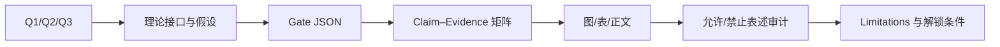

# Paper 1 候选贡献地图

## 冻结题目方向

**Strategy Selection under Momentum and Stability Constraints for Non-Cooperative Spacecraft Capture: Feasibility Maps and a Binding-Gate Criterion**

本文件沿用 `10_research/00_project_architecture/paper_structure_plan.md` 已冻结的贡献骨架，只做证据可读化，不新增科学命题，也不声称文献新颖性审查已完成。

## C1：冻结约束下的可行域与绑定 Gate

- 候选命题：给定终端状态、目标参数和资源阈值，可把当前扫描空间分类为不同任务可行区域；策略选择必须依据当前活动的绑定约束。
- 问题：Q1。
- 理论节点：终端状态 → 接触动量交换 → 可行域 → 策略绑定 Gate。
- 主证据：`sim10` 的 `SIM10_GATES_PASS`；`sim12` 的 `SIM12_PHASE1_GATES_PASS`。
- 证据状态：`VERIFIED_WITHIN_FROZEN_SCOPE`。
- 文献锚点：`papadopoulos2021survey`、`ellery2019tutorial`、`wilde2018tutorial`、`virgilillop2019simultaneous`。
- 图表角色：系统/状态流程图、sim10 可行域图、sim12 绑定约束矩阵。
- 可写：策略选择依赖工况下的绑定物理约束。
- 禁止写：某策略对所有工况普遍最优；区域计数是真实成功概率。
- 主要限制：目标与执行机构多项参数仍为低置信度/暂定；柔性不在正式判据中。

## C2：动量—姿态—资源统一账本

- 候选命题：同一策略必须同时按捕获冲量、组合角动量、捕获后角速度、轮动量/推力器和推进剂账本审查，单指标改善不保证任务可行。
- 问题：Q1、Q3。
- 理论节点：接触冲量 → 组合体动量 → 资源与稳定阈值。
- 主证据：sim06 锚点、sim10 X1/X3、sim12 ledger/GS1/GS3。
- 证据状态：`VERIFIED_CORE_WITH_PROVISIONAL_ENGINEERING_INPUTS`。
- 文献锚点：`yoshida2004impedance`、`uyama2012compliantwrist`、`wilde2018tutorial`。
- 图表角色：动量/资源 Sankey 或账本表；只使用冻结结果已有量。
- 可写：B_anchor 的 S2 与 S1 存在 Gate 已允许引用的具体冲量—角动量差异。
- 禁止写：冲量越小必然越安全；推进剂和轮动量派生量可作为独立证据重复计数。
- 主要限制：执行机构档、比冲、时间上限和若干阈值尚未硬件闭环。

## C3：有限接触带宽的模型边界

- 候选命题：理想瞬时冲量对柔性能量指标形成数值/模型域边界；在当前暂定参数合同内，有限接触窗使 sim11 的收敛与交叉求解 Gate 可审计。
- 问题：Q2。
- 理论节点：接触窗频谱 → 柔性模态 → 守恒/能量/收敛 Gate。
- 主证据：`sim11` 的 `SIM11_GATES_PASS_WITH_PROVISIONAL_PARAMS`。
- 证据状态：`LIMITED_PROVISIONAL`。
- 文献锚点：`yoshida2004impedance`、`uyama2012compliantwrist`、`liu2022flexiblecapture`。
- 图表角色：理想冲量与有限窗的概念对比、已有带宽扫掠图/收敛表。
- 可写：在当前模型合同内，有限带宽主判据通过 G1–G5。
- 禁止写：20 ms 为实测；柔性整星安全域已认证；e15 已 PASS。
- 主要限制：模态/阻尼/接触时长暂定，最终候选 ANCF 认证为 REPEAT。

## C4：fail-closed 证据链与负结果保留

- 候选命题：覆盖完整性、科学可行性、柔性认证和执行授权被分离；无安全候选或认证失败不会被总体 PASS 掩盖。
- 问题：Q1、Q2、Q3。
- 理论节点：候选预筛 → 核心 Gate → 柔性认证 → SAFE/授权。
- 主证据：sim09 无总体 verdict；e15 core `REPEAT_CORE_NO_SAFE_CANDIDATE`；e15 ANCF `REPEAT_ANCF_CERTIFICATION`；e16 0 正式安全候选；SAFE `next_stage_authorized=false`。
- 证据状态：`VERIFIED_GOVERNANCE_AND_NEGATIVE_RESULT_CHAIN`。
- 文献锚点：综述和捕获文献只用于解释任务背景，不替代负结果。
- 图表角色：多层 Gate 状态图、允许/禁止命题表。
- 可写：覆盖 PASS 与科学 PASS 分离；负结果被原样保留。
- 禁止写：e15/e16 已给出可执行安全候选；SAFE PASS 等于下一阶段获批。
- 主要限制：这是一项证据治理与可复核性贡献候选，学术新颖性仍需系统检索和期刊定位验证。

## 明确不属于 Paper 1 已验证贡献

| 内容 | 当前状态 | 正确放置 |
|---|---|---|
| VLA/具身智能闭环捕获 | `PLANNED_NOT_IMPLEMENTED` | Future work / 后续论文 |
| 在轨装配 | `BLOCKED` | 系统路线图，不进结果 |
| 实时数字孪生 | `BLOCKED`；当前上限为离线回放规划 | 比赛路线图/验证计划 |
| HIL/真实硬件/微重力试验 | 无当前证据 | Limitations / experiment roadmap |
| 柔性整星安全域 | e15 认证 REPEAT | Limitations / future validation |

## 论文证据闭环

## 投稿前必须补的审查

1. 对 C1–C4 做系统先验检索，区分方法新颖性、工程整合和证据治理价值。
2. 所有图/表逐项绑定不可变结果文件与 Gate 哈希。
3. 参数限制按 `20_engineering/parameter_registry/` 回填到方法和限制部分。
4. 对任何新增扫描/实验另立合同，不覆盖当前证据。

`last_verified_head: b75352c1c226c0f3e9a4bc9c469b766e06f41616`

