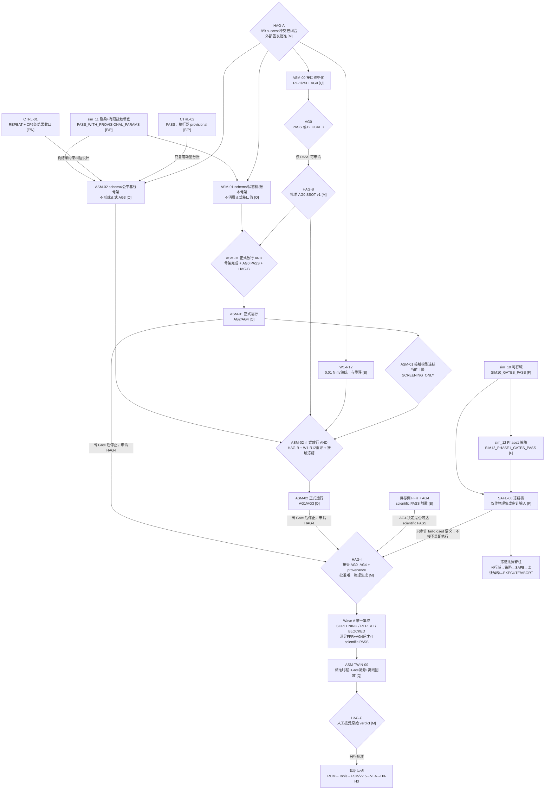

# Active Mainline DAG — 唯一科学主线授权图

> 当前唯一候选实施主线是 `ON-ORBIT ASSEMBLY WAVE A`。  
> 当前状态：`PLANNED_NOT_AUTHORIZED + INTERFACE_BLOCKERS`。

## 图例

- `[F]` 冻结证据，不得重做
- `[P]` PASS 但带 provisional/适用域限制
- `[N]` 真实负结果已收口
- `[B]` 阻塞
- `[M]` 人工批准
- `[Q]` 规划节点，尚未实施

## 节点状态与下一合法动作

| 节点 | 当前状态 | 下一合法动作 |
|---|---|---|
| sim_10/11/12 | 已完成、冻结 | 只读引用；触发器发生时才重跑 |
| SAFE-00 | PASS | 只作 Wave A 物理集成的 fail-closed 语义审计输入；AG5 尚未实施，不授予装配执行 |
| CTRL-01 | REPEAT，真实负结果收口 | 作为 ASM-02 设计约束，不再同题修复 |
| CTRL-02 | PASS，provisional | 复用分账；W1-R12/R13 保留 |
| ASM-00 | 未实施 | HAG-A 后先关闭 RF-1/2/3 与字段/出处 |
| ASM-01 | 未实施 | 可做 schema/状态机/账本骨架；正式运行须 AG0 PASS + HAG-B，且目标侧 FFR/AG4 决定能否达到 scientific PASS |
| ASM-02 | 未实施 | 可做 schema/公平基线骨架；正式运行须 HAG-B、W1-R12 重评与 ASM-01 接触冻结 |
| 唯一集成 | 未实施 | 三卡到 Gate 后先停止；HAG-I 接受 AG0–AG4/provenance 后才允许一个集成者输出一个 physics verdict |
| ASM-TWIN-00 | 未实施 | 只能回放真实集成证据，不能先制造演示 |
| Wave B/C | 未授权 | 等 HAG-C/HAG-D，禁止抢跑 |

## 阻塞边放行条件

| 编号 | 阻塞边 | 放行条件 | 未放行状态 |
|---|---|---|---|
| B0 | 人工批准 → Wave A | 先闭合 8/9 success schema 冲突；再由外部签发、可验证的 HAG-A 冻结任务卡、阈值、所有权与 schema 哈希 | `PLANNED_NOT_AUTHORIZED` |
| B1 | ASM-00 → ASM-01/02 | AG0 PASS；RF-1/2/3 与字段/出处闭合 | `_WITH_INTERFACE_BLOCKERS` |
| B2 | AG0 → 正式参数消费 | AG0 PASS 后由 HAG-B 批准 SSOT v1 | 只做 schema/骨架 |
| B3 | W1-R12 → ASM-02 | 冻结 `0.01 N·m/轴` 并统一口径重评 | ASM-02 只做骨架 |
| B4 | ASM-01 → ASM-02 正式运行 | 接触模型/状态机冻结，UNKNOWN fail-closed | AC2 不裁决 |
| B5 | 目标侧 FFR → 装配成功声明 | 目标侧柔性模型通过 AG4 | `ASM01_SCREENING_ONLY` |
| B6 | 三卡 → 唯一集成 | 各任务先停；HAG-I 接受 AG0–AG4 与 provenance | 未授权集成 |
| B7 | SAFE-00 → 装配执行 | Wave B 另行实现/审查 SAFE-00 装配扩展 AG5 | Wave A 只产物理 verdict，不产执行授权 |
| B8 | Wave A → 智能/硬件 | 集成 verdict 经 HAG-C 接受并另批 Wave B/C | 不启动后续队列 |

## 唯一主线纪律

1. 比赛链冻结，只做证据编排，不争夺“当前科学主线”。
2. Wave A 是一个主线、三个受统一 Gate 约束的子任务和一个唯一集成。
3. ROM、Physics Tools、V2.5、VLA、外部对拍与 H0–H3 均为后续队列。
4. 新场景、增益、阈值或接口几何变化必须作为预注册新实验。
5. 每个 Gate 出具后停止并等待人工批准，不自动滚入下一波。
