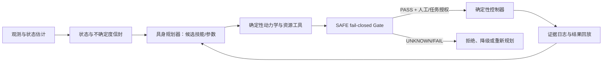

# 航天器设计、空间机械臂与具身智能专业研究经验综合

> 状态：`PAPER_SYNTHESIS_COMPLETE_WITH_LIMITATIONS`  
> 日期：2026-08-08（Asia/Shanghai）  
> 用途：为航天工程、机械工程、机器人工程与具身智能研究 Agent 提供同一套证据边界、专业判断框架和研究启动流程。  
> 权限边界：本文是研究导航与专家综合，不是新的项目 SSOT，不覆盖任何 Gate JSON、冻结配置、CAD 基线或人工授权。

## 1. 证据护照

本次综合先按论文知识总控流程完成 `STATE_AUDIT` 与全文完整性核验，再做跨主题综合：

| 项目 | 当前结果 | 可支持的表述 |
|---|---:|---|
| canonical manifest | 45 条 | 题录与本地路径入口 |
| 本地 PDF | 44 份 | 已验证文件存在与完整性 |
| 全量 PDF SHA-256 | 44/44 通过 | 可确认读取对象与 manifest 绑定一致 |
| 完整阅读卡 | 34 张 | 可使用卡内页级定位做受限综合 |
| 已有 PDF、待形成完整卡 | 10 篇 | 只能先列入精读队列，不冒充已精读 |
| 缺本地全文 | 1 篇 | `gerstmayr2013ancfreview`，只登记缺口 |
| 校验错误/警告 | 0 / 0 | 文献控制面当前可用 |

机器校验见 [controller_validation.json](./controller_validation.json)，题录真值见 [manifest.yaml](../../../50_literature/references/manifest.yaml)。论文只能解释方法、假设与外部结果，不能替代本项目的机器 Gate 或硬件证据。

## 2. 五类结论必须分开

今后任何专业 Agent 的输出都应给每条重要结论加上以下身份之一：

| 标签 | 含义 | 例子 |
|---|---|---|
| `PROJECT_FACT` | 项目配置、原始结果或 Gate 直接支持 | sim_10 在冻结合同内评估 9,002 点 |
| `LITERATURE_EVIDENCE` | 论文作者在特定对象和条件下的主张或结果 | ETS-VII 的 RNS 飞行验证属于其系统 |
| `ENGINEERING_INFERENCE` | 专家基于前两类证据作出的条件性判断 | 6R 的零反作用可达域可能限制终端任务 |
| `PROPOSAL` | 尚待授权、预注册和验证的研究或设计方案 | 建立离线 embodied-planner 对照基线 |
| `HOLD` | 参数、接口、全文、授权或验证缺口 | 接触时间 20 ms 仍为 provisional |

禁止把 `LITERATURE_EVIDENCE` 改写为 `PROJECT_FACT`，也禁止把 `PROPOSAL` 写成当前能力。

## 3. 跨学科核心经验

### 3.1 航天器/飞行器设计首先是任务—约束—验证闭环

当前本地证据主要覆盖轨道航天器与空间机器人，不足以支撑大气层内飞行器的气动、推进、热防护或适航设计。对本项目而言，“飞行器设计”应严格理解为空间服务航天器的系统工程设计。

专业工作顺序应为：

1. 冻结任务阶段、目标状态、成功条件与中止条件；
2. 建立质量、质心、惯量、功率、热、通信、动量和推进剂预算；
3. 把机械构型、接口、柔性附件、执行机构和传感器映射到同一坐标/单位体系；
4. 先做任务级可行性和绑定约束分析，再做局部优化；
5. 让每个设计量都回指来源、配置所有者、验证方法和失效后果；
6. 用分析—仿真—HIL—硬件—在轨的证据阶梯逐级升级，不能跳级。

[alizadeh2024comprehensive](../../../50_literature/references/notes/alizadeh2024comprehensive.md) 第 2、9、22 页支持“任务架构—自治—地面验证”联合闭环；[sscae2024strategy](../../../50_literature/references/notes/sscae2024strategy.md) 第 2、4–6 页支持按任务、构型、智能控制和试验体系分阶段推进。它们不提供本项目的设计阈值或成熟度认证。

### 3.2 空间机械臂不是固定基座机械臂

机械臂的关节运动、末端接触和捕获冲量会改变服务航天器的姿态与动量账本。因此“末端可达”只是必要条件，还必须同步审查：

- 基座角速度和姿态扰动；
- 机械臂奇异性、关节限位、碰撞与相机视场；
- 轮动量、轮力矩、推力器总冲量和推进剂；
- 柔性附件模态能量、结构振动和接触峰值；
- 捕获后的组合体质量、质心、惯量与控制余量。

[wilde2018tutorial](../../../50_literature/references/notes/wilde2018tutorial.md) 第 14 页式 (107)–(111) 给出广义雅克比核心关系：

```text
J* = Jm - J0 H0^-1 H0m
```

该式体现了基座—机械臂惯性耦合，但其使用必须绑定坐标、状态表示、外力矩和初始动量假设。GJM 不自动等于 RNS，也不证明接触稳定或安全。

[yoshida2001zrm](../../../50_literature/references/notes/yoshida2001zrm.md) 第 3、5–6 页说明 6R 系统的反作用零空间自由度受限；不能据此声称 6R 能执行任意零反作用末端轨迹，也不能未经任务权衡就直接得出“必须改 7R”。

### 3.3 捕获是分阶段状态机，不是一次抓取动作

高可信捕获链至少应拆为：

1. 目标观测与状态估计；
2. 终端接近与速度匹配；
3. 预接触对准；
4. 有限时长接触与柔顺吸能；
5. 抓取/闭锁；
6. 捕获后刚性化或组合体重构；
7. 消旋、镇定与资源恢复；
8. 成功确认或安全中止。

[papadopoulos2021survey](../../../50_literature/references/notes/papadopoulos2021survey.md) 第 2 页给出观测规划、最终接近、冲击抓取、捕获后镇定四阶段框架；[sst2024autonomous](../../../50_literature/references/notes/sst2024autonomous.md) 第 1、13、17 页进一步区分 free-floating/free-flying 与 pre-/post-capture。阶段间必须有显式守卫条件，不能把“抓住”写成“已消旋”或“任务成功”。

### 3.4 接触控制的本质是时间尺度与阻抗匹配

接触持续时间短于传感、估计和控制延迟时，主动控制无法及时改变冲击过程。工程设计要共同处理：

- 目标和末端的等效质量；
- 柔顺腕/末端执行器的刚度与阻尼；
- 恢复系数、摩擦、偏心距和相对速度；
- 传感采样、滤波、控制周期与总延迟；
- 峰值力、冲量、接触保持、重复碰撞和捕获后稳定。

[yoshida2004impedance](../../../50_literature/references/notes/yoshida2004impedance.md) 印刷页 181–197 给出虚拟质量与阻抗匹配思路，但其单轴、固定基座和频域近似不能直接认证本项目；[uyama2012compliantwrist](../../../50_literature/references/notes/uyama2012compliantwrist.md) 第 2–5 页说明柔顺腕可延长接触时间，并给出恢复系数—阻尼比关系，但二维台架参数不得移植为 B601 设计值。

### 3.5 柔性动力学必须与刚体可行域分层

刚体模型适合回答大尺度动量、姿态和资源问题，却不能自动回答柔性振铃、应变能、接触激振或局部载荷。建议保持三层模型：

- L1：刚体/冲量模型，用于大规模可行域扫描；
- L2：有限接触窗 + 低阶模态，用于频谱和敏感性筛选；
- L3：经资格化的 FEA/FFR/ANCF 或独立求解器，用于候选认证。

[liu2022flexiblecapture](../../../50_literature/references/notes/liu2022flexiblecapture.md) 第 3–16 页展示刚柔耦合、Hertz 接触和偏心碰撞的定性风险；[yoshida1999vibrationsuppression](../../../50_literature/references/notes/yoshida1999vibrationsuppression.md) 与 [nenchev1999flexiblerns](../../../50_literature/references/notes/nenchev1999flexiblerns.md) 表明反作用抑制与结构抑振是不同子任务。它们都不能替代当前项目的帆板参数、收敛或 ANCF Gate。

### 3.6 视觉与状态估计必须单独接受域差验证

PBVS 依赖三维位姿与标定，IBVS 直接使用图像特征但受可观性、遮挡与交互矩阵影响。视觉收敛不等于低冲击接触，更不等于捕获后稳定。

[visualservoing2024survey](../../../50_literature/references/notes/visualservoing2024survey.md) 第 2、6–7 页提供 PBVS/IBVS/混合方法分类；[park2021speedplus](../../../50_literature/references/notes/park2021speedplus.md) 第 1、4、8 页说明合成与 HIL 图像应显式分域评估；[lampariello2018tracking](../../../50_literature/references/notes/lampariello2018tracking.md) 第 3–7 页表明目标预测、视觉、PBVS、阻抗与关节控制可采用不同频率，但其 1–2°/s、刚性目标和地面设施结论不能外推为本项目安全能力。

### 3.7 具身智能应是受物理门约束的候选生成层

高层 Agent 的合适职责是：理解任务、生成候选技能、选择确定性工具、解释失败并建议恢复；不应直接拥有执行器权限。

推荐接口：



[kawaharazuka2025vlareview](../../../50_literature/references/notes/kawaharazuka2025vlareview.md) 第 5–6、13、16、19 页说明动作表示、数据与推理时延共同决定部署；[ma2024vlasurvey](../../../50_literature/references/notes/ma2024vlasurvey.md) 第 1–3、7、15 页支持把感知组件、低层策略和高层规划分开评价；[spacemind2026](../../../50_literature/references/notes/spacemind2026.md) 第 2、3、6、16 页提供技能路由、工具调用和失败恢复对标；[rodriguez2024lmspacecraft](../../../50_literature/references/notes/rodriguez2024lmspacecraft.md) 第 2、5、7–8 页则说明 schema/函数调用错误必须默认拒绝执行。

OpenVLA、SpaceRobotEnv、Space Robotics Bench 等只能作为未来离线基线或参考实现。外部 checkout、论文结果或 benchmark 成绩都不等于 B601 已适配、已训练、已集成或已通过项目 Gate。

## 4. 专业智能体的角色分工

| Agent 角色 | 必须先读 | 合法输出 | 必须拒绝 |
|---|---|---|---|
| 总体/任务工程 Agent | 任务合同、系统架构、质量/资源账本 | 任务阶段、需求追踪、接口与验证矩阵 | 用愿景替代可验证需求 |
| 航天器机械 Agent | accepted URDF、几何 SSOT、当前 CAD ruling | 构型、接口、载荷路径、收拢与装配风险 | 用 donor/reference 覆盖 current authority |
| 动力学 Agent | sim_05/sim_11、配置与 Gate | 假设、方程、守恒审计、适用域 | 把 provisional 参数写成实测 |
| 捕获/控制 Agent | sim_06/10/12、CTRL、SAFE | 阶段状态机、绑定约束、控制候选 | 用单一指标宣布普适最优 |
| 感知/HIL Agent | 数据合同、标定、时间同步与 H0–H3 | 误差预算、域差矩阵、测试协议 | 把实验室装置称为完整微重力等效 |
| 具身规划 Agent | Q4 合同、技能 schema、工具清单 | 候选技能、工具调用、失败解释 | 直接输出力矩/点火或绕过 SAFE |
| 证据/Gate Agent | 原始结果、hash、Gate JSON | 可复算裁决、异常与缺口登记 | 用报告摘要覆盖最终机器裁决 |
| 总师/集成 Agent | 上述全部角色的边界化输出 | 跨域权衡、授权建议、下一 Gate | 静默消解冲突或删除负结果 |

### 每次研究回合的标准协议

1. `OBSERVE`：读取当前 authority、Gate、hash 和变更状态。
2. `CLASSIFY`：把输入标为项目事实、文献证据、推断、建议或 HOLD。
3. `BOUND`：写明对象、坐标、单位、初值、参数来源和适用域。
4. `HYPOTHESIZE`：提出可证伪命题及反例。
5. `PRE-REGISTER`：若需新仿真/试验，先冻结变量、对照、seed、指标、Gate 与停止条件。
6. `EXECUTE`：只有取得对应授权后才运行，不覆盖旧结果。
7. `AUDIT`：核对守恒、收敛、交叉求解、负结果和 provenance。
8. `REPORT`：同时写“能声称什么、不能声称什么、下一解锁条件”。

推荐统一输出格式：

```text
QUESTION:
PROJECT_FACTS:
LITERATURE_EVIDENCE:
ASSUMPTIONS_AND_APPLICABILITY:
ENGINEERING_INFERENCE:
COUNTEREVIDENCE_OR_FAILURE_MODES:
PROPOSED_NEXT_GATE:
CANNOT_CLAIM:
```

## 5. 对当前 Q1–Q6 的研究映射

| 问题 | 当前证据状态 | 专家判断 | 下一项合法研究工作 |
|---|---|---|---|
| Q1 捕获可行域 | `ACTIVE_VERIFIED_CORE_LIMITED_SCOPE` | 是当前 Paper 1 主问题；冻结合同内可研究绑定约束 | 补 claim–evidence 绑定与先验对比，不改旧 Gate |
| Q2 柔性—接触 | `LIMITED_AND_NEGATIVE_CERTIFICATION` | 可写模型边界，不能给柔性安全域 | 先取得帆板模态/阻尼与夹爪接触时长证据 |
| Q3 不确定性 | `ACTIVE_METHOD_QUESTION_NOT_QUANTIFIED` | 已可追溯来源，尚无统计鲁棒结论 | 另立 UQ 预注册合同与合法参数域 |
| Q4 具身智能 | `PLANNED_NOT_IMPLEMENTED` | 应先做离线候选层和拒绝机制 | 冻结状态信封、技能 schema、工具接口和 OOD 策略 |
| Q5 数字孪生 | `LIMITED_DT2_AND_BLOCKED_UPGRADE` | 当前上限是离线证据回放 | 定义时间戳、回放一致性与参数校准 Gate |
| Q6 模块装配 | `PLANNED_SCOPE_FROZEN_EXECUTION_BLOCKED` | 近期应聚焦 1U/2U 预制接口，不扩成大型结构愿景 | 先关闭 RF-1/2/3、HAG-A 与 AG0 |

## 6. 建议的研究主线

### 主线 A：先完成可发表的证据闭环

1. 固定 Paper 1 的 C1–C4 候选贡献；
2. 把每条主张绑定到 Gate JSON、结果行、配置 hash 和页级文献；
3. 对“绑定约束/策略依赖工况”做系统先验检索；
4. 只重排已有图表，不启动未经授权的新实验；
5. 明确写入 FLEX 未入判据、参数 provisional、无硬件/飞行验证。

### 主线 B：把机械候选升级为可审查基线

1. 完成 F3R2 人工裁决；
2. 修复或豁免 10 条 native 外部引用并做独立 cold reopen；
3. 按 WING_ROOT_LUG → 真实支撑/收拢 → HDRM → camera/harness → gripper fingers 的顺序逐轮授权；
4. 用接口载荷、干涉、连续路径、质量属性和配置分化证据替代“看起来完整”。

### 主线 C：为下一轮科学复算准备真实参数

- B601/夹爪：质量、质心、惯量、接触持续时间、刚度/阻尼；
- 航天器：系统质量预算、帆板面密度、模态、阻尼与连接刚度；
- 执行机构：轮力矩/轮动量、推力器最小脉冲、总冲量与延迟；
- 感知：相机标定、时间同步、位姿误差、遮挡和照明域；
- 所有参数先进入来源分级和影响分析，再触发新版本复算。

### 主线 D：建立最小物理门控具身智能原型

在单独授权后，先做“离线、无命令输出”的最小闭环：

1. 输入冻结的目标状态与不确定度；
2. Agent 只生成离散技能和有界参数；
3. 确定性工具计算可行性与资源账本；
4. SAFE 对 UNKNOWN/FAIL 一律拒绝；
5. 与规则基线比较任务成功、拒绝正确率、schema 错误、延迟和恢复率；
6. 保留完整提示、模型版本、seed、工具输入输出和人工审批日志。

这一步仍不构成 HIL、硬件或在轨能力。

## 7. 文献共识、分歧与空白

### 共识

- 自由漂浮耦合和动量守恒必须进入机械臂任务设计；
- 接近、接触、闭锁和捕获后镇定应分阶段；
- 柔顺/阻抗能降低某些冲击风险，但必须绑定目标质量、接触时间和控制带宽；
- HIL 有价值但不完整等效微重力；
- VLA/语言 Agent 必须与确定性控制和安全门分层。

### 不能直接统一的差异

- 文献对象从固定基座、二维气浮到自由漂浮在轨系统不等；
- 接触模型包含瞬时冲量、线性弹簧阻尼、Hertz、柔顺腕等不同假设；
- 目标转速、质量、抓取接口和验证设施差异巨大；
- benchmark 成功率、jerk 或样本效率不能跨平台直接排名；
- 论文给出的周期、刚度、夹持力、质量和速度均不是本项目阈值。

### 当前知识空白

1. `gerstmayr2013ancfreview` 缺本地全文，ANCF 综述链未闭合；
2. 10 篇已到盘论文仍待完整阅读卡；
3. 本地文献对大气飞行器气动/推进/热设计覆盖不足；
4. 缺 B601 实物参数、帆板实测模态和接触时间；
5. 缺项目级 HIL、dataset、ROS2/Isaac/MuJoCo/Basilisk 集成与 Gate；
6. 具身智能尚无项目数据、基线、OOD 和实时性证据。

## 8. 下一轮精读优先级

按当前队列，先完成以下 10 篇的页级卡：

- P0：`rybus2024manipulators`、`xu2017reactiontorque`、`gerstmayr2008elasticline`、`vijayan2022detumbling`、`palma2022compliantjoint`；
- P1：`uyama2016hybrid`、`fujii2024gripping`、`gerstmayr2023exudyn`、`mavrakis2021rocketstage`、`park2024poseestimation`。

队列真值见 [reading_queue.md](./reading_queue.md)。每篇必须在真实全文基础上记录页码、对象、假设、数值身份、项目接口和禁止外推项。

## 9. 最终专家裁决

```text
PAPER_SYNTHESIS_COMPLETE_WITH_LIMITATIONS

可开始：
- 现有证据的 Paper 1 主张绑定与专业写作；
- F3R2 人工评审准备与参数缺口整理；
- Q3/Q4/Q5/Q6 的预注册、接口和 Gate 设计；
- 10 篇待读论文的逐篇精读。

不可直接开始或宣称：
- 未授权的新仿真、HIL、dataset 或 CAD 修改；
- F3R2 已成为人工接受/制造基线；
- 柔性整星安全域、实时数字孪生或具身智能闭环已实现；
- 外部开源仓库或论文结果已经验证本项目。
```
