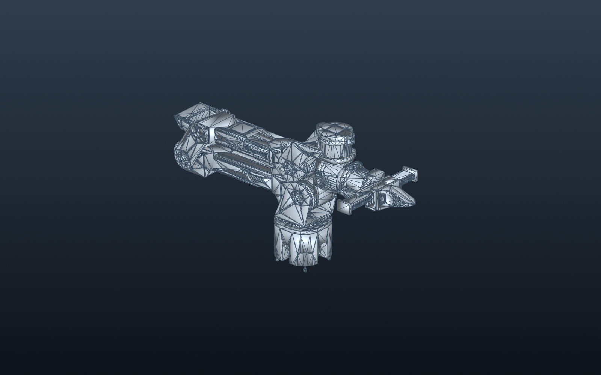
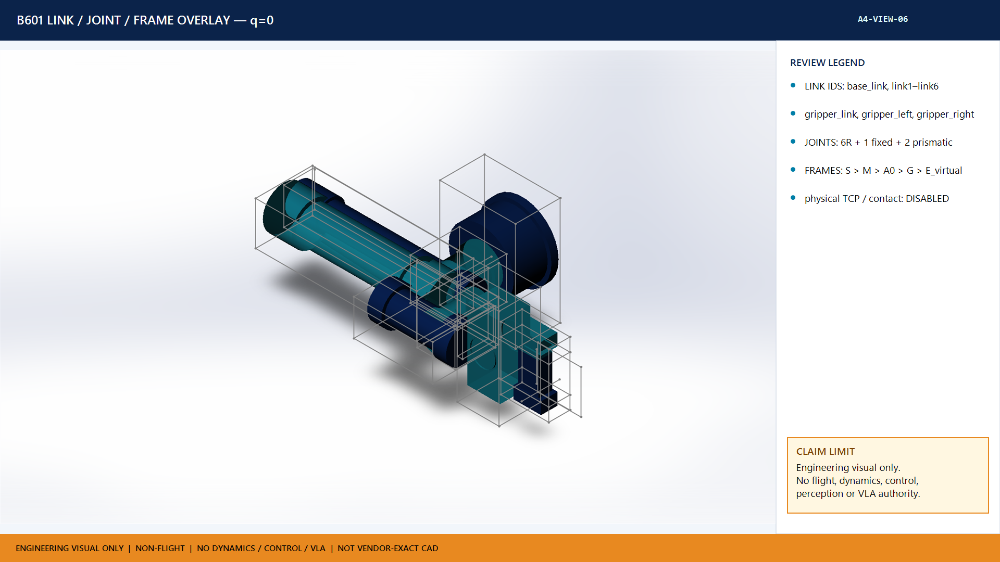
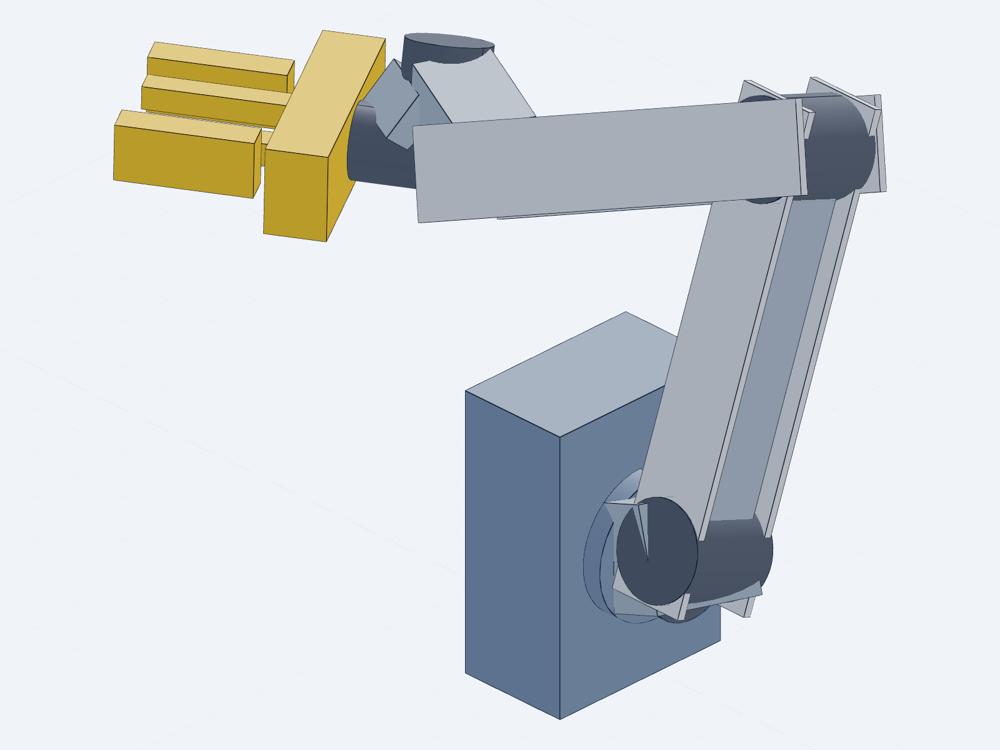
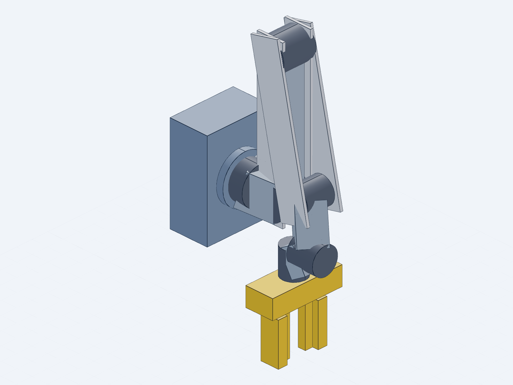
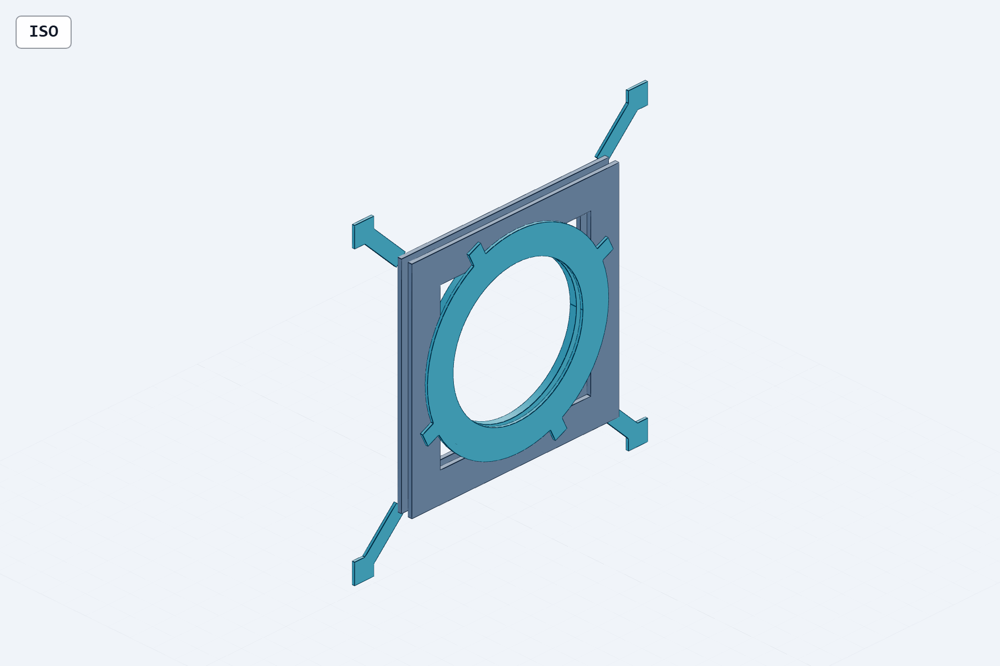
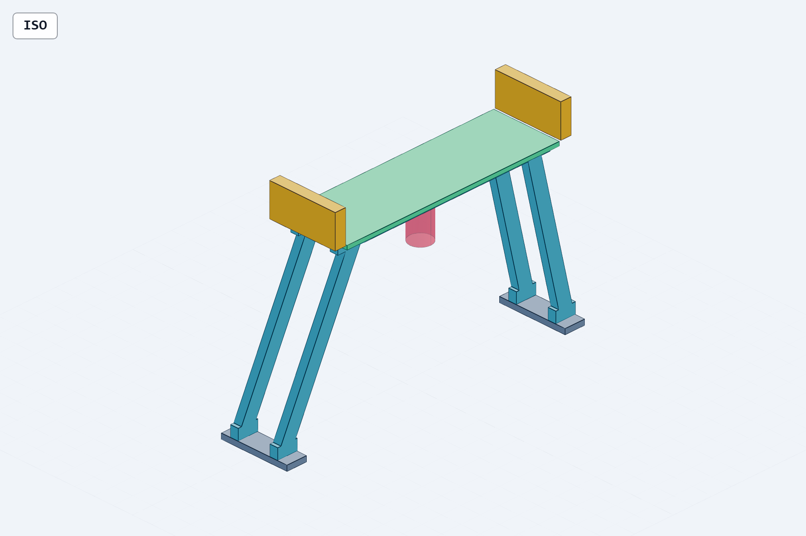
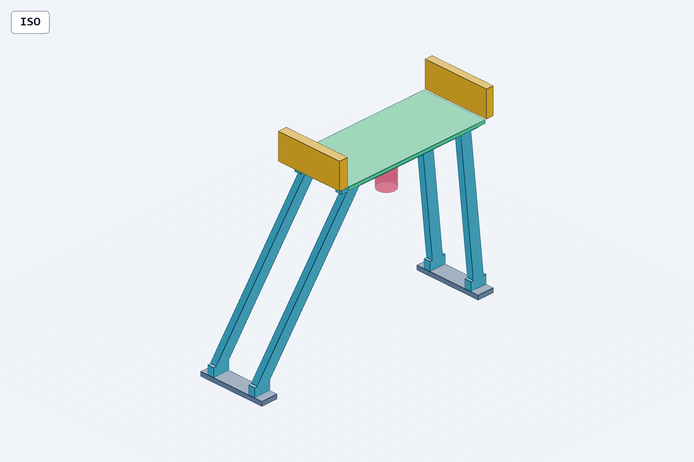

# 空间具身智能机械臂机械设计效果与项目进度展示

更新时间：2026-07-29  
适用范围：本项目本地内部评审  
状态依据：当前 Gate JSON / YAML、原生 CAD 文件、STEP、渲染图与只读检查结果

> 结论先行：当前已有可用于方案汇报的整星构型、维护态、B601 固定 q0 细节、关节拓扑和接口候选件渲染；但尚不存在通过 Gate 的 B601 原生可运动 `6R + 1 fixed + 2P` 整机装配。静态姿态图不得作为连续运动、收拢闭合或碰撞安全的验收证据。

## 1. 推荐展示图

### 1.1 整星收拢构型

- 用途：总体机械布局、舱体与顶部机构关系展示。
- 证据等级：V2.2_NATIVE 原生结构可视化。
- 限制：不是 B601 原生运动验收，也不是制造或飞行发布。

### 1.2 维护态与内部载荷路径展示

- 用途：展示主结构、可拆面板、顶部载荷路径与维修接近性概念。
- 限制：维护空间和工具可达性尚未形成闭合的间隙证据。

### 1.3 B601 固定 q0 原生工程几何

- 用途：当前最完整的 B601 原生 SolidWorks 整臂几何展示。
- Gate：`B5_0_PHASE1_NATIVE_Q0_REFERENCE_PASS_WITH_G05_G08_HOLD_AND_RECORDED_TOOL_DEVIATIONS`。
- 关键限制：所有组件固定；`retained_mechanism_dof=false`；不代表关节自由度已经实现。
- 分发：按项目内部研究资料管理，不对外传播供应商精细几何。

### 1.4 B601 关节、连杆与坐标系说明

- 用途：答辩中解释 10 links、`6R + 1 fixed + 2 prismatic` 和坐标系链。
- 证据等级：教学/评审视觉图。
- 限制：不是供应商精确 CAD，不具有动力学、控制或飞行权威。

### 1.5 LOD2 收拢态与 q0 状态对照

| 收拢候选态 | q0 参考态 |
|---|---|
|  |  |

- 用途：说明命名姿态、安装关系和收拢概念。
- Gate：`B601_GEOMETRY_POSEMAP02_ACCEPT_WITH_ENGINEERING_HOLDS`。
- 限制：两幅图是静态状态，不是连续关节运动、扫掠包络或无碰撞证明。

### 1.6 B5.1 接口返工候选件

| 桥接适配器 | G07 主鞍座 | G08 末端鞍座 |
|---|---|---|
|  |  |  |

- 用途：展示当前接口问题定位与返工对象。
- Gate：B5.1 `G2=FAIL_GEOMETRY_REDESIGN_REQUIRED`。
- 当前问题：28 行 H10 接口账本均未闭合，其中 8 行为不可接受碰撞；长桁基准偏差 4 mm；鞍座距主承力结构约 3 mm，当前落在可拆面板层上。
- 限制：以上均为候选件，不能作为已闭合接口、合格载荷路径或已定型结构展示。

## 2. 原生装配、工程图和交换文件入口

### 2.1 当前最完整的整臂原生资产

- [B50_B601_ENGINEERING_ARM_Q0.SLDASM](../../20_engineering/cad/B5_0_B601_space_manipulator_candidate/03_CAD/native_runs/B50_NATIVE_20260727T2214Z/20_assembly/B50_B601_ENGINEERING_ARM_Q0.SLDASM)  
  原生 SolidWorks 固定 q0 装配，25,600,066 bytes。
- [B50_B601_ENGINEERING_ARM_Q0.SLDDRW](../../20_engineering/cad/B5_0_B601_space_manipulator_candidate/03_CAD/native_runs/B50_NATIVE_20260727T2214Z/40_drawings/B50_B601_ENGINEERING_ARM_Q0.SLDDRW)  
  原生工程图，25,295,507 bytes；当前只可作为固定 q0 参考图。
- [B50_B601_ENGINEERING_ARM_Q0.step](../../20_engineering/cad/B5_0_B601_space_manipulator_candidate/03_CAD/native_runs/B50_NATIVE_20260727T2214Z/30_exports/B50_B601_ENGINEERING_ARM_Q0.step)  
  STEP 交换文件，124,616,124 bytes；几何交换权威高于预览网格，但仍不提供运动自由度。

### 2.2 运动预试装配

- [B51_B601_ARTICULATED_ENGINEERING_ARM_PRETEST.SLDASM](../../20_engineering/cad/B5_1_B601_interface_closure_candidate/03_CAD/native_articulated/B51_SEGMENT_CHAIN_6R_20260728T005/assembly/B51_B601_ARTICULATED_ENGINEERING_ARM_PRETEST.SLDASM)

状态：`B51_NATIVE_6R_SEGMENT_CHAIN_HOLD`。首个随机合法姿态冷读回最大 FK 误差为 `0.012812317049107874 m`；2P 未实现；原生角度限位配合缺失；没有可发布的最终装配、工程图、PDF 或 STEP。该文件只能用于故障复现和后续返工，不能作为“机械臂已经可运动”的成果。

### 2.3 整星原生工程图

- [NATIVE01_STOWED.SLDDRW](../../20_engineering/cad/Space_Embodied_Robot_CAD_V2_2_NATIVE/drawings/NATIVE01_STOWED.SLDDRW)
- [NATIVE01_STOWED.pdf](../../20_engineering/cad/Space_Embodied_Robot_CAD_V2_2_NATIVE/drawings/NATIVE01_STOWED.pdf)
- [NATIVE01_MAINTENANCE.SLDDRW](../../20_engineering/cad/Space_Embodied_Robot_CAD_V2_2_NATIVE/drawings/NATIVE01_MAINTENANCE.SLDDRW)
- [NATIVE01_MAINTENANCE.pdf](../../20_engineering/cad/Space_Embodied_Robot_CAD_V2_2_NATIVE/drawings/NATIVE01_MAINTENANCE.pdf)

只读复核结果：

- 生成记录声称每张图包含 4 个模型视图和 1 个 A-A 剖视；
- 2026-07-29 实际渲染两张 PDF 时，图纸主体为空白，仅保留图框与限制声明；
- 图框仍出现无权威的 SolidWorks 默认质量值（收拢态约 6.159 kg、维护态约 5.191 kg），不得引用；
- 因此当前可确认“原生 SLDDRW 文件存在”，不能确认“可发布工程图已完成”。

对应预览证据：

- [收拢态 PDF 页面预览](assets/drawing_stowed_page1.png)
- [维护态 PDF 页面预览](assets/drawing_maintenance_page1.png)

## 3. 当前项目进度

| 版本 / 工作包 | 已形成内容 | 当前 Gate | 工程解释 |
|---|---|---|---|
| V2.0 | 20/20 基线检查；历史整星机械 CAD | `V2_SYSTEM_MECHANICAL_CAD_COMPLETE_WITH_PHYSICAL_LIMITATIONS` | 已冻结历史基线；物理接口、质量惯量、载荷与资格限制仍保留 |
| V2.1 | 60 个原生文件；机器检查通过 | `B4_1_ACCEPTANCE_HOLD`，6 PASS / 17 HOLD / 0 FAIL | 有参考 CAD，不是物理机构或工程图发布 |
| V2.2 | 102 个原生文件；主要功能几何 | L1 PASS；L2 PARTIAL；L3 NOT_STARTED；L4 NOT_AUTHORIZED | 布局和实体化进展明显；接口、运动包络和发布未闭合 |
| V2.2_NATIVE | 原生结构、维护态、STEP 和 SLDDRW | `NATIVE01_PHASE1_BUILT_PASS`，带明确 claim limits | 可作为原生结构视觉基线；不能升级为整臂运动/制造发布 |
| V2.3 | 56/56 本地引用；Stage 2 三表征尝试 | `NATIVE_MECH_REAL_01_STAGE2_HOLD` | HIFI 导入、质量属性、三表征互斥、顶层插入和冷启动链未闭合 |
| B5.0 | B601 原生固定 q0 装配、工程图、STEP | 固定 q0 参考 PASS，后续接口/DOF HOLD | 当前最完整整臂几何，但没有保留机构自由度 |
| B5.1 | 桥接件、G07/G08 鞍座、6R 预试 | `B51_REVISE_INTERFACE_COLLISION` | G2 几何重设计；G3–G7 均未闭合 |
| **B5.1R1（当前前沿）** | 21/21 父输入锁定；基准因果、H10、拓扑、收拢约束与贸易合同 | `B51R1_PHASE0_CAUSALITY_AND_CONTRACT_BASELINE_COMPLETE_WITH_MEASUREMENT_HOLD` | **0 个新 CAD/STEP；0/28 H10 闭合；T005-A/B/C 未运行；Phase 1 未授权** |

不建议用单一百分比描述当前进度，因为各 Gate 的完成定义不同。最准确的说法是：**总体构型与静态原生几何已经形成；接口闭合、原生可运动装配、收拢约束、连续间隙、结构分析与工程图发布仍处于 HOLD / FAIL / 未授权状态。**

## 4. 当前阻塞项和下一门

当前最关键的阻塞项：

1. 通过命名面和实例变换完成耐久基准测量，闭合 4 mm 基准偏差和 3 mm 鞍座—主结构间隙的因果链。
2. 完成 H9 / 安装方案人工裁决，并形成可授权的 Master Skeleton V2。
3. 逐行闭合 H10 28/28，消除 8 行不可接受碰撞。
4. 实现唯一、可复位、带零位驱动与原生限位的 `6R + 1 fixed + 2P` 装配。
5. 通过 T005-A/B/C 冷启动随机姿态回读。
6. 闭合 G4 收拢约束、释放接口和失效联锁，再进行连续间隙与结构趋势验证。
7. 修复工程图视图和图框质量字段，形成可复核 PDF / SLDDRW 发布包。

下一人工 Gate：

`COMP-PROT-03-A4-B5.1R1-PHASE1-MASTER-SKELETON-V2-AND-NATIVE-REWORK-AUTHORIZATION`

在该 Gate 正式批准前，不应创建或宣称新的 B5.1R1 原生 CAD、可运动整机、制造发布、发射资格或飞行可用性。

## 5. 推荐汇报顺序

1. 用整星收拢构型说明任务载荷和机械臂总体安装位置。
2. 用维护态图说明主结构、面板和载荷路径概念。
3. 用固定 q0 细节图展示当前真实整臂几何成熟度。
4. 用关节拓扑图解释 `6R + 1 fixed + 2P` 目标架构。
5. 用收拢态 / q0 对照图说明状态设计，但明确其为静态。
6. 用桥接件和 G07/G08 图主动说明碰撞、基准和载荷路径问题。
7. 以 B5.1R1 Gate 结束：Phase 0 已完成，Phase 1 等待授权。

