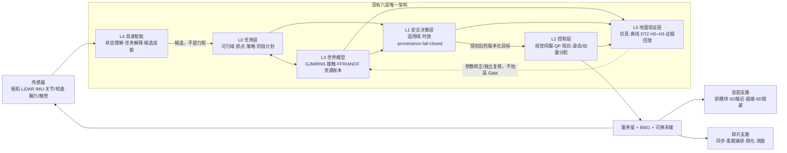
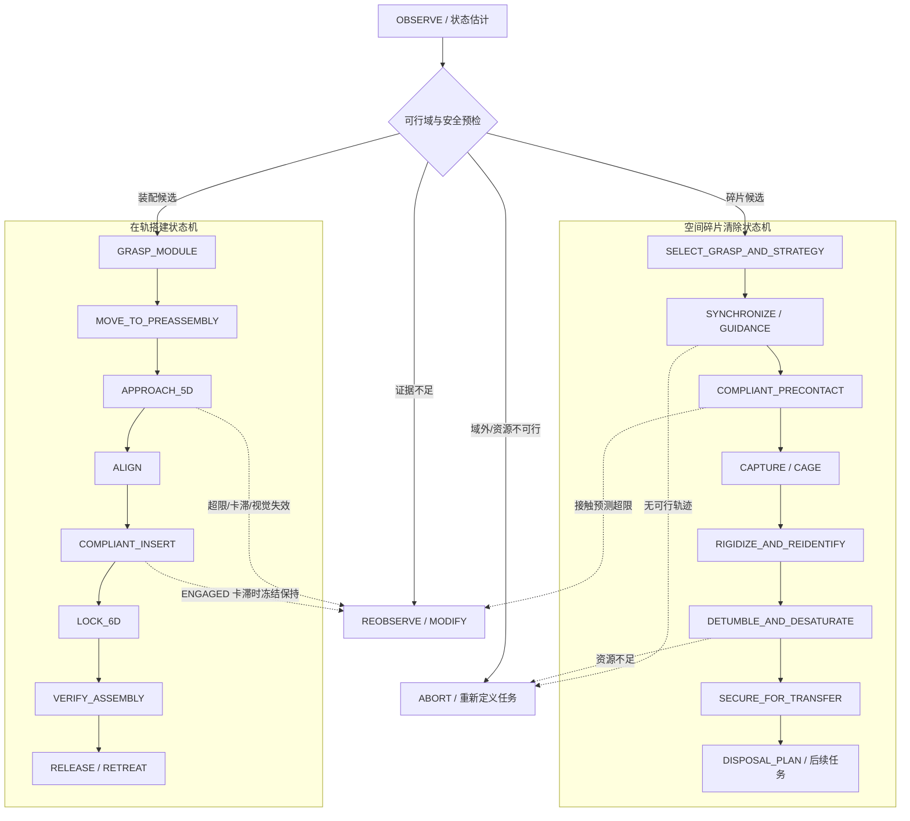

# 空间飞行器具身智能机械臂双任务完整方案

## ——在轨搭建 / 空间碎片清除的共平台架构、控制链与验证路线

> 日期：2026-07-22
> 文档性质：`LITERATURE_SYNTHESIS_AND_ENGINEERING_MAPPING`
> 当前 HEAD：`62f851e`（`feat/sim09-grasp-evaluator`）
> 适用基线：12U 服务星 + B601 六自由度机械臂
> 证据纪律：Machine Gate JSON > 原始结果 > 测试 > Git > 报告 > 文献设想
> **本文件不产生 HAG-A/HAG-B/HAG-I，不授权 ASM-01/02、VLA、HIL 或 B601 运动。**

本文件是对现有[六层唯一架构](../framework_convergence/canonical_architecture.md)、
[装配 Master Plan](./master_plan.md)和已落盘论文的双任务综合，不建立平行总架构，
也不重做 sim_01–12、e15/e16、SAFE-00、CTRL-01/02 或 Assembly Wave A。

---

## 0. 文档级结论

### 0.1 总体方案

在轨搭建和空间碎片清除可以共用同一套“服务星—机械臂—物理世界模型—安全核—
分阶段控制—地面证据回放”主干，任务差异集中在四处：

1. **目标模型**：装配对象接口已知且合作；碎片几何、惯量、转速与抓取部位不确定；
2. **末端执行器**：装配使用模块夹持/导向插接工具；碎片清除使用包络、夹爪、喷管探针
   或柔顺抓取工具；
3. **接触终态**：装配要求对准、插入、锁紧和结构验证；碎片清除要求稳定抓持、消旋、
   组合体重构和后续转移/离轨；
4. **任务策略**：装配以 `5D 接近 → 柔顺插接 → 6D 锁紧` 为主；碎片清除按绑定约束
   在被动捕获、速度匹配、动量预置和 ABORT 之间选择。

因此推荐采用：

> **一套共平台 + 两套可换末端 + 两条任务状态机 + 一个不可绕过的安全授权核。**

当前可诚实主张的是“已形成文献支撑的完整双任务方案，并具有捕获可行域、有限带宽
刚柔耦合、策略选择和离线安全解释证据”；不能主张“已完成自主在轨搭建/碎片清除”。

### 0.2 本地证据盘点

- 统一归档 `50_literature/pdf/`：44 份 PDF，全部采用 `NN_category/bibkey.pdf`；
- `补充论文/`：只保留 README，原 21 份、348 页已归并；
- SHA-256 去重后仍为 44 份，即无字节级重复；
- 21 份补充文件中 10 份按 DOI 匹配既有 key，11 份补入新题录；路径、页数与哈希已回填
  `manifest.yaml` 和 `refs.bib`。LIT-01 的 23 篇完整阅读卡仍见
  [主题索引](../../50_literature/references/notes/INDEX.md)，新增 11 篇先完成题录级归档。

此前“补充 23 篇”的目标清单中，REORG-01-R 后仍缺两项来源，其中只有第一项属于当前 manifest 的硬缺口：

1. Gerstmayr, Sugiyama & Mikkola, ANCF 综述，DOI
   [10.1115/1.4023487](https://doi.org/10.1115/1.4023487)；
2. Gecko-inspired adhesive 抓取装置，DOI
   [10.1126/scirobotics.aan4545](https://doi.org/10.1126/scirobotics.aan4545)。

前者是柔性建模理论补强项；后者是可选末端方案，不是当前 B601 主线的开工阻塞。

---

## 1. 双任务科学问题与边界

### 1.1 统一科学问题

给定自由漂浮服务星、机械臂、执行器预算、柔性附件、感知不确定度和接触接口，系统应
回答三个递进问题：

1. **能不能做**：目标是否处于可达、可捕获、可稳定、可装配的物理可行域；
2. **应该怎么做**：当前是哪条约束先饱和，应选择哪种抓取/接触/动量管理策略；
3. **是否允许执行**：候选动作是否具有适用域、时效、来源和安全 Gate 的完整证据。

“具身智能”在这里不是端到端输出关节力矩，而是把视觉、语言任务、技能库和物理工具
组织为候选方案，再由确定性的动力学与安全核裁决。

### 1.2 两个任务的最小闭环

| 任务 | 起点 | 终点 | 当前最小研究场景 | 不在当前闭环内 |
|---|---|---|---|---|
| 在轨搭建 | 已获取 1U/2U 模块 | 模块通过预制接口完成对准、插接、锁紧与状态验证 | 12U+B601、双方自由漂浮、目标侧双柔性帆板、锥面/导向销/机械锁扣 | 大桁架连续建造、真实电气互连、长期结构认证 |
| 碎片清除 | 已建立近距离相对导航 | 完成稳定捕获、组合体状态重构与消旋 | 翻滚非合作航天器/上面级，单臂柔顺抓取，轮—推力器—机械臂协同 | 实际离轨许可、全轨道转移、再入安全与法规闭环 |

---

## 2. 六层共平台系统架构

合法执行链固定为：

`L4 候选 → L0/L3 物理求值 → L1 安全授权 → L2 实时控制 → 执行机构`。

L4、VLM 或 VLA 不得越过 L1 直接控制机械臂、轮组或推力器；任一 UNKNOWN、数据过期、
参考系不一致、哈希不匹配或模型域外状态都必须 fail-closed。

---

## 3. 航天器与机械臂总体设计

### 3.1 当前比赛基线与升级边界

| 子系统 | 当前基线 | 双任务设计 | 证据/限制 |
|---|---|---|---|
| 服务星 | 12U CubeSat | 提供相对导航、姿态/轨道控制、计算、通信、功热和任务载荷接口 | 质量/惯量只认 SSOT；低置信字段保持 PROVISIONAL |
| 机械臂 | B601 六自由度机械臂 | 共用关节、编码器和控制接口；通过技能与末端切换承担两任务 | 6R 严格 6D 任务零空间为零；不能把 7R 文献优势直接写成本机能力 |
| 腕部 | 现有末端接口 | 增配六维力/力矩、近距相机和机械/控制柔顺；可采用柔顺腕或选择性柔顺移动副 | Uyama 2012、Palma 2022 支撑；具体刚度/阻尼须实验标定 |
| 装配末端 | 模块夹持 + 导向插接工具 | 抓取模块、粗对准、柔顺插入、锁扣状态读取 | 接口销距、倒角、间隙、摩擦、刚度和锁紧力尚未转正 |
| 碎片末端 | 当前未冻结 | 优先研究包络夹爪/喷管或适配环夹持；柔性/黏附工具列为对照 | Fujii 2024、Mavrakis 2021；不得先验宣称某方案最优 |
| 姿控执行器 | 轮组 + 推力器预算模型 | 轮组承担存储/重分配，推力器承担外部角冲量与饱和卸载 | 机械臂内部运动不能移除系统总角动量 |
| 感知 | 仿真/离线输入为主 | 远距检测，近距 6D 位姿与角速度，部件/接口分割，腕部接触状态 | 先合作标记 H2，再做 markerless；当前无在机闭环证据 |
| 计算 | 地面/仿真链 | 安全实时核与 AI 加速计算隔离；AI 只能调用版本化工具 | 未做抗辐照、时延、资源和故障资格化 |

七自由度冗余臂、双臂或多臂只作为后续构型对照。当前方案首先证明 B601 6R 在分阶段
任务中可用，而不是通过改构型绕过已有 CTRL-01 负结果。

### 3.2 可换末端原则

建议采用“通用腕部法兰 + 任务工具”的模块化方式：

- 通用层：腕部 F/T、近距相机、触觉/接近、被动/主动柔顺、工具身份与标定参数；
- 装配工具：模块夹具、锥面/导向销对接探针、锁扣驱动与状态检测；
- 碎片工具：包络夹爪、适配环/喷管探针或柔性抓手；
- 所有工具都必须携带 `tool_id / mass / inertia / T_tool / compliance / load_limit /
  calibration_hash / validity`，换工具后重新进入 L0/L3/L1，不允许沿用旧授权。

---

## 4. 统一动力学与控制骨架

### 4.1 自由漂浮星—臂耦合

以基座 twist `ν_b`、关节坐标 `q` 表示刚体主干：

\[
\begin{bmatrix}
H_b & H_{bm} \\
H_{bm}^{T} & H_m
\end{bmatrix}
\begin{bmatrix}
\dot{\nu}_b \\
\ddot q
\end{bmatrix}
+
\begin{bmatrix}c_b\\c_m\end{bmatrix}
=
\begin{bmatrix}W_{ext}\\\tau+J_c^T F_c\end{bmatrix}.
\]

无外部力矩且初始总动量为零时：

\[
\nu_b=-H_b^{-1}H_{bm}\dot q,
\qquad
\dot x_e=J_g\dot q,
\qquad
J_g=J_m-J_bH_b^{-1}H_{bm}.
\]

`J_g` 是 GJM 主接口。RNS/反作用力矩最小化控制可写成：

\[
\dot q=J_g^{\#}\dot x_d+
(I-J_g^{\#}J_g)z,
\]

其中第二项只能使用真实存在的任务零空间。对 B601 6R：

- `APPROACH_5D` 允许保留 1 维冗余，用于降低基座反作用、避限位或提高接触裕度；
- `LOCK_6D` 通常无冗余，只能依靠任务降维、基座执行器协同和分阶段控制；
- 不能把 RNS/零空间项在零 nullity 下仍写成有效控制收益。

### 4.2 有限带宽接触与阻抗匹配

接触不能只用 `Δt=0` 理想冲量。候选连续接触模型采用单边 Kelvin–Voigt /
Hunt–Crossley 家族，并显式处理触离、滑移和多点接触：

\[
F_n=[k_n\delta+c_n\dot\delta]_+,
\qquad
M_d(\ddot x-\ddot x_d)+D_d(\dot x-\dot x_d)+K_d(x-x_d)=F_{ext}.
\]

Yoshida 2004 的虚拟质量/阻抗匹配用于选择 `M_d,D_d,K_d`，目标不是简单“越软越好”，
而是在接触峰值、反弹、目标推离、基座反冲、柔性激振和稳定抓持之间求可行解。

当前 sim_11 已证明有限接触带宽路径可使模态能前向加密收敛，但名义 `T_c=20 ms`、
帆板模态和阻尼仍为 PROVISIONAL；B601 夹爪实测到位后必须重跑 Gate。

### 4.3 柔性附件与 ANCF/FFR

刚柔模型统一写为：

\[
M(e)\ddot e+Q_{int}(e,\dot e)+\Phi_e^T\lambda=Q_{ext},
\]

其中 `e` 可由 FFR 模态坐标或 ANCF 绝对节点坐标组成。保真度路线为：

1. 刚体/GJM：大网格可行域和快速候选筛选；
2. FFR：边界格、柔性帆板反馈和控制相互作用；
3. ANCF/高保真接触：大变形、局部接触和独立交叉验证；
4. ROM selector：只有完成误差证书后才允许自动切换，当前仍是计划态。

e15 的 ANCF 交叉求解最大差 5.64% 超过 5% 门槛，裁决为
`REPEAT_ANCF_CERTIFICATION`；因此当前柔性结果不能被包装成最终 ANCF 认证。

### 4.4 动量与资源账本

\[
H_{total}=H_{base}+H_{arm}+H_{target}+H_{wheel},
\qquad
\dot H_{total}=\tau_{external}.
\]

- 机械臂运动：`INTERNAL_REDISTRIBUTION`；
- 反作用轮：`MOMENTUM_STORAGE`；
- 推力器：`EXTERNAL_MOMENTUM_REMOVAL`；
- 混合动作：必须给出分项账本，不能用“机械臂消除了总角动量”描述。

当前 150 kg、3 deg/s 冻结锚点需要的角动量约为 3.65 N·m·s，是轮组容量模型的
12 倍，因此该场景在现有冻结策略集内应 ABORT，而不是播放成已完成消旋。

---

## 5. 感知、具身智能与安全决策

### 5.1 统一状态向量

世界状态至少包含：

`relative_pose, relative_twist, target_geometry, grasp/interface_pose,
mass_inertia_distribution, base_state, joint_state, wheel_momentum,
thruster_budget, contact_state, flexible_state, uncertainty,
timestamp, source_hash, validity_domain`。

对非合作碎片，质量、惯量、质心、抓取部位和角速度必须带置信区间；对装配接口，几何
公差、摩擦、刚度、倒角、销距和锁紧力必须带来源等级。估计值不等于 MEASURED。

### 5.2 感知路线

1. **远距相对导航**：检测/跟踪目标，输出粗位姿和角速度；
2. **近距目标理解**：6D 位姿、部件分割、抓取/接口候选、遮挡与退化检测；
3. **腕部闭环**：近距相机 + F/T + 触觉/接近，识别预接触、接触、滑移、卡滞、锁紧；
4. **在线修正**：以 robust multi-task pose estimation 和 online refinement 处理合成—
   真实域差；校准失败或不确定度越界时返回 UNKNOWN；
5. **验证顺序**：合作标记 H2 → 已知模型 markerless → 未知外形/参数联合估计。

### 5.3 具身智能的职责边界

具身智能层只做：

- 将自然语言/任务单转换成版本化目标；
- 从技能库选择候选状态机；
- 调用物理工具并解释结果；
- 在失败时提出 `MODIFY`、重观测、换抓点、换策略或 ABORT；
- 整理证据，不直接生成执行器指令。

建议的工具合同：

| 工具 | 输入 | 输出 | fail-closed 条件 |
|---|---|---|---|
| `estimate_target_state` | 图像/点云/时间戳 | 位姿、twist、协方差、模型域 | 过期、遮挡、域外、协方差越界 |
| `rank_grasp_or_interface` | 几何、动力学、任务模式 | 候选 + 可达/碰撞/稳定评分 | 无有效接触几何、参考系不明 |
| `query_feasibility` | 目标状态、工具、资源 | 区域、绑定门、适用域 | FLEX 未入判据时必须显式 UNKNOWN |
| `simulate_contact` | 候选轨迹、接触参数 | 峰值力、冲量、反弹、柔性响应 | 模型未收敛、参数无 provenance |
| `select_strategy` | 候选与资源账本 | S1/S2/S3a/MODIFY/ABORT | 候选未注册或资源超限 |
| `authorize_candidate` | 全部证据及哈希 | EXECUTE/MODIFY/ABORT 解释 | 任一 UNKNOWN/REPEAT/缺哈希 |

先实现确定性 FSM/V2.5，再与 VLA 做配对对照；没有 V2.5 就不能把任务收益归因于 VLA。

### 5.4 安全核的不变量

L1 每周期检查：

- 感知时效、协方差和模型适用域；
- 走廊、keep-out、臂/星/目标自碰撞；
- 接触力、冲量、能量、滑移/卡滞状态；
- 基座姿态/角速度、轮动量、关节力矩、推力器/推进剂；
- 柔性挠度、模态能、应变和稳定时间；
- 装配几何/公差/锁紧状态；
- provenance 三元组、registry/hash 和授权有效期。

当前比赛回放中的 `EXECUTE/MODIFY/ABORT` 都是离线解释标签，
`execution_authority=false`、`command_emitted=false`；不能等同真实飞行授权。

---

## 6. 双任务状态机与控制策略

### 6.1 在轨搭建支路

1. **抓取模块**：确认工具、模块惯量、抓取位姿与夹持状态；
2. **预装配位**：在接口外建立低相对速度、可观测、可退出的等待位；
3. **5D 接近**：控制位置与主要姿态，保留 1D 冗余用于基座反作用/限位/碰撞优化；
4. **对准**：视觉/力融合修正锥面和导向销误差；
5. **柔顺插接**：阻抗/导纳控制，处理单边接触、摩擦、触离、双销、楔紧和卡滞；
6. **6D 锁紧**：切换至短程刚性保持，基座姿控与机械臂协同；
7. **九项单源验证**：最终位置、姿态、插入深度、锁扣几何、接触载荷、基座/轮资源、
   柔性响应、provenance/阶段账本、接触历史；
8. **释放/撤离**：只有九项 evaluator 与安全核均通过才允许释放模块。

接触内数据过期时不能盲目 BACKOFF：若已 ENGAGED/卡滞，优先冻结保持并降低载荷；
仅 PREENGAGE 且退路无碰撞时才允许守卫式回退。

### 6.2 空间碎片清除支路

1. **目标表征**：估计几何、抓取部位、转轴、角速度、质心/惯量不确定度；
2. **策略选择**：
   - S1 被动/低速捕获：低速、低冲量、资源可行时；
   - S2 速度匹配：降低接触冲量，但必须同时计算总角动量与执行器代价；
   - S3a 轮组预置：只在轮组容量和后续卸载均可行时；
   - ABORT：速率、资源、几何或感知不满足时；
3. **同步与制导**：凸优化/模型预测等方法产生满足碰撞、限幅和终端相对速度的候选；
4. **柔顺预接触**：虚拟质量与目标等效惯量匹配，抑制推离、反弹和基座冲击；
5. **捕获与刚化**：确认抓持稳定后逐步增加约束，重估新组合体质量、惯量与柔性；
6. **消旋**：混合阻抗/位置控制 + 轮/推力器/臂分账；机械臂重分配、轮组存储、
   推力器移除外部角动量；
7. **安全转移**：只在组合体稳定、抓持载荷和推进资源合格后进入离轨/转移规划。

“同时捕获与消旋”和“先捕获后消旋”都保留为候选，不做无条件排序；应由目标转速、
接触限制、轮动量、推力器预算、抓持稳定性和柔性响应共同裁决。

---

## 7. 论文证据到方案模块的映射

| 证据主题 | 关键论文（本地或 LIT-01） | 方案中采用的结论 | 不外推的内容 |
|---|---|---|---|
| IOS/ADR 机械臂总体 | Rybus 2024；Papadopoulos 2021；Alizadeh 2024 | 构型、任务阶段、末端方案与验证维度 | 文献参数不直接等于 B601 参数 |
| GJM/RNS | Wilde 2018；Yoshida 2001；Xu 2017 | 自由漂浮耦合、基座反作用、零空间控制 | 6R 严格 6D 下不能虚构冗余 |
| 柔性基座反作用 | Nenchev et al. 1999 reaction null-space；vibration suppression 1999 | 反作用零空间可兼顾柔性振动 | 不替代本项目 e15/FFR/ANCF Gate |
| 冲击传播 | Nenchev & Yoshida 1999 | 接触冲量到基座/关节速度突变映射 | 瞬时冲量不适用于持续多点接触 |
| 阻抗匹配 | Yoshida et al. 2004；Uyama 2012；Palma et al. 2022 | 虚拟质量、柔顺腕/移动副和接触控制 | “更软必然更安全”不成立 |
| 捕获—消旋 | Uyama 2016；Virgili-Llop & Romano 2019；ICRA 2022 detumbling | 分阶段或同时优化、捕获后状态重构 | 单篇结果不能证明全任务最优 |
| 抓持稳定性 | Mavrakis et al. 2021；Fujii et al. 2024 | 包络/夹爪/非合作抓持的方案权衡 | 未完成本机工具环境资格化 |
| 柔性目标捕获 | Liu et al. 2022；Gerstmayr & Irschik 2008；Exudyn 2023 | 柔性目标/臂、ANCF 表示与交叉验证 | 当前 ANCF 认证仍为 REPEAT |
| 翻滚目标制导 | Virgili-Llop et al. 2018/2019；tracking control 2018 | 终端同步、限幅和可行轨迹候选 | 当前仓库未复现其完整控制器 |
| 位姿域差 | Robust multi-task learning 2023；SPEED+ | 合成—真实域差、在线修正和不确定度 | 当前没有 markerless HIL Gate |
| 在轨搭建 | Li et al. 2022；modular telescope architecture 2016 | 模块化接口、装配序列、地面验证层次 | 不能据此声称本项目已装配成功 |
| 具身/VLA | SpaceMind；VLA surveys；OpenVLA | 高层任务理解、工具/技能调度 | 不允许端到端飞行力矩输出 |
| 整器仿真 | Basilisk 2020；Exudyn 2023 | 星平台 GNC 与柔性多体的模块化对拍 | 本地仓库仅克隆，尚未集成/复现 |

---

## 8. 验证矩阵：从模型到双任务闭环

### 8.1 共用 Gate

| Gate | 科学问题 | 最小输出 | 当前真值 | 下一合法动作 |
|---|---|---|---|---|
| G-DYN-RIGID | 星—臂刚体耦合是否正确 | 质量矩阵、GJM、基座反冲、动量残差 | sim_05/10 下游交叉复核；非每个早期模块都有独立 Gate | 只做一个 SPART/Pinocchio/SpaceDyn 锚点对拍，另行授权 |
| G-CONTACT | 接触带宽、冲量和能量是否收敛 | 峰值力、冲量、反弹、接触态、能量残差 | sim_11 PASS_WITH_PROVISIONAL_PARAMS | 实测 `T_c` 后触发重跑，不重建 sim_11 |
| G-FLEX | FFR/ANCF 柔性结论是否跨求解器成立 | 模态、挠度、应变能、收敛和退化链 | e15 `REPEAT_ANCF_CERTIFICATION` | 先补参数与独立对拍，不抬高现有裁决 |
| G-FEAS | 任务是否在可行域 | 区域、绑定门、资源、适用域 | sim_10 `SIM10_GATES_PASS`；FLEX 未入判据 | 装配/ADR 新状态必须新建版本化域，不修改冻结域 |
| G-STRATEGY | 哪类策略在当前绑定门下最合适 | S1/S2/S3a/ABORT + 两本账 | sim_12 Phase1 PASS；FLEX 未入判据 | 扩展必须预注册，不能给无条件策略排序 |
| G-SAFE | 候选是否可授权 | 决策、reason、有效期、来源哈希 | SAFE-00 PASS；`next_stage_authorized=false` | 仅版本化扩展合同，UNKNOWN 永不 EXECUTE |
| G-CTRL | 控制是否满足任务和资源 | 跟踪、基座、关节/轮/推力器、账本 | CTRL-01 REPEAT；CTRL-02 provisional PASS | 把负结果转为分阶段设计，不回改冻结实验 |

### 8.2 装配专用 Gate

| Gate | 核心内容 | 当前状态 |
|---|---|---|
| AG0 / ASM-00 | 接口 SSOT、RF-1/2/3、销距/倒角/间隙语义、来源、九项 evaluator | `ASM00_BLOCKED_BY_MISSING_PARAMETERS`；HAG-A/B 缺失；不授权后续 |
| AG1 / ASM-02 基线 | 5D/6D 分阶段、基座反作用、W1-R12 轮力矩统一 | 未实施 |
| AG2 / ASM-01 接触 | 连续接触、卡滞/楔紧、单源 success、动量/能量账本 | 未实施；目标侧 FFR 前上限 SCREENING_ONLY |
| AG3 / ASM-02 控制 | 柔顺插接、锁紧、失败率与 success 解耦 | 未实施 |
| AG4 / 柔性目标 | 目标侧帆板 FFR/ANCF 与装配载荷 | 未实施；是 scientific PASS 的硬前置 |
| ASM 集成 | 三卡结果的唯一原始 machine verdict | 未授权；不得并行造第二个集成器 |

### 8.3 碎片清除专用 Gate

| Gate | 最小试验 | 主要指标 | 当前证据 |
|---|---|---|---|
| ADR-PER | 不同照明、遮挡、纹理和域差下的位姿/角速度估计 | 误差、协方差校准、时延、丢帧、UNKNOWN 召回 | 文献与数据集就绪，项目内未实施 |
| ADR-GRASP | 喷管/适配环/上面级表面的候选抓点与末端对比 | 可达、碰撞、抓持稳定、结构载荷、工具裕度 | sim_09/e16 有限证据；formal safe 候选不足 |
| ADR-SYNC | 翻滚目标同步与近距制导 | 终端位置/速度、碰撞裕度、执行器限幅 | 文献支撑，项目内未形成独立 Gate |
| ADR-CAP | 有限带宽柔顺捕获 | 峰值力、冲量、反弹、滑移、基座扰动、柔性响应 | sim_11 可复用骨架，参数仍 provisional |
| ADR-DET | 组合体重构与消旋 | 角速度、时间、轮动量、推力器角冲量、推进剂、抓持载荷 | sim_08/10/12 与 CTRL-02 提供范围证据，尚无统一闭环 Gate |
| ADR-XFER | 安全转移/离轨 | 轨道、推进剂、热/功率、抓持寿命、法规/再入风险 | 当前项目范围外，必须独立任务设计 |

### 8.4 地面与数字孪生

验证顺序保持：

1. DT0/DT1：模型与数据管线；
2. DT2：确定性离线回放、Gate 溯源、无命令输出；
3. H0：驱动/通信/编码器/相机/急停/工具时序资格；
4. H1：固定基座预存轨迹和接触样件；
5. H2：合作标记位姿/角速度估计；
6. H3：地面决策—执行闭环；
7. 未来 DT3/DT4：实时同步/硬件双向闭环，必须另立 Gate。

当前 competition Gate 为 `COMPETITION_DEMO_READY`，但只证明离线 DT2 演示包可用，
且 `command_emitted=false`；H0/H1/H2 仍未开始。

---

## 9. 指标体系与数据合同

### 9.1 指标

| 层 | 必须记录的指标 |
|---|---|
| 感知 | 位置/姿态/角速度误差、协方差一致性、时延、丢帧、遮挡、域外检测 |
| 动力学 | 线/角动量残差、能量残差、跨求解器差、退化链、积分收敛 |
| 接触 | 峰值力、冲量、接触时长、反弹、滑移、卡滞、接触历史、工具载荷 |
| 基座/资源 | 姿态/角速度、轮动量与力矩、推力器角冲量、推进剂、功率、关节力矩/速度 |
| 柔性 | 末端挠度、目标/帆板挠度、模态能、主频、应变、稳定时间 |
| 装配 | 九项 evaluator、阶段失败率、回退原因、释放前验证 |
| ADR | 抓持稳定、捕获后组合体状态、消旋时间、剩余转速、资源和转移准备度 |
| 具身智能 | 候选有效率、工具调用失败、reason 正确率、UNKNOWN→EXECUTE 数量（必须为 0） |

除已有冻结阈值外，本文件不发明数值门槛。新门槛必须进入版本化 registry，写明来源、
单位、参考系、适用域和哈希，并在运行前冻结。

### 9.2 最小运行记录

每次运行至少保存：

`run_id, mission_mode, scenario_id, target_id, tool_id, model_fidelity,
frame_convention, parameter_source_levels, input_hashes, estimator_state,
candidate_strategy, safety_request, safety_response, phase_timeline,
contact_events, momentum_ledger, energy_ledger, actuator_ledger,
flex_metrics, task_metrics, verdict, reason_codes, software_commit`。

科学主张还要绑定：`claim_id / scope / gate_json / scenario_hash / raw_result /
figure / commit / confidence / allowed_wording / forbidden_wording`。

---

## 10. 推荐实施顺序（按 Gate，不按乐观日历）

### WP0：文献与参数入库

- 21 份 PDF 已完成 10 个既有 key 匹配、11 个新题录补入及路径/SHA/页数回填；新增
  11 篇的全文阅读卡仍是后续精读任务，不影响本次归档完整性；
- 补 Gerstmayr 2013 ANCF 综述；gecko adhesive 仅在要比较黏附末端时补；
- 从论文提取可进入 SSOT 的参数时，必须记录材料对、表面状态、实验条件和适用域。

### WP1：解除当前 ASM-00 阻塞

- 先取得有效 HAG-A；
- 解决 raw-hash binding 漂移；
- 关闭 RF-1/2/3、销距、倒角、clearance 语义、摩擦 provenance；
- 将九项 evaluator 与 HAG-A 哈希绑定；
- 只有 AG0 合格和 HAG-B 批准后，才允许正式消费 SSOT v1。

### WP2：执行唯一 Assembly Wave A

- ASM-01：连续接触、卡滞状态机、账本、目标侧 FFR、九项单源 evaluator；
- ASM-02：5D/6D 分阶段控制、W1-R12/R13、姿态/资源分配；
- 三卡分别到 Gate 后停止，经 HAG-I 才进入唯一集成；
- 原始 PASS/REPEAT/BLOCKED 不允许人工翻转。

### WP3：ADR 共平台扩展

- 不重做 sim_10/11/12；把现有捕获证据作为只读基线；
- 新建版本化 ADR-PER/GRASP/SYNC/CAP/DET 合同，先选一个低速目标和一个域外 ABORT
  目标；
- 先验证“抓点—接触—组合体重构—消旋”一条最小闭环，再扩末端和目标族；
- 离轨/转移作为单独任务包，不混在捕获 Gate 里。

### WP4：Physics Tools、V2.5 与 VLA

- 先实现确定性工具与 FSM/V2.5；
- 工具输出必须含适用域、置信度、来源和 reason code；
- 再做 VLA vs V2.5 配对实验，比较恢复能力、无效候选、时延和安全拦截；
- VLA 只产生候选，不输出执行器力矩，不绕过 SAFE-00。

### WP5：H0–H3 与统一离线孪生

- H0 前不移动 B601；
- H1 只称固定基座地面组件表征；
- H2 从合作标记开始；
- H3 只称地面决策—执行闭环；
- 最后把真实 Gate 结果编入统一 DT2 时间线，不用动画补造不存在的成功轨迹。

比赛 Lane C 可继续使用已冻结的捕获—可行域—策略—SAFE 离线脊柱，不依赖
Assembly Wave A 或 ADR 新 Gate 的 PASS。

---

## 11. 风险与应对

| 风险 | 影响 | 当前处置 |
|---|---|---|
| RF-1/2/3 与接口关键字段缺失 | 装配接触不可求值 | ASM-00 fail-closed，禁止启动 ASM-01/02 |
| HAG-A/B/I 缺失 | 无科学执行/集成授权 | 保持计划态，不用文档替代批准 |
| 帆板与目标侧 FFR 参数不足 | 柔性结论可能翻转 | 参数转正后重跑；此前保持 provisional/screening |
| `T_c`、夹爪和执行器实测缺失 | 接触带宽、轮/推力器结论可能变化 | H0/H1 实测触发 sim_11 与下游重跑 |
| e15 ANCF 认证 REPEAT | 高保真柔性主张不够强 | 补理论综述、网格/积分/跨求解器证书 |
| 6R 严格 6D 零空间为零 | 单控制律难兼顾末端和基座 | 使用 5D 接近、6D 短程锁紧和基座协同 |
| 非合作目标域差与遮挡 | 错抓点/错速率可直接致险 | 协方差校准、在线修正、域外检测、UNKNOWN fail-closed |
| 抓持后惯量突变 | 消旋控制失配 | RIGIDIZE 后重新辨识组合体，再授权 DETUMBLE |
| VLA 幻觉、时延或非法工具调用 | 产生不安全候选 | V2.5 基线、工具 schema、L1 拦截、AI 与实时核隔离 |
| 固定基座演示被误写成空间验证 | 评审可信度损失 | 明示 ground component validation，动力学证据由 Gate 链承担 |
| 开源仓库“已克隆”被误写成“已集成” | 复现性失真 | 当前只称本地锁定源码；逐库最小对拍后再升级状态 |

---

## 12. 当前允许与禁止的主张

### 允许

- 已形成面向在轨搭建和碎片清除的共平台双任务方案；
- sim_10/11/12 已完成，其中 sim_11 带 provisional，sim_10/12 的 FLEX 未入判据；
- SAFE-00 在冻结合同与案例下 PASS，但不产生后续执行授权；
- CTRL-01 的真实负结果支持 5D/6D 分阶段装配设计；
- competition 演示包是确定性离线 DT2 证据回放；
- 原 21 份补充 PDF 已归并到统一 `50_literature/pdf/` 路径，可用于后续阅读卡、参数出处和方案细化。

### 禁止

- 已完成自主在轨搭建或空间碎片清除；
- ASM-00 接口已合格、ASM-01/02 已授权或装配成功；
- 已形成实时数字孪生、自由漂浮硬件验证或微重力验证；
- VLA 已实现飞行级控制、markerless 泛化已证明；
- CTRL-01 通用轨迹控制已解决、CTRL-02 已完成硬件有效性认证；
- e15 REPEAT 被柔性文献或 Exudyn 仓库自动“补成 PASS”；
- 任一 UNKNOWN/PROVISIONAL/PENDING_REVIEW 被省略或升级为 SUCCESS/EXECUTE。

---

## 附录 A：原 `补充论文/` 21 份 PDF 的归并后任务映射

| # | 本地 PDF | 页数 | DOI | 方案角色 |
|---:|---|---:|---|---|
| 1 | [A Detumbling Strategy for an Orbital Manipulator](../../50_literature/pdf/03_contact_capture/vijayan2022detumbling.pdf) | 7 | [10.1109/ICRA46639.2022.9812067](https://doi.org/10.1109/ICRA46639.2022.9812067) | 抓后消旋状态机与控制 |
| 2 | [Impedance Control Using Selected Compliant Prismatic Joint](../../50_literature/pdf/03_contact_capture/palma2022compliantjoint.pdf) | 17 | [10.3390/aerospace9080406](https://doi.org/10.3390/aerospace9080406) | 选择性柔顺移动副、接触控制 |
| 3 | [Capturing a Space Target Using a Flexible Space Robot](../../50_literature/pdf/03_contact_capture/liu2022flexiblecapture.pdf) | 18 | [10.3390/app12030984](https://doi.org/10.3390/app12030984) | 柔性空间机器人捕获 |
| 4 | [Architecture for in-space robotic assembly of a modular space telescope](../../50_literature/pdf/06_on_orbit_assembly/lee2016modulartelescope.pdf) | 16 | [10.1117/1.JATIS.2.4.041207](https://doi.org/10.1117/1.JATIS.2.4.041207) | 模块化在轨搭建架构 |
| 5 | [Dynamics, control and impedance matching](../../50_literature/pdf/03_contact_capture/yoshida2004impedance.pdf) | 25 | [10.1163/156855304322758015](https://doi.org/10.1163/156855304322758015) | 虚拟质量与阻抗匹配核心 |
| 6 | [Simultaneous Capture and Detumble](../../50_literature/pdf/03_contact_capture/virgilillop2019simultaneous.pdf) | 24 | [10.3389/frobt.2019.00014](https://doi.org/10.3389/frobt.2019.00014) | 同时捕获/消旋与可行轨迹 |
| 7 | [On-Orbit Robotic Grasping of a Spent Rocket Stage](../../50_literature/pdf/03_contact_capture/mavrakis2021rocketstage.pdf) | 19 | [10.3389/frobt.2021.652681](https://doi.org/10.3389/frobt.2021.652681) | 上面级抓持稳定与实验 |
| 8 | [Comparative Analysis of Robotic Gripping Solutions](../../50_literature/pdf/03_contact_capture/fujii2024gripping.pdf) | 14 | [10.1109/AERO58975.2024.10520942](https://doi.org/10.1109/AERO58975.2024.10520942) | 末端执行器权衡 |
| 9 | [Correct representation of bending and axial deformation in ANCF](../../50_literature/pdf/04_flexible_ancf/gerstmayr2008elasticline.pdf) | 27 | [10.1016/j.jsv.2008.04.019](https://doi.org/10.1016/j.jsv.2008.04.019) | ANCF 梁弯曲/轴向表示 |
| 10 | [Exudyn](../../50_literature/pdf/04_flexible_ancf/gerstmayr2023exudyn.pdf) | 29 | [10.1007/s11044-023-09937-1](https://doi.org/10.1007/s11044-023-09937-1) | 柔性多体平台与交叉验证 |
| 11 | [Basilisk](../../50_literature/pdf/07_platform/kenneally2020basilisk.pdf) | 12 | [10.2514/1.I010762](https://doi.org/10.2514/1.I010762) | 星平台/GNC 模块化仿真 |
| 12 | [Impact analysis and post-impact motion control](../../50_literature/pdf/02_gjm_rns/nenchev1999impact.pdf) | 10 | [10.1109/70.768186](https://doi.org/10.1109/70.768186) | 冲量传播与抓后运动 |
| 13 | [Reaction null-space control of flexible structure mounted manipulators](../../50_literature/pdf/02_gjm_rns/nenchev1999flexiblerns.pdf) | 13 | [10.1109/70.817666](https://doi.org/10.1109/70.817666) | RNS 与柔性振动抑制 |
| 14 | [Robust multi-task learning and online refinement for spacecraft pose estimation](../../50_literature/pdf/05_embodied_vla/park2024poseestimation.pdf) | 15 | [10.1016/j.asr.2023.03.036](https://doi.org/10.1016/j.asr.2023.03.036) | 位姿估计域差与在线修正 |
| 15 | [Robotic manipulators for IOS and ADR](../../50_literature/pdf/01_survey/rybus2024manipulators.pdf) | 26 | [10.1016/j.paerosci.2024.101055](https://doi.org/10.1016/j.paerosci.2024.101055) | 构型/参数/任务总体对比 |
| 16 | [Tracking Control for the Grasping of a Tumbling Satellite](../../50_literature/pdf/03_contact_capture/lampariello2018tracking.pdf) | 8 | [10.1109/LRA.2018.2855799](https://doi.org/10.1109/LRA.2018.2855799) | 翻滚目标跟踪抓取 |
| 17 | [Impedance-based contact control with a compliant wrist](../../50_literature/pdf/03_contact_capture/uyama2012compliantwrist.pdf) | 6 | [10.1109/IROS.2012.6386082](https://doi.org/10.1109/IROS.2012.6386082) | 柔顺腕与阻抗捕获 |
| 18 | [Hybrid Impedance/Position Control](../../50_literature/pdf/03_contact_capture/uyama2016hybrid.pdf) | 6 | [10.1016/j.ifacol.2016.09.040](https://doi.org/10.1016/j.ifacol.2016.09.040) | 捕获后消旋阶段切换 |
| 19 | [Vibration suppression and zero reaction maneuvers](../../50_literature/pdf/02_gjm_rns/yoshida1999vibrationsuppression.pdf) | 11 | [10.1088/0964-1726/8/6/312](https://doi.org/10.1088/0964-1726/8/6/312) | 零反作用与柔性振动抑制 |
| 20 | [Convex-programming guidance for a tumbling object](../../50_literature/pdf/03_contact_capture/virgilillop2019convexguidance.pdf) | 33 | [10.1177/0278364918804660](https://doi.org/10.1177/0278364918804660) | 翻滚目标约束制导 |
| 21 | [Reaction torque-based control](../../50_literature/pdf/02_gjm_rns/xu2017reactiontorque.pdf) | 12 | [10.1016/j.cja.2017.02.021](https://doi.org/10.1016/j.cja.2017.02.021) | 反作用力矩与 RNS 统一 |

总页数：348。原文件名 `nenchev1999impac.pdf` 已按 manifest key 更名为
`nenchev1999impact.pdf`；SHA-256 未变，`renamed_from` 与更名原因已写入 manifest。

---

## 附录 B：开源工具的严格职责

| 工具 | 本方案职责 | 当前状态 | 不证明什么 |
|---|---|---|---|
| SPART / SpaceDyn / Pinocchio | 刚体 GJM、质量矩阵、基座反冲锚点对拍 | 本地有源码/现有模型；未形成统一外部 Gate | 不证明柔性、接触或装配成功 |
| Exudyn | FFR/ANCF 柔性多体交叉验证 | 已克隆，论文已落盘；未完成本项目复现 | 不自动修复 e15 REPEAT |
| Chrono | 柔性 + 接触的高保真候选 | 已克隆，未集成 | 不替代模型适用域和参数资格 |
| Basilisk | 轨道/姿态/轮—推力器—柔性整器锚点 | 已克隆，论文已落盘；未运行项目锚点 | 不验证机械臂接触/装配 |
| SpaceRobotEnv / Space Robotics Bench | 快速技能、感知和未来 V2.5/VLA 对照 | 已克隆，未复现实验 | 不作为空间动力学真值 |
| Astrobee | 自由飞行器自主工程参考 | 已克隆 | 不等于本项目机械臂飞行软件 |
| OpenVLA / openpi | 动作表示、微调和 VLA 对照 | 已克隆，未训练/部署 | 不具备执行授权或飞行安全资格 |
