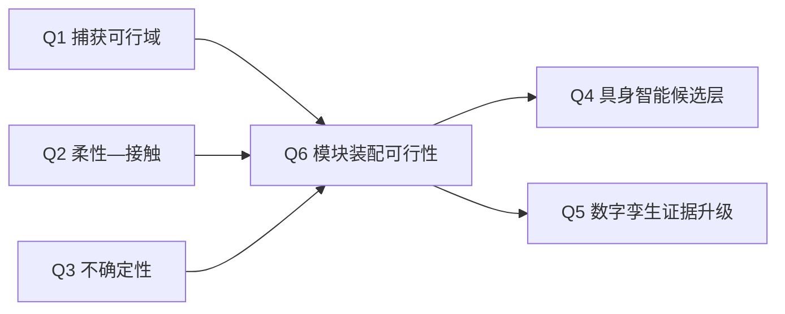

# Q6：预制接口模块在轨装配可行性

## 研究问题

在冻结的“12U 服务星 + B601 机械臂 + 1U/2U 可更换载荷模块 + 目标星预制接口”场景中，**什么条件使模块能够从 5D 接近安全过渡到 6D 锁紧，并被九判据评估器判定为装配成功？**

本问题不是在询问“大型桁架能否一次建成”，也不是把普通交会、停靠或抓捕自动称为装配。近期对象是一个可测、可分阶段、已在现有 Assembly Wave A 规划中定义的模块安装任务。

## 当前裁决

`PLANNED_SCOPE_FROZEN_EXECUTION_BLOCKED`

范围可以进入理论整理、先验检索和证据规划；科学实施仍被接口参数、原始哈希绑定和人工授权共同阻塞。当前机器真值是：

- `30_simulation/asm_00_interface_preflight/results/asm_00_gate_check.json`
- `raw_verdict = ASM00_AG0_BLOCKED_BY_INTERFACE`
- `scientific_execution_authorized = false`
- `next_stage_authorized = false`
- HAG-A、HAG-B、HAG-I 均为 `ABSENT`

九判据合同已冻结不等于 HAG-A 已批准，也不等于接口或装配已经验证。

## 术语与范围裁决

NASA 当前把 assembly 定义为在空间中把两个或更多部件聚合为单一功能结构。因此，装配不只限于桁架；把功能模块安装到专用接口、形成新的功能聚合体，也可以属于装配。另一方面，单纯接近、抓捕、停靠或两航天器暂时连接，不会仅因“连在一起”就自动成为本项目所称的结构/功能装配。

本项目采用两层范围：

| 层级 | 对象 | 当前角色 |
|---|---|---|
| Q6-L1 | 1U/2U 功能模块安装到目标星预制接口 | 近期唯一主问题；与现有 Wave A、B601 和九判据合同一致 |
| Q6-L2 | 桁架、反射面、望远镜或超大型模块化结构连续构建 | 未来扩展；只做先验知识登记，不进入当前实施或已验证贡献 |

在线定义依据：[NASA ISAM](https://www.nasa.gov/isam/)。NASA 的当前页面同时把 servicing、assembly 和 manufacturing 分开描述，适合本项目保持“在轨服务主线”和“模块装配支线”的概念边界。

## 子问题

### Q6.1 接口资格化

导向锥、销孔、倒角、公差、摩擦、刚度和锁紧几何在何种条件下形成可复核的捕获域、插入域和卡滞边界？

- 当前入口：`10_research/on_orbit_assembly/interface_ssot_draft.yaml`
- 当前机器阻塞：RF-1 缺导向半径、RF-2 缺摩擦出处/裕度、RF-3 clearance 语义未定义，且缺销距和倒角。
- 需要的证据：实测/可追溯接口参数、解析边界、单元测试和 AG0 机器裁决。

### Q6.2 接触—柔性—组合体更新

从预接触到插入、锁紧的持续接触如何改变冲量/能量账本、基座反作用、目标星柔性响应，以及锁紧后的质量、惯量和拓扑？

- 可复用：`sim_05`、`sim_11`、`CTRL-02` 的方法和受限侧证据。
- 不能复用为结论：`sim_10/sim_12` 的 FLEX 均为 `UNKNOWN_NOT_IN_CRITERIA`；现有 `sim_11` 柔性附件拓扑也不能直接证明目标星装配响应。
- 需要的证据：接触状态机、接触历史账本、目标侧柔性模型、锁紧后模型更新与 AG2/AG4 资格化。

### Q6.3 分阶段控制与 fail-closed 验证

如何把 5D 接近、柔顺插入、6D 锁紧、验证和安全回退写成不可绕过的分阶段合同，并将几何、力学、资源、柔性、出处和接触历史统一到九判据评估器？

- 可复用：CTRL-01 的负结果、CTRL-02 的受限姿态分账、SAFE-00 的 fail-closed 语义。
- 当前禁止：在 HAG-A 和 AG0 未闭合时启动 ASM-01/ASM-02；VLA 不能直接输出力矩或绕过确定性 Gate。
- 需要的证据：AG1–AG5 的独立机器裁决；任何 UNKNOWN 均不得判 success。

## 场景合同

### 纳入

1. `GRASP_MODULE → MOVE_TO_PREASSEMBLY → APPROACH_5D → ALIGN → COMPLIANT_INSERT → LOCK_6D → VERIFY_ASSEMBLY → RETREAT`。
2. 双方自由漂浮的数字模型；地面固定基座 B601 只作为组件验证，不称微重力等效。
3. 预制接口的几何、接触、摩擦、锁紧、资源与柔性判据。
4. 现有九判据单源评估器和 HAG/AG 授权语义。

### 排除

1. 大型桁架的多模块物流、多机器人协作和长期拓扑演化。
2. VLA 训练、学习控制器、自动技能执行或自主成功率。
3. 新科学仿真、阈值调整、Gate 改写、HIL 或真实在轨验证。
4. 将 OSAM-1/OSAM-2 写成仍在执行的飞行示范。NASA 已确认 [OSAM-1 取消](https://www.nasa.gov/mission/on-orbit-servicing-assembly-and-manufacturing-1/)，[OSAM-2 于 2023 年在飞行演示前结束](https://www.nasa.gov/mission/on-orbit-servicing-assembly-and-manufacturing-2-osam-2/)。

## 与 Q1–Q5 的关系

- Q1 提供“工况—绑定约束—资源判据”的方法，不提供装配成功结论。
- Q2 提供接触带宽和柔性认证边界，Q6 必须补目标侧拓扑与持续接触。
- Q3 管理接口参数、摩擦和公差的不确定性；在来源未转正前保留 PROVISIONAL。
- Q4 只在确定性装配技能与安全 Gate 成熟后生成候选动作。
- Q5 先绑定离线 DT2 回放；实时 DT3/DT4 仍阻塞。

## FINER 预审

| 维度 | 评分 | 预审理由 |
|---|---:|---|
| Feasible | 4/5 | 已有场景、接口草案、九判据合同和任务卡；但参数与授权仍阻塞 |
| Interesting | 4/5 | 直接连接比赛中的在轨服务延展与未来论文支线 |
| Novel | 3/5 | `UNASSESSED_PENDING_SYSTEMATIC_PRIOR_ART`；现阶段不得声称新颖性已成立 |
| Ethical | 5/5 | 当前仅文档、模型与未来地面验证规划；执行仍需安全授权 |
| Relevant | 5/5 | 与空间机械臂、模块维护/升级和 ISAM 路线直接相关 |

条件平均分为 4.2/5，只表示该问题值得进入受控研究，不表示实施已获批或创新性已证明。

## 现有证据与使用边界

| 证据 | 可复用内容 | 禁止外推 |
|---|---|---|
| `sim_05/sim_11` | 自由漂浮耦合与有限接触带宽的方法接口 | 目标侧装配柔性已验证 |
| `sim_10/sim_12` | 可行域和绑定约束的组织方法 | 现有刚体 Gate 已包含装配或柔性判据 |
| `CTRL-01` | 6D 严格任务零空间不足的负结果，支持分阶段设计动机 | 通用末端控制已解决 |
| `CTRL-02` | 基座姿态/轮—推力器分账的受限方法 | 执行器已实测转正 |
| `SAFE-00` | UNKNOWN 不放行的 fail-closed 思路 | 下一阶段已授权 |
| ASM-00 前检 | 九判据合同冻结、RF-1/2/3 的机器分类 | 接口已资格化或装配成功 |
| 本地装配文献 | 任务分类、模块接口、柔顺装配和验证方法 | 替代项目 Gate、实测或本项目结论 |

## 工作命题（不是结论）

| 编号 | 工作命题 | 所需证伪/验证证据 |
|---|---|---|
| WP6-A | 预制接口装配可分解为 5D 接近、柔顺插入和 6D 锁紧 | 相位可达性、切换守卫、失败/回退测试与 AG1/AG3 |
| WP6-B | 接口几何与摩擦可能先于高层规划成为绑定约束 | RF-1/2/3 参数转正、解析边界和 AG0 扫描 |
| WP6-C | 锁紧后的拓扑/惯量/柔性更新是捕获链升级为装配链的必要接口 | 组合体更新推导、守恒账本和 AG2/AG4 |
| WP6-D | 学习系统只能在确定性技能和安全门之上增加候选生成价值 | V2.5 确定性基线、AG5、AG6 消融和人工授权 |

## Devil's Advocate Checkpoint 1

裁决：`PASS_WITH_SCOPE_REVISION`

1. 原“以大型桁架为 Q6 核心”的提法过宽，与现有 Wave A 和 B601 证据链错位；已降为 Q6-L2。
2. “两个完整航天器连接一定不是装配”过于绝对；改为以是否形成新的功能聚合体和任务合同为判据。
3. OSAM-1/2 的项目状态已过时；改用当前 NASA ISAM、ARMADAS 和 TriTruss 地面试验作为技术背景。
4. Q6 同时包含接口、动力学、控制、VLA 和孪生会造成不可证伪；已拆为 Q6.1–Q6.3，并把 VLA/DT 保留为 Q4/Q5 接口。
5. 新颖性未做系统检索；所有“创新”只能写为候选贡献。

## 解锁条件

1. HAG-A 以规范记录存在，且原始文件哈希绑定闭合。
2. RF-1/2/3、销距和倒角问题闭合，接口 SSOT 从草案升级且具有可追溯来源。
3. 先完成 AG0，再分别授权 ASM-01/ASM-02；禁止跨 Gate 启动。
4. 目标侧柔性参数、B601 接触时间和执行器参数完成实测或权威转正。
5. 任何后续新仿真另立预注册合同，不改写现有结果和 Gate。

## 来源

### 本地真值

- `10_research/on_orbit_assembly/state_truth_and_scope.md`
- `10_research/on_orbit_assembly/master_plan.md`
- `10_research/on_orbit_assembly/gate_registry.yaml`
- `10_research/on_orbit_assembly/dual_mission_literature_synthesis.md`
- `30_simulation/asm_00_interface_preflight/results/asm_00_gate_check.json`
- `30_simulation/asm_00_interface_preflight/contracts/assembly_success_evaluator_v1.yaml`
- `50_literature/references/manifest.yaml`

### 在线与领域背景

- [NASA ISAM 当前入口](https://www.nasa.gov/isam/)
- [NASA 2025 ISAM State of Play](https://ntrs.nasa.gov/citations/20250008988)
- [NASA ARMADAS](https://ntrs.nasa.gov/citations/20230001316)
- [NASA TriTruss 自主装配地面试验](https://ntrs.nasa.gov/citations/20230013537)
- [Li et al. 2022 在轨装配综述](https://doi.org/10.34133/2022/9849170)
- [Wang et al. 2025 空间机器人在轨装配综述](https://doi.org/10.3390/aerospace12050375)

`last_verified_head: b75352c1c226c0f3e9a4bc9c469b766e06f41616`

