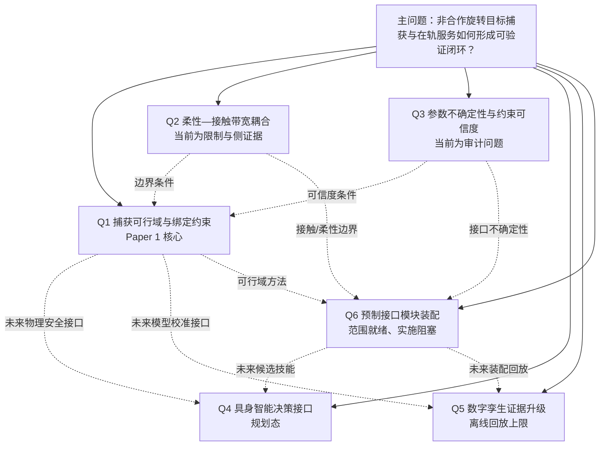

# 项目科学问题树

> 状态：`RESEARCH_OS_02_Q6_SCOPE_READY_EXECUTION_BLOCKED`
>
> 本目录管理“要回答什么”，不替代 Gate、结果、配置或文献 manifest。所有问题的证据边界以当前仓库中的机器裁决为准。

## 一句话主线

本项目当前能够研究的是：**给定终端接近与捕获初始状态，在冻结的动量、姿态、资源与安全约束下，哪些捕获/镇定策略可行、由哪个约束首先绑定，以及如何在不越过接口与授权 Gate 的前提下，把这条证据链扩展到预制接口模块装配。**

当前不能写成已完成的是：完整轨道交会、经认证的柔性整星安全域、VLA 闭环捕获、在轨装配、实时数字孪生、HIL 或空间硬件验证。

## 问题树

| 编号 | 当前状态 | 当前能回答什么 | 不能回答什么 | 论文位置 |
|---|---|---|---|---|
| [Q1](Q1_capture_feasibility.md) | `ACTIVE_VERIFIED_CORE_LIMITED_SCOPE` | 冻结假设下的可行域、策略差异和绑定 Gate | 普适任务最优性、柔性安全域、飞行验证 | Paper 1 主问题 |
| [Q2](Q2_flexible_coupling.md) | `LIMITED_AND_NEGATIVE_CERTIFICATION` | 有限接触带宽的侧证据、柔性认证缺口 | 柔性使安全域如何定量移动 | Paper 1 限制/讨论 |
| [Q3](Q3_uncertainty_constraint.md) | `ACTIVE_METHOD_QUESTION_NOT_QUANTIFIED` | 参数来源、暂定项和使用者可追溯 | 概率可靠度、鲁棒置信区间 | Paper 1 假设/限制 |
| [Q4](Q4_embodied_intelligence.md) | `PLANNED_NOT_IMPLEMENTED` | 定义未来决策器与物理安全 Gate 的接口 | VLA 闭环性能或自主成功率 | 后续论文，不进 Paper 1 贡献 |
| [Q5](Q5_digital_twin.md) | `LIMITED_DT2_AND_BLOCKED_UPGRADE` | 离线回放和证据绑定计划 | 实时同步、HIL、在轨数字孪生 | 比赛路线图/后续验证 |
| [Q6](Q6_on_orbit_assembly.md) | `PLANNED_SCOPE_FROZEN_EXECUTION_BLOCKED` | 1U/2U 模块—预制接口装配问题、理论接口和证据路线 | 接口已资格化、装配成功、大型桁架/VLA/HIL 已实现 | 后续装配论文/比赛延展，不进 Paper 1 已验证贡献 |

## 使用规则

1. 先选择问题，再读取对应理论节点、模块卡、参数记录和文献卡。
2. `Gate PASS` 只说明该 Gate 合同内通过，不自动等价于科学结论普适、硬件可用或下一阶段获批。
3. `PROVISIONAL`、`UNKNOWN_NOT_IN_CRITERIA`、`REPEAT` 和“没有总体 verdict”必须原样保留。
4. 新研究只有在明确增加实验/仿真授权后，才能从本目录的“解锁条件”进入实施。

## 共同真值入口

- 当前状态：`10_research/research_state_v4.md`
- 架构冻结：`10_research/00_project_architecture/system_architecture.md`
- Paper 1 冻结结构：`10_research/00_project_architecture/paper_structure_plan.md`
- 模块卡：`30_simulation/module_cards/`
- 参数登记：`20_engineering/parameter_registry/`
- 文献 manifest：`50_literature/references/manifest.yaml`
- 阅读卡索引：`50_literature/references/notes/INDEX.md`

`last_verified_head: b75352c1c226c0f3e9a4bc9c469b766e06f41616`
