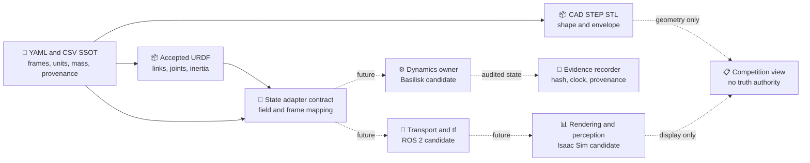

# CAD、URDF 与动力学接口设计

*COMP-PROT-02 output A2/A3 — model exchange, state semantics and clock ownership; no asset generation*

---

> `STATUS: ARCHITECTURE_ONLY`<br>
> `CAD_GENERATION: prohibited`<br>
> `URDF_GENERATION: prohibited`<br>
> `SIMULATION: prohibited`<br>
> `SOLIDWORKS_ROLE: consumer_not_truth_source`

## 📋 接口裁决

本项目不再通过“一个大装配文件”承载全部真值。数字本体采用四类互补资产：

1. YAML/CSV：几何、frame、质量/惯量、置信度和来源的唯一工程入口；
2. CAD/STEP/STL：形状、装配、包络和展示消费者；
3. URDF：机器人拓扑、关节、惯性与网格引用消费者；
4. 运行时状态：带时间、坐标系、单位、参数哈希和证据来源的命名字段。

SolidWorks、URDF importer、ROS 2、Basilisk 和 Isaac Sim 都是消费者。任何消费者都不能以导入后自动生成的数值反写 SSOT。

## 📦 既有资产清单

| 对象 | 既有资产 | 本阶段动作 | 角色 |
|---|---|---|---|
| 12U 服务星 | JSON / STEP / STL / URDF | 只读 | M1 竞赛数字样机与几何参照 |
| B601 机械臂 | accepted URDF + link/夹爪 STL | 只读 | M0/M1 共享拓扑与惯性入口 |
| 安装适配器 | JSON / STEP / STL / URDF / legacy SLDPRT | 只读 | `S ↔ M` 机械接口参照 |
| 小卫星目标 | JSON / STEP / STL / URDF | 只读 | 目标库 T0 |
| 圆柱碎片 | JSON / STEP / STL / URDF | 只读 | 目标库 T1 |
| 6U 服务星 | JSON / STEP / STL / URDF | 只读、非主线 | 快速布局历史参照，不替换 12U |

全部路径见 [spacecraft layout](../../../20_engineering/cad/spacecraft_layout/)。本文件不创建新的 CAD/URDF 输出清单，也不要求在 COMP-PROT-02 打开 SolidWorks。

## 🔐 真值优先级

发生冲突时按以下顺序停止并裁决，而不是自动“取看起来合理的一份”：

1. 当前任务的人工授权与冻结边界；
2. 原始科学 Gate/config/hash；
3. [geometry SSOT](../../../20_engineering/config/geometry/) 与质量惯量预算；
4. accepted B601 URDF 的拓扑/关节/惯性；
5. CAD/STEP/STL/对象 JSON 的几何表达；
6. ROS/Isaac 导入后的派生资产；
7. 截图、动画、自然语言描述。

派生资产不得升级为比其来源更高的证据等级。

## ⚙️ 坐标系合同

### 机械坐标系

现行 [frame tree](../../../20_engineering/config/geometry/frame_tree_v1.yaml) 是 CAD、URDF、动力学和 ANCF 的共同来源：

| Frame | 含义 | 父系 | 关键规则 |
|---|---|---|---|
| `S` | 12U 服务星本体 | none | 原点为名义几何中心 |
| `M` | 机械臂安装面 | `S` | `T_SM=[185.25,0,0] mm`；`+Z_M=+X_S` |
| `E` | 工具中心 | arm chain | `+Z_E` 为接近方向 |
| `F_L/F_R` | 左/右柔性板根 | `S` | 区分展开方向与板法向 |
| `T` | 小卫星目标本体 | runtime scene | 目标状态与质量属性参考系 |
| `D` | 圆柱碎片本体 | runtime scene | `+Z_D` 为名义对称/自旋轴 |
| `C_sat/C_deb` | 抓取点 | `T/D` | 抓取接口、力矩臂与接触 reference point |

未来运行时可以增加惯性系 `N` 和相对观测 frame，但必须作为接口层扩展，不得修改既有机械 frame 的方向或含义。

### 变换命名

所有位姿必须采用 `T_parent_child` 或明确的 `pose_of_child_in_parent`，并记录：

- translation unit；
- rotation representation 和元素顺序；
- passive/active convention；
- 时间戳与 clock id；
- 来源 frame-tree 版本/哈希。

禁止只写 `pose`、`q` 或 `H` 而省略 reference frame。

## 📊 动力学状态接口

### 统一状态不是匿名向量

附件要求的 `x, q, v, omega, H` 在运行时必须拆为命名字段。`q` 既可能指四元数又可能指关节坐标，因此接口中禁止单独使用裸 `q`。

| 逻辑量 | 建议字段 | 形状/单位 | Frame/reference point | 备注 |
|---|---|---|---|---|
| 服务星位置 | `r_BN_N` | 3 / m | point B wrt N, expressed N | 平动状态 |
| 服务星速度 | `v_BN_N` | 3 / m·s⁻¹ | point B wrt N, expressed N | 与位置同一时间戳 |
| 服务星姿态 | `quat_BN_wxyz` | 4 / unitless | B relative N | 固定 wxyz；归一化误差需记录 |
| 服务星角速度 | `omega_BN_B` | 3 / rad·s⁻¹ | B wrt N, expressed B | 不得与 deg/s 混用 |
| 机械臂位置 | `joint_position` | 8 / rad,m | B601 joint-name order | 6R + 2P；指端可锁定但不可消失 |
| 机械臂速度 | `joint_velocity` | 8 / rad·s⁻¹,m·s⁻¹ | 同上 | 必须带 joint name 数组 |
| 目标相对位姿 | `T_B_target` | SE(3) | target in B | 目标可为 T 或 D |
| 目标相对 twist | `twist_B_target` | 6 / m·s⁻¹,rad·s⁻¹ | 明确 expressed-in frame | 与状态协方差绑定 |
| 系统质量属性 | `mass_properties` | kg,m,kg·m² | about/expressed-in 必填 | 绑定 parameter hash |
| 角动量 | `H_rot_C_N` | 3 / kg·m²·s⁻¹ | about system CoM C, expressed N | 与轨道角动量分开 |
| 轨道角动量 | `H_orb_N_N` | 3 / kg·m²·s⁻¹ | about inertial origin N | 可选但不得与旋转角动量混名 |
| 柔性状态 | `modal_or_ancf_state` | model-specific | root `F_L/F_R` | M2 扩展；当前允许 absent + reason |
| 接触状态 | `contact_hypothesis` | categorical + bounds | `C_sat/C_deb` | 不是接触真值，需来源和时效 |

Basilisk 的 spacecraft 模块已经定义惯性位置、速度、姿态、角速度、质量、质心、惯量以及能量/角动量类状态输出，因此未来适配应采用显式映射表，不应通过数组位置猜测。[^basilisk_spacecraft]

### 状态信封头

每个未来运行时消息至少包含：

```text
schema_version
sample_id
timestamp_ns
clock_id
producer_id
source_mode
scenario_hash
parameter_set_hash
frame_tree_hash
valid_until_ns
quality_state
unknown_fields[]
```

`quality_state` 只能表达量测/消息质量，不能表达 SAFE 决策或执行许可。

## 🔗 工具边界与数据流



### 工具职责矩阵

| 工具/层 | 读 | 写 | 不得做 |
|---|---|---|---|
| SolidWorks/CAD | frame、尺寸、keepout、对象标识 | 未来批准后的派生装配/图纸 | 反写质量惯量真值、改变 frame 定义 |
| URDF | 机械臂拓扑、关节、惯性、网格 URI | 未来批准后的导入/导出报告 | 表达轨道动力学或安全授权 |
| Basilisk | 质量属性、状态、效应器、场景输入 | 未来动力学状态/守恒量/日志 | 生成感知真值或比赛能力声明 |
| ROS 2 | 命名消息、`tf`、时间、记录 | 未来桥接与日志 | 成为物理参数 SSOT |
| Isaac Sim | URDF/USD、相机和视觉场景 | 未来渲染/感知/合成数据 | 覆盖动力学或科学 Gate |

Isaac Sim 的 URDF importer 支持 mobile root，但会将不符合 USD 规则的名称替换、可由视觉网格生成碰撞体，并产生 USD 派生资产。因此 COMP-PROT-03 必须保存名称映射、base mode 和 collision policy，而不能把导入成功视为模型一致性通过。[^isaac_urdf]

## ⚡ 时间、采样与同步

未来全栈只能有一个 `clock_owner`。建议在动力学存在时由动力学层产生单调仿真时间；ROS 2 转发 `/clock`/时间戳；Isaac Sim 消费时间并报告实际帧时间，不得反向推进科学状态。

| 规则 | 要求 |
|---|---|
| 时间基准 | `timestamp_ns` 为单调仿真时间，墙钟仅作日志元数据 |
| 数据一致性 | 一次 Physics 评价使用同一 `sample_id` 与参数哈希的快照 |
| 多速率 | 每条消息记录 producer rate；禁止以最后值静默补齐关键状态 |
| 延迟 | 记录产生、传输、消费时间；超过 validity 进入 `UNKNOWN/HOLD` |
| 重放 | 相同输入、版本、随机种子与 clock schedule 应产生可比较证据包 |
| 单位 | 动力学 SI；CAD mm 只在边界转换一次并留转换记录 |

NVIDIA 的 ROS 2 教程明确把 Clock、Transform、QoS、相机和 simulation control 分成独立主题，支持这种“传输与时间明确、物理所有权分离”的接口设计。[^isaac_ros]

## ✅ COMP-PROT-03 前置一致性检查

未来实施前至少需要文档化、自动化或人工签核以下检查；本阶段不执行：

1. `frame_tree_hash` 一致，`T_SM` 方向和单位 round-trip 无误；
2. B601 link/joint 名称、类型、轴、限制、质量和惯性导入前后逐项一致；
3. 6R + 2P joint order 固定，指端锁定状态显式；
4. CAD nominal/deployed envelope 与碰撞包络分开；
5. 总质量/CoM/惯量按唯一 component ownership 闭合；
6. Isaac 命名替换、base type 与 collision approximation 形成差异清单；
7. 所有消息带 unit、frame、clock、validity、parameter hash；
8. 展示层关闭后，科学证据链仍可单独重放；
9. 任一 `UNKNOWN`、OOD、过期或哈希不一致均 fail closed。

## 🚫 本阶段停止点

到此只完成接口设计。禁止生成 SLDASM/SLDPRT、修改 STEP/STL、生成 URDF/USD、创建 ROS package/node/topic 实现、安装 Isaac Sim、接入 Basilisk、编写桥接代码或运行场景。

## 🔗 References

[^basilisk_spacecraft]: Basilisk Documentation, “C++ Module: spacecraft,” state, mass-property, effector, energy and momentum interfaces, https://avslab.github.io/basilisk/Documentation/simulation/dynamics/spacecraft/spacecraft.html
[^isaac_urdf]: NVIDIA Isaac Sim Documentation, “URDF Importer Extension,” import conventions, mobile base and collision options, https://docs.isaacsim.omniverse.nvidia.com/latest/importer_exporter/ext_isaacsim_asset_importer_urdf.html
[^isaac_ros]: NVIDIA Isaac Sim Documentation, “ROS 2 Tutorials,” Clock, transforms, QoS, sensors and simulation-control topics, https://docs.isaacsim.omniverse.nvidia.com/latest/ros2_tutorials/index.html
