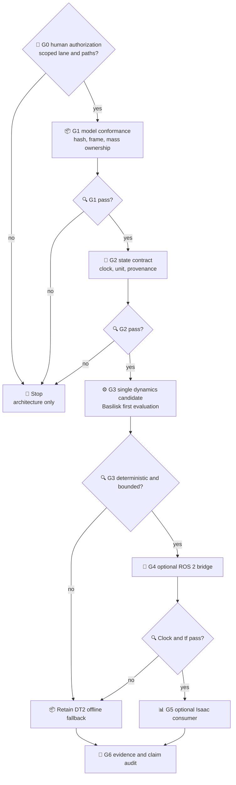

# COMP-PROT-03 实施准入与验收要求

*Downstream contract — A0/A1 documentation authorized; engineering implementation remains unauthorized*

---

> `STATUS: PARTIAL_AUTHORIZATION_A0_A1_DOCUMENTS_ONLY`<br>
> `CURRENT_PHASE: COMP-PROT-03-A0/A1 / DIGITAL_MODEL_ARCHITECTURE_ONLY`<br>
> `IMPLEMENTATION_CODE: none`<br>
> `NEXT_ACTION: wait_for_separate_A2_or_model_build_human_approval`

## 📋 准入裁决

COMP-PROT-03 不是本阶段的自动后继任务。只有单独人工批准且下列 G0 条件全部满足后，才允许把数字本体转化为受控工程原型。批准必须明确选择实施 lane、允许修改的目录、是否允许安装外部软件、是否允许运行非科学 dry-run，以及是否允许生成派生 CAD/URDF/USD。

未获批准前，本文只是实施合同模板，不能触发代码、仿真、控制、训练、下载或环境搭建。

## 📌 A0/A1 人工授权回填

2026-07-23 的最新人工指令批准 A0/A1 范围内的文档、知识库、接口、architecture manifest 与多智能体模型审查协议。结果见 [`../comp_prot_03_a0_a1/README.md`](../comp_prot_03_a0_a1/README.md)。

该批准不满足或绕过下文任何工程 G0 条件；A2 候选模型评审、CAD/URDF 派生、模型下载、Basilisk/ROS/Isaac、仿真、控制、SAFE、RL 与 VLA 仍为 `NOT_AUTHORIZED`。

## 🎯 实施目标分解

### Lane A：模型一致性内核（优先）

目标是把现有 SSOT、B601 URDF、对象身份、坐标系、单位与参数哈希变成可验证的只读模型包。它不运行科学动力学，也不发控制命令。

未来交付要求：

- 模型 manifest 与逐文件 hash；
- component mass ownership 闭合；
- frame transform round-trip；
- B601 joint/link/inertia conformance；
- target/grasp/keepout 对象索引；
- 参数置信度和 `UNKNOWN` 传播；
- 无任何 Gate 或现有结果变更。

### Lane B：比赛最小原型

目标是用现有 DT2 离线/受控回放展示：`Perception/HARNESS → Candidate → Task Skill → Physics Response → SAFE pending → Memory`。它必须保留 `command_emitted=false` 或等价边界，不把动画写成控制执行。

未来交付要求：

- 四阶段场景：approach、capture proposal、stabilize proposal、detumble proposal；
- 每一帧显示来源、时间、模型状态与四值 Physics 评价；
- OOD/过期/未知/哈希错误的 fail-closed 示例；
- 失败经验影响下一次候选建议的可解释回放；
- 明示 `PROTOTYPE_NOT_AUTONOMOUS`、`NO_VLA_IMPLEMENTATION`、`NO_CONTROL_AUTHORITY`。

### Lane C：Paper 2 Physics World Model（研究线）

目标是未来建立确定性的“状态 + 技能意图 → 物理后果 + 适用域 + provenance”接口。它必须继承 Paper 1 原始 Gate/配置，不覆盖或插值现有捕获可行域。

未来交付要求：

- 动力学引擎选型与版本锁；
- 状态/质量/惯量/角动量映射；
- 精确证据绑定和适用域检查；
- `FEASIBLE | INFEASIBLE | OUT_OF_COVERAGE | UNKNOWN` 四值输出；
- 守恒量、单位、frame、reference point 与输入 hash；
- 与比赛展示完全分离的复算证据包。

Lane C 属于科学实施，不能因 Lane B 展示按期而自动授权。

## 🔐 G0 人工批准前置条件

| ID | 条件 | 必须证据 | 失败动作 |
|---|---|---|---|
| G0-01 | 明确批准的 lane 和写入路径 | 人工批准文本 | 不启动 |
| G0-02 | 现有 Gate JSON/冻结路径基线 hash | 只读基线 manifest | 不启动 |
| G0-03 | 12U/B601/目标唯一基线确认 | [平台规格](./space_robot_platform_spec.md) 签核 | 拒绝平行模型 |
| G0-04 | component mass ownership 已裁决 | 唯一质量账本设计 | 不运行动力学 |
| G0-05 | frame、单位、四元数、joint order 固定 | 接口映射表 | 不桥接工具 |
| G0-06 | 外部软件/资产许可准入清单 | license/NOTICE/版本/来源 | 不安装、不下载 |
| G0-07 | 单一 clock owner 与重放策略 | 时序合同 | 不联调多栈 |
| G0-08 | 允许声明/禁止声明签核 | 比赛与论文口径表 | 不产出公开材料 |
| G0-09 | 失败/负结果保留规则 | evidence layout | 不运行试验 |

## ⚙️ 分阶段实施顺序



### G1：模型一致性

1. 不重新设计 12U 或 B601；
2. 不生成第二套 frame tree；
3. 逐 link/joint 检查 URDF 导入差异；
4. 区分 nominal、deployed、collision 与 keepout envelope；
5. 质量、CoM、惯量按唯一 component id 闭合；
6. 所有 provisional/unknown 参数保持水印。

### G2：状态与证据接口

1. 采用 [CAD/URDF/动力学接口设计](./cad_urdf_dynamics_interface_design.md) 的命名字段；
2. 每条状态带 clock、frame、unit、validity、source 与 hash；
3. `H` 明确 reference point 和 expressed-in frame；
4. Physics Response 只能输出四值科学评价；
5. SAFE 五值与外部执行授权保持独立；
6. 插值、默认填充、自然语言生成参数一律禁止。

### G3：单一动力学候选

首选评估 Basilisk，但只有以下检查通过才可进入集成：

- 当前 12U/B601/目标状态能够一一映射；
- 质量属性与角动量语义一致；
- 固定输入能够确定性重放；
- 关闭 ROS/Isaac 后仍可产出证据；
- 与现有 Gate 比较时不覆盖原结果；
- 失败能退回现有 DT2 离线路线。

如果 Basilisk 不满足这些条件，应停止并形成负结果/替代引擎选型，不得同时引入 Trick 或第二个动力学真值源掩盖问题。

### G4/G5：可选 ROS 2 与 Isaac Sim

ROS 2 仅在单引擎通过后引入，验证消息、`tf`、clock、QoS、记录与重放。Isaac Sim 仅在 ROS/文件适配稳定后作为消费者引入，验证名称映射、mobile root、collision policy、unit scale 和相机外参。

两层都必须可以删除而不影响科学证据；若比赛周期不足，直接保持现有离线展示，不把三栈集成变成关键路径。

## 📊 验收矩阵

| Gate | 验收对象 | PASS 最低条件 | 明确不代表 |
|---|---|---|---|
| G1 Model | 对象/参数/frame/URDF | hash 可追、零静默重命名、质量账本闭合 | 科学动力学正确 |
| G2 Contract | state/clock/provenance | schema/映射完整、unknown fail closed | 控制器存在 |
| G3 Dynamics | 单引擎候选 | 确定性、守恒量检查、适用域和差异报告 | Paper 2 已完成 |
| G4 Transport | ROS 2 bridge | clock/tf/QoS/replay 一致 | ROS 已飞行认证 |
| G5 Visual | Isaac consumer | unit/name/collision/camera 映射通过 | Isaac 是物理真值 |
| G6 Prototype | 比赛回放 | 四阶段可追溯、失败路径、无命令授权 | 自主捕获/VLA/安全控制完成 |
| G7 Research | Paper 2 evidence | Claim–Evidence、复算包、负结果与限制 | 自动解锁装配/Q6 |

## ⚠️ 强制停止条件

出现任一条件立即停止当前 lane，保留证据并请求人工裁决：

- 需要修改现有 Gate、冻结配置、`30_simulation/` 结果或论文状态；
- 需要重新运行被明确冻结或禁止 replay 的科学流程；
- 12U/B601/目标身份或 frame 与 SSOT 不一致；
- 质量部件重复计数、惯量 reference point 不明或单位不明；
- 外部资产许可证为 B/C/D 却要进入竞赛交付；
- ROS/Isaac 成为第二时钟或第二物理真值；
- 任何 `UNKNOWN`、OOD、过期、验签失败被自动转成允许；
- 需要宣称“已实现空间具身智能/自主捕获/VLA/安全控制”；
- 实施范围从展示原型扩张到 RL、MPC、SAFE v2、真实控制器或装配。

## 📚 必须保留的证据

未来每次实施提交至少保存：

- 人工批准文本与作用域；
- 输入文件清单、版本、hash 与许可；
- 环境/依赖版本与可复现启动说明；
- frame/单位/parameter mapping；
- 运行命令、随机种子、clock schedule 与日志；
- 预期和实际输出；
- PASS/FAIL/REPEAT/NEGATIVE_RESULT 原样裁决；
- 未触碰冻结路径证明；
- 允许声明/禁止声明清单。

## ✍️ 下一次人工批准应明确的内容

```text
Gate: COMP-PROT-03-IMPLEMENTATION
Authorized lanes: [A | B | C]
Writable paths: [...]
External installs allowed: [none | named packages only]
External downloads allowed: [none | named assets only]
Dry-run allowed: [true | false]
Scientific simulation allowed: [true | false]
CAD/URDF/USD generation allowed: [true | false]
Controller/RL/SAFE implementation allowed: false unless separately named
Frozen paths and hash manifest: [...]
Required stop conditions: [...]
```

在收到该批准前，唯一合法状态仍是 `ARCHITECTURE_ONLY`。
