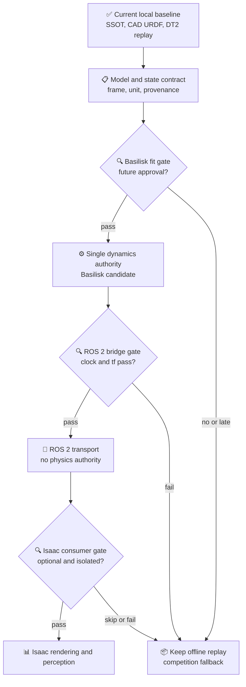

# 空间机器人开源资源调研与采用裁决

*COMP-PROT-02 output A1/A2 — official and open-source resource survey, no downloads*

---

> `STATUS: ARCHITECTURE_ONLY` 
> `SURVEY_DATE: 2026-07-23` 
> `NETWORK_ACTION: metadata_and_documentation_review_only` 
> `MODEL_DOWNLOADS: none`

## 📋 调研方法

本轮只核验官方文档、官方 GitHub 入口与项目已有资源治理文件，用于回答“未来可采用什么接口/范式”。没有把任何外部 CAD、URDF、数据集、软件仓库或模型下载到工程目录。

项目已有两套资源真值：

- [外部在轨资产目录](../../../20_engineering/stage1_spacecraft_layout/02_open_bus_reference/external_onorbit_asset_catalog.md)：66 条、9 类角色；
- [Stage 1 source manifest](../../../20_engineering/stage1_spacecraft_layout/00_source_manifest/source_manifest.md)：8 个已克隆参考仓及标准文档的路径/HEAD。

因此本轮不再建立第二份“全量资源库”，只形成与 COMP-PROT-02 架构有关的采用裁决。

## 🌐 官方资源核验

| 资源 | 官方能力/用途 | 本项目裁决 | 当前动作 |
|---|---|---|---|
| CubeSat Design Specification Rev.14.1 | 1U–12U 外形/接口规范入口 | `STANDARD_REFERENCE`；继续以本地副本和人工图纸复核为准 | 不下载新副本[^cubesat] |
| NASA 3D Resources | NASA 3D 模型、纹理和可视资源；使用前需阅读站点指南 | `VISUAL_REFERENCE_ONLY`；逐模型核许可，不继承质量/惯量 | 不下载[^nasa3d] |
| Basilisk | 面向航天器的开源任务仿真，支持 6-DOF、效应器、消息追溯、Monte Carlo/HIL 方向 | `PREFERRED_DYNAMICS_CANDIDATE`；需 COMP-PROT-03 独立验证 | 不安装、不运行[^basilisk] |
| NASA Astrobee | ISS 自由飞行机器人软件、仿真与 ROS 消息中间件范式 | `ARCHITECTURE_REFERENCE`；不复制为服务星模型 | 不克隆新仓[^astrobee] |
| Space ROS | 面向空间机器人、强调 ROS 采用与航空航天标准对齐的开源框架 | `MIDDLEWARE_AND_ASSURANCE_REFERENCE`；不等于已具备飞行认证 | 不安装[^spaceros] |
| NVIDIA Isaac Sim | URDF/USD、ROS 2、相机/传感器、渲染和合成数据工具 | `OPTIONAL_PERCEPTION_VISUAL_LAYER`；不拥有航天器动力学真值 | 不安装、不导入[^isaac] |
| NASA Trick | 航天器设计、飞行软件、载荷、虚拟/HIL 仿真的通用环境 | `ALTERNATIVE_NOT_PARALLEL_BASELINE`；若未来采用须与 Basilisk 二选一主时钟/主动力学 | 不安装[^trick] |
| NASA cFS | 通用飞行软件框架；开源 bundle 是起点而不是任务级验证成品 | `FUTURE_FLIGHT_SOFTWARE_REFERENCE`；超出比赛 Prototype | 不集成[^cfs] |

NASA 3D 资源适合改善演示中的视觉语义，但官方页面本身只保证资源可获取并要求遵守使用指南，不提供本项目所需的质量、惯量、接口或目标失效状态真值。[^nasa3d] 因而“官方外观”也不能替代现有参数与目标模型证据。

## 🔍 项目已有开源资源裁决

### P0/P1 直接相关资源

| 资源 | 既有许可闸门 | 可继承内容 | 不可继承内容 | COMP-PROT-02 裁决 |
|---|---|---|---|---|
| Basilisk | A / ISC | 状态、效应器、消息、守恒量验证范式 | 现成的本项目 12U/B601 模型 | `EVALUATE_CP03` |
| NASA Astrobee | A / Apache-2.0 | 自由飞行软件分层、ROS 消息范式 | ISS 机器人质量/结构作为服务星真值 | `REFERENCE_ONLY` |
| SPART | A- / LGPL-3.0 | URDF→GJM/RNS 工具链候选 | 未经复核的结果或“零反作用”声明 | `PAPER2_TOOL_CANDIDATE` |
| SpaceDyn | B / 学术限制 | GJM 理论交叉核验 | 竞赛交付代码/资产 | `RESEARCH_ONLY` |
| Space Robotics Bench | A / mixed permissive | Isaac 任务组织、debris_capture benchmark 参考 | RL 训练、现成策略、科学结果 | `REFERENCE_ONLY` |
| SpaceOctopus | A / Apache-2.0 | 自由漂浮/多臂任务设计参考 | 替换 B601 与现有 Gate | `REFERENCE_ONLY` |
| Space ROS demos | A / Apache-2.0 | ROS 2 接口、demo 编排参考 | 航天器动力学真值 | `INTERFACE_REFERENCE` |
| bsk-ros2-bridge | A / BSD-3 | Basilisk↔ROS 2 桥接思路 | 无验证地直接并入主线 | `BRIDGE_REFERENCE` |
| NASA 3D Resources | A- / 逐模型 | 视觉/形态参考 | 质量、惯量、制造 CAD、原创性替代 | `VISUAL_ONLY` |
| SPEED / SPEED+ | A / B | 位姿估计与域差研究参照 | 未获许可的比赛数据、当前完成感知的声明 | `FUTURE_PERCEPTION` |

许可等级来自现有 [license gate](../../../20_engineering/stage1_spacecraft_layout/02_open_bus_reference/license_gate_v0.md)，本文件不重新裁决许可证。

### 已克隆机械布局参考

OreSat、BIRDSX-CAD、PyCubed、SpaceRobotEnv、SPOT 等已有本地浅克隆与固定 HEAD。它们继续只承担布局、模块组织、任务/试验范式参考；现有 [external reference usage policy](../../../20_engineering/stage1_spacecraft_layout/02_open_bus_reference/external_reference_usage_policy.md) 明确禁止把外部 CAD 改名为本项目服务星、用 SpaceRobotEnv 替代 accepted B601 URDF，或声称已经完成 SPOT 级实验。

## ⚙️ Basilisk、ROS 2、Isaac Sim 的采用顺序

### 架构选择

建议采用“**先单栈真值、再桥接、最后可视化**”而不是三栈并行开发：

1. 先用现有文件状态/离线 replay 验证数字本体和 frame/parameter hash；
2. 若 COMP-PROT-03 批准动力学，首先独立评估 Basilisk 与现有状态接口；
3. 只有单栈状态、质量和守恒量映射通过后，才评估 ROS 2 bridge；
4. 只有 clock/tf/QoS 与离线重放通过后，才把 Isaac Sim 作为可选消费者；
5. 任何时候 Isaac Sim 都不是 Physics Tool 或 SAFE 的替代品。

### 为什么不直接采用 NASA Trick

Trick 同样覆盖软件/硬件在环与航天器开发场景。[^trick] 但同时引入 Trick 与 Basilisk 会制造第二个动力学调度、数据记录和时钟权威。本阶段把它保留为未来替代路线，不作为并行依赖；若 Basilisk 适配失败，必须另起选型裁决，而不是双引擎无主从共存。

### 为什么不把 cFS/F´ 纳入比赛原型

飞行软件框架解决的是任务软件组件、调度、遥测、平台抽象和任务级验证问题，不直接解决本阶段的模型一致性与 Physics World Model。NASA cFS 官方也明确开源 bundle 是起点，任务方仍承担完整 V&V。[^cfs] 因此它属于长期飞行化路线，不应成为 9 月比赛展示的关键路径。

## 🔐 许可与资产进入规则

| 等级 | 本项目处理 | COMP-PROT-03 默认动作 |
|---|---|---|
| A / A- | 可评估；保留 attribution、NOTICE、逐资产条款和来源 hash | 未列入准入清单前仍不自动复制 |
| B | 研究阅读/复现 | 不进入竞赛资产包 |
| C | 隔离 | 不静态并入主交付，不进入 CAD/URDF 主线 |
| D | 只作线索 | 不复制、不下载、不改用，等待明确授权 |

即使许可为 A/A-，外部资产也只能在定义用途内进入；许可宽松不等于参数可信、科学适用或与现有架构兼容。

## 📌 资源选择结论

- **现在保留**：本地 SSOT、accepted B601 URDF、原创 12U/目标块体模型、既有 DT2 replay；
- **下一阶段优先评估**：Basilisk 状态/质量/守恒量适配；
- **条件评估**：ROS 2 transport/tf/clock；
- **最后且可选**：Isaac Sim 视觉/感知消费者；
- **只作参照**：Astrobee、Space ROS、Trick、cFS、Space Robotics Bench、SpaceOctopus；
- **本轮不再搜索/下载**：外部 CAD、URDF、目标模型和训练数据。

## 🚫 禁止外推

- GitHub 存在仓库不等于本项目安装、连接、验证或可交付；
- 官方 NASA 3D 模型不等于工程 CAD 或动力学真值；
- ROS/Space ROS 不等于飞行认证；
- Isaac Sim 导入成功不等于自由漂浮动力学正确；
- Basilisk 模块有验证机制不等于本项目适配已验证；
- 开源许可可用不等于科学适用域已成立。

## 🔗 References

[^cubesat]: CubeSat Program, “CubeSat Information,” Rev.14.1 1U–12U specification entry, https://www.cubesat.org/cubesatinfo
[^nasa3d]: NASA, “3D Resources,” resource availability and usage-guideline notice, https://www.nasa.gov/3d-resources/
[^basilisk]: AVS Laboratory, Basilisk Documentation, architecture, license, platforms, simulation and HIL scope, https://avslab.github.io/basilisk/
[^astrobee]: NASA, “Astrobee Robot Software,” flight software, simulator, tools and ROS middleware description, https://github.com/nasa/astrobee
[^spaceros]: Space ROS, project goals and aerospace-aligned open-source framework description, https://space.ros.org/
[^isaac]: NVIDIA Isaac Sim Documentation, URDF importer and ROS 2 integration entry, https://docs.isaacsim.omniverse.nvidia.com/latest/importer_exporter/ext_isaacsim_asset_importer_urdf.html
[^trick]: NASA, “Trick Simulation Environment,” simulation development and virtual/HIL scope, https://github.com/nasa/trick
[^cfs]: NASA, “Core Flight System,” open-source bundle scope and mission V&V responsibility, https://github.com/nasa/cFS
