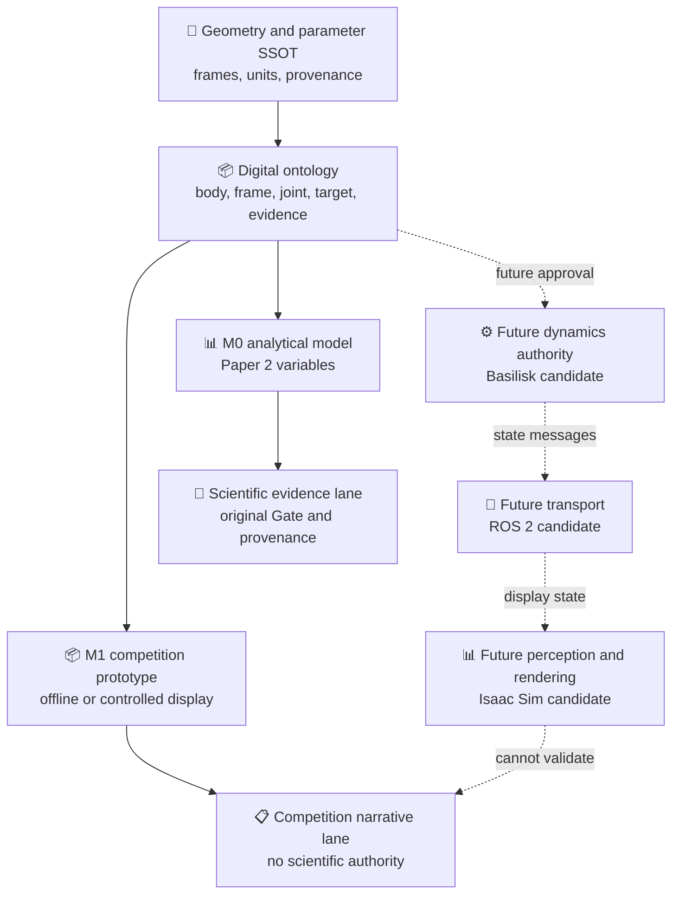

# Space Embodied Robot Physical Platform 架构规格

*COMP-PROT-02 output A1 — platform definition and digital ontology, architecture only*

---

> `STATUS: ARCHITECTURE_ONLY` 
> `BASELINE: servicer_12U_v0 + arm_b601_v1 + target_library_v0` 
> `EXECUTION_AUTHORITY: false` 
> `NEW_SCIENTIFIC_CLAIMS: none`

## 📋 结论先行

本项目的最佳实验模型不是重新设计一颗“更轻的 12U”或再造一套 7 自由度机械臂，而是把现有资产收敛为一个**同源、分层、可降级、可追溯**的平台：

- 服务星：现有 `servicer_12U_v0/v1`，24.0 kg 为低置信度参考锚点；
- 机械臂：现有 B601 6R，末端两指夹爪另含两个直线关节；
- 目标库：现有 22 kg 小卫星目标与 150 kg 圆柱碎片目标，均为低置信度块体模型；
- 坐标系：现有 `S → M → arm → E` 及 `T/D → C_sat/C_deb`；
- 展示与论文：共享对象身份、参数来源和状态接口，但保持“展示证据”和“科学证据”两条独立判定通道。

这里的“最佳”只表示**当前比赛与 Paper 2 路线下的最小证据漂移方案**。它不表示已完成系统级质量优化、机械臂构型优化或捕获性能优化。

## 🎯 平台任务定义

### 任务对象

平台用于表达“自由漂浮服务星对非合作旋转目标进行接近、候选抓取、捕获后稳定与降旋”的研究对象。它必须支持下列四个基准阶段，但当前只定义语义与接口：

| 阶段 | Task Skill 对应 | 物理问题 | 本阶段输出 |
|---|---|---|---|
| Approach | `APPROACH_TARGET` | 相对位姿、速度匹配、禁入区 | 状态与约束字段 |
| Capture | `CAPTURE_TARGET` | 抓取区域、接触模式、动量交换 | 候选与接口关系 |
| Stabilize | `STABILIZE_TARGET` | 捕获后组合体状态与资源边界 | 后果状态字段 |
| Detumble | `REDUCE_ROTATION` | 目标/组合体角动量与姿态扰动 | 评价变量与证据绑定 |

这些阶段不是已实现状态机；运行时状态仍需未来独立批准。

### 平台能力边界

平台架构可以表达：对象、坐标系、几何包络、质量属性、关节状态、目标假设、抓取区、禁入区、状态置信区间、证据来源和模型保真度。

平台架构不能证明：轨迹可执行、抓取必然成功、控制闭环稳定、未知目标泛化、安全放行或 VLA 已实现。

## ⚙️ 三层数字模型

| 层级 | 名称 | 用途 | 允许资产 | 禁止外推 |
|---|---|---|---|---|
| M0 | 分析本体 | Paper 2 变量、守恒量、状态/参数追溯 | 参数、坐标系、刚体/柔性抽象、证据绑定 | 不以可视网格替代质量/惯量真值 |
| M1 | 竞赛数字样机 | 可解释场景、对象关系、离线回放与展示 | 既有 12U/B601/目标 CAD-URDF-STL 与 DT2 证据 | 不称实时数字孪生，不反推科学结论 |
| M2 | 未来高保真模型 | 连续接触、柔性附件、HIL/在线状态同步 | 仅在 COMP-PROT-03 或更后续另行批准 | 当前不存在，不得在比赛材料中写成已完成 |

M0 与 M1 共用标识符和坐标系；M2 只能在满足参数、接口、验证与授权门槛后追加，不能静默覆盖 M0/M1。

## 📚 数字本体

### 核心对象类型

| 类型 | 必需语义 | 当前实例 |
|---|---|---|
| `Body` | 刚体/柔性体身份、父子关系、质量属性来源 | 12U bus、solar panel、target satellite、debris |
| `Frame` | 原点、轴、父坐标系、变换方向、单位 | `S`、`M`、`E`、`T`、`D`、`C_sat`、`C_deb` |
| `Link` / `Joint` | 机械臂拓扑、关节类型、状态字段 | B601 links、6R joints、2 prismatic fingers |
| `Sensor` | 安装坐标系、量测、时间戳、协方差、资格状态 | camera/IMU 为接口角色，不宣称已接入 |
| `Actuator` | 能力边界、资源账本、命令权限 | 未来对象；本阶段无控制命令 |
| `TargetHypothesis` | 目标类别、质量/惯量区间、OOD 与有效期 | satellite/debris hypothesis |
| `GraspRegion` | 几何、法向、材料/结构含义、禁止区域 | separation ring、nozzle rim |
| `KeepoutZone` | 禁止接触/遮挡/部署/工具通道边界 | panel、camera FOV、smooth shell、nozzle |
| `EvidenceBinding` | Gate/config/hash/row/来源与时效 | 只引用原资产，不复制裁决 |
| `ModelFidelity` | 模型层级、已知缺口、适用域 | M0/M1/M2 |
| `Scenario` | 初始状态、目标、技能、约束、版本哈希 | 未来实例；当前只定义字段需求 |

### 关系词表

数字本体只允许使用可审计关系：`has_frame`、`mounted_on`、`connected_by`、`described_by`、`bounded_by`、`observed_by`、`consumed_by`、`derived_from`、`validated_by`、`excluded_by`。其中 `validated_by` 必须指向原始证据，不允许指向演示截图或自然语言总结。

## 🔍 物理平台组成

### 服务星

服务星采用现有 12U 三舱段布局：前任务舱、中部平台舱、后服务舱。名义刚体外包络、展开包络、质量拆分和安装面均来自现有 [geometry SSOT](../../../20_engineering/config/geometry/service_spacecraft_v1.yaml) 与 [model specs](../../../20_engineering/cad/spacecraft_layout/model_specs_v0.json)。

24.0 kg 是现有整体参考锚点而非实测质量。`23.3032134 kg + 2 × 0.3483933 kg = 24.0 kg` 只证明当前刚体总线/两块柔性板的代数闭合，不能自动加入机械臂与适配器后宣称系统总质量。COMP-PROT-03 必须先裁决适配器、法兰和内部部件的质量所有权，防止重复计数。

### 机械臂与末端

机械臂只接受 [B601 6R SSOT](../../../20_engineering/config/geometry/arm_b601_v1.yaml)：6 个转动关节、两指夹爪的 2 个直线关节、动力学质量 4.6956 kg（中置信度）。7 自由度通用骨架已被项目明确降级为未来理论对照，不能重新进入竞赛基线。

末端捕获接口仍存在几何 TBD；当前仅冻结 `point_capture_3dof` 与 `rigid_lock_6dof` 两种约束语义，见 [capture interface](../../../20_engineering/config/geometry/capture_interface_v1.yaml)。因此演示可以显示“候选抓取/状态变化”，但不能把夹爪动画写成完成硬捕获验证。

### 目标模型库

| 类别 | 当前对象 | 架构角色 | 主要限制 |
|---|---|---|---|
| T0 小卫星 | `target_satellite_v0`，22 kg | 立方/带附件非合作目标基线 | 质量与惯量均低置信度，未实测 |
| T1 圆柱碎片 | `target_debris_v0`，150 kg | 上面级/适配器类翻滚目标基线 | 实心等效密度非物理，壳体修正未实施 |
| T2 柔性附件目标 | 由 T0 的太阳翼语义派生 | Paper 2 后续扩展需求 | 仅对象关系与禁抓区，不新增几何或结论 |

T2 不是新 CAD 对象；它只要求未来模型把 panel、root、keepout 和 modal state 区分开。目标库不得使用来源不明模型替代现有原创块体模型。

## 🔗 分层软件架构裁决

### 是否采用 Basilisk + ROS 2 + Isaac Sim

裁决为：**采用接口兼容方向，不批准一次性全栈落地。**

| 层 | 未来唯一职责 | 明确不拥有 | COMP-PROT-02 状态 |
|---|---|---|---|
| Basilisk 候选 | 航天器平动/转动、质量属性、效应器与守恒量计算 | 感知真值、SAFE 放行、比赛叙事 | `EVALUATE_IN_COMP_PROT_03` |
| ROS 2 候选 | 消息、时间戳、`tf`/机器人描述、记录与桥接 | 物理真值、控制授权、模型参数真值 | `INTERFACE_ONLY` |
| Isaac Sim 候选 | URDF/USD 导入、渲染、相机/感知、合成数据 | 轨道/自由漂浮动力学真值、科学 Gate | `OPTIONAL_VISUAL_LAYER` |

Basilisk 官方定位为开源、面向航天器的任务仿真框架，并提供刚体状态、质量属性、效应器、能量和动量验证接口，因而适合作为未来动力学候选，而不是本阶段既成能力。[^basilisk][^basilisk_spacecraft]

Isaac Sim 官方支持 URDF 导入、移动基座选项与 ROS 2 桥接，但导入会进行命名转换、碰撞近似和 USD 资产生成；这些能力适合可视化/感知，不足以让它自动成为本项目动力学真值。[^isaac_urdf][^isaac_ros]

### 降级原则

1. 不启用 Isaac Sim 时，Paper 2 的 M0 分析模型仍应完整运行；
2. 不启用 ROS 2 时，动力学与离线证据仍应能通过文件/确定性消息回放；
3. 不启用 Basilisk 时，当前比赛 DT2 离线回放仍保持原样，不因架构设计而失效；
4. 任一层出现时钟、坐标系、参数哈希或单位不一致时，系统必须停止而不是自动插值或猜测。

## 📊 比赛 Demo 与 Paper 2 双用途映射

| 共享对象 | 比赛 Demo 使用 | Paper 2 使用 | 隔离规则 |
|---|---|---|---|
| 12U/B601/目标身份 | 统一外观与标签 | 统一模型索引和参数来源 | 网格不生成质量/惯量真值 |
| 坐标系与时间 | 显示相对位姿和阶段 | 形成状态、守恒量和后果映射 | 不允许未标坐标系/单位字段 |
| Skill | 展示任务语义 | 绑定待评估 Physics Primitive | Skill 不直接产生控制命令 |
| Physics Response | 显示四值评价和理由 | 形成 Claim–Evidence 输入 | `FEASIBLE` 不等于 `ALLOW` |
| Experience Memory | 展示失败经验如何改变建议 | 记录适用域和失败模式 | 记忆不覆盖当前物理复核 |
| 图像/动画 | 解释流程 | 仅作示意或输入数据 | 不能作为 Gate 通过证据 |

因此，同一数字本体可以服务比赛与论文，但两条线的验收对象不同：比赛验收“信息表达与可追溯性”，Paper 2 验收“方程、适用域、参数、守恒量和复算证据”。

## 🚫 禁止声明

- 不得把本架构称为已实现数字孪生；现有最高成熟度仍受 [digital twin plan](../../00_project_architecture/digital_twin_plan.md) 的 DT2 离线回放边界约束；
- 不得把 B601 动画称为自由漂浮控制验证；
- 不得把 Basilisk/ROS 2/Isaac Sim 的候选关系写成已经集成；
- 不得把低置信度质量、惯量、柔性或接触参数写成实测值；
- 不得将 Architecture Gate 等同于科学 Gate 或实施授权。

## 🔗 References

[^basilisk]: Basilisk Documentation, “Architecture” and framework scope, https://avslab.github.io/basilisk/
[^basilisk_spacecraft]: Basilisk Documentation, spacecraft dynamics module and energy/momentum state interfaces, https://avslab.github.io/basilisk/Documentation/simulation/dynamics/spacecraft/spacecraft.html
[^isaac_urdf]: NVIDIA Isaac Sim Documentation, “URDF Importer Extension,” https://docs.isaacsim.omniverse.nvidia.com/latest/importer_exporter/ext_isaacsim_asset_importer_urdf.html
[^isaac_ros]: NVIDIA Isaac Sim Documentation, “ROS 2 Tutorials,” https://docs.isaacsim.omniverse.nvidia.com/latest/ros2_tutorials/index.html
