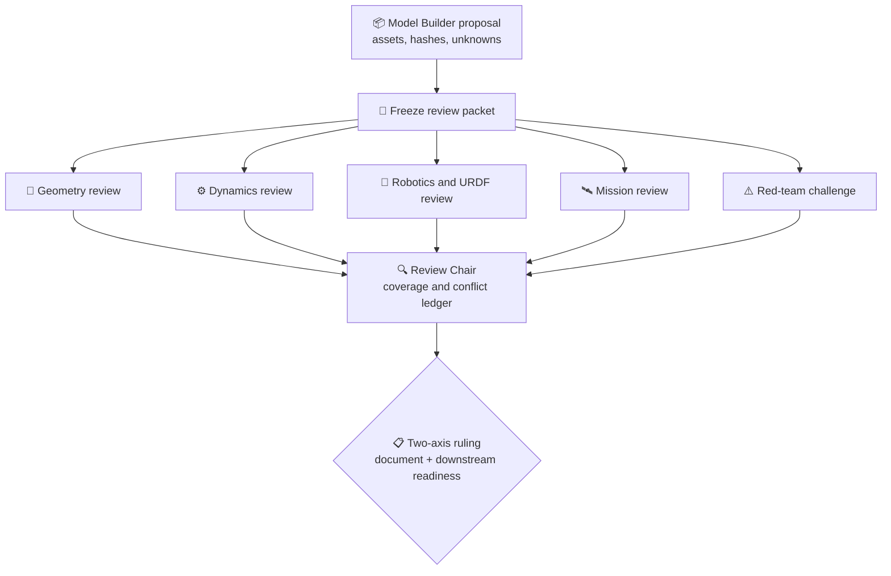

# 数字空间机器人多智能体模型评审协议

*COMP-PROT-03-A1 — evidence-bounded adversarial review contract; no model generation*

---

> `STATUS: DIGITAL_MODEL_ARCHITECTURE_ONLY`<br>
> `PROTOCOL_AUTHORITY: review_contract_only`<br>
> `SCIENTIFIC_GATE: false`<br>
> `MODEL_ACCEPTANCE_EXECUTION: not_authorized`<br>
> `AGENT_COMMAND_AUTHORITY: false`

## 📋 协议目的

本协议把“多个 Agent 一起看模型”改造成可审计的角色分离流程。Agent 不能用多数票创造物理真值，也不能把自然语言共识升级为科学 Gate。每项结论必须落到对象、字段、来源路径、哈希、适用域和未解决异议。

评审对象可以是未来候选 manifest、CAD 差异报告、URDF 差异报告或参数账本；本轮只定义协议，不执行对 CAD/URDF 候选的正式接受。

## 👥 角色与独立性

| 角色 | 核心职责 | 必须攻击的问题 | 禁止事项 |
|---|---|---|---|
| Model Builder | 汇总候选对象、来源和差异；回答审查问题 | 是否遗漏来源、变化和未知 | 不参加最终接受裁决，不自签正确 |
| Geometry Reviewer | 尺寸、包络、装配、frame、keepout、干涉与单位 | frame 是否真实存在；CAD 是否反写 SSOT | 不裁决动力学或任务安全 |
| Dynamics Reviewer | 质量、CoM、惯量、reference point、柔性与守恒量接口 | 重复计数、张量表达、暂定参数是否被升级 | 不重跑仿真或修改 Gate |
| Robotics/URDF Reviewer | link/joint 树、轴、限位、惯性、网格 URI、root 与工具 frame | 6R+2P 是否保留；导入是否静默改名 | 不生成或修复 URDF |
| Mission Reviewer | 对象、抓取区、keepout、适用域、任务阶段与声明 | 模型是否足以支持声称的任务，而非只看起来像 | 不把比赛叙事当验证 |
| Red Team | 跨域寻找来源断裂、许可、负结果和隐藏假设 | “你凭什么知道？”“失败会怎样？” | 不以挑错数量代替证据 |
| Review Chair | 检查覆盖率、合并重复发现、保留冲突并出具裁决 | 是否所有关键角色完成；阻塞是否被诚实保留 | 不自行填 UNKNOWN，不覆盖专业审查 |

至少 Geometry、Dynamics、Robotics/URDF、Mission 和 Red Team 五个角色相互独立。Model Builder 不计入独立审查覆盖率。若资源限制导致一名 Agent 承担两个角色，必须记录 `independence_exception`，且 Red Team 不能与 Builder 合并。

以下专门审查覆盖层按候选内容触发，不替代五个核心角色：任何候选都必须由 Chair 完成 Evidence/Configuration 核验；新增外部资产时增加 License/Provenance Reviewer；涉及实机或 Sim2Real 声明时增加 Hardware/Calibration Reviewer。这些覆盖层可以由已有核心 Reviewer 兼任，但必须在记录中逐项列出，不能静默假设已经覆盖。

## 🔐 输入合同

一次评审必须冻结以下输入：

| 输入 | 必需内容 |
|---|---|
| 授权 | phase、可写路径、禁止动作、下一 Gate |
| 候选资产 | 路径、版本、SHA-256、用途、生成来源；不存在时明确 `absent` |
| Canonical 来源 | geometry/frame/质量预算/accepted URDF/Gate/许可闸门 |
| 对象集合 | component id、父子关系、frame、质量所有权、置信度 |
| 差异 | 与上一个已知版本逐字段差异；无差异也要声明 |
| 未知与负结果 | `UNKNOWN`、TBD、provisional、blocked、deprecated、rejected |
| 声明范围 | 本轮允许和禁止写出的能力表述 |

若缺少授权、哈希、frame、reference point、许可或对象身份，Chair 必须把评审限制在 `BLOCKED_BY_EVIDENCE`，不能要求 Agent 猜测。

## ⚙️ 评审流程



### 阶段 1：冻结评审包

Chair 先记录候选与 canonical 输入的哈希、Git 状态、许可和人工批准。评审期间候选变更即使只有一个字段，也必须关闭旧 review id 并开新记录，不能让不同 Agent 审查不同版本。

### 阶段 2：独立审查

各角色先独立输出，不读取其他角色结论，避免锚定。每条 finding 至少包含：`finding_id`、对象/字段、严重度、证据路径/哈希、可复核陈述、影响、建议责任人和状态。

### 阶段 3：交叉质询

只允许针对冲突字段质询，不允许把“大家都觉得合理”当证据。事实冲突回到 canonical 来源；规范冲突回到人工授权/许可；科学冲突回到原 Gate 或未来独立验证计划。

### 阶段 4：Chair 汇总

Chair 去重但不删除异议，计算角色、对象、关键字段和红队挑战覆盖率。未完成角色记为 `ABSTAINED_OR_MISSING`，不得从分母移除。

### 阶段 5：受限裁决

裁决只描述“是否具备进入下一次设计评审的证据”，不描述物理正确或科学 PASS。任何实施、模型生成、仿真和公开能力声明仍需独立人工 Gate。

## 📊 两轴裁决词表

文档完整性和下游就绪度必须分开，避免“协议写完”等于“模型可用”。

| 文档裁决 | 含义 |
|---|---|
| `DOCUMENT_COMPLETE` | 文档、来源、角色和限制记录完整，且没有已知下游 blocker |
| `DOCUMENT_COMPLETE_WITH_RECORDED_DOWNSTREAM_BLOCKS` | 文档完整，但存在明确 UNKNOWN/冲突/阻塞；本轮可以收口，下游不能启动 |
| `DOCUMENT_INCOMPLETE` | 缺角色、来源、字段、覆盖率或必要记录 |
| `DOCUMENT_REJECTED_SCOPE_VIOLATION` | 文档过程触发越界动作或能力升级 |

下游就绪度使用下表：

| 值 | 含义 | 允许后续 |
|---|---|---|
| `REVIEW_READY` | 所有必需角色完成，关键字段有证据，零开放 Critical/Major blocker | 仅可请求下一人工 Gate |
| `REVIEW_READY_WITH_LIMITATIONS` | 零开放 Critical blocker；Major 限制已显式接受且不影响拟议范围 | 只在写明限制的范围内请求下一 Gate |
| `REVISION_REQUIRED` | 候选存在可修正的不一致 | Builder 修订后以新 review id 重审 |
| `BLOCKED_BY_EVIDENCE` | 缺授权、来源、哈希、许可、frame、质量所有权或关键证据 | 补证据；不得实现或接受 |
| `OUT_OF_SCOPE` | 请求超出本轮批准或要求触碰冻结资产 | 停止并请求人工裁决 |

禁止使用 `PASS`、`FAIL`、`VERIFIED` 或 `ACCEPTED_DIGITAL_BODY` 作为本协议裁决，避免与科学 Gate、工程验收和最终模型接受混淆。

## 🚨 硬阻塞与否决规则

以下任一项开放时，`REVIEW_READY` 和 `REVIEW_READY_WITH_LIMITATIONS` 均不可用：

1. 候选对象身份与 12U/B601/目标基线不一致；
2. source hash 与 Agent 实际读取文件不一致；
3. frame 不存在、变换方向不明或 mm/m 静默转换；
4. 质量重复计数、CoM/惯量 reference point 或 expressed-in frame 不明；
5. 6R/2P 拓扑、关节轴、限位、link 或工具 frame 静默变化；
6. `UNKNOWN`、TBD、provisional 或 OOD 被默认值填补；
7. B/C/D 许可资产进入竞赛交付，或 A/A- 资产缺 attribution/逐资产核验；
8. 候选要求修改 Gate、`30_simulation/`、`40_evidence/` 或冻结配置；
9. CAD/渲染结果反向覆盖质量、惯量或科学结论；
10. 评审输出被用于声称自主捕获、VLA、安全控制或空间级验证。

专业审查角色可以提出 hard blocker，Chair 只能确认其是否有证据、是否重复或是否已由来源所有者关闭；不能通过 4:1 或全体多数票否决该 blocker。Red Team 不能单独接受候选，但其 Critical finding 未答复时可以阻止 review-ready 裁决。

## 🔍 五域检查表

| 域 | 最低检查 |
|---|---|
| Geometry | 对象外包络；nominal/deployed/collision/keepout 分离；安装面；frame round-trip；CAD 单位；干涉声明范围 |
| Dynamics | 唯一 component mass owner；质量闭合；CoM；惯量对称/正定/三角不等式；reference point；柔性与接触 provisional 水印 |
| Robotics/URDF | link/joint 完整；6R+2P 与固定夹爪连接；轴/限位；root mode；mesh URI；tool frame；导入重命名差异 |
| Mission | 服务星/目标身份；抓取区与禁抓区；适用域；任务阶段；地面与在轨证据边界；允许声明 |
| Red Team | 来源断裂；过期路径；许可漂移；默认填值；重复质量；平行模型；负结果遗漏；失败与回滚路径 |

## 📏 覆盖率规则

结构化记录至少计算：

```text
role_coverage = completed_required_roles / 5
object_coverage = reviewed_required_objects / required_objects
critical_field_coverage = evidenced_critical_fields / required_critical_fields
red_team_response_coverage = answered_red_team_findings / all_red_team_findings
inspection_coverage = (verified + explicit_unknown + explicit_conflict + justified_na) / required_fields
resolution_coverage = verified / required_fields
```

分母必须来自冻结评审包，不能因某字段未知而删除。文档可以在 `inspection_coverage=1.0`、但 `resolution_coverage<1.0` 时使用 `DOCUMENT_COMPLETE_WITH_RECORDED_DOWNSTREAM_BLOCKS`；此时下游就绪度必须反映未关闭问题。`REVIEW_READY` 要求角色、对象、关键字段、红队响应、inspection 和 resolution coverage 均为 1.0；这些覆盖率仍不证明模型物理正确。

## 🔗 冲突处理

| 冲突类型 | 唯一处理 |
|---|---|
| Agent 与 SSOT 冲突 | 以 SSOT 为当前事实，并登记 SSOT 本身的待修问题；Agent 不直接修 |
| 两份 canonical 来源冲突 | `BLOCKED_BY_EVIDENCE`，交给来源所有者人工裁决 |
| 许可冲突 | 采用更保守等级，直到许可负责人书面升级 |
| 科学结论冲突 | 回到原始 Gate/config/raw result；评审协议不重算 |
| 展示与工程冲突 | 展示层降级，不修改工程/科学来源 |
| 多 Agent 意见冲突 | 同时保留两方证据、适用域和未解决点；禁止强行共识 |

## 📝 记录与交付

每次正式评审必须以[结构化模板](./model_review_record_template.yaml)为起点，并附一份人可读摘要。摘要必须列出：

- 人工授权与禁止动作；
- 候选资产/来源哈希；
- 各角色的独立结论；
- 开放/关闭 blocker；
- 覆盖率；
- 未解决冲突与责任人；
- 裁决词和它不代表什么；
- 冻结路径未触碰证明；
- 下一合法 Gate。

评审记录不得覆盖原始 finding。修订以 append-only 的新 review id 保存；旧版只能标记 superseded，不能删除失败历史。

## 🚫 本轮状态

本轮只完成协议设计和对数字 manifest 的文档级对抗审查。已知 `DB-BLK-001` 至 `DB-BLK-015` 保持开放，因此没有候选数字机体可被称为 accepted。下一阶段如要评审实际 CAD/URDF/模型候选，必须得到 `COMP-PROT-03-A2-CANDIDATE-MODEL-REVIEW` 的独立人工批准。
