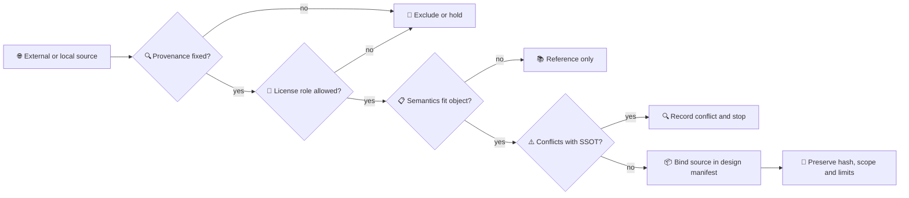

# 数字空间机器人开源模型知识库

*COMP-PROT-03-A0 — source knowledge, adoption boundaries and provenance; no downloads*

---

> `STATUS: DIGITAL_MODEL_ARCHITECTURE_ONLY` 
> `SOURCE_REVIEW_DATE: 2026-07-23` 
> `NETWORK_ACTION: official_metadata_and_documentation_review_only` 
> `MODEL_DOWNLOADS_OR_CLONES: none` 
> `SCIENTIFIC_CLAIMS_CREATED: none`

## 📋 使用方式

本知识库回答“某个外部资源可以教我们什么、不能替代什么”。它不保存模型副本，也不维护第二份许可 SSOT。许可判定仍以[项目许可闸门](../../../20_engineering/stage1_spacecraft_layout/02_open_bus_reference/license_gate_v0.md)为准，已克隆资源的固定 HEAD 仍以[源清单](../../../20_engineering/stage1_spacecraft_layout/00_source_manifest/source_manifest.md)为准。

资源采用必须同时通过四个问题：

1. 来源与版本是否可定位；
2. 许可是否允许目标用途；
3. 资源语义是否适配本项目对象；
4. 是否会覆盖现有 SSOT、Gate 或硬件映射。

任何一项未知都不能靠“开源”“NASA 官方”或“GitHub 上有人用过”自动转为可采用。

`reference_rank` 与 `adoption_role` 必须分开：某来源即使是某类结构的 `PRIMARY_REFERENCE`，也仍可能只能是 `REFERENCE_ONLY`，不得因为“主参考”而自动升级为项目 canonical 几何或动力学真值。

## 🔐 采用词表

| 采用角色 | 含义 | 是否可直接进入数字机体 |
|---|---|---|
| `CANONICAL_PROJECT_SOURCE` | 项目现行 SSOT、accepted URDF、质量预算或原始 Gate | 仅按原字段和限制绑定 |
| `STANDARD_REFERENCE` | 标准或工程流程参考 | 不能自动生成项目几何/质量 |
| `GROUND_HARDWARE_SOURCE` | 实体 reBot/B601 的结构、拓扑、接口与许可来源 | 可支撑硬件映射，不证明空间适用性 |
| `ARCHITECTURE_REFERENCE` | 软件分层、frame、消息或验证组织范式 | 只借鉴模式，不复制物理本体 |
| `TOOL_CANDIDATE` | 未来获批后可独立评估的工具 | 当前不安装、不运行、不称已集成 |
| `VISUAL_REFERENCE_ONLY` | 外形、纹理、展示语义 | 不生成质量、惯量、材料或任务真值 |
| `LEGACY_LAYOUT_REFERENCE` | 有历史价值但上游已过时或仅用于比较 | 不作为新模型主来源 |
| `EXCLUDED_CURRENT_PHASE` | 许可、适用域、阶段或证据不足 | 不进入当前资产、实现或声明 |

## 🌐 官方与上游资源矩阵

| 资源 | 当前核验 | 本项目采用角色 | 可学习内容 | 禁止继承 |
|---|---|---|---|---|
| CubeSat Design Specification Rev.14.1 | 官方入口仍将 Rev.14.1 列为 1U–12U 规范；本地 PDF 哈希已登记，但 Appendix B 图纸尺寸仍待人工复核[^cubesat] | `STANDARD_REFERENCE` | 外形、接口、验收与 fit-check 组织 | 不把现有 12U 块体自动称为发射合规设计 |
| reBot-DevArm / B601-DM | 官方仓库公开硬件图纸、BOM 与软件生态；硬件为 CERN-OHL-W-2.0，软件标为 Apache-2.0[^rebot] | `GROUND_HARDWARE_SOURCE` | 6R 实体拓扑、制造参考、ROS/SDK 接口线索 | 不证明空间级、自由漂浮、辐照/真空适用或在轨控制能力 |
| NASA Astrobee | 官方仓库包含飞行软件、仿真和工具，并以 ROS 作为消息中间件[^astrobee] | `ARCHITECTURE_REFERENCE` | 自由飞行机器人软件分层、定位/规划/模式与消息组织 | 不复制 Astrobee 质量、几何或 ISS 工况作为本项目服务星真值 |
| NASA 3D Resources | NASA 提供持续扩展的 3D/纹理/图像资源，并要求读取使用指南[^nasa3d] | `VISUAL_REFERENCE_ONLY` | 目标外形和比赛展示语义 | 不继承质量、惯量、接口、材料、故障状态或逐资产许可结论 |
| Basilisk | 官方文档当前标识 2.11.0，定位为空间器中心的开源任务仿真框架[^basilisk] | `TOOL_CANDIDATE` | 状态、质量属性、效应器、守恒量与可复算仿真范式 | 当前不安装、不运行；不因工具能力宣称本项目适配通过 |
| Space ROS | 官方定位为帮助 ROS 进入空间机器人系统并提供与航空航天标准对齐的工件[^space_ros] | `ARCHITECTURE_REFERENCE` | 中间件、软件保证与证据组织 | 不等于本项目飞行认证，也不拥有物理真值 |
| SPART | 官方仓库说明可从 URDF 计算移动基多体运动学、GJM/动力学并支持浮动基座，许可为 LGPLv3[^spart] | `TOOL_CANDIDATE` | B601 拓扑/动力学交叉检查方法 | 当前不运行；输出不能覆盖既有 Gate 或被称为独立验证已完成 |
| OreSat Structure | 上游 GitHub 已明确标记 SolidWorks 仓库自 2022 年起 deprecated，现行 CAD 移至 Onshape[^oresat] | `LEGACY_LAYOUT_REFERENCE` | 结构分层、板卡与 keepout 组织方式 | 不再作为“当前 CAD 主来源”；未来使用 Onshape 需另做来源/许可/版本核验 |

## 📦 本地固定来源与数字机体关系

| 本地来源 | 固定状态 | 数字机体用途 | 限制 |
|---|---|---|---|
| `20_engineering/config/geometry/*.yaml` | `CANONICAL_PROJECT_SOURCE` | 对象、frame、抓取点、质量拆分与置信度 | 存在 `DB-BLK-001` 至 `DB-BLK-015`，不得自动修复 |
| `arm_b601_v1.urdf` | tracked；SHA-256 `1bc2b748…c164` | accepted B601 拓扑、关节、惯性和网格引用 | 6R + 2P；工具 frame `E` 尚未绑定到存在的 link |
| reBot 上游本地仓 | 本地 HEAD `71a1a6e…486`；remote 为 Seeed 官方仓库 | 厂商硬件和许可追溯 | 不是“最新上游已验证”；SSOT 内 STEP 路径当前失效 |
| OreSat Structure | 本地浅克隆 HEAD `4c02299` | 历史布局参考 | 上游已 deprecated，不能继续称现行主 CAD |
| OreSat Solar / Backplane | 本地 HEAD `af8f6f3…` / `0e1550c…`；CERN-OHL-S-2.0 | 面板与背板组织参考 | 不作为本项目结构、质量或许可继承的捷径 |
| BIRDSX-CAD | 本地浅克隆 HEAD `36bceea` | 小卫星外观/结构层级参考 | 不提供本项目目标质量与惯量 |
| PyCubed Hardware / Software | 本地 HEAD `d1adfd0…` / `72ab3a1…`；硬件 CC-BY-SA-4.0、软件 MIT | 板卡体积、内部组织与软件接口参考 | 不作为主结构或质量预算真值；硬件与软件许可不可混写 |
| SpaceRobotEnv | 本地 HEAD `155989c…`；Apache-2.0 | 自由漂浮任务与研究范式阅读 | 不替换 B601、现有动力学或 Gate |
| SPOT | 本地 HEAD `66a4929…`；本地未找到 LICENSE | 地面低摩擦验证范式 | 许可未闭合，代码不得复用；地面台架证据不能写成自由漂浮在轨验证 |
| Basilisk | 本地 HEAD `6b9c222…`；ISC | 未来单一航天器动力学工具候选 | 当前不是已集成模型，不运行、不输出新结果 |
| Astrobee | 本地 HEAD `bf43a42…`；Apache-2.0 并带第三方 NOTICE | 自由飞行软件架构参考 | 不替代 12U 服务星或 B601 本体 |
| SPART | 本地 HEAD `1365c7e…`；LGPL-3.0 | 未来 URDF→GJM/RNS 交叉检查候选 | 当前不运行，不能声称已验证 |
| SpaceDyn | 本地 HEAD `57e5d60…`；上游声明学术用途并限制商业使用 | 学术交叉验证参考 | 不进入竞赛交付，不形成主工具链 |

本表中的 HEAD 是本地源清单记录，不表示 2026-07-23 上游最新提交。若未来需要更新，必须单独批准 fetch/clone、重新做许可和差异审计，并保留旧固定版本。

## 🔍 reBot/B601 双身份边界

reBot 在本项目中同时有两个不同身份：

- `reBot-DevArm`：地面实体硬件与厂商开源来源；
- `arm_b601_v1`：项目 accepted 数字动力学/拓扑表示。

二者只有在关节名、轴、限位、link、质量/惯量、夹爪拓扑、安装 frame、版本和来源哈希逐项映射后，才能称为同一 hardware–digital identity。当前只能确认项目采用 6 个 revolute 关节、两个 prismatic 指端和 accepted URDF；不能确认完整 Sim2Real 映射，因为驱动、编码器、标定、工具 frame 和系统质量账本尚未闭合。

## ⚠️ 本轮来源漂移与冲突

| ID | 观察 | 影响 | 后续责任 |
|---|---|---|---|
| `SRC-DRIFT-001` | 本地 source manifest 把 OreSat Structure 描述为主开源结构参考；官方仓库现已明确 deprecated | 当前知识库将其降为 legacy；不修改历史清单 | 未来来源治理评审决定是否更新清单并核验 Onshape |
| `SRC-DRIFT-002` | `arm_b601_v1.yaml` 的厂商 STEP 绝对路径指向不存在的 `80_third_party/vendor` 层级 | 不能形成可复算的源文件绑定 | SSOT 所有者在下一人工 Gate 中修正路径并保存 hash/许可 |
| `SRC-DRIFT-003` | reBot 上游仓库有本地固定 HEAD，但未执行联网 fetch | 可追溯，但不能称最新 | 如需更新，另行批准只读 remote audit/fetch |
| `SRC-DRIFT-004` | NASA 3D 为集合入口，逐模型用途和条款尚未绑定 | 不能提前把任意模型列为可交付 | 对具体资产逐项建立 source/license/hash 记录 |
| `SRC-DRIFT-005` | accepted B601 URDF 仅带 attribution，CERN-OHL-W-2.0 正文仍位于项目外部 vendor checkout | 单独复制当前项目组件包会中断许可证据链 | A2 前将 `license_file_path/hash`、NOTICE/attribution 与 `portable` 纳入资产审核；本轮不复制 |
| `SRC-DRIFT-006` | B601 README/YAML 仍称网格 untracked 或 pending LFS，但当前 10 个网格及全部 CAD 根目录文件均已被 Git 跟踪 | 元数据与实盘状态不一致 | 后续配置治理阶段修正文案，不改动本轮冻结资产 |

## 🚫 当前明确排除

- 不把 GitHub/NASA 模型“等比例放大”后当成 12U/B601 工程本体；
- 不复制外部 CAD、URDF、USD、训练数据或纹理进入工程；
- 不安装 Basilisk、ROS、Isaac Sim、SPART 或其他工具；
- 不采用 B/C/D 许可资产进入竞赛交付；
- 不从视觉网格反推质量、惯量、质心、材料或柔性；
- 不把厂商地面机械臂性能写成空间级或自由漂浮性能。

## 🔗 References

[^cubesat]: CubeSat Program, “CubeSat Information,” https://www.cubesat.org/cubesatinfo
[^rebot]: Seeed Projects, “reBot-DevArm,” https://github.com/Seeed-Projects/reBot-DevArm
[^astrobee]: NASA, “Astrobee Robot Software,” https://github.com/nasa/astrobee
[^nasa3d]: NASA, “3D Resources,” https://www.nasa.gov/3d-resources/
[^basilisk]: AVS Laboratory, “Basilisk: an Astrodynamics Simulation Framework,” https://avslab.github.io/basilisk/
[^space_ros]: Space ROS, project home, https://space.ros.org/
[^spart]: Naval Postgraduate School Space Robotics Laboratory, “SPART,” https://github.com/NPS-SRL/SPART
[^oresat]: Portland State Aerospace Society, “OreSat Structure,” https://github.com/oresat/oresat-structure
