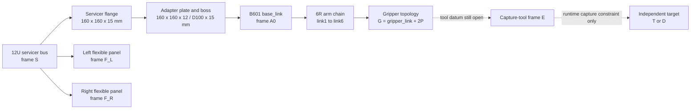

# 12U+B601 空间具身机器人机械构型设计标准 v0

*Digital Mechanical Configuration Standard — design contract only*

---

> `STATUS: CANDIDATE_MODEL_DESIGN_ONLY`<br>
> `MODEL_SCOPE: pre-capture servicer + optional independent target branch`<br>
> `CAD_OR_URDF: not generated`<br>
> `DYNAMICS_USE: prohibited until CAD-SKELETON-G0 closes`

## 📋 目的与适用边界

本标准把现有零散组件转化为未来 CAD/URDF 的单一设计输入。它规定对象身份、父子关系、唯一质量 owner、坐标语义、接口层级、目标独立性和 CAD 入口规则。所有数值均沿用现有来源或人工复核记录；没有来源的字段保持 `UNKNOWN`，不以“合理默认值”填补。

本标准不改变现行几何 SSOT、不覆盖历史 Gate、不计算新动力学结果，也不证明发射适配、抓取安全、可达性、结构强度或在轨任务性能。

## 🧭 系统拓扑



捕获前，目标星 `T` 与碎片 `D` 必须是独立自由体；不得永久挂在 `E` 下。只有任务状态进入接触后，才允许按已批准的 Interface 1/2 约束创建条件边。

## 🧱 构型候选与选择规则

| ID | 定义 | 本阶段角色 | 选择边界 |
|---|---|---|---|
| `A_CENTERLINE_TASK_FACE_SINGLE_ARM` | B601 安装于 `+X_S` 任务端面中心线，复用现有 12U、适配器和 `T_SM` 锚点 | `PRIMARY_CANDIDATE_FOR_DESIGN_REVIEW` | 仅因证据漂移最小而选；不声称性能最优 |
| `B_SIDE_MOUNT_SINGLE_ARM` | 同一 B601 移至侧面候选安装区 | `COMPARATOR_HYPOTHESIS_ONLY` | 必须重新定义 mount datum、包络、FOV、质量属性和 frame；不得继承 A 的证据 |
| `C_DUAL_ARM` | 两套机械臂布置 | `EXCLUDED_OUT_OF_SCOPE` | 缺第二套机械臂、质量/功率/frame/许可/控制证据；需新人工 Gate 才能重入 |

“前端、尾部、侧面”不是工程 frame。所有后续位置必须用 `S` 中的安装面 datum 与 `T_SM` 表达；任何不带 frame 的方向性描述均为叙事，不得进入 CAD。

## 📐 12U 几何与部署器边界

候选 CAD 的 12U rail-reference 外包络输入来自 CDS Rev.14.1 Appendix B 第 34 页、图号 `CDS-14-008`：

- 长度：`366.0 mm`；
- 横截面：`226.3 mm × 226.3 mm`；
- 坐标原点：几何中心；
- rail 到第一个允许突出物的最小距离：`8.5 mm`；
- rail 端接触面：至少 `6.5 mm × 6.5 mm`，且至少 75% rail 接触；
- 黄色侧面相对 rail 平面法向的突出量不得超过 `6.5 mm`。

这些值的来源与限定见[人工复核记录](./cds_appendix_b_12u_review_record.md)。项目当前 `servicer_12U_v0` 的 `340.5 × 226.3 × 226.3 mm` 是旧 block-model 占位值，**不得作为新 CAD 的 12U 长度输入，也不得据此声称 Appendix B 合规**。

在 `CAD-SKELETON-G0` 前必须从以下 profile 中 exactly-one 选择，禁止混用：

| Profile | 本体长度 | `T_SM` | 合法用途 |
|---|---:|---|---|
| `COMPETITION_DISPLAY_V0` | `340.5 mm`，沿 `+X_S` | 现行 `[185.25,0,0] mm`、`R_y(+90°)` | legacy/non-flight display 参考 |
| `CDS_12U_REFERENCE` | `366.0 mm`，项目轴映射仍待签核 | `UNKNOWN`，不得沿用 185.25 mm | 未来 rail-reference CAD 输入 |

CDS 图纸坐标与项目 `S` 轴尚未形成显式 `T_S_RCDS`。将图纸长轴放到 `+X_S` 目前只是一项候选映射，必须与 geometry profile 和 `T_SM` 一起签核。

采用 `rail-reference` 仅是候选设计参考。实际发射服务商、部署器 CIFP、tuna-can/额外体积、材料、倒角、公差和 fit-check 均未完成，本标准禁止形成发射合规声明。

## ⚖️ 质量所有权规则

质量表示必须满足两个 `EXACTLY_ONE` 约束：

1. 服务星在 `whole_sat_reference_24kg` 与 `split_bus_panels_v1` 之间只能选一个；
2. B601 在 `full_urdf_10link` 与未来的 `locked_gripper_collapsed` 派生表示之间只能选一个。

本候选选择：

```text
servicer_12U_bus_v1              23.303213400000 kg
solar_panel_left_v1               0.348393300000 kg
solar_panel_right_v1              0.348393300000 kg
                                  ----------------
split servicer subtotal          24.000000000000 kg

robot_mount_adapter_v0            1.200000000000 kg
accepted B601 full URDF       4.6955559493429862 kg
                                  ----------------
candidate ledger total      29.8955559493429862 kg
```

`29.8955559493429862 kg` 是按 URDF 源数字符串做十进制求和的账本值，唯一合法标签是 `PROVISIONAL_DESIGN_LEDGER_TOTAL`。其位数不代表物理精度或实测精度。该值建立在“24 kg split 分支不包含适配器与机械臂”的**候选所有权决定**上，仍需质量 owner 签核；不得称为最终整机质量。

目标星和碎片属于独立 `target_mass_domain`，捕获前不得加入服务星质量。总系统 CoM/惯量依赖机械臂关节状态、夹爪状态、帆板位形和 frame 绑定，本阶段保持 `UNKNOWN`。

## 🧭 Frame 标准

变换遵守 `T_XY`：frame `Y` 在 frame `X` 中的位姿，`p_X = T_XY p_Y`；长度进入动力学消费者时使用 m，CAD/几何记录可用 mm 但必须显式写 unit。

| Frame/变换 | 定义 | A2 处理 | CAD 使用限制 |
|---|---|---|---|
| `S` | 12U 几何/本体 frame，原点为候选包络几何中心 | 沿用 SSOT | 可用 |
| `B` / `T_SB` | 自由漂浮母体 frame/变换 | `UNKNOWN`；不得默认 `B=S`，不得从低置信度 CoM 自动反推 | 纯几何草图可水印隔离；当前 A3 是 CAD/URDF 一致性包，入门前必须闭合 |
| `M` / `T_SM` | 适配器外安装面与 B601 基座 datum | 引用现行 `t=[185.25,0,0] mm`、`R_y(+90°)`，但与新 366 mm 包络及适配器堆叠仍须几何签核 | 未签核前不得生成正式总装 |
| `A0` / `T_MA0` | accepted URDF `base_link` | 候选绑定为 identity | 需 Geometry + Robotics 双签 |
| `G` | accepted URDF `gripper_link` | 通过固定 joint 绑定：`[0,0,0.15971] m`、rpy `[0,-1.5708,0]` | 可作 URDF link frame，不等于工具 TCP |
| `E_virtual` | link6 对齐的候选虚拟工具 datum | 与 `G` 保持不同身份；仅提出 `T_link6_E_virtual` | 可用于骨架审查，未获双签前不得作为 canonical frame |
| `TCP_contact` | 物理工具中心/接触 datum | `T_E_TCP=UNKNOWN` | 未闭合前不得做接触 CAD、6DOF lock 或任务可达性声明 |
| `T` / `D` | 目标星/碎片本体 frame | 独立 runtime body | `T_ST/T_SD` 未给定时不得装入有场景真值含义的总装 |
| `C_sat` / `C_deb` | 目标候选抓取特征 | 仅保留 point + normal；完整旋转未知 | Interface 0 可用；6DOF 约束禁止 |

`T_ME(q)` 必须保持为 accepted URDF 关节链随 `q` 变化的符号变换；不得在未指定机械臂构型时给出全局 `E` 位姿。

## 🔩 安装接口规则

候选设计必须把三个几何对象分开：服务星法兰 `160 × 160 × 15 mm`、适配器板 `160 × 160 × 12 mm`、适配器 boss `Ø100 × 15 mm`。服务星法兰归入 `servicer_split`，不得与适配器共享质量 owner；板与 boss 是 `robot_mount_adapter_v0` 的子几何，统一包含在适配器 `1.2 kg` 账本项中，不得再单独计重。`140 × 140 × 15 mm` 旧法兰仅作 deprecated consumer evidence，不得进入新 CAD。

在 A3 前必须明确：

- `T_SM` 与 366 mm 12U 外包络、12 mm 板和 15 mm boss 名义尺寸的几何关系；实际轴向堆叠取决于嵌入/配合方式，不能直接按 27 mm 推定；
- 适配器是外贴、局部嵌入还是其他装配方式；
- rail/contact keepout、6.5 mm 突出物规则和 8.5 mm 首突出物距离；
- 螺栓孔、PCD、装配工具空间、线缆通道与 F/T 接口仍为占位，不得称为最终硬件接口；
- 任何 CAD 干涉结果只能作为 A3 证据，不能由本设计合同预先声称“无干涉”。

## 🧲 捕获接口分级

| Level | 名称 | 本阶段允许内容 | 当前状态 |
|---|---|---|---|
| Interface 0 | `visual_patch` | 视觉候选区、点、法向、来源与 keepout 关系 | 可记录，不等于可抓取 |
| Interface 1 | `contact_patch` | 接触面边界、法向、允许接触模式、工具包络和禁触区 | `OPEN_BLOCKING` |
| Interface 2 | `rigid_lock_interface` | 6DOF 刚性锁紧、装配/硬捕获接口 | 本阶段延期；禁止硬捕获/装配能力声明 |

碎片 `[660,0,950] mm` 暂称 `forward_end_ring_candidate_patch`，不得再称 `nozzle_rim`。真正的 aft engine/nozzle 区 `z_D < -1000 mm` 是禁触区。语义重命名是候选合同决定，仍需来源 owner 回写 canonical source 后才能证据关闭。

## 🧩 Digital Skeleton 消费合同

| Consumer | 可消费 | 禁止消费 |
|---|---|---|
| CAD authoring | 选定 A 构型、对象身份、12U 候选外包络、`S→M→A0→arm→G` 链和 UNKNOWN 水印 | 未签核 `E`、目标 6DOF frame、总系统 CoM/惯量、历史 Gate |
| URDF authoring | accepted B601 10-link/9-joint 树和显式 fixed mount | collapsed gripper 作为主拓扑、静默重命名、猜测工具 frame |
| Dynamics | 当前禁止 | `T_SB=identity`、候选账本总量冒充实测、E16 结果继承 |
| Visualization | 水印后的候选位置与 topology | 物理真值、无干涉、任务可行性 |
| Paper/Gate | 设计方法和限制说明 | 科学 PASS、在轨验证、VLA/自主捕获完成 |

## 🚦 CAD 进入条件

进入 A3 不是本目录自动触发的动作。必须先满足 [CAD-SKELETON-G0](./cad_entry_gate.md)，完成独立人工批准，并把审查包 hash 冻结。即使 Gate 满足，授权范围也只能是 CAD/URDF 一致性建模，不包含动力学、仿真、控制、训练或科学声明。
