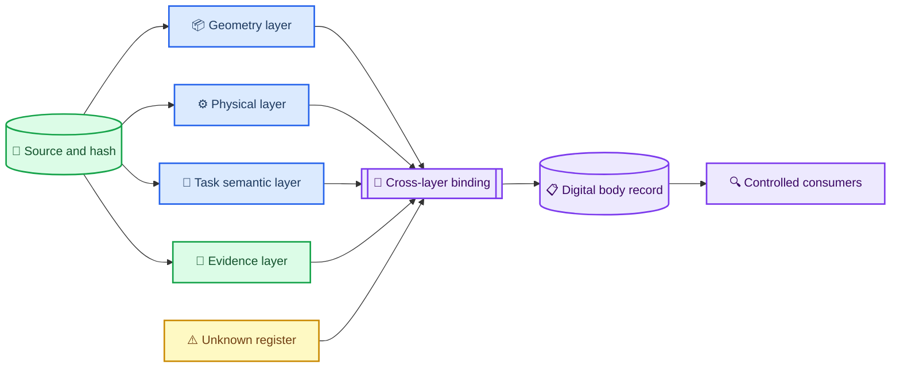
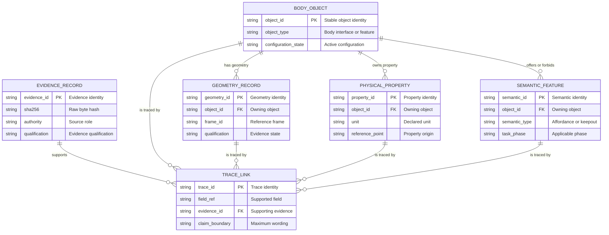
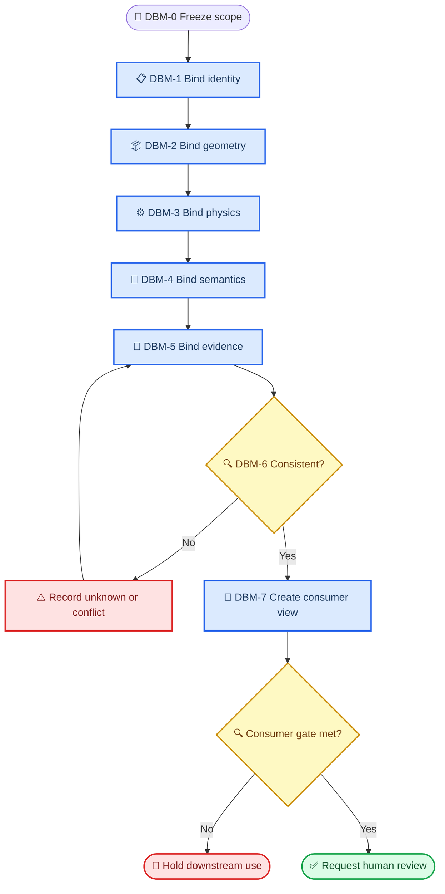
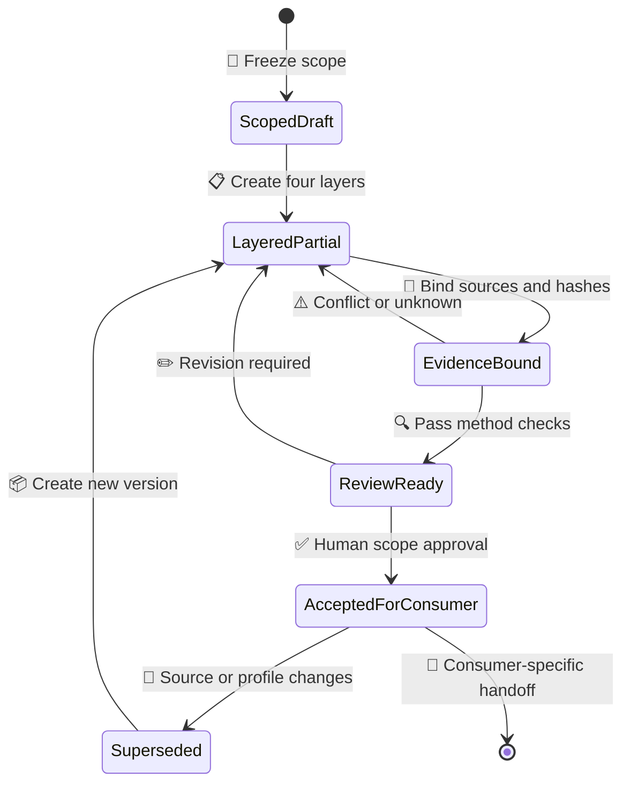

# 空间具身智能数字身体构建方法

_Digital Body Construction Method v0.1 — 面向 12U+B601 候选的 A3 前置研究_

---

> `STATUS: DIGITAL_BODY_METHOD_CONTRACT_ONLY`<br>
> `CANDIDATE_INSTANCE: PARTIAL_WITH_EXPLICIT_UNKNOWNS`<br>
> `CAD_ENTRY: UNCHANGED_CAD_ENTRY_BLOCKED_BY_EVIDENCE`

## 📋 方法定义

本方法把“数字身体”定义为一个具有唯一身份、明确构型状态、可追溯参数和受控任务语义的机械系统记录。它不是 CAD、URDF、动力学模型或动画的别名，而是这些消费者共同读取的上游合同。

一个合格的数字身体必须同时包含四层：

| 层 | 回答的问题 | 最小内容 | 不能单独证明 |
|---|---|---|---|
| Geometry | 它是什么、在哪里、如何连接 | 对象、拓扑、包络、Frame、接口、keepout | 质量正确、可运动或可完成任务 |
| Physical | 它具有哪些物理属性 | 质量 owner、CoM、惯量、关节、柔性、接触属性 | 任务语义或控制安全 |
| Task Semantic | 对任务而言这些对象意味着什么 | affordance、抓取区、禁入区、任务接口、状态约束 | 几何真实或物理可行 |
| Evidence | 为什么可以相信每个字段 | source、hash、authority、qualification、review、limitation | 超出证据范围的新能力 |

任何缺失层都必须显式表示为 `UNKNOWN`、`DEFERRED` 或 `NOT_APPLICABLE`，不得用默认值、自然语言推断或下游工具导入结果静默补齐。

## 🔗 四层数字身体架构



四层之间不是简单并列关系。一个任务语义必须拥有几何载体，物理参数必须指明对象、Frame、参考点和构型状态，任何字段都必须链接证据或进入未知量登记。

## 📚 数字身体数据本体

### 核心实体



### 原子事实结构

数字身体中的数值不允许作为“裸值”存在。每个事实至少需要：

```text
fact
├── subject_id
├── property_id
├── value
├── unit
├── frame_id
├── reference_point
├── configuration_state
├── evidence_state
├── source_ref_ids[]
├── limitations[]
└── unknown_reason
```

例如，`29.8955559493429862 kg` 只能记录为当前候选的 `PROVISIONAL_DESIGN_LEDGER_TOTAL`；由于 aggregate CoM、惯量和物理称重未完成，它不能被缩写为“航天器最终质量”。

## ⚙️ 八步构建流程

| 阶段 | 输入 | 必须输出 | 停止条件 |
|---|---|---|---|
| DBM-0 Scope | 人工授权、冻结边界 | mission、对象范围、允许消费者 | 授权或写入范围不明 |
| DBM-1 Identity | 现有 manifest、候选选择 | 唯一对象 ID、拓扑、exactly-one 构型 | 平行身份未裁决 |
| DBM-2 Geometry | geometry SSOT、标准、骨架 | 对象、Frame、变换、接口、包络、keepout | profile、单位或 Frame 冲突 |
| DBM-3 Physical | 质量账本、URDF、参数卡 | mass owner、CoM、惯量、关节、柔性/接触状态 | 重复计数或参考点不明 |
| DBM-4 Semantic | 任务合同、目标特征 | affordance、抓取/禁入区、任务状态、接口等级 | 语义无几何载体 |
| DBM-5 Evidence | 文件、hash、review | field-level trace、qualification、limitation | 来源缺失、冲突被静默覆盖 |
| DBM-6 Consistency | 前四层 | 跨层 binding、unknown register、conflict register | 关键引用悬空或未知量被消费 |
| DBM-7 Projection | 已闭合的记录 | CAD/URDF/Physics/Agent/Display 受控视图 | 消费者要求超过证据等级 |



## 🎯 任务语义建模

### 三类语义

| 语义类别 | 含义 | 12U+B601 当前示例 |
|---|---|---|
| Observation semantic | 感知系统应该识别什么 | 前端环候选特征、法向、目标类别 |
| Interaction semantic | 允许或禁止怎样接触 | `forward_end_ring_candidate_patch`、aft engine keepout |
| Constraint semantic | 接触后形成何种约束 | Interface 0 候选；Interface 1 未闭合；Interface 2 延期 |

任务语义不能直接写成“可抓取”。它必须至少关联：

- 几何载体及其 Frame
- 生效任务阶段
- 允许和禁止动作
- 物理依赖和未知接触属性
- 证据来源及适用范围

### 具身技能消费边界

高层 `Task Skill` 只能读取已发布的 semantic feature 和状态约束。它不能通过名称推断质量、摩擦、刚度或安全性，也不能把 `candidate_patch` 自动提升为 `qualified_grasp_interface`。

## 🔐 证据链与不确定性

### 证据链

```text
source file
→ raw SHA-256
→ authoritative fields
→ value or semantic binding
→ conflict and limitation
→ reviewer decision
→ allowed consumer
→ maximum claim wording
```

每个 Trace Link 必须指向具体字段或语义节点，而不是只指向一个宽泛目录。若两个来源冲突，保留两条证据和一条 conflict record；方法禁止“取平均”“选更顺眼的值”或用容差掩盖身份冲突。

### 状态词汇

| 状态 | 含义 | 消费规则 |
|---|---|---|
| `SOURCE_BOUND` | 与明确来源字段绑定 | 仅按来源范围消费 |
| `PROVISIONAL` | 有来源但未完成测量或签核 | 必须带水印和 limitation |
| `PROPOSED` | 设计提案，尚未成为 canonical | 只能评审，不得执行 |
| `UNKNOWN` | 不存在可接受值 | fail closed |
| `CONFLICTED` | 多来源不一致且未裁决 | fail closed |
| `DEFERRED` | 明确移出当前范围 | 禁止当前消费者读取 |
| `NOT_APPLICABLE` | 对当前对象或构型不适用 | 不进入聚合或 Gate |

证据等级、设计状态和科学 Gate 是三条独立轴。Schema 通过只说明结构完整，不能升级 `PROVISIONAL` 参数，也不能把 `CAD_ENTRY_BLOCKED_BY_EVIDENCE` 改为 PASS。

## 🔄 生命周期与版本化



版本更新必须新建 record version，并记录父版本、变更字段、旧新 source hash 和重新评审范围。禁止直接修改已引用的实例后继续沿用旧 hash。

## 📦 消费者投影视图

同一数字身体可以生成多个视图，但每个视图只能读取其必要字段：

| 消费者 | 可读取 | 必须拒绝 |
|---|---|---|
| CAD skeleton | profile、Frame、接口、包络、keepout | 未签核 profile、未知 stack-up、物理性能结论 |
| URDF | link/joint、Frame、质量惯量、mesh provenance | 猜测工具 Frame、静默重命名、轨道动力学 |
| Physics model | 完整质量属性、构型状态、初始状态、接触合同 | UNKNOWN CoM/惯量、混合 reference point |
| Embodied Agent | task semantic、状态质量、Physics/SAFE 结果引用 | 裸物理参数、直接执行权限 |
| Competition display | 几何与水印后的候选语义 | 科学真值、飞行合规或自主能力声明 |

SolidWorks、URDF、Basilisk、ROS 和 Isaac 都是消费者；任何消费者不得反向成为几何、物理或证据真值源。

## 📊 12U+B601 方法实例

当前示例实例见 [candidate_12u_b601_digital_body_v0_1.yaml](./candidate_12u_b601_digital_body_v0_1.yaml)。它继承 A2 的现有事实：

- 唯一主候选为 `A_CENTERLINE_TASK_FACE_SINGLE_ARM`
- 逻辑骨架为 30 nodes、32 edges、21 transform references
- B601 保持 10 links / 9 joints
- 质量账本总和为 `29.8955559493429862 kg`，仅标记为 `PROVISIONAL_DESIGN_LEDGER_TOTAL`
- `COMPETITION_DISPLAY_V0` 与 `CDS_12U_REFERENCE` 仍未 exactly-one 选择
- `T_SB`、CDS profile 的 `T_SM`、aggregate CoM/惯量、物理 TCP 和 Interface 1 仍为未知
- `CAD-SKELETON-G0` 保持 `CAD_ENTRY_BLOCKED_BY_EVIDENCE`

本实例证明的是方法可以容纳已知值、冲突、限制和未知量，不证明候选航天器已经完成工程集成。

## ✅ 方法验收与下一 Gate

方法级验收只检查：

1. 四层是否存在
2. 每个事实是否有证据或显式未知原因
3. 跨层引用是否完整
4. 质量表示是否遵守 exactly-one
5. Frame、单位、参考点和构型是否显式
6. task semantic 是否拥有几何载体
7. 消费者权限是否 fail closed
8. 允许表述是否不强于证据

当前方法包可达到 `METHOD_CONTRACT_READY_CANDIDATE_INSTANCE_PARTIAL`。它不关闭 `DB-BLK-001/002/008/009/010/012/013/014` 的 CAD 前置证据要求。下一阶段仍必须先执行独立的 `COMP-PROT-03-A3-G0-EVIDENCE-CLOSURE`，再由人工决定是否授权 `A3-GEOMETRY-ONLY`。
