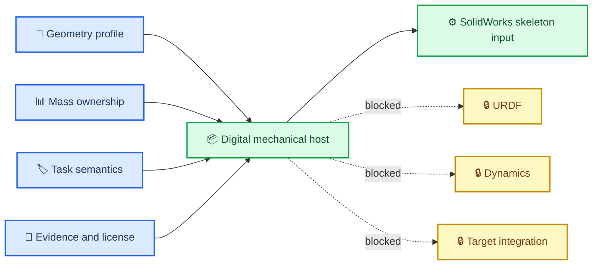

# Digital Mechanical Host v0.1

_12U+B601 数字机械主机的预 CAD 合同入口，2026-07-23_

---

> `STATUS: PRE_CAD_DIGITAL_MECHANICAL_HOST_CONTRACT_READY` 
> `G0_VERDICT: PASS_WITH_SCOPE_ISOLATION` 
> `NEXT_REQUEST_STATE: A3_GEOMETRY_ONLY_ENTRY_REVIEW_READY_TO_REQUEST` 
> `A3_GEOMETRY_ONLY_AUTHORIZED: false` 
> `FULL_CAD_URDF_ENTRY: CAD_ENTRY_BLOCKED_BY_EVIDENCE`

## 📋 本阶段结果

本目录第一次把 12U+B601 候选压缩成一份可供未来 SolidWorks Master Skeleton 消费的数字机械主机合同。它已经同时包含几何 profile、质量所有权、Frame Tree、任务语义、证据与许可证链，但没有创建任何 CAD、URDF 或仿真资产。

当前选择为：

- 构型：`A_CENTERLINE_TASK_FACE_SINGLE_ARM`
- profile：`COMPETITION_DISPLAY_V0`
- 包络：`340.5 × 226.3 × 226.3 mm`
- `T_SM`：`[185.25, 0, 0] mm + R_y(+90°)`
- 候选设计账本质量：`29.8955559493429862 kg`
- 质量标签：`PROVISIONAL_DESIGN_LEDGER_TOTAL`

## 🔗 数字主机关系

## 📦 交付物

| 文件 | 用途 | 当前边界 |
|---|---|---|
| [执行计划](./research_execution_plan.md) | 固化范围、验收与回滚 | 不授权 CAD |
| [批准范围](./approval_scope_record.md) | 记录用户输入与禁止项 | G0 only |
| [数字机械主机](./digital_mechanical_host_v0_1.yaml) | 四层主记录 | 预 CAD 合同 |
| [主机 Schema](./digital_mechanical_host.schema.json) | 约束 fail-closed 字段 | 不证明物理正确 |
| [CAD profile 裁决](./cad_profile_decision_v0_1.yaml) | exactly-one 选择与 `T_SM` | 非飞行展示 profile |
| [质量所有权](./mass_owner_registry_v0_1.yaml) | BOM owner 与逐 link 质量 | provisional |
| [Frame Tree v2 候选](./frame_tree_v2_candidate.yaml) | `S→M→A0→G/E` 合同 | `T_SB/TCP` 禁用 |
| [机械语义](./mechanical_interface_semantics_v0_1.yaml) | task face、接口与 keepout 语义 | 目标分支禁用 |
| [SolidWorks 输入](./solidworks_skeleton_input_v0_1.yaml) | 未来 Master Skeleton 参数表 | `.SLDASM` 未创建 |
| [15 项处置矩阵](./evidence_closure_matrix.yaml) | 逐项关闭、隔离或转为 A3 exit | 不等于全证据关闭 |
| [Geometry-only 闸门](./a3_geometry_only_entry_gate.yaml) | 请求下一次人工批准 | `authorized=false` |
| [验证报告](./verification_report.md) | 解析、Schema、哈希与冻结边界 | 工作树快照 |

B601 的许可证随行包位于：

- [许可证全文](../../../80_third_party/notices/rebot_b601/CERN-OHL-W-2.0.txt)
- [NOTICE](../../../80_third_party/notices/rebot_b601/NOTICE.md)
- [PROVENANCE](../../../80_third_party/notices/rebot_b601/PROVENANCE.yaml)

## ✅ 已闭合的输入决策

- 唯一 profile 已选为 `COMPETITION_DISPLAY_V0`
- `T_SM` 与所选 profile 单值绑定
- 160 mm 现行接口被选中，140 mm 旧接口不再消费
- 质量 exactly-one 规则与 component owner 已建立
- B601 候选质量源裁决为 accepted URDF 的 10 link 精确和
- `G`、`E` 和 physical TCP 不再混用
- B601 许可证全文、NOTICE、上游提交和源哈希可随项目包携带

## ⚠️ 保留的未知量

以下字段没有被猜测：

- `T_SB`
- `T_E_TCP`
- aggregate CoM
- aggregate inertia
- adapter axial stack
- panel configuration
- camera package
- target contact interface

这些未知量不会阻塞“纯几何 Master Skeleton 的批准请求”，但会继续阻塞 URDF、动力学、目标接触集成或完整 CAD/URDF 准入。

## 🚫 停止点

本阶段没有创建 `12U_Master_Skeleton.SLDASM`。下一步只能先由人工批准或拒绝 `A3-GEOMETRY-ONLY`；未批准前不得打开 SolidWorks 开始总装。
