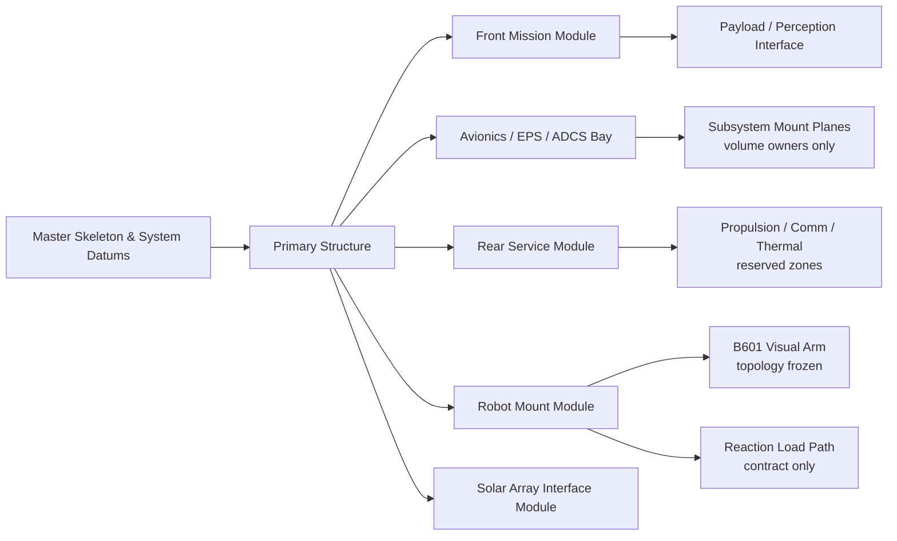

# 12U 自主在轨服务航天器 V2.0 机械架构设计任务书

_从 A4-B1 Engineering Visual Mechanical Prototype 升级到受控的 System Mechanical Prototype_

---

> `DOCUMENT_STATUS: APPROVED_TASKBOOK_BASELINE`  
> `PROGRAM_STATUS: PROTOTYPE_CONTRACT_ONLY`  
> `DESIGN_CLASS: SYSTEM_MECHANICAL_PROTOTYPE`  
> `PROFILE: COMPETITION_DISPLAY_V0`  
> `CAD_AUTHORING: NOT_AUTHORIZED`  
> `NO_FLIGHT / NO_MANUFACTURING / NO_DYNAMICS_AUTHORITY`

## 1. 任务目标

本任务要解决的不是“把现有模型画得更像航天器”，而是把当前 12U+B601 工程视觉样机组织成一个可审查、可参数化、可持续深化的服务航天器机械系统架构：

```text
任务与接口
    ↓
系统机械架构
    ↓
主/次结构与舱段职责
    ↓
机械臂反力传递链、设备安装和维护路径
    ↓
SolidWorks 顶层骨架与子装配
    ↓
证据、未知量和退出审查
```

V2.0 的目标称谓固定为：

> **12U Small Autonomous Servicing Vehicle — System Mechanical Prototype**

“Autonomous”只描述长期任务定位，不构成自治感知、规划、控制或 VLA 已实现的声明。

## 2. 现有基线，不得被错误重做

A4-B1 已经不是单纯的“方盒 + 机械臂”。其经封存的事实包括：

| 基线事实 | 当前证据 | V2.0 处理 |
|---|---|---|
| 32 份原生 SolidWorks 文件 | A4-B1 `32/32 HASH_MATCH` | 全部只读保留，不覆盖 |
| 外框、4 个纵向构件、4 道横向框环 | `native_feature_inventory.csv` | 作为视觉构型参考，不自动转为承力设计 |
| 前/中/后三舱边界和设备板 | A4-CAD-05 `PASS` | 升级为有职责、有接口、有维护方向的舱段合同 |
| B601 10-link/9-joint 身份 | accepted URDF/STL `11/11 PASS` | 拓扑冻结，不修改 URDF |
| `T_SM` 精确名义值 | 坐标系 SSOT `nominal_frozen_v1` | 保持不变，作为 mount datum |
| Sensor、`E_virtual` 为零实体语义参考 | A4-CAD-09/11 | 保持非物理，不补相机或 TCP |
| 独立 target scene | A4-CAD-12 | 继续与 active assembly 隔离 |
| q0 展开参考存在 10 处静态干涉 | `NEGATIVE_RESULT` | 不删除、不美化；V2 必须设计可审查的收拢/安全提案 |

V1.0 的最终证据 seal manifest SHA-256 为：

`dce2b66ac9f60a32329388c4579fec8d7174b7be3c1dfc60dccc716c7a8969f0`

任何 V2.0 工作都必须先复核该 seal，且不得把 V1.0 的“视觉存在”改写为“强度、刚度或飞行合规已经成立”。

## 3. 权威输入与冲突裁决

### 3.1 真值顺序

1. 人工授权与具名 Gate；
2. 原始机器 Gate、冻结配置和绑定哈希；
3. `coordinate_frame_definition_v0.md`；
4. accepted B601 URDF/STL 与 A4-B1 封存证据；
5. Stage 1-C 标准提取、布局合同和质量登记；
6. 官方标准、航天机构案例与公开参考；
7. 本任务书中的设计提案；
8. 外观、演示图和对话记忆。

### 3.2 坐标系硬规则

- `S`：服务星几何/本体坐标系；
- `B`：自由漂浮母体动力学基座坐标系；
- `M`：机械臂安装面、B601 URDF base reference；
- `A0`：B601 接入/首级链参考；
- `E`：末端参考；`E_virtual` 仍只是任务语义标记。

必须使用：

```text
T_SM = pose of M in S
t_SM = [185.25, 0, 0] mm
R_SM = R_y(+90°)
```

禁止把旧语义“`T_SB` = 星体到机械臂基座”带入 V2.0。现行 SSOT 中：

- `T_SM` 才是星体到机械臂安装面的机械—动力学桥；
- `T_SB` 是 `S → B`，依赖聚合质心/动力学参考，当前仍未知。

### 3.3 标准和案例的使用边界

- CubeSat Design Specification Rev.14.1：标准参考；Appendix B 图纸细节仍为 `manual_review_required`。
- NASA Small Spacecraft Technology SOA 2026：结构分类、模块化与风险组织参考；不把供应商数据直接转为项目参数。其表中 12U 为 `226.3 × 226.3 × 366 mm`，与项目 `340.5 × 226.3 × 226.3 mm` 显示 profile 存在未裁决冲突。
- OreSat：本地固定版本的历史布局参考；上游已声明旧 SolidWorks 仓库 deprecated，不作为当前设计真值。
- OSAM-1：已取消任务的历史架构案例，仅学习“bus / servicing payload / robotics / tools / vision”的系统分层。
- ETS-VII：已完成的历史在轨试验案例，学习 chaser/target、机械臂和遥操作的任务分工；不做尺度复制。
- DEOS：已结束的研究项目/任务概念案例，学习捕获—稳定—组合体操作阶段及 free-flying/free-floating 区分；不当作本项目飞行证据。

## 4. V2.0 总体机械架构



### 4.1 顶层装配

顶层装配身份固定为：

`Spacecraft_Service_Vehicle_V2_0`

一级子系统：

1. `00_Master_Skeleton`
2. `01_Primary_Structure`
3. `02_Front_Mission_Module`
4. `03_Avionics_EPS_ADCS_Bay`
5. `04_Rear_Service_Module`
6. `05_Robot_Mount_Module`
7. `06_B601_Visual_Arm`
8. `07_Solar_Array_Interface_Module`
9. `08_Payload_Perception_Interface`
10. `09_Service_Access_and_Harness_References`
11. `10_Review_Overlays`

完整机器可读层级见 [v2_assembly_tree.yaml](./v2_assembly_tree.yaml)。

## 5. 机械模块设计要求

### 5.1 Master Skeleton

必须拥有且只拥有总体驱动参数、基准和包络，不建真实承力细节。

必须冻结：

- 当前 `COMPETITION_DISPLAY_V0` 包络：`340.5 × 226.3 × 226.3 mm`；
- `+X_S` 指向前任务面；
- `S/M/A0/G/E_virtual` 身份；
- `T_SM`；
- front/mid/rear 三舱分界基准；
- robot-mount、太阳翼根部、外板拆装和维护方向基准；
- rail/tab、折叠包络、FOV、工作空间、喷流和天线区域的 reference owner。

不得在 Master Skeleton 内：

- 定义材料、板厚、紧固件、预紧或载荷；
- 生成质量、质心、惯量；
- 定义 `B` 或补出 `T_SB`；
- 定义 physical TCP、contact、target mate。

### 5.2 Primary Structure

V2.0 必须把“看得见的框架”升级为“职责明确但物理量仍受阻的主结构合同”：

| 对象 | V2.0 职责 | 当前状态 |
|---|---|---|
| 端框/任务面承力框 | 汇集机械臂安装反力并传入纵向主结构 | `DESIGN_PROPOSAL` |
| 纵向主构件 | 连接前/中/后框，形成主要轴向/弯扭传递路径 | `DESIGN_PROPOSAL` |
| 横向框环/设备甲板 | 封闭截面、支撑舱段与设备安装面 | `DESIGN_PROPOSAL` |
| rail/tab 接口 | 发射/部署器载荷入口 | `UNKNOWN_BLOCKED` |
| 可拆外板 | 维护、遮蔽和次结构界面 | `DESIGN_PROPOSAL` |
| 紧固和连接 | 框、板、设备、mount 的连接模式 | `UNKNOWN_BLOCKED` |

主结构和次结构必须在装配树、属性和评审图中分离；不得用颜色代替结构所有权。

### 5.3 Front Mission Module

前任务模块必须包含：

- robot mount 的独立承载界面；
- 传感器/照明/任务标记的非物理保留区；
- 工具可达方向、外板拆卸方向和电缆过孔 reference；
- 机械臂折叠/展开和服务目标接近方向的 keepout；
- 与中平台舱之间的接口甲板。

相机、镜头、FOV、标定、照明、目标接触和末端工具均保持 `UNKNOWN_BLOCKED`。

### 5.4 Avionics / EPS / ADCS Bay

中舱以“安装和质量所有权”而不是虚构硬件为核心。至少定义：

- OBC/C&DH 安装面和 volume owner；
- EPS/PMAD 和电池 volume owner；
- reaction-wheel/IMU 的中心区域；
- 可抽取板卡或设备托盘的维护方向；
- 电源/数据线束走廊；
- 到主结构的安装界面；
- 质量预算、热路径和连接器的待填字段。

设备占位不得包含型号、真实尺寸、真实材料、质量或热耗散值，除非后续来源和人工 Gate 明确绑定。

### 5.5 Rear Service Module

后服务模块至少划分：

- propulsion reserved zone；
- communication reserved zone；
- thermal/radiator reserved zone；
- rear service panel；
- ground/debug/service interface reserved zone；
- 与前方机械臂工作区隔离的 plume/antenna/thermal keepout owner。

这些区域是系统机械占位，不代表推进系统、储箱、阀、天线或热控硬件已选型。

### 5.6 Robot Mount Module 与反力传递链

必须以如下链路组织设计和审查：

```text
B601 base
  → M / adapter face
  → adapter plate and boss
  → local mount reinforcement
  → front task-face load-spreading frame
  → longitudinal primary members / transverse ring
  → bus primary structure
```

V2.0 必须表达：

- adapter 与服务星结构的不同质量/几何 owner；
- 螺栓/定位/工具空间的 reference，不给无来源尺寸；
- 线缆通道和虚拟 F/T interface plane；
- mount 周边可拆装路径；
- 载荷输入点、反力出口和结构闭合路径的图示；
- 需要后续输入的 `F_M`、`M_M`、刚度、强度、模态和连接参数。

在载荷、材料、连接和边界条件未闭合前，不得写“已加强”“满足强度”或“高刚度安装座”。

### 5.7 B601、太阳翼、末端和目标

- B601：沿用 V1.0 的 link 级视觉外壳和 accepted 10-link/9-joint 身份；不得修改 URDF 或从视觉壳推物性。
- 太阳翼：只定义 root/hinge/interface、收拢/展开/safe-display 的状态槽和 keepout；铰链、释放、锁定、驱动和线束均未知。
- 末端：沿用现有 gripper、`G` 和 `E_virtual`；physical TCP、接触面、柔顺和 F/T 均禁用。
- 目标：继续置于独立 scene，不进入 active assembly，不建立 mate/contact/rigid lock。

## 6. SolidWorks 顶层建模方法

V2.0 采用 Top-Down Skeleton，不允许从任意零件尺寸反向拼出整星：

```text
System requirements
  → Master Skeleton
  → reference planes / CS / envelopes / interface points
  → layout sketches and bay boundaries
  → subsystem skeletons
  → project-owned parts
  → subassemblies
  → top assembly
  → evidence export and review
```

### 6.1 模型规则

1. V2.0 必须建立独立根目录，不覆盖 V1.0。
2. 总体尺寸只能由 Master Skeleton 驱动。
3. 子装配只引用发布的 skeleton/interface geometry，禁止循环外部引用。
4. 每个一级对象必须有 `OBJECT_ID`、`SYSTEM_OWNER`、`STRUCTURE_CLASS`、`EVIDENCE_STATE`、`SOURCE_REF`、`FRAME_ID`、`MASS_OWNER`、`NO_DYNAMICS_USE`、`CLAIM_LIMIT`。
5. `EVIDENCE_BOUND`、`DESIGN_PROPOSAL`、`UNKNOWN_BLOCKED`、`EXCLUDED` 必须同时写入自定义属性和评审图。
6. 外部 CAD 只作只读观察/参考；不得直接复制、改名或作为本项目原创零件。
7. 不创建“默认材料 = 已选材料”“默认质量 = 真实质量”的隐式权威。
8. 所有配置必须具名，至少包括：
   - `STRUCTURAL_REVIEW`
   - `SERVICE_ACCESS_REVIEW`
   - `DEPLOYED_REFERENCE_Q0`
   - `STOWED_PROPOSAL`
   - `EVIDENCE_STATE_REVIEW`
9. V1.0 的 10 处静态干涉负结果必须保留为上游约束，不得通过隐藏组件消失。
10. 任何“无干涉”结论必须绑定唯一配置、姿态、求解范围和报告，不得外推。

## 7. V1.0 → V2.0 具体修正包

V2.0 的合法增量分为六包：

| 工作包 | 内容 | 输出 |
|---|---|---|
| WP-01 Architecture control | 顶层骨架、舱段和一级装配 owner | master skeleton + assembly tree |
| WP-02 Structural ownership | 主/次结构、框环、甲板和可拆板职责 | structure-class inventory |
| WP-03 Robot integration | mount 接口、反力链、线缆和维护路径 | interface/load-path review |
| WP-04 Subsystem packaging | avionics/EPS/ADCS/service volume owner | equipment-volume register |
| WP-05 Serviceability | 外板、托盘、线束和工具访问方向 | access/assembly sequence views |
| WP-06 Evidence and review | 来源、状态、配置、差异、哈希和退出审查 | manifest + acceptance report |

逐对象差异见 [v1_to_v2_correction_matrix.md](./v1_to_v2_correction_matrix.md)。

## 8. 必需交付物

未来 B3 CAD 阶段必须交付：

1. 独立 V2.0 SolidWorks 根目录；
2. Master Skeleton、一级子装配和项目自建零件；
3. 机器可读 assembly tree 与 object inventory；
4. 主/次结构 owner 表；
5. robot mount interface 与反力传递链图；
6. 舱段 volume owner 与设备安装面表；
7. 外板/托盘/线束维护方向和装配顺序图；
8. 太阳翼/机械臂/传感/服务区 keepout register；
9. V1→V2 deviation manifest；
10. 来源、许可、hash、frame、mass owner 和 claim-limit 清单；
11. 原生重开/重建/缺件/外部引用检查；
12. 具名配置静态干涉记录；
13. 至少 12 类评审视图；
14. V1.0 封存未改证明；
15. 退出审查和人工裁决。

## 9. 未闭合输入与责任人

| blocker | 当前状态 | owner | 阻塞对象 |
|---|---|---|---|
| 项目显示 profile 与 NASA SOA 12U 尺寸冲突 | `UNKNOWN_BLOCKED` | Standards/Geometry Owner | 标准 12U 与发射合规声明 |
| CDS Appendix B 12U 图纸人工复核 | `UNKNOWN_BLOCKED` | Standards/Geometry Owner | 发射包络与 rail/tab 合规 |
| rail 或 tab 参考接口选择 | `UNKNOWN_BLOCKED` | Spacecraft Configuration Owner | 部署器/载荷入口 |
| `T_SB` 与 aggregate CoM | `UNKNOWN_BLOCKED` | Dynamics Frame Owner | 自由漂浮动力学 |
| robot mount 载荷工况 | `UNKNOWN_BLOCKED` | Loads/Dynamics Owner | mount 强度/刚度 |
| 材料、板厚、紧固件和预紧 | `UNKNOWN_BLOCKED` | Structural Design Owner | 强度、模态、制造 |
| 整星 mass/CoM/inertia | `UNKNOWN_BLOCKED` | Mass Properties Owner | 动力学和配平 |
| launch/operational load cases | `UNKNOWN_BLOCKED` | Verification Owner | 结构资格 |
| 太阳翼收拢、锁定和释放 | `UNKNOWN_BLOCKED` | Deployables Owner | 飞行构型与碰撞 |
| camera package 与 `T_SC` | `UNKNOWN_BLOCKED` | Perception Hardware Owner | FOV/遮挡/标定 |
| physical TCP / `T_E_TCP` | `UNKNOWN_BLOCKED` | Capture Interface Owner | 接触/抓取 |
| target interface / `T_ST` / `T_SD` | `EXCLUDED_CURRENT_PHASE` | Mission/Target Owner | target integration |

## 10. 验收与阶段裁决

本任务书只使 B3 具备“可申请”状态，不自动使其获批。详细标准见 [v2_review_and_acceptance_matrix.md](./v2_review_and_acceptance_matrix.md)。

当前裁决：

- `A4_B2_V2_MECHANICAL_ARCHITECTURE_CONTRACT_COMPLETE`
- `V2_CAD_AUTHORING_NOT_AUTHORIZED`
- `V1_0_UNMODIFIED`
- `A5_NOT_AUTHORIZED`

下一 Gate：

`COMP-PROT-03-A4-B3-V2-SYSTEM-MECHANICAL-CAD`

## 11. 允许与禁止的比赛/论文措辞

允许：

> “项目已形成 12U 服务航天器 V2.0 系统机械架构和可追溯 CAD 任务书，下一阶段将在独立版本中实现主/次结构、机械臂安装反力链、舱段集成和维护路径。”

禁止：

- “已完成真实服务航天器机械设计”；
- “满足发射/空间环境/强度/模态要求”；
- “已完成自主捕获、VLA 或安全控制”；
- “OSAM-1/ETS-VII/DEOS 证明本方案可行”；
- “V1.0/V2.0 CAD 已经是数字孪生或制造模型”。

## 12. 来源入口

本任务书的来源角色、核验状态和禁止用途统一见：

[Spacecraft Mechanical Design Knowledge Base — source registry](../../knowledge_base/spacecraft_mechanical_design/source_registry.yaml)。
