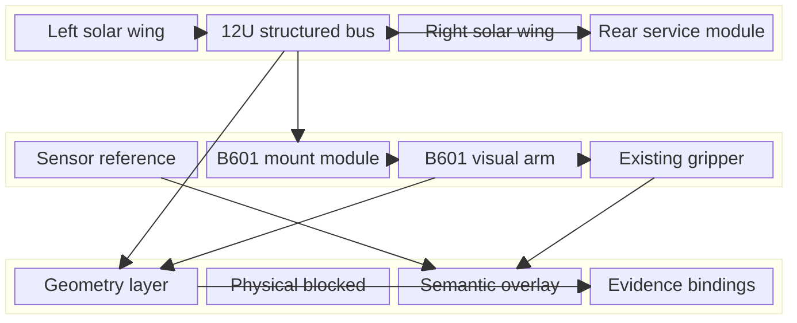

# Space Embodied Robot Engineering Visual Design Specification

_A4 机械结构深化主规范：把 A3 几何占位样机升级为可解释、可审查、可展示的工程视觉机械样机_

---

> `STATUS: DESIGN_REVIEW_COMPLETE`  
> `DESIGN_CLASS: ENGINEERING_VISUAL_ONLY`  
> `BASELINE_PROFILE: COMPETITION_DISPLAY_V0`  
> `NO_DYNAMICS_USE: true`  
> `NO_FLIGHT_OR_MANUFACTURING_CLAIM: true`

## 📋 结论与范围

A4 不再接受“一个 12U 方盒加十个机械臂包围盒”作为下一版展示模型。下一版必须同时具备：

1. 能看出航天器的外框、三舱、设备板、任务面和后服务面；
2. 能看出 B601 的关节、连杆、夹爪与线缆组织，而不是轴对齐方块；
3. 能把观察、操作、禁入和任务接口作为可追溯语义挂到机械结构上；
4. 能让评审者区分来源绑定几何、项目视觉设计、未知物理量和明确排除项。

该规范定义的是工程视觉结构，不是载荷路径、制造图、发射合规、动力学数字孪生或自主捕获系统。

本规范继承 [A3 验收报告](../comp_prot_03_a3_geometry_only/verification_report.md) 的原生 CAD 证据，并保持 [Digital Mechanical Host](../comp_prot_03_a3_g0_evidence_closure/digital_mechanical_host_v0_1.yaml) 的四层边界。历史 pre-CAD 文件保持不改，A4 以新版本和新 manifest 追加。

## 🎯 V1.0 设计目标

未来 CAD 包建议命名：

```text
Space_Embodied_Robot_CAD_V1_0/
```

目标视觉构型为：

```text
结构化 12U 服务星
  + 左右太阳翼显示构型
  + 前任务面感知 reference
  + B601 加强型安装模块
  + link 级 B601 工程视觉外壳
  + 原有两指夹爪
  + E_virtual 任务标记
  + 独立 keepout / frame / evidence overlay
```

不包含：

```text
目标接触实体
physical TCP
硬捕获锁紧
真实传感器硬件
动力学质量重算
URDF / Isaac / Basilisk
控制器 / SAFE / RL / VLA
```

## ⚙️ 机械架构

_该 block diagram 表示 A4 工程视觉样机的模块层级：结构化 12U 主体承载太阳翼、后服务模块和前任务面；任务面通过 adapter 连接 B601，感知与任务语义以非物理 reference overlay 进入模型。_



### 建议目录层级

```text
Space_Embodied_Robot_CAD_V1_0/
├── 00_Master_Skeleton/
├── 01_Primary_Structure/
├── 02_External_Panels/
├── 03_Internal_Bays/
├── 04_Robot_Mount_Module/
├── 05_B601_Visual_Reconstruction/
├── 06_End_Effector_Reference/
├── 07_Deployables/
├── 08_Sensor_Semantic_Reference/
├── 09_Rear_Service_Module/
├── 10_Review_Overlays/
├── Assembly/
├── Configurations/
└── evidence/
```

该目录必须创建为 A4 新版本，不能覆盖 `Space_Embodied_Robot_CAD_V0_1/`。

## 📊 模块设计要求

### Master Skeleton

必须继承并锁定：

- `COMPETITION_DISPLAY_V0`
- 主体包络 `340.5 × 226.3 × 226.3 mm`
- `S → M → A0`
- `T_SM = [185.25, 0, 0] mm + R_y(+90°)`
- `G`、`E_virtual`、`TCP_contact` 三种不同身份

允许增加：

- 三舱 boundary datum
- 左右太阳翼 root/hinge 候选 datum
- `CS_SENSOR_RESERVED`
- rear service face
- rail/contact reference layer
- 设备板、维护方向和线缆走廊 reference

继续禁用：

- `B`/`T_SB`
- physical TCP/`T_E_TCP`
- target pose/`T_ST`/`T_SD`
- 未指定机械臂状态的全局末端位姿

### 12U 主体与三舱

主体必须从一个大实体拆成可读的结构层级：

| 子模块 | 最小表达 | 状态 |
|---|---|---|
| 外框 | 角框、端框、纵向结构件和外形边界 | `DESIGN_PROPOSAL` |
| 外板 | 可拆前/中/后舱板、任务面板和服务面板 | `DESIGN_PROPOSAL` |
| 前任务舱 | B601、sensor reference、照明/标记保留区 | `DESIGN_PROPOSAL` |
| 中平台舱 | OBC、EPS、PMAD、电池、轮组、IMU 体积占位 | `DESIGN_PROPOSAL` |
| 后服务舱 | 通信、推进、热控和调试接口保留区 | `DESIGN_PROPOSAL` |
| rail/contact | 仅作 reference overlay，未形成合规实体 | `UNKNOWN_BLOCKED` |

三舱必须由实际 boundary datum 和独立装配层级表达，不能只用三种颜色假装分舱。内部设备只建体积占位，不绑定型号、材料、真实质量或连接器。

### 太阳翼与柔性附件

左右太阳翼身份、既有显示几何锚点和质量 owner 沿用 [flexible appendage SSOT](../../../20_engineering/config/geometry/flexible_appendage_v1.yaml)。

A4-B1 可建立：

- `DEPLOYED_REFERENCE`：按当前来源锚点表达；
- `STOWED_DESIGN_PROPOSAL`：仅用于展示，不能称为发射收拢构型；
- `SAFE_DISPLAY_PROPOSAL`：用于表现机械臂与帆板避让意图；
- root/hinge datum、扫掠 reference 和 keepout overlay。

铰链、锁定、释放、驱动、线束、柔性展开过程、部署角和发射包络继续未知。任何静态构型都必须显示 `NON_FLIGHT_DISPLAY`。

### B601 安装模块

来源绑定对象保持分离：

1. servicer flange：服务星质量域；
2. adapter plate：adapter 子几何；
3. adapter boss：adapter 子几何；
4. `M/A0` datum：frame 合同；
5. B601 base：机械臂 link 身份。

A4-B1 可增加：

- 加强筋、局部护罩和维修开口的视觉提案；
- 螺栓、定位销、线缆孔和工具空间的 reference feature；
- 独立 3D cable route；
- virtual F/T interface plane；
- 轻量化槽和盖板的非承力视觉设计。

孔径、公差、预紧、材料、壁厚、加强筋承载、刚度和强度均不得填写为工程真值。plate 与 boss 继续包含在 adapter 单一质量项中，不得重复计重。

### B601 link 级视觉重构

A4 不消费 vendor STEP。每个 link 使用三层表示：

| 层 | 内容 | 允许用途 |
|---|---|---|
| `REF_EVIDENCE` | accepted STL、URDF frame、joint origin/axis | 来源、轮廓、拓扑和 q=0 对照 |
| `VISUAL_SHELL` | 项目自建的参数化壳体、关节罩、分缝、维修盖和颜色 | 比赛展示与结构理解 |
| `PHYSICAL_RESERVED` | 质量体、碰撞体、轴承、电机、材料和承载芯体 | 默认禁用，等待后续证据 |

视觉外壳必须：

- 保持 `base_link → link1 … link6 → gripper_link → gripper_left/right`；
- 保持 10-link/9-joint 身份，不新增或合并运动副；
- 为每个 link 保存 source STL/URDF 哈希；
- 为每个关节保存 parent、child、origin、axis 和 q=0 变换；
- 以圆柱/渐缩壳/关节罩等接近 STL 轮廓的原生特征替代包围盒；
- 对所有超出 STL reference envelope 的区域登记 `VISUAL_ENVELOPE_DEVIATION`；
- 标记 `NO_DYNAMICS_USE=TRUE` 和 `NOT_VENDOR_EXACT_CAD`。

外观建模不得改变 URDF joint identity，也不得反向覆盖质量或惯性来源。

### 末端执行器

A4-B1 允许使用 accepted STL/URDF 中已经存在的：

- `gripper_link`
- `gripper_left`
- `gripper_right`
- `G`
- `E_virtual`

允许增加非物理的：

- joint/夹爪身份标识；
- `E_virtual` frame triad；
- Interface 0 任务标记；
- 指端未来接触区 reference surface，但必须 suppressed/disabled。

不允许增加已生效的软指、接触垫、力传感器、锁紧器或 physical TCP。真正的 Embodied Capture End Effector 需要后续独立 `A5-SENSOR-AND-END-EFFECTOR-QUALIFICATION-G0`。

### 传感器与观察语义

由于相机型号、光学参数、安装 frame、标定和线束均未关闭，A4 只能建立：

- `SENSOR_MOUNT_REFERENCE` datum；
- `CS_SENSOR_RESERVED` 候选 frame；
- 任务面的安装保留区；
- `camera_fov_reference` 标签；
- 无尺寸或来源绑定的 observation-region construction sketch；
- 非实体线缆与遮挡检查 reference。

强制属性：

```text
IS_HARDWARE=false
BOM_INCLUDED=false
MASS_CONTRIBUTION=false
MATERIAL=UNASSIGNED
SENSOR_MODEL=UNKNOWN
CALIBRATION_STATE=UNKNOWN
EXECUTION_AUTHORITY=false
```

没有 datasheet 和标定证据时，不创建带数值意义的 FOV 锥体，不声称覆盖、分辨率、工作距离或目标可见。

### 后服务模块

后服务面可建立通信、天线、推进、热控和调试接口的体积保留区，用于解释航天器系统完整性和任务面隔离。

这些对象必须标记 `DISPLAY_PLACEHOLDER`，不得绑定具体推进剂、推力、天线增益、热流或飞行选型。推进 plume、天线扫掠和热控面只作 future keepout reference。

### 目标与交互接口

目标星和碎片不进入 A4 active servicer assembly。若未来比赛场景需要，只能作为独立 scene reference：

```text
Servicer assembly
    independent from
Target scene reference
```

A4 可以表达 `visual_patch`、approach direction 和 keepout annotation；不得建立固定 mate、contact mate、rigid lock、qualified grasp region 或已捕获状态。

## 🔗 数字身体四层映射

| 对象 | Geometry | Physical | Semantic | Evidence |
|---|---|---|---|---|
| 12U 结构化主体 | A4 原生工程视觉结构 | 材料、强度、质量仍不由 CAD 产生 | 三舱、任务面、服务面 | A3 profile、Stage 1-C 布局与 A4 deviation |
| B601 视觉外壳 | STL/URDF 对照的 link 级壳体 | accepted URDF 质量独立保留 | joint/link、操作链与 `E_virtual` | STL/URDF 哈希、link mapping |
| adapter | 来源绑定 plate/boss + 视觉加强件 | 单一 adapter 质量 owner | 安装、线缆和维护接口 | mount SSOT、A3 frame 和 A4 feature register |
| sensor reference | datum/保留区/草图 | 硬件与物理属性未知 | 观察需求、光轴待定 | 任务需求和 UNKNOWN register |
| end-effector reference | 现有夹爪 + suppressed contact reference | TCP、材料、柔顺和力传感未知 | Interface 0 与任务标记 | URDF、A3 frame export |
| solar wings | 来源绑定板体 + 提案构型 | 柔性和部署机构不由 A4 证明 | panel keepout 与状态标签 | flexible SSOT 与 configuration record |

核心规则：

```text
Geometry 存在
≠ Physical 已知
≠ Semantic 可执行
≠ Evidence 已验证
```

## 🔍 工程视觉语言

下一版 CAD 的“真实感”来自可解释结构，而不是无来源细节：

- 用结构层级表达外框、外板、舱段和设备板；
- 用 link 轮廓、关节罩、分缝和维修盖表达机械臂；
- 用独立子装配表达 adapter、太阳翼和后服务模块；
- 用 frame、keepout、reference surface 和 annotation 表达具身语义；
- 用 display state 区分 `BOUND`、`PROPOSED`、`UNKNOWN`、`EXCLUDED`；
- 用 custom properties 记录来源、用途和禁止外推。

所有一级零件或装配体至少具有：

| 属性 | 要求 |
|---|---|
| `OBJECT_ID` | 全包唯一 |
| `REPRESENTATION_LAYER` | `REF_EVIDENCE` / `VISUAL_SHELL` / `PHYSICAL_RESERVED` |
| `EVIDENCE_STATE` | `EVIDENCE_BOUND` / `DESIGN_PROPOSAL` / `UNKNOWN_BLOCKED` / `EXCLUDED` |
| `SOURCE_REF` | path + hash 或 `A4_DESIGN_RECORD` |
| `FRAME_ID` | 所属 frame |
| `SEMANTIC_ROLE` | task/keepout/interface/display role |
| `MASS_OWNER` | owner 或 `NONE_VISUAL_ONLY` |
| `NO_DYNAMICS_USE` | 对 A4 视觉对象必须为 `TRUE` |
| `CLAIM_LIMIT` | 最大允许表述 |
| `BLOCKED_CONSUMERS` | dynamics/contact/flight 等 |

## 🚫 反误导边界

以下任一情况均使 A4-B1 失败：

- 把 visual shell 称为供应商精确 CAD 或可制造结构；
- 从 CAD 材料或体积覆盖质量、CoM、惯量；
- 把 `B=S`、`G=E` 或 `E=TCP_contact`；
- 把 q=0 静态干涉扩展成全工作空间无碰撞；
- 用漂亮的镜头、传感器或目标动画暗示感知和自主捕获已实现；
- 把 FOV 草图称为标定覆盖；
- 把 task marker 称为识别、规划或执行结果；
- 把太阳翼展示姿态称为发射收拢或在轨部署验证；
- 把加强筋和螺栓外观称为强度、刚度或载荷路径验证；
- 修改 A3 文件而不建立新版本与 deviation manifest。

## ✅ 下一阶段入口

本设计评审已经关闭以下选择：

| 入口项 | A4 决定 |
|---|---|
| Profile | 保持 `COMPETITION_DISPLAY_V0` |
| 主拓扑 | `A_CENTERLINE_TASK_FACE_SINGLE_ARM` |
| B601 视觉来源 | accepted STL + URDF |
| vendor STEP | 不消费 |
| 12U 表示 | 结构化工程视觉提案 |
| 太阳翼 | 来源绑定展开参考 + 非飞行显示提案 |
| 末端 | 现有夹爪 + `E_virtual` marker |
| sensor | nonphysical reference overlay |
| target | active assembly 排除 |

仍缺的是独立人工执行授权。未获得 `COMP-PROT-03-A4-B1-ENGINEERING-VISUAL-CAD` 批准前，不创建或修改 SolidWorks 文件。
