# COMP-PROT-03-A4 Mechanical Design Council Review

_12U+B601 空间具身机器人机械结构深化设计联合评审，2026-07-23_

---

> `STATUS: A4_DESIGN_REVIEW_COMPLETE`  
> `REVIEW_TYPE: MULTI_AGENT_DESIGN_COUNCIL`  
> `SCIENTIFIC_EVIDENCE: false`  
> `CAD_AUTHORING_AUTHORIZED: false`

## 📋 联合裁决

机械设计委员会同意：A3 已完成几何合同验证，但其方块化表达不足以承担比赛展示、论文系统图和未来数字场景的机械本体角色。下一版可以进入独立的 **Engineering Visual CAD**，将 12U 平台、安装适配器、B601 机械臂和柔性附件组织成可辨识的工程视觉样机。

委员会同时否决把该样机描述为供应商精确 CAD、制造模型、动力学真值、已标定感知系统或已验证捕获系统。

本次联合裁决为：

- `A4_DESIGN_REVIEW_COMPLETE`
- `A4_B1_ENGINEERING_VISUAL_READY_TO_REQUEST`
- `SENSOR_HARDWARE_DEFERRED_TO_A5`
- `PHYSICS_AND_CONTACT_REMAIN_BLOCKED`

多 Agent 共识只构成设计审查记录，不构成新的科学证据或物理参数来源。

## 👥 评审角色与独立意见

| 评审席位 | 核心问题 | 独立结论 |
|---|---|---|
| 航天结构与比赛展示 | 12U 平台能否摆脱单一包络块并保持证据边界 | 可以建立外框、三舱、设备板、可拆外板和维护界面；所有新增细节必须标为 `DESIGN_PROPOSAL` |
| 机械臂与动力学边界 | B601 如何变得可读，又不伪造内部结构和物性 | 以已接受 STL 与 URDF 为来源，逐 link 建立 `REF_EVIDENCE / VISUAL_SHELL / PHYSICAL_RESERVED` 三层；不得消费 vendor STEP |
| 具身语义与红队 | 传感器、末端和目标如何进入展示而不越权 | A4 仅允许非实体传感器参考、`E_virtual` 标记和独立目标场景；实体传感器、FOV、physical TCP 与接触机构延期至 A5 |

## 🧭 一致通过的设计方向

### 12U 主体

- 保持 `COMPETITION_DISPLAY_V0` 的当前包络与 `T_SM`，不静默切换到其他 12U 标准。
- 建立主骨架、角框/端框、纵向构件、前中后三舱边界、设备板和可拆外板。
- 前舱承担机械臂安装、传感器预留和任务语义面；中舱承载计算、电源与姿控占位；后舱承载通信、推进和服务接口占位。
- 导轨接触尺寸、真实承力路径、材料、壁厚、紧固件和强度仍为 `UNKNOWN_BLOCKED`。

### 机械臂安装

- 保留已钉住的 160 mm 接口、adapter plate 和 boss 几何。
- 加强筋、罩壳、减重造型、参考紧固件、电缆通道和维护开口可以作为工程视觉提案。
- adapter 质量仍由既定 mass owner 管理，plate 与 boss 不得产生重复质量行。

### B601 视觉重构

- 保留已接受的 10 link / 9 joint 拓扑、link ID、父子关节和 q=0 框架关系。
- 每个 link 的视觉外壳必须记录来源哈希、视觉偏差与 `NOT_VENDOR_EXACT_CAD`。
- 可以增加外壳圆角、关节罩、分缝、线缆视觉路径和颜色编码。
- 不得由视觉外壳推导电机、减速器、轴承、材料、壁厚、质量、惯量、强度或关节间隙。

### 末端、传感与目标

- 已有 B601 gripper 可以进入装配，继续使用 `G` 作为证据边界内参考。
- `E_virtual` 只作为具身任务标记；`TCP_contact` 必须为空值和禁用状态。
- A4 只能创建 `SENSOR_MOUNT_REFERENCE`、`CS_SENSOR_RESERVED`、安装预留草图和 `camera_fov_reference` 标签。
- 不得建立带选型、镜头、质量、BOM 或数值 FOV 的相机硬件实体。
- 目标只能在独立场景或演示参考中出现，不得固定配合到主总装，不得激活接触或刚性锁定。

## ⚖️ 分歧与最终裁决

| 议题 | 展示需求 | 风险意见 | 最终裁决 |
|---|---|---|---|
| 传感器外形 | 相机能增强“机器人会看”的可读性 | 无选型、安装、光学与标定证据，实体相机易被误读为硬件完成 | A4 仅做非实体语义预留；实体传感器进入 A5 资格审查 |
| FOV 视锥 | 可直观表达观察区域 | 无数据手册和标定时，任何数值角度都是伪精度 | 只保留无数值 `camera_fov_reference` 标签 |
| B601 真实感 | 应有 link、关节和末端外形 | vendor STEP 的来源、许可和物理权威性未闭合 | 只用 accepted STL+URDF 做项目自有视觉壳，不导入 vendor STEP |
| 柔性附件 | 应有收拢与展开展示 | 铰链、锁紧释放、线束和动态边界未知 | 展开为 evidence-bound reference；收拢/安全态仅为 design proposal |
| 目标与抓取 | 目标有助于任务叙事 | 容易把静态装配误称为接触或自主捕获 | 目标与主总装隔离，只允许独立 reference scene |
| “工程样机”命名 | 比“方块原型”更准确 | 容易被理解为可制造或可飞行 | 统一称 `Engineering Visual Mechanical Prototype` |

## 🧱 必须实现的机械层级

_该图描述下一阶段允许创建的工程视觉层级；它不是动力学链、制造 BOM 或飞行构型证明。_

```mermaid
block-beta
  columns 4
  block:root:4
    skel["Master Skeleton"]
  end
  block:bus:2
    frame["Primary Structure"]
    bays["Front / Mid / Rear Bays"]
    panels["External Panels"]
    decks["Equipment Decks"]
  end
  block:task:2
    mount["Robot Mount"]
    arm["B601 Visual Shell"]
    grip["Existing Gripper"]
    sensor["Sensor Reference Only"]
  end
  block:deploy:2
    solar["Flexible Appendages"]
    rear["Rear Service References"]
  end
  block:review:2
    evidence["Evidence-State Overlay"]
    frames["Frame Overlay"]
    clearance["Scoped Clearance Overlay"]
    scene["Independent Target Scene"]
  end
  skel --> frame
  skel --> mount
  frame --> bays
  frame --> panels
  bays --> decks
  mount --> arm
  arm --> grip
  mount --> sensor
  frame --> solar
  frame --> rear
```

## 🚨 红队否决条件

出现以下任一项，A4-B1 必须停止并裁决为失败：

1. 无来源地填入相机型号、数值 FOV、标定参数或传感器物性。
2. 传感器参考进入 BOM、质量汇总、材料表或硬件完成清单。
3. 混用 `G`、`E_virtual` 与 `TCP_contact`，或给 physical TCP 填入默认值。
4. 将目标通过固定、接触或刚性配合并入主总装。
5. 将 q=0 静态无干涉推广为全工作空间、运动安全或抓取可行。
6. 将视觉壳用于制造、强度、动力学、碰撞或飞行判断。
7. 将截图、动画、Agent 共识或评委观感当作物理证据。
8. 覆盖 A3 原始 CAD、历史数字身体状态或来源哈希记录。
9. 将未知参数自动置零、默认化或以视觉比例替代。
10. 在没有最终人工审查的情况下自动进入 URDF、Isaac、控制或仿真阶段。

## ✅ 委员会建议的下一 Gate

下一 Gate 为：

`COMP-PROT-03-A4-B1-ENGINEERING-VISUAL-CAD`

它必须由人工单独批准，且最高允许退出标签为：

`A4_ENGINEERING_VISUAL_COMPLETE_WITH_PHYSICAL_LIMITATIONS`

在该 Gate 通过前，A3 原生 CAD 仍是唯一当前 SolidWorks 基线。
