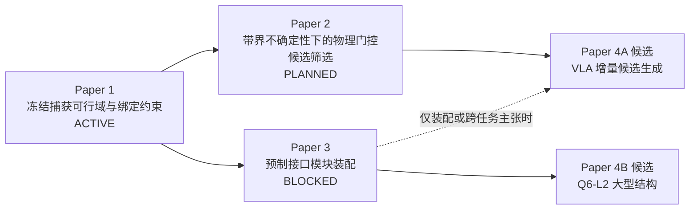

# 未来论文路线与证据门

_状态水印：2026-07-23；总裁决：`PAPER_SEQUENCE_DEFINED_NO_NEW_CLAIMS`。_

> 论文编号表示研究依赖，不代表投稿承诺或执行授权。所有新颖性结论统一保持 `UNASSESSED_PENDING_SYSTEMATIC_PRIOR_ART`，直到各论文完成独立、可复核的系统查新。

## 1. 论文路线总览

- Paper 2 与 Paper 3 可在合同层并行；未知目标操作不是装配的强制前置。
- Paper 4A 与 4B 是两条远期候选分叉，不应提前合并成一篇“VLA 大型结构自主装配”。
- 当前竞赛只使用 Paper 1 主线；其他论文只出现在未来路线页。

## 2. Paper 1：冻结捕获可行域与绑定约束

### 2.1 定位

| 项目 | 内容 |
|---|---|
| 状态 | `ACTIVE — STRUCTURE_FROZEN_EVIDENCE_BINDING_INCOMPLETE` |
| 中文冻结工作题目 | **动量与稳定性约束下的非合作航天器捕获策略选择：可行域地图与绑定门判据** |
| 英文现行候选标题 | **Strategy Selection under Momentum and Stability Constraints for Non-Cooperative Spacecraft Capture: Feasibility Maps and a Binding-Gate Criterion** |
| 研究对象 | 给定终端捕获初始状态、冻结参数/阈值和资源预算下，哪些工况可行、哪个约束先绑定、何时拒绝候选 |
| 不是 | 完整 ADR、轨迹生成控制器、柔性全域认证、成功概率估计或在轨验证 |

### 2.2 核心问题与候选贡献

1. 冻结合同内，哪些目标状态对给定候选策略可行？
2. 动量、姿态速率、资源或稳定性中哪个 Gate 先成为绑定约束？
3. 为什么策略选择不能由单一几何操纵度或无条件算法排名决定？

候选主张继续以现有 [Claim–Evidence 矩阵](../contribution_map/claim_evidence_matrix.csv) 为准：

- C1：冻结范围内的可行域与 binding-gate 策略选择；
- C2：冲量—动量—姿态—资源统一账本，工程输入仍有 provisional 项；
- C3：有限接触带宽作为柔性模型边界，仅 `LIMITED_PROVISIONAL`；
- C4：覆盖、科学认证和授权的 fail-closed 分离，包含真实负结果链。

### 2.3 当前证据与投稿最小门

| 类别 | 当前证据 | 投稿前最小门 |
|---|---|---|
| 主机器证据 | sim_10 9002 点；sim_12 16 个策略单元；SAFE 决策核 | 每个数字、图和句子绑定 Gate/config/hash/row locator |
| 侧证据 | sim_11 有限接触带宽；sim_06/08 锚点 | 明确 provisional 参数与 FLEX 排除，不升级为完整柔性结论 |
| 负结果 | e15、CTRL-01、Wave 1、e16 候选级 formal safe=0 | 原词保留，不平滑成“基本通过”；候选分类不等于执行授权 |
| 文献 | 已有核心捕获/GJM/接触阅读卡 | 对 reachability、viability、active-constraint、runtime assurance 和轨迹设计完成专项 prior-art |
| 状态治理 | 论文结构与贡献图已建立 | 修复旧材料中的状态数字漂移和标题冲突 |

若要超出冻结参数域，必须另立 UQ/敏感性或解析论证合同；不得直接补跑并并入既有 Gate。

### 2.4 建议图表

1. 任务与证据链示意：输入 → 可行域 → binding gate → 策略 → SAFE；
2. 冻结参数域和排除项；
3. 可行域图（明确它是离散扫描，不是概率图）；
4. binding-gate/策略矩阵；
5. 动量—姿态—资源账本；
6. 有限接触带宽的限定性对照；
7. 覆盖/认证/授权分离与负结果链。

### 2.5 允许与禁止表述

允许：

> 在冻结工况和判据内，候选策略的选择取决于当前先绑定的物理或资源约束。

禁止：

- 提出了一种普适最优捕获控制器；
- 已完成碎片清除、消旋或离轨；
- 9002 点区域占比是任务成功概率；
- `sim_10/12` 已包含 FLEX；
- SAFE 的 PASS 自动授权执行；
- 已证明国内/国际首创。

## 3. Paper 2：带界不确定性下的物理门控候选筛选

### 3.1 定位

| 项目 | 内容 |
|---|---|
| 状态 | `PLANNED_NOT_CONTRACTED` |
| 中文候选标题 | **面向非合作空间目标自由漂浮操作的带界不确定性感知与物理门控候选筛选** |
| 英文候选标题 | **Uncertainty-Aware Physics-Gated Action Screening for Free-Floating Manipulation of Non-Cooperative Space Targets** |
| 英文备选标题 | **Physics-Gated Manipulation Planning under Bounded Uncertainty for Free-Floating Space Robots**；仅为标题候选，不改变 Paper 2 的 VLA-agnostic 范围 |
| 研究对象 | 在位姿、转速、质量、惯量和受控几何不确定域内，候选动作如何被校准估计、适用域检查、物理评价和 fail-closed 门共同筛选 |
| 主要绑定 | Q3 不确定性 + Q4 中确定性的 Physics Tool/SAFE 接口；路线名为 `BRIDGE-UT`，不新增 Q |
| 不含 | 任意开放世界物体、自主闭环执行、VLA 贡献、完整装配；VLA 增量主张只属于 Paper 4A |

### 3.2 最强可证伪问题

> 在预注册的 U0–U3 条件下，相比冻结 nominal 评价，校准状态区间、最坏端点传播和确定性物理门控如何改变错误可行判定、弃权、覆盖和 binding reason？

这不是“实现未知目标自主抓取”的同义表述。Paper 2 保持 VLA-agnostic：即使未来附带探索性 VLA 行，也不得把 prompt/model 或语义候选作为本论文核心贡献；相关增量检验统一留给 Paper 4A。

### 3.3 未来最小证据门

| Gate | 必须冻结/验证 | 最低输出 |
|---|---|---|
| P1 感知合同 | 目标类、数据许可、渲染/传感真值、同步、误差/协方差、OOD | 资格化 L2 状态信封；不是执行 |
| P2 确定性候选基准 | U0–U3、mesh/surface/禁抓区、B0 nominal、B1 interval endpoints、B2 deterministic FSM + physics gate | 分层候选指标与逐行追溯 |
| P3 物理工具 | 单一 SSOT、closed schema、EXACT-first、最坏端点、签名 response_id、T1–T4 | `FEASIBLE/INFEASIBLE/OUT_OF_COVERAGE/UNKNOWN` |
| P4 SAFE 扩展 | 独立状态信道、候选注册表、OOD/UNKNOWN 零放行、绕过集=0、红队与显式授权 | SAFE 运行时五值决策及授权字段；不改冻结 SAFE，也不与候选级 `formal_safe` 混名 |
| P5 对照 | nominal/classical baseline 与预注册消融 | utility、runtime、coverage、abstention、false-ALLOW/错误 EXECUTE |

formal-safe 候选当前为 0，必须区分 geometry-admissible、rigid-core-feasible、formal-safe/candidate-scientifically-safe 和 execution-authorized 四层。若某层 Recall@K 分母为零，报告 N/A，不人为换真值；formal safe 也不等于 SAFE/人工执行授权。

### 3.4 建议图表

1. U0–U4 未知性分级与适用域；
2. perception state envelope 数据结构；
3. B0 nominal / B1 interval / B2 deterministic physics-gated 候选管线；
4. Physics Tool 四值响应与 SAFE 五值决策；
5. Gate 前/后错误提案、弃权和覆盖；
6. 不确定域/最坏端点与 binding reason；
7. 失败案例：过期、OOD、质量/惯量不闭合、柔性未知。

### 3.5 禁止表述

- 已实现开放世界未知目标自主抓取；
- 视觉直接识别了真实质量/惯量；
- 将探索性 VLA 行、prompt/model 或提示级迁移包装为 Paper 2 的贡献；
- Gate 后错误执行为零证明候选生成器安全（若成立，它首先是 SAFE 构造性质）；
- admissible/rigid-core feasible 等于 formal safe，或 formal safe 等于 execution authorization。

## 4. Paper 3：预制接口模块在轨装配

### 4.1 定位

| 项目 | 内容 |
|---|---|
| 状态 | `BLOCKED — PLANNED_SCOPE_FROZEN_EXECUTION_BLOCKED` |
| 中文候选标题 | **自由漂浮空间机器人预制接口模块装配的分阶段可行性与九判据验证** |
| 英文候选标题 | **Stage-Gated Feasibility and Verification of Prepared-Interface Module Assembly by a Free-Floating Space Robot** |
| 场景 | 12U + B601 + 1U/2U 模块 + 目标星预制接口；5D 接近 → 柔顺插入 → 6D 锁紧 |
| 不是 | 大型桁架、两航天器普通停靠、VLA 装配或已验证系统 |

### 4.2 科学问题

> 在接口几何、接触、资源和柔性参数均具有可追溯来源的条件下，什么条件使模块从 5D 接近进入柔顺插入和 6D 锁紧，并被九判据评估器判定成功？

### 4.3 最小证据门

| 顺序 | 入口条件 | 需要的证据 | 当前状态 |
|---:|---|---|---|
| 0 | 有效 HAG-A + 原始 hash + 所需接口输入/出处 | 为 AG0 科学接口资格化提供可审查输入 | 未闭合；现有 AG0 preflight 已运行并 BLOCKED |
| 1 | 上述输入与单独科学执行授权存在 | AG0 内部裁决 RF-1/2/3、销距/倒角/clearance/摩擦、捕获域与卡滞边界，并输出资格/授权 | 当前 `AG0_SCIENTIFIC_INTERFACE_QUALIFICATION=NOT_RUN_UNAUTHORIZED`；raw verdict=`ASM00_AG0_BLOCKED_BY_INTERFACE` |
| 2 | AG0 合格且单独授权 | AG1–AG2 持续接触、历史账本、资源/守恒 | 未授权 |
| 3 | 接触模型和参数资格化 | AG3 分阶段控制、守卫和回退 | CTRL-01 负结果必须保留 |
| 4 | 目标侧 FFR/柔性和锁紧模型存在 | AG4 组合体质量/惯量/拓扑/模态更新 | 缺失 |
| 5 | 上述逐门闭合 | AG5 runtime safety；再与 AG0–AG4 共同进入九判据聚合评估与独立审查 | 未启动 |

当前 `scientific_execution_authorized=false`、`next_stage_authorized=false`。冻结九判据评估器不等于接口已资格化或装配已成功。

### 4.4 建议图表

1. Q6-L1 场景与接口 SSOT；
2. 5D → insert → 6D 状态机和守卫；
3. 接口几何捕获域与卡滞边界；
4. 接触历史、能量/冲量和回退事件；
5. 锁紧前后组合体质量—惯量—拓扑—模态更新；
6. AG0–AG5 与九判据依赖图；
7. 负结果和 UNKNOWN 的 fail-closed 案例。

### 4.5 禁止表述

- 已完成模块/桁架在轨装配；
- 当前接口已经资格化；
- 捕获冲量或 `sim_11` 已证明插入/目标侧柔性；
- 单接口成功可外推到大型空间结构；
- 地面固定基座试验等于自由漂浮或在轨验证。

## 5. Paper 4 远期分叉

### 5.1 Paper 4A：物理门控 VLA 候选路由

| 项目 | 内容 |
|---|---|
| 状态 | `FUTURE_CANDIDATE_NOT_COMMITTED` |
| 候选标题 | **Physics-Gated Vision-Language-Action Candidate Routing for Space Robotic Manipulation** |
| 附件标题映射 | *Physics-Grounded Vision-Language-Action Decision Making for Free-Floating Space Manipulation* 只可作为本 Paper 4A 的远期备选标题，不重编号为 Paper 3 |
| 最低前置 | Paper 2 的不确定性与 Physics Tool/SAFE 扩展通过，并至少有一条资格化确定性技能；只有声称装配或跨任务迁移时，Q6-L1/Paper 3 才是额外前置 |
| 唯一可接受问题 | VLA 相对 `V2.5` 确定性基线是否增加有用候选/失败恢复价值，而不提高错误放行 |
| 降级路径 | 若增量不显著，只保留语义候选或负结果论文；不修改安全定义 |

### 5.2 Paper 4B：Q6-L2 大型模块化结构

| 项目 | 内容 |
|---|---|
| 状态 | `DEFERRED_Q6_L2` |
| 候选标题 | **Sequence- and Topology-Aware Assembly of Large Modular Space Structures by Free-Floating Robots** |
| 最低前置 | Q6-L1 AG0–AG5 闭合；独立 Q6-L2 合同；连接重复性、结构/接口参数和全局柔性证据 |
| 新问题 | 装配顺序、累计误差、时变全局刚度/模态、结构精度、物流与可能的多机器人协同 |
| 禁止 | 从单个 1U/2U 接口或地面 TriTruss 先验直接外推大型结构在轨成功 |

Paper 4A 与 4B 不应在当前阶段捆绑。前者检验高层智能的增量价值，后者检验结构与任务规模扩展，证据体系不同。

## 6. 投稿依赖与 go/no-go

| 论文 | GO 条件 | NO-GO/降级条件 |
|---|---|---|
| Paper 1 | 主张—证据绑定、专项查新、状态冲突和边界语言全部闭合 | 若新颖性不足，降为方法/数据/证据治理定位或继续查证，不包装首创 |
| Paper 2 | UQ、感知、确定性候选、物理工具、SAFE 扩展与 nominal/interval 对照形成完整链 | formal-safe truth 为空或工具未资格化时，不投稿“安全未知目标操作”；可保留合同/负结果；VLA 不进入核心主张 |
| Paper 3 | HAG-A、接口 SSOT、AG0–AG4、AG5 runtime safety 和九判据聚合评估逐门闭合 | 任一接口/授权/参数缺失时保持 BLOCKED，不用规划文档代替结果 |
| Paper 4A | VLA 相对 V2.5 有预注册的增量价值，且不绕过 SAFE | 无增量则降级或不立项 |
| Paper 4B | Q6-L1 已闭合且 Q6-L2 新证据链独立成立 | 只有单接口或文献先验时继续 DEFERRED |

## 7. 与竞赛和学位研究的关系

| 场景 | 应讲内容 | 不应讲内容 |
|---|---|---|
| 当前竞赛 | Paper 1：冻结捕获可行域、绑定约束、SAFE 和 DT2 离线解释 | Paper 2–4 作为已完成功能 |
| 硕士/近期论文 | 优先收口 Paper 1；Paper 2 只先建合同与可证伪问题 | 同时实现视觉、VLA、装配、HIL 和大型结构 |
| 长期学位/团队路线 | Paper 2 与 Q6-L1 两支线受控推进；再选择 Paper 4A 或 4B | 用一个“大一统”标题掩盖每条证据链的缺口 |

## 8. 文献门

每篇论文都必须使用现有 Paper Knowledge Agent 的单一题录入口，遵循“项目 Gate > 冻结合同 > 状态快照 > 文献 > 派生总结”的证据优先级。

当前控制器：45 题录、44 本地 PDF、29 完整阅读卡、15 待精读、1 缺全文。Paper 2 在使用位姿在线修正细节前须补 `park2024poseestimation` 阅读卡；Paper 3 在使用模块望远镜架构细节前须补 `lee2016modulartelescope` 阅读卡。任何综述、NASA 路线或其他团队地面试验只用于定义、背景、比较和局限，不能替代本项目 Gate。

## 9. 统一禁止声明

- 已完成碎片清除、消旋、离轨或在轨服务全任务；
- 已实现未知目标自主操作、VLA、实时孪生或 HIL；
- 已完成接口资格化、模块/桁架装配；
- 已获得微重力或在轨验证；
- SAFE PASS 即授权；
- FLEX 已包含于 `sim_10/12`；
- 网格占比即成功概率；
- 新颖性、国内首创或世界首次已经证明。

## 10. 来源与 AI 披露

- [Paper 1 结构计划](../00_project_architecture/paper_structure_plan.md)
- [Paper 1 理论链](../theory_graph/paper1_theory_chain.md)
- [贡献—证据矩阵](../contribution_map/claim_evidence_matrix.csv)
- [Q1–Q6](../research_questions/README.md)
- [Q6 证据生成计划](../research_os_02/q6_evidence_gap_and_generation_plan.md)
- [文献控制器状态](../knowledge_base/papers/controller_state.yaml)

本计划由 AI 在读取现有论文结构、Gate、模块卡、Q1–Q6、文献状态与三个只读专家审计后综合生成。它只定义候选问题、证据门和降级路径；未进行新仿真、训练、数据分析或新颖性裁决。
