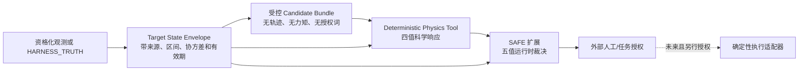

# Physics-Gated Space Manipulation Agent 规划冻结

_状态水印：2026-07-23_

> 裁决：`PHYSICS_GATED_AGENT_PLANNING_COMPLETE_NO_IMPLEMENTATION`
>
> 执行权限：`NO_NEW_EXECUTION_AUTHORITY`
> 性质：研究认知层与未来接口约束，不是 Physics Tool、SAFE 扩展、VLA、控制器或机器人执行实现。

## 1. 修正后的定位

长期研究可以使用以下候选主题：

- **Physics-Grounded Embodied Intelligence for Free-Floating Space Robots**；
- **面向自由漂浮空间机器人的物理约束具身智能操作方法研究**。

这两个名称只用于长期学位研究和路线规划。当前竞赛与 Paper 1 的标题、证据范围和冻结结论继续以[研究总路线](./research_roadmap.md)与现行论文结构为准。

附件提出的核心思想被保留为：**高层模型提出候选，确定性物理与安全层决定候选能否继续流转。** 但项目不采用“Stage 0→5 必须串行继承 PASS”的解释。任务能力轴与自主性轴继续独立，`BRIDGE-UT` 与 Q6-L1 可以并行建合同，任何支线都不得继承另一支线的机器裁决。

## 2. 规划架构

当前只允许定义 `E/C/P/S` 的合同和证据依赖。图中的执行适配器不属于本轮交付，虚线也不表示已有可执行链。

## 3. 三个模块的唯一职责

### 3.1 Module 1 — Target State Envelope

当前设计入口是[迁移合同 §4.2](./servicing_to_assembly_transition.md#42-感知动力学状态信封)。未来正式 schema 至少要绑定：

- `observation_id`、时间戳、有效期和来源分支；
- 位姿与校准协方差、角速度区间；
- 质量/惯量区间及其来源，禁止由自由文本或单帧图像直接推定；
- 几何后验、mesh/surface/禁抓区引用；
- 接触约束、未知字段、标定引用和 OOD 状态；
- 可复算的 `scenario_hash`。

附件中的“100–200 kg、1–5 deg/s”只是示意，不写入项目参数或 benchmark。正式数值必须来自获批合同与可追溯来源。

当前状态：`SCHEMA_REQUIREMENTS_DEFINED_CONTRACT_NOT_FROZEN`。

### 3.2 Module 2 — Deterministic Physics Tool

计划输入为 `candidate_bundle + target_state_envelope`；计划科学响应词表统一为：

`FEASIBLE | INFEASIBLE | OUT_OF_COVERAGE | UNKNOWN`

每个响应未来必须携带 `response_id`、服务端签名、binding reason、最坏端点、`flex_status`、provisional 字段、有效期以及 Gate/config/hash/row 追溯。

当前仓库存在两份历史草案：[tool_contract_draft.yaml](../vla/tool_contract_draft.yaml) 与 [system_interface_plan.md](../integration/system_interface_plan.md)。它们在工具数量、EXACT/插值、层号和决策词表上仍有冲突，只能作为 B3 合同收敛的输入，**目前没有单一正式 SSOT，也没有已实现工具服务**。

“Physics Foundation Model”术语当前裁决为 `REJECTED_AS_PREMATURE_LABEL`。现阶段对象是确定性的、证据绑定的物理查询/评价接口；在没有训练对象、模型能力、泛化协议和独立评价前，不得称为 foundation model。

当前状态：`DRAFT_CONFLICTS_OPEN_NOT_IMPLEMENTED`。

### 3.3 Module 3 — SAFE Extension

冻结 SAFE-00 只覆盖既有候选与既有合同。本路线不修改它。未来若覆盖新状态信封和新候选集合，必须另立 B4 扩展合同，并保持唯一正式决策词表：

`ALLOW | MODIFY | WAIT | BACKOFF | ABORT`

Physics Tool 的四值响应是科学评价，不是执行授权；候选层不得产生 `ALLOW`。OOD、过期、验签失败、来源缺失或 `UNKNOWN` 必须 fail-closed。任何 `ALLOW/MODIFY` 仍需独立审查与外部授权，不能由模型自签。

当前状态：`SEPARATE_EXTENSION_REQUIRED_NOT_AUTHORIZED`。

## 4. 信息、科学判定与执行权分离

| 层 | 合法输出 | 不得输出 |
|---|---|---|
| 感知/状态层 | 带来源的观测、区间、协方差、OOD 与有效期 | 已验证质量/惯量、执行建议 |
| 候选层 | 几何/语义候选、重观测请求、假设与弃权 | 轨迹、力矩、推进器命令、formal `ALLOW` |
| Physics Tool | 四值科学响应、binding reason 与证据定位器 | SAFE 决策、人工授权、控制量 |
| SAFE | 五值运行时裁决、原因和审计记录 | 自签 HAG、覆盖上游 Gate |
| 外部授权/执行 | 在未来独立合同内批准确定性执行 | 反向改写科学 Gate |

候选真值继续分为 `geometry_admissible → rigid_core_feasible → formal_safe/candidate_scientifically_safe → execution_authorized`。任何一层都不能用前一层替代。

## 5. 附件建议的逐项裁决

| 建议 | 本轮处置 | 原因/落点 |
|---|---|---|
| 长期主题升级 | `ADOPTED_WITH_SCOPE` | 作为候选 umbrella title，不替代比赛/Paper 1 标题 |
| 线性 Stage 0→5 | `CORRECTED` | 保留叙事顺序；治理上继续采用任务轴 × 自主性轴 |
| 状态信封 | `ADOPTED_AS_CONTRACT_REQUIREMENT` | 进入 BRIDGE-UT B1；未写入示例数值 |
| Physics Tool 四值接口 | `ADOPTED_AS_TARGET_SEMANTICS` | B3 前先解决现有草案冲突 |
| “Physics Foundation Model” | `REJECTED_AS_PREMATURE_LABEL` | 当前既非已实现模型，也无泛化证据 |
| SAFE 扩展 | `DEFERRED_TO_SEPARATE_CONTRACT` | 不修改冻结 SAFE-00 |
| 根目录新建 `physics_agent/` | `REJECTED_BY_ROOT_GOVERNANCE` | 改用薄索引 [`knowledge_base/physics_agent/`](../knowledge_base/physics_agent/README.md) |
| 立即下载新论文 | `QUEUED_NOT_EXECUTED` | 统一交给 Paper Knowledge Agent；本轮不改 manifest/PDF |
| 建专属研究 Agent | `IMPLEMENTED_AS_PLANNING_AGENT` | 见 [Codex Agent](../../.codex/agents/space-embodied-intelligence-research-agent.md) |
| 立即搭建 MuJoCo/PyBullet/ROS2/Isaac Sim | `DEFERRED_TOOL_EVALUATION` | 当前禁止新仿真；先由科学问题决定单一工具，而不是堆叠平台 |
| 形成新的“博士 Q1–Q3” | `CORRECTED_TO_LONG_TERM_THEMES` | 不重编号既有 Q1–Q6，见[研究与学习队列](./research_learning_and_literature_queue.md) |

## 6. 近期合法出口

1. Paper 1 只做 claim–evidence/hash/locator 闭合与专项查新；
2. 文档级冻结 Q3 的不确定性变量、相关性、端点和拒绝规则；
3. 为 BRIDGE-UT 起草状态信封与 benchmark 预注册，但不生成数据或运行求解器；
4. 用现有 Paper Knowledge Agent 补 `park2024poseestimation` 与 `lee2016modulartelescope` 阅读卡；
5. 收集 Q6 的接口出处、HAG-A 和原始哈希，保持 AG0/ASM-01/02 阻塞语义。

任何实施仍需新的可证伪任务合同、allowlist/denylist、输入来源、Gate、唯一输出根和明确人工授权。

## 7. 允许与禁止声明

允许：

> 项目已经冻结一套面向未来状态信封、确定性物理评价与 SAFE 扩展的规划架构；相关工具、VLA 与新候选闭环尚未实现或验证。

禁止：

- 已实现 Physics-Gated Agent、Physics Foundation Model 或 VLA 闭环；
- 现有 SAFE 已覆盖未知目标或装配候选；
- `sim_10/sim_12` 已成为鲁棒不确定性求解器；
- 当前能自主抓取、消旋、搬运、装配或构建空间基础设施；
- 新增架构名称构成新颖性证明。

## 8. 权威入口

- [当前状态速查](../knowledge_base/project_context/README.md#history)
- [研究总路线](./research_roadmap.md)
- [任务分类](./task_taxonomy.md)
- [技术缺口](./technology_gap_analysis.md)
- [迁移合同](./servicing_to_assembly_transition.md)
- [Q3 不确定性问题](../research_questions/Q3_uncertainty_constraint.md)
- [Q4 具身智能问题](../research_questions/Q4_embodied_intelligence.md)
- [论文知识控制器](../knowledge_base/papers/controller_state.yaml)

本文件只把附件建议映射到既有治理和证据边界；未运行仿真、训练、控制、装配、HIL 或硬件，也未生成新的科学结论。
