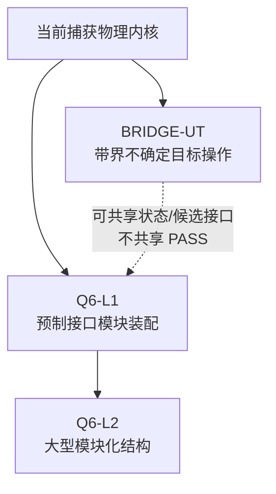

# 从在轨服务捕获到模块装配的迁移合同

_状态水印：2026-07-23；裁决：`METHOD_INTERFACE_CONTINUITY_IDENTIFIED_EVIDENCE_CONTINUITY_NOT_CONFIRMED`。_

> 本文回答“哪些方法能迁移、哪些状态与证据必须重建”。它不实施仿真、VLA 或装配，不授予 ASM、控制或硬件执行权限。

## 1. 迁移不是一条证据直线



两条近期支线解决不同断点：

- `BRIDGE-UT` 主要增加感知、辨识、状态不确定性、非规则表面和适用域拒绝；
- Q6-L1 主要增加接口公差、持续接触、卡滞、锁紧、接触历史和组合体拓扑更新；
- BRIDGE-UT 不是 Q6-L1 的强制科学前置，二者也不能相互继承机器裁决。

## 2. 连续的理论接口与不连续的验证对象

自由漂浮操作可共享如下抽象方程族：

\[
M(q,\theta)\ddot q+C(q,\dot q,\theta)\dot q
=\tau+J_c(q)^T\lambda_c,
\]

以及接触、资源和约束接口：

\[
\lambda_c=f_c(x,\dot x,\theta_c),\qquad
g(q,\dot q,\theta)\le 0.
\]

但是，“使用同一个方程族”只说明接口相容，不说明验证可以跨任务继承。

| 维度 | 可连续复用 | 必须按任务重建 |
|---|---|---|
| 动力学 | 自由漂浮基座—机械臂耦合、GJM、动量/能量账本、接触广义力 | 参数状态、接触流形、模型适用域、柔性拓扑 |
| 资源 | 轮力矩/动量、推进器、姿态速率、冲量预算的记账格式 | 新任务的阈值、执行器真值、最坏端点和安全裕度 |
| 决策 | 绑定约束、UNKNOWN 不放行、fail-closed 语义 | 候选集合、输入状态包、授权记录和独立 Gate |
| 证据 | 哈希、逐行 trace、负结果保留、机器裁决格式 | 每个新版本的原始结果、配置、Gate 和人工授权 |

不连续的四个核心对象是：

1. **状态可知性**：冻结真值变为估计量与区间；
2. **接触持续性**：捕获瞬态冲量变为插入/卡滞/锁紧的混杂接触历史；
3. **成功定义**：终端捕获判据变为几何、力学、资源、柔性、出处和历史的九判据合取；
4. **结构拓扑**：捕获后组合体变为锁紧后需更新质量、惯量、连接和模态的结构对象。

## 3. 三次迁移的证据边界

| 迁移 | 可复用的方法 | 新增状态/模型 | 绝对不能迁移的结论 |
|---|---|---|---|
| 捕获 → BRIDGE-UT | GJM、动量/资源账本、物理筛选组织、SAFE fail-closed | pose/cov、角速度区间、质量/惯量区间、geometry posterior、表面/禁抓区、OOD 与在线有效期 | `sim_10/sim_12` 的冻结可行域不是未知目标鲁棒可行域；`sim_09` 固定候选不是开放目标抓取器 |
| 捕获 → Q6-L1 | 自由漂浮耦合、接触带宽方法、资源账本、组合体更新思想 | 锥—销—孔公差、摩擦/楔紧、持续接触状态机、5D/6D 切换、锁扣和九判据 | 捕获冲量不证明插入；`sim_11` 追踪星侧柔性不证明目标星装配柔性；SAFE PASS 不授权 ASM |
| Q6-L1 → Q6-L2 | 局部抓取—搬运—连接—验证原语、接口对象和局部拓扑更新格式 | 重复连接图、装配序列、累计误差、时变全局刚度/模态、物流与多机器人协同 | 单接口成功不能外推到桁架、望远镜或超大型结构 |

## 4. BRIDGE-UT 的状态与动作接口

### 4.1 未知性分级

“未知目标”不能作为一个未定义标签。近期合同只允许 U0–U3 的带界条件进入离线评估；U4 开集未知必须拒绝执行。

| 等级 | 定义 | 当前允许动作 |
|---|---|---|
| U0 | 合作标记 + 已知 CAD | 基准对照，不用于无标记泛化声明 |
| U1 | 已知 CAD、无标记，位姿/转速未知 | 资格化估计后可进入离线候选评估 |
| U2 | 已知目标族，质量/惯量/自旋/位姿有明确区间 | 最坏端点或经批准的鲁棒传播后可进入物理筛选 |
| U3 | 部分观测、损伤或非规则几何，具有表面片和禁抓区假设 | 仅在真值、适用域和 OOD 合同冻结后评估 |
| U4 | 开集未知、状态包无法闭合 | 上游可提出非授权 `request_reobserve`；formal SAFE 只能输出 `WAIT`（附该 reason）或 `ABORT`；禁止执行 |

接触后的搬运/约束属于任务与接触轴；预制接口模块安装属于任务、接口、接触和拓扑轴。二者不再占用未知性编号，Q6-L1 的 U 等级应按其实际感知合同另定。

### 4.2 感知—动力学状态信封

状态信封必须由 `HARNESS_TRUTH` 或未来资格化估计器产生，VLA 不得自报。最小字段为：

| 字段 | 含义 | 失败语义 |
|---|---|---|
| `observation_id`, `timestamp`, `expiry` | 观测身份、时效 | 上游提交重新观测请求；formal SAFE 输出 `WAIT`（`reason=request_reobserve`）或 `ABORT` |
| `pose`, `pose_covariance` | 位姿及校准协方差 | 未校准即 `UNKNOWN` |
| `omega_interval` | 旋转状态区间 | 不闭合即 `OUT_OF_COVERAGE` |
| `mass_interval`, `inertia_interval` | 质量与惯量边界及来源 | 不得从图像自由文本直接推定 |
| `geometry_posterior` | 几何假设、置信度、mesh/surface 引用 | 无冻结几何/禁抓区即拒绝 |
| `perception_branch` | U0–U4 分支与模型版本 | 分支不一致即拒绝 |
| `source_refs`, `calibration_refs` | 真值、数据和标定链 | 缺出处即 provisional/UNKNOWN |

### 4.3 候选包：VLA 的最大权限

VLA 或其他高层模型只允许提交 `candidate_bundle`：

- `candidate_id`, `observation_ref`, `target_hypothesis_id`；
- `surface_patch_id`, 抓取位姿、接近方向；
- 来自受控枚举的 `affordance`；
- `unknown_fields`, `assumptions`；
- `prompt_sha256`, `model_id_version`。

自由文本 `semantic_label` 不得回流为质量、惯量、阈值或控制参数。候选包不得包含关节力矩、关节/末端速度、完整轨迹、推进器命令或 formal `ALLOW`。

### 4.4 Physics Tool 响应

未来物理工具响应必须至少包含：

- `response_id` 与服务端签名；
- 四值状态：`FEASIBLE | INFEASIBLE | OUT_OF_COVERAGE | UNKNOWN`；
- binding reason、最坏端点、`flex_status`、`provisional_flags`；
- Gate/config/hash/row 引用与 `expiry`。

`OUT_OF_COVERAGE` 和 `UNKNOWN` 永不外推为可执行。现有 `sim_10/sim_12` 只能提供方法与接口原型；在没有新的版本化合同和 Gate 前，不能直接作为此工具的已验证实现。

### 4.5 SAFE 与授权

唯一正式运行时决策词表保持：

`ALLOW | MODIFY | WAIT | BACKOFF | ABORT`

Q4/VLA 草案不得再生成第二套授权词表。VLA 只能提交 `proposed_action`；SAFE 必须独立读取状态信封、重算 `scenario_hash`、逐调用读取 Gate/registry，并按 `response_id` 取回和验签物理响应。VLA 引用的结论不能自证。

当前 SAFE-00 虽为 `PASS`，但 `review_status=PENDING_REVIEW`、`next_stage_authorized=false`，且只覆盖冻结候选/合同。因此它不授权 BRIDGE-UT、Q6 或未知目标集合。

## 5. Q6-L1 装配迁移接口

### 5.1 分阶段任务链

```text
GRASP_MODULE
→ MOVE_TO_PREASSEMBLY
→ APPROACH_5D
→ ALIGN
→ COMPLIANT_INSERT
→ LOCK_6D
→ VERIFY_ASSEMBLY
→ RETREAT
```

### 5.2 必须新增的装配状态

| 状态组 | 最小内容 |
|---|---|
| 接口几何 | 导向半径、销距、孔/销公差、倒角、clearance 语义、锁扣行程 |
| 接触材料 | 摩擦、刚度、阻尼、出处和裕度 |
| 混杂相位 | pre-contact、touch、alignment、insert、jam、lock、verify、retreat |
| 历史账本 | 每次接触、冲量/能量、卡滞、回退和未知状态 |
| 组合体更新 | 锁紧后的质量、质心、惯量、连接拓扑与柔性/模态模型 |
| 成功裁决 | 现有九判据单源评估器；任何 UNKNOWN 不判 success |

### 5.3 当前停止条件

AG0 的授权前检已经运行，机器结果保持：

- `AG0_AUTHORIZATION_PREFLIGHT=BLOCKED`；
- `AG0_BASE_AND_HASH_BINDING=BLOCKED`；
- `AG0_RF_CLASSIFICATION=BLOCKED`；
- `AG0_SCIENTIFIC_INTERFACE_QUALIFICATION=NOT_RUN_UNAUTHORIZED`；
- raw verdict=`ASM00_AG0_BLOCKED_BY_INTERFACE`。

AG0 科学接口资格化的合法入口是：有效 HAG-A、原始哈希绑定、所需接口输入/出处已经提供或明确登记，并获得单独科学执行授权。RF-1/2/3 是 AG0 内部要裁决和关闭的事项；`interface_qualification_granted` 与 `next_stage_authorized` 是 AG0 输出，不得反过来作为 AG0 的循环前置条件。当前两者均为 false，因此不得进入 ASM-01/ASM-02。

## 6. 三个未来合同包（仅规划）

### C-BR-01：`BOUNDED_UNCERTAINTY_TARGET_BENCHMARK`

目的：定义 U0–U3 的状态信封、真值、校准、OOD、候选层级和 false-ALLOW 指标。  
当前状态：`PLANNED_NOT_CONTRACTED`。  
最小对照：B0 冻结 nominal、B1 区间/最坏端点、B2 确定性几何/FSM + Physics Tool/SAFE；本合同保持 VLA-agnostic。  
停止条件：没有首样本前冻结的 mesh/surface/禁抓区，或候选科学安全真值为空且指标未分层。

### C-AS-01：`MODULAR_INTERFACE_MANIPULATION`

目的：将 Q6-L1 的 5D 接近、柔顺插入、6D 锁紧和组合体更新写为独立 Gate。  
当前状态：`PLANNED_SCOPE_FROZEN_EXECUTION_BLOCKED`。  
最小入口：有效 HAG-A + raw hash + 所需接口输入/出处 + AG0 科学接口资格化的单独授权。  
停止条件：现有 AG0 preflight 保持 BLOCKED；不得跳过 AG0 的资格与下游授权输出启动 ASM-01/ASM-02。

### C-VLA-01：`PHYSICS_GUIDED_VLA_CANDIDATE_ROUTING`

目的：只评估高层模型对候选生成、错误提案和弃权行为的增量价值。  
当前状态：`OFFLINE_ADVISORY_NOT_IMPLEMENTED`。  
最小入口：C-BR-01 已闭合、确定性基线成立、物理工具 T1–T4 通过、SAFE 扩展另立合同并获授权。  
降级路径：若 VLA 与 `V2.5` 表现接近，贡献降级为语义候选生成，不包装为安全或控制贡献。

## 7. 两条独立 Gate 梯

### 7.1 BRIDGE-UT / 可选 VLA 梯

| Gate | 要解决的问题 | 只解锁什么 |
|---|---|---|
| B0 `SCOPE_ONLY` | taxonomy、接口、威胁和证据合同 | 文档设计，不训练、不仿真 |
| B1 `PERCEPTION_CONTRACT` | 数据许可、真值、同步、误差/协方差、OOD | 离线 L2 状态信封 |
| B2 `DETERMINISTIC_CANDIDATE_BENCH` | mesh/surface/禁抓区、nominal/interval/FSM 对照和溯源 | 确定性候选评测，不执行 |
| B3 `PHYSICS_TOOLS` | 单一合约 SSOT、closed schema、EXACT-first、hash/verdict 与签名 | 工具可用于离线筛选 |
| B4 `SAFE_EXTENSION` | 独立状态信道、候选注册表、OOD/UNKNOWN 零放行、红队与授权 | 新候选集合的 fail-closed 决策 |
| B5 `DT2_OFFLINE_LOOP` | 控制 Gate、SAFE 复审、物理工具共同闭合 | 精确场景离线闭环回放 |
| B-VLA `OPTIONAL_INCREMENT_TEST` | VLA 相对确定性 V2.5 基线的预注册增量价值 | Paper 4A 候选；不直控、不改变 SAFE |
| B6 `HIL/DT3` | H0–H2、B601 参数、统一时钟、延迟/丢帧与原始日志 | 申请地面实时验证；仍不是在轨证明 |

### 7.2 Q6-L1 装配梯

| Gate | 要解决的问题 | 只解锁什么 |
|---|---|---|
| A0 输入与授权 | 有效 HAG-A、raw hash、接口输入/出处和科学执行授权 | 允许 AG0 科学接口资格化；现有 blocked preflight 不被改写 |
| AG0 | 在 AG0 内裁决 RF-1/2/3、公差/摩擦/卡滞与接口资格 | 输出资格与 `next_stage_authorized`，不自动启动 ASM-01/02 |
| AG1–AG4 | 持续接触、资源、分阶段控制、组合体/柔性更新 | 按 registry 和独立授权逐门推进 |
| AG5 | runtime safety | 与 AG0–AG4 结果共同进入九判据聚合评估和独立审查 |
| AG6（可选） | agent value ablation | 只有评估装配候选层增量价值时使用；必须保留 V2.5 确定性对照，不改变 AG0–AG5 或 SAFE 结论 |
| Q6-L2 决策门 | Q6-L1 证据闭合后另立大型结构合同 | 只允许评估立项，不继承单接口 PASS |

两条 Gate 梯可以并行建合同，互不作为强制前置；每个 Gate 只解锁表中动作，不自动解锁下一行。

## 8. 当前证据解释

| 资产 | 当前状态 | 在迁移中允许的用途 |
|---|---|---|
| `sim_09` | `LIMITED`，无全局 verdict 字段 | 固定候选评价经验，不是未知物体抓取器 |
| `sim_10` | `SIM10_GATES_PASS`，FLEX 未入判据 | 可行域组织方法，不是鲁棒未知目标 evaluator |
| `sim_11` | `SIM11_GATES_PASS_WITH_PROVISIONAL_PARAMS` | 有限接触带宽侧证据，不是目标侧装配柔性证明 |
| `sim_12` | `SIM12_PHASE1_GATES_PASS`，FLEX 未入判据 | 绑定约束和策略单元组织方法 |
| e15 core/ANCF | `REPEAT_CORE_NO_SAFE_CANDIDATE` / `REPEAT_ANCF_CERTIFICATION` | 保留安全与柔性认证缺口；formal safe=0 |
| e16 | `PASS_WITH_GEOMETRY_AND_FLEX_LIMITATIONS` | 受限同步捕获扫描；formal safe=0 |
| CTRL-01 | `REPEAT` | 支持分阶段任务动机，不证明控制已解决 |
| CTRL-02 | 机器 `verdict=PASS`；对外 `PASS_WITH_PROVISIONAL_SCOPE`；`review_status=PENDING_REVIEW`；`formal_safety_classification_emitted=false`；`flex_status=UNKNOWN_NOT_IN_CRITERIA` | 受限姿态/资源分账，不是工程参数转正或 formal safety |
| SAFE | `PASS`, `PENDING_REVIEW`, 不授权下游 | fail-closed 设计参考，不覆盖新候选 |
| ASM-00 | `BLOCKED` | 接口与授权缺口的机器分类，不是装配结果 |

这里的 e15/e16 `formal safe=0` 是候选级科学分类，不包含 SAFE 运行时决策或人工执行授权。完整链必须分成 `geometry_admissible → rigid_core_feasible → formal_safe/candidate_scientifically_safe → execution_authorized` 四层。

## 9. 最强反驳与接受条件

> 当前所谓“从捕获到具身操作再到装配”可能只是用通用多体方程包装三种不同任务；没有感知估计器、未知目标真值、物理工具实现、formal-safe 候选、合格装配接口或获授权控制后端。

这一反驳当前成立。因此只能作如下表述：

- 已验证贡献仍是冻结捕获可行域与绑定约束；
- BRIDGE-UT 和装配是共享方法内核的两条待建证据支线；
- 大型结构保持 `DEFERRED_Q6_L2`；
- VLA 只有通过对确定性 `V2.5` 基线的预注册增量检验，才可能保留研究价值。

## 10. 来源与 AI 披露

本迁移合同综合以下本地权威入口：

- [Q4 具身智能问题](../research_questions/Q4_embodied_intelligence.md)
- [Q5 数字孪生问题](../research_questions/Q5_digital_twin.md)
- [Q6 装配问题](../research_questions/Q6_on_orbit_assembly.md)
- [`10_research/vla/`](../vla/)
- [模块卡](../../30_simulation/module_cards/)
- [ASM-00 Gate](../../30_simulation/asm_00_interface_preflight/results/asm_00_gate_check.json)

本文由 AI 在只读审计动力学、VLA、SAFE、控制、装配合同和文献控制器后综合生成。所有接口字段均为未来合同建议；未执行训练、仿真、控制或装配，也未生成新的科学结论。
