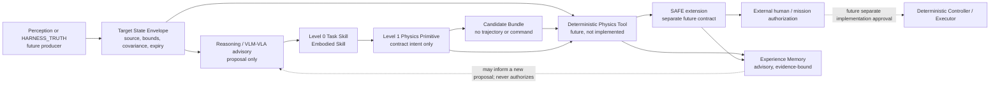

# Space Embodied Agent Prototype V1 研究合同

> `STATUS: PROTOTYPE_CONTRACT`<br>
> `CLASSIFICATION: PROTOTYPE_CONTRACT_ONLY`<br>
> `AUTHORIZATION: COMP-PROT-01-CONTRACT-LANDING / APPROVED_WITH_SCOPE_LIMIT`<br>
> `SCIENTIFIC_GATE: false`<br>
> `EXECUTION_AUTHORITY: false`<br>
> `COMP_PROT_02_RESULT: ARCHITECTURE_ONLY / APPROVED_WITH_SCOPE_LIMIT`<br>
> `COMP_PROT_03_A0_A1_RESULT: DIGITAL_MODEL_ARCHITECTURE_ONLY`<br>
> `NEXT_GATE: COMP-PROT-03-A2-CANDIDATE-MODEL-REVIEW / NOT_AUTHORIZED`

## 0. 合同裁决

本合同只定义 **Space Embodied Agent Prototype V1** 的接口、数据结构、状态流、权限边界和文档级验收规则。它不是软件实现、仿真结果、控制器、SAFE 扩展、RL 环境、VLA 模型或执行授权。

本轮允许的对外名称为：

> **面向非合作空间目标操作的物理约束具身智能决策框架**

使用该名称时必须同时注明 `PROTOTYPE_CONTRACT_ONLY`。本合同不能支撑“已实现空间具身智能”“已完成自主捕获”“已完成 VLA”或“已完成安全控制”等表述。

本合同继承现有机器 Gate 的状态，但不复制或修改其裁决。项目数值、PASS、REPEAT、授权和结论强度仍只认原始 Gate JSON、冻结配置与绑定哈希。

## 1. 研究连续性与边界

| 路线 | 本合同中的用途 | 本合同不新增的结论 |
|---|---|---|
| Paper 1：捕获可行域 | 提供可追溯的冻结物理证据入口和候选约束语言 | 不扩展现有可行域，不重跑仿真，不改变 FLEX 限制 |
| Paper 2：Physics-Gated Manipulation | 定义状态信封、候选、技能和物理响应的未来接口 | 不宣称 Physics Tool、SAFE 扩展或闭环已实现 |
| Paper 3：Assembly | 预留 `TRANSFER_TARGET` 与任务迁移接口 | 不解锁 Q6、AG0、ASM-01 或 ASM-02 |
| Future：VLA Agent | 将 VLM/VLA 限定为候选与任务技能提议者 | 不训练模型，不建立数据集，不授予控制或安全决策权 |

当前成熟度继续保持：捕获证据按原 Gate 冻结；Embodied Agent 为规划/合同态；Q6 Assembly 保持 BLOCKED。`COMP-PROT-01` 只把接口从“内存草案”推进为“可审查合同”，不推进工程成熟度。

### 1.1 比赛创新叙事冻结（合同口径）

以下三项是 Prototype 的**设计创新点**，不是已经验证的系统能力：

1. **空间物理世界模型接口**：用状态信封组织位姿、转速、质量/惯量区间、几何、约束和出处，再由未来确定性 Physics Tool 返回动作后果的四值评价。动量守恒、自由漂浮耦合和约束传播只通过现有冻结证据引用进入接口；本合同不新算物理。
2. **物理约束技能智能体接口**：高层 AI 只提议 Level 0 Task Skill，Level 1 Physics Primitive 将其转换为待评价的动力学意图；Physics Tool 负责科学可行性判断，高层模型不拥有安全或执行权。
3. **安全闭环具身决策协议**：目标链为 `Perception → Reasoning → Physics Verification → SAFE Decision → External Authorization`。本轮只冻结前述接口和 fail-closed 规则，不实现 SAFE 扩展、控制器或闭环执行。

比赛材料不得把上述“设计创新点”简写成“基于 VLA 的空间机器人已实现”。

## 2. 分层架构



依赖方向固定为：

```text
VLM/VLA（未来、建议层）
    ↓
Level 0：Task Skill（任务语义）
    ↓
Level 1：Physics Primitive（动力学意图）
    ↓
Physics Tool 科学评价（未来）
    ↓
SAFE 独立裁决（未来扩展）
    ↓
外部授权 → Controller（均不属于 COMP-PROT-01）
```

任何上层输出都不能跳过下层验证，也不能把“提议”升级为“授权”。

## 3. 唯一词表

### 3.1 Level 0：任务技能（Embodied Skill）

这是高层模型和任务规划者可理解、可提议的唯一 V1 技能词表：

| Task Skill | 合同语义 | 明确不代表 |
|---|---|---|
| `INTERCEPT_TARGET` | 提议建立目标交会/截获关系 | 已生成轨迹或已完成交会 |
| `APPROACH_TARGET` | 提议进入有界接近阶段 | 已完成闭环接近控制 |
| `CAPTURE_TARGET` | 提议进入抓取闭合任务 | 候选已安全、已抓稳或已获执行许可 |
| `STABILIZE_TARGET` | 提议降低捕获后组合体扰动 | 已完成姿态稳定控制 |
| `REDUCE_ROTATION` | 提议降低目标或组合体旋转 | 已完成消旋或离轨 |
| `TRANSFER_TARGET` | 提议受控搬运目标或模块 | 已完成装配、插入或锁紧 |

旧词表中的 `APPROACH`、`CAPTURE`、`POST_CAPTURE_STABILIZE`、`DETUMBLE` 分别归一为 `APPROACH_TARGET`、`CAPTURE_TARGET`、`STABILIZE_TARGET`、`REDUCE_ROTATION`。`ALIGN` 不再是 Level 0 技能；它只可作为接近/捕获任务中的几何前置条件或未来控制阶段，不进入本合同技能枚举。

### 3.2 Level 1：动力学技能（Physics Primitive）

这是控制器上游的动力学意图，不包含控制律、增益、轨迹点、力矩或推进器命令：

| Physics Primitive | 合同语义 | 必须返回的未来证据类型 |
|---|---|---|
| `approach_trajectory` | 请求评价接近路径/边界的动力学可接受性 | 适用域、约束与证据引用 |
| `velocity_matching` | 请求评价相对速度匹配意图 | 状态区间、资源与最坏端点引用 |
| `momentum_exchange` | 请求评价动量交换后果 | 动量/资源账本引用 |
| `grasp_closure` | 请求评价抓取闭合候选 | 几何、接触和候选引用 |
| `attitude_compensation` | 请求评价基座/组合体姿态补偿意图 | 姿态与执行器资源引用 |

一个 Task Skill 可以引用多个 Physics Primitive；引用顺序只表示待评价的逻辑顺序，不表示已经存在执行状态机。

### 3.3 科学响应与运行时决策分离

Physics Tool 唯一科学响应词表：

```text
FEASIBLE | INFEASIBLE | OUT_OF_COVERAGE | UNKNOWN
```

SAFE 唯一运行时决策词表：

```text
ALLOW | MODIFY | WAIT | BACKOFF | ABORT
```

二者不能混用。Physics Tool 不得输出 `ALLOW`；Candidate Bundle 与 Skill Contract 不得输出任何 SAFE 决策；SAFE 的 `ALLOW/MODIFY` 也不能替代外部任务授权。

### 3.4 冲突裁决

| 冲突 | V1 唯一裁决 | 对旧资产的处理 |
|---|---|---|
| `G3_compact` vs `G3_dense` | 新合同只接受 `G3_compact`，与 `20_engineering/config/mission_feasibility/scan_v0.yaml` 一致 | 冻结 SAFE schema 中的 `G3_dense` 不修改；进入未来 SAFE 扩展前另做显式适配 |
| EXACT vs 插值 | V1 只允许 `evidence_binding=EXACT`，`interpolation_used=false` | 非精确命中必须返回 `OUT_OF_COVERAGE` 或 `UNKNOWN`，不得插值升级 |
| 工具决策词表 vs SAFE 词表 | 工具四值、SAFE 五值，完全分离 | 旧草案的 `EXECUTE_UNDER_ASSUMPTIONS` 等不进入 V1 |
| `ALIGN` 与 SAFE 枚举冲突 | `ALIGN` 既不是 SAFE 决策，也不是 V1 Task Skill | 仅作为任务前置条件/未来控制相位描述 |

## 4. 六类接口与文件

| # | 接口 | Schema/规则 | 当前状态 |
|---|---|---|---|
| 1 | Target State Envelope | [`target_state_envelope.schema.json`](../../20_engineering/config/competition_prototype/target_state_envelope.schema.json) | `PROTOTYPE_CONTRACT` |
| 2 | Candidate Bundle | [`candidate_bundle.schema.json`](../../20_engineering/config/competition_prototype/candidate_bundle.schema.json) | `PROTOTYPE_CONTRACT` |
| 3 | Two-Level Skill Contract | [`skill_contract.schema.json`](../../20_engineering/config/competition_prototype/skill_contract.schema.json) | `PROTOTYPE_CONTRACT` |
| 4 | Physics Tool Response | [`physics_tool_response.schema.json`](../../20_engineering/config/competition_prototype/physics_tool_response.schema.json) | `PROTOTYPE_CONTRACT` |
| 5 | SAFE Extension Boundary | 本文 §6；沿用五值词表但不修改/复用为新候选授权 | `PLANNED` |
| 6 | Experience Memory | [`experience_memory.schema.json`](../../20_engineering/config/competition_prototype/experience_memory.schema.json) | `PROTOTYPE_CONTRACT` |

文档级验收规则见 [`prototype_acceptance.yaml`](../../20_engineering/config/competition_prototype/prototype_acceptance.yaml)。这些文件是设计合同，不是运行时配置或 Gate。

## 5. 数据流与状态流

### 5.1 合同状态

```text
OBSERVATION_PENDING
  → STATE_ENVELOPE_READY
  → CANDIDATE_PROPOSED / ABSTAINED
  → SKILL_PROPOSED
  → PHYSICS_REVIEWED
  → SAFE_REVIEW_PENDING
  → EXECUTION_AUTHORIZATION_PENDING
```

任一阶段遇到 OOD、过期、来源缺失、验签失败、非精确证据绑定或 `UNKNOWN`，必须进入：

```text
FAIL_CLOSED_HOLD
```

该状态流是协议语义，不是已实现的有限状态机。

### 5.2 转移约束

| 从 | 到 | 最小输入 | 禁止的自动跃迁 |
|---|---|---|---|
| `OBSERVATION_PENDING` | `STATE_ENVELOPE_READY` | 来源、时间、有效期、区间/协方差、OOD、`scenario_hash` | 单帧自由文本直接产生质量/惯量真值 |
| `STATE_ENVELOPE_READY` | `CANDIDATE_PROPOSED` | 合格或显式受限的状态信封 | 候选直接成为控制命令 |
| `CANDIDATE_PROPOSED` | `SKILL_PROPOSED` | 受控 Task Skill 与 Physics Primitive | 候选自签 `ALLOW` |
| `SKILL_PROPOSED` | `PHYSICS_REVIEWED` | 精确证据绑定请求 | 插值、域外外推或无 provenance 的可行结论 |
| `PHYSICS_REVIEWED` | `SAFE_REVIEW_PENDING` | 四值响应、有效期、签名和证据引用 | `FEASIBLE` 直接等于 `ALLOW` |
| `SAFE_REVIEW_PENDING` | `EXECUTION_AUTHORIZATION_PENDING` | 未来独立 SAFE 扩展结果 | SAFE 自签人工/任务授权 |

## 6. 接口责任

### 6.1 Target State Envelope

必须表达：观测身份与时效、来源分支、U0–U4 感知分支、位姿与协方差、角速度区间、质量/惯量区间及来源、几何后验、禁抓区、接触约束、OOD、未知字段和可复算的 `scenario_hash`。

规则：

- 只有 `HARNESS_TRUTH` 或未来 `QUALIFIED_ESTIMATOR` 可成为合格来源；
- `UNQUALIFIED_INPUT`、U4、OOD、过期或关键字段未知必须 fail-closed；
- 质量、惯量和阈值不得由自然语言或视觉标签自由生成；
- `G3_compact` 是唯一有效的 G3 拼写。

### 6.2 Candidate Bundle

只允许提交目标假设、表面片、抓取/接近几何意图、受控 affordance、假设、未知字段、模型/提示哈希和 Task Skill 意图。允许显式 `ABSTAIN` 或请求重新观测。

禁止包含：关节力矩、关节/末端速度、完整轨迹、推进器命令、控制增益、SAFE 决策或执行授权。

### 6.3 Skill Contract

必须同时记录 Level 0 Task Skill 和有序 Level 1 Physics Primitive，并引用状态信封与候选包。所有技能均为 `proposal_only=true`、`execution_authority=false`，且必须经过 Physics Tool、未来 SAFE 扩展和外部授权三层独立检查。

### 6.4 Physics Tool Response

必须包含：四值科学响应、binding reason、最坏端点、FLEX 状态、provisional flags、有效期、精确绑定方式、Gate/config/hash/row provenance、响应身份和签名字段。

V1 禁止插值：

- 精确冻结行或未来获批的精确冻结求解器可记录 `EXACT`；
- 无精确证据绑定时只能返回 `OUT_OF_COVERAGE` 或 `UNKNOWN`；
- `FEASIBLE` 只是科学评价，`execution_authority` 恒为 `false`。

### 6.5 SAFE Extension Boundary

冻结 SAFE-00 不覆盖本合同的新状态信封、技能和候选集合，本轮不修改它。未来扩展必须另立合同并保持：

- 五值决策唯一；
- OOD、过期、验签失败、来源缺失、非精确绑定或 Physics `UNKNOWN` 零放行；
- `ALLOW/MODIFY` 仍需外部授权；
- 不能反向覆盖任何 Gate 或阈值。

### 6.6 Experience Memory

Experience Memory 记录任务上下文、曾用技能、Physics 响应、SAFE 引用、结果、失败模式、物理原因、成功技能和复用条件。其目的在于让过去的失败或成功影响下一轮**候选提议**，不是让记忆替代物理复核。

强制规则：

1. 失败经验与弃权经验必须保留，不能只保留成功样本；
2. `memory_effect=ADVISORY_ONLY`；
3. 每次复用都必须重新绑定当前状态信封、Physics 响应和未来 SAFE 结果；
4. 记忆不得缓存、复制或生成执行授权；
5. 条件不匹配、证据过期或目标 OOD 时不得复用。

## 7. 权限边界

| 对象 | 可以做什么 | 绝对不能做什么 |
|---|---|---|
| Perception/HARNESS | 形成带来源的状态信封 | 自报安全或控制结论 |
| VLM/VLA/Human proposer | 提交候选、Task Skill、假设或弃权 | 输出轨迹、力矩、推进器命令、SAFE 决策 |
| Skill layer | 把任务语义映射为待评价 Physics Primitive | 声称存在控制器或执行状态机 |
| Physics Tool | 返回四值科学响应与 provenance | 返回 `ALLOW` 或人工授权 |
| Experience Memory | 影响下一轮建议与拒绝理由 | 绕过当前状态、Physics、SAFE 或授权检查 |
| SAFE extension | 未来返回五值运行时决策 | 自签 HAG、修改 Gate、覆盖阈值 |
| Controller/Executor | 未来独立获批后执行确定性命令 | 在本合同下存在或运行 |

## 8. 文档级验收

`COMP-PROT-01` 只有在以下条件同时满足时才可被描述为“合同已落盘”：

1. 本文与五个获批基础文件加 Experience Memory schema 均存在且可解析；
2. 所有 JSON Schema 通过 Draft 2020-12 元模式检查；
3. Task Skill、Physics Primitive、Physics 响应和 SAFE 决策各只有一套词表；
4. `G3_compact`、`EXACT`、fail-closed 和权限分离被明确写入；
5. Schema 不接受控制命令或执行授权字段；
6. `30_simulation/`、`40_evidence/`、Gate JSON、已有冻结配置与论文状态均无本任务修改；
7. 不运行仿真、训练、控制或环境搭建；
8. 在 `COMP-PROT-01` 闭环时，下一 Gate 保持 `COMP-PROT-02-ARCHITECTURE-DESIGN / NOT_AUTHORIZED`；该历史条件已于 2026-07-23 获得范围受限人工批准，但未产生实施授权。

该验收是文件与协议完整性检查，不是科学 Gate、工程 Gate 或系统能力 PASS。

## 9. 声明词典

允许：

> 已完成 Space Embodied Agent Prototype V1 的研究合同与数据接口落盘；当前状态为 `PROTOTYPE_CONTRACT_ONLY`，尚无 Agent、Physics Tool、SAFE 扩展、控制器或 VLA 实现。

> 项目设计了一套“候选提议—确定性物理评价—独立安全裁决—外部授权”的物理约束具身决策协议。

禁止：

- “已实现空间具身智能”；
- “已完成自主捕获”；
- “已完成 VLA”；
- “已完成安全控制”；
- “Physics Tool 已可在线计算/调用”；
- “SAFE 已覆盖未知目标或新技能”；
- “Experience Memory 已学习或提升策略”；
- “合同落盘证明 Paper 2/Paper 3 或 Q6 已完成”。

## 10. 下一 Gate

后续人工批准记录（覆盖本合同落盘时的 `PLANNED / NOT_AUTHORIZED` 状态）：

```text
COMP-PROT-02-ARCHITECTURE-DESIGN
STATUS: ARCHITECTURE_ONLY
AUTHORIZED: true (documentation and interface design only)
IMPLEMENTATION_AUTHORITY: false
RESULT_PATH: 10_research/space_embodied_robotics/comp_prot_02/

NEXT_GATE: COMP-PROT-03-IMPLEMENTATION
NEXT_GATE_AUTHORIZED: false
```

本次只落盘软件/物理平台边界、数字本体、模型参数、CAD/URDF/动力学接口、开源资源采用裁决、比赛 Demo 任务定义以及与 Paper 1/2 的映射。它不授权 `COMP-PROT-03` 的 CAD/URDF 生成、仿真、控制、PPO、视觉、ROS/Isaac/Basilisk 集成或其他工程实现。现行入口见 [`comp_prot_02/README.md`](./comp_prot_02/README.md)。

## 11. AI 辅助披露

本合同由 Codex 在读取现行 Gate 导航、Physics-Gated Agent 规划、迁移合同、旧 Physics Tool 草案和人工批准边界后生成。AI 仅用于合同整理、词表冲突裁决和结构化表达；未运行科学仿真，未修改机器 Gate，未产生新的项目科学结论。
