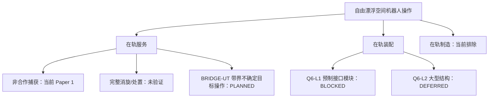

# 空间具身机器人任务分类体系

_状态水印：2026-07-23；性质：`NAVIGATION_AND_SCOPE_TAXONOMY_ONLY`。_

> 本分类用于防止“捕获、服务、装配、制造、未知目标、具身智能”被混为同一个概念。它不新增 Q 编号，不修改 Q1–Q6，也不授予任何科学执行权。

## 1. 一级任务定义

| 术语 | 本项目定义 | 典型终态 | 当前项目位置 |
|---|---|---|---|
| 在轨服务 OOS | 对在轨对象进行检查、接近、捕获、搬运、维护、补给、升级或处置的上位任务族 | 服务目标被检查、约束、维护或重新配置 | 当前捕获主线属于其中一个受限子任务 |
| 主动碎片清除 ADR | 对失效或非合作对象进行捕获并完成安全处置/离轨的完整任务链 | 对象被转移、离轨或进入安全处置状态 | 本项目只研究捕获可行性的一部分，未证明完整 ADR |
| 捕获 Capture | 建立满足冻结终端判据的受控机械约束 | 捕获状态和资源/安全 Gate 满足 | 当前 Paper 1 的核心背景与证据范围 |
| 消旋 Detumbling | 使目标或组合体的角运动降低到合同阈值 | 角速度/动量达到冻结要求 | 不是当前已验证完整任务结论 |
| 搬运/约束操作 Manipulation | 在受控接触下改变对象位姿、约束或位置 | 对象达到任务定义的位姿/约束状态 | `BRIDGE-UT` 的未来范围 |
| 在轨装配 Assembly | 在空间中把两个或更多部件聚合为新的功能结构或功能组合体 | 接口锁紧、组合体状态更新并通过装配判据 | Q6-L1 规划、实施阻塞 |
| 在轨制造 Manufacturing | 在空间中通过材料加工、增材/减材或成形产生部件 | 新部件被制造并通过质量验证 | 当前不在项目范围 |

“两个航天器连接”是否属于装配，要看是否形成了任务合同所定义的新功能组合体，而不是只看是否接触或停靠。当前 Q6-L1 的 1U/2U 模块安装满足装配问题的定义，但尚未获得装配验证结果。

## 2. 任务分类的十个独立轴

不能用单一 Stage 或单一“难度”概括空间操作任务。每个任务至少要在以下十轴上登记。

| 轴 | 枚举/描述 | 为什么重要 |
|---|---|---|
| T：任务类型 | capture / detumble / transport / insert / lock / verify / repair / manufacture | 决定成功终态与 Gate |
| C：合作程度 | cooperative / semi-cooperative / non-cooperative | 决定标记、接口与状态先验 |
| U：对象未知性 | U0–U4，见第 3 节 | 决定感知、估计与 OOD 拒绝 |
| I：接口结构 | none / incidental / prepared / qualified | 决定几何捕获域、公差、摩擦与锁紧模型 |
| K：接触形态 | impulsive / finite-duration / sustained hybrid / multi-point | 决定冲量模型能否适用和是否需要接触历史 |
| F：结构/柔性 | rigid / flexible appendage / flexible target / flexible aggregate | 决定 ANCF/ROM、模态和柔性认证要求 |
| G：结构拓扑 | TOP0–TOP3，见第 5 节 | 区分无拓扑变化、捕获组合体、锁紧组合体与重复构建 |
| A：自主性 | A0–A3，见第 4 节 | 区分离线评价、确定性规划和 VLA 候选层 |
| E：证据成熟度 | VERIFIED / LIMITED / NEGATIVE_RESULT / PLANNED / BLOCKED | 决定可以说什么、不能说什么 |
| M：变更控制 | FROZEN / CHANGE_CONTROLLED / PLANNING_ONLY | 决定资产是否允许变更；不表示科学证据强弱 |

## 3. 对象未知性 U0–U4

| 等级 | 对象与观测条件 | 需要的最小证据 | 允许的当前口径 |
|---|---|---|---|
| U0 | 合作标记 + 已知 CAD | 标记/相机标定与基准真值 | 合作基线，不用于无标记泛化声明 |
| U1 | 已知 CAD、无标记，位姿/转速未知 | 资格化姿态/位姿/角速度估计、校准误差 | 未来离线估计与候选评测 |
| U2 | 已知目标族，质量、惯量、自旋和位姿为有来源的区间 | 区间/概率合同、最坏端点或经批准鲁棒传播 | `BRIDGE-UT` 近期核心 |
| U3 | 部分观测、损伤或非规则几何；只有表面片/禁抓区假设 | 首样本前冻结 mesh/surface/禁抓区、OOD 与适用域 | 未来受控扩展，不等于开集泛化 |
| U4 | 开集未知、状态/几何边界无法闭合 | 不建立可执行真值 | 上游只能请求重新观测；formal SAFE 输出 `WAIT`（附 `reason=request_reobserve`）或 `ABORT` |

“unknown object”在近期材料中必须展开到具体等级和具体未知字段。视觉不能直接把质量或惯量变成已验证真值；不能闭合时状态保持 `UNKNOWN`。

经授权接触后的搬运属于 T/K 轴，预制接口模块安装属于 T/I/K/G 轴；它们不是更高的“未知性等级”。

## 4. 自主性 A0–A3

| 等级 | 系统角色 | 输出权限 | 当前状态 |
|---|---|---|---|
| A0 | 离线可行域、策略评价和证据回放 | 报告、Gate 引用、解释 | 当前主线，最高为受限 DT2 |
| A1 | 确定性 FSM、轨迹/技能规划 | 受控候选或经独立授权的传统控制输入 | 部分计划/有限控制证据，不等于完整闭环 |
| A2 | 物理门控候选生成 | 候选动作、请求、弃权；由 Physics Tool 和 SAFE 复核 | `PLANNED_NOT_IMPLEMENTED` |
| A3 | VLA 增量消融 | 语义/几何候选及失败恢复建议 | 只能在 A1/A2 基线闭合后评估，不直控 |

VLA 不得输出关节力矩、关节/末端速度、轨迹、推进器命令或 formal `ALLOW`。正式决策词表只能由 SAFE 产生：`ALLOW/MODIFY/WAIT/BACKOFF/ABORT`。

## 5. 接触与拓扑等级

| 接触等级 | 描述 | 典型任务 | 当前证据边界 |
|---|---|---|---|
| K0 | 无接触接近 | 观测、伴飞 | 不是捕获或装配成功 |
| K1 | 理想瞬态冲量 | 捕获终端近似 | `sim_10/12` 的一部分建模边界 |
| K2 | 有限时宽接触 | 抓持/碰撞带宽 | `sim_11` 仅在 provisional 参数下为受限侧证据 |
| K3 | 持续混杂接触 | 对准、插入、卡滞、回退 | Q6-L1 必须新增，当前未资格化 |
| K4 | 多点/重复连接接触 | 桁架、反射面、多模块结构 | Q6-L2 未来范围 |

| 拓扑等级 | 定义 | 当前角色 |
|---|---|---|
| TOP0 | 不改变结构拓扑 | 捕获前接近与候选评价 |
| TOP1 | 捕获后形成受控组合体 | Paper 1 终端/组合体分析范围的一部分 |
| TOP2 | 预制接口锁紧并更新质量/惯量/连接/柔性 | Q6-L1 的必要新证据 |
| TOP3 | 多模块重复连接、全局时变拓扑 | `DEFERRED_Q6_L2` |

这里使用 `TOP0–TOP3`，避免与现有场景/几何标签（例如 `G3_dense`）混淆。

## 6. 项目任务树

## 7. 典型任务的分类向量

| 项目任务 | 分类向量（摘要） | 状态 | 当前可用陈述 |
|---|---|---|---|
| 冻结非合作目标捕获 | T=capture；C=non-cooperative；U=N/A（冻结 HARNESS_TRUTH，不是估计器）；I=none；K=K1–K2；F=rigid/limited-flex；G=TOP1；A=A0 | `VERIFIED/LIMITED + FROZEN` | 冻结合同内可行域、策略选择和绑定约束 |
| BRIDGE-UT U2 | T=manipulation；C=non-cooperative；U=U2；I=none/incidental；K=K1–K2；F 按合同；G=TOP1；A=A0–A2 | `PLANNED_SCOPE_ONLY` | 未来合同方向，不是已验证未知目标操作 |
| BRIDGE-UT U3 | T=manipulation；C=non-cooperative；U=U3；I=incidental；K=K2；F 按合同；G=TOP1；A=A0–A2 | `PLANNED/OUT_OF_COVERAGE_UNTIL_CONTRACTED` | 只有真值、OOD 与适用域冻结后才可研究 |
| Q6-L1 模块装配 | T=insert/lock/verify；C=semi-cooperative；U=按实际感知合同另定；I=prepared-unqualified；K=K3；F=flexible target/aggregate；G=TOP2；A=A1 | `PLANNED_SCOPE_FROZEN_EXECUTION_BLOCKED` | 范围和九判据合同已定义，实施未授权 |
| Q6-L2 桁架/望远镜 | T=repeated assembly；C=semi-cooperative；U=按合同；I=prepared；K=K4；F=flexible aggregate；G=TOP3；A=A1–A3 | `DEFERRED_Q6_L2` | 只作远期先验和立项方向 |
| VLA 候选路由 | 跨任务高层候选 / 任一受控 U 类 / A3 | `OFFLINE_ADVISORY_NOT_IMPLEMENTED` | 未来增量消融，不是控制器 |

## 8. 与 Q1–Q6 的映射

| 研究问题 | 分类体系中的位置 | 当前裁决 |
|---|---|---|
| Q1 捕获可行域 | T=capture，A0，冻结参数类，K1 | `ACTIVE_VERIFIED_CORE_LIMITED_SCOPE` |
| Q2 柔性—接触耦合 | F 与 K 轴的模型资格化 | `LIMITED_AND_NEGATIVE_CERTIFICATION` |
| Q3 不确定性与约束 | U 轴、来源和参数传播 | `ACTIVE_METHOD_QUESTION_NOT_QUANTIFIED` |
| Q4 具身智能 | A2/A3 候选生成与工具接口 | `PLANNED_NOT_IMPLEMENTED` |
| Q5 数字孪生 | 证据回放、同步、HIL 成熟度 | `LIMITED_DT2_AND_BLOCKED_UPGRADE` |
| Q6 预制接口模块装配 | T=insert/lock/verify、I=prepared、K3、TOP2；U 按感知合同另定 | `PLANNED_SCOPE_FROZEN_EXECUTION_BLOCKED` |

`BRIDGE-UT` 连接 Q3 的不确定性合同与 Q4 的候选层，但**不是新的 Q，也不重新编号现有 Q6**。若未来需要升格为独立科学问题，必须另行范围审查和编号决策。

## 9. 证据成熟度与变更控制词表

| 状态 | 含义 | 写作规则 |
|---|---|---|
| `VERIFIED` | 指定 Gate 在指定合同内通过 | 必须同时写清范围和排除项 |
| `LIMITED` | 有可用证据但参数、模型或覆盖有限 | 不升级为普遍结论 |
| `NEGATIVE_RESULT` | 预注册裁决未通过或没有安全候选 | 保留原词，不平滑成“基本可行” |
| `PLANNED` | 只有问题、接口或路线 | 不写“已实现、已验证、性能提高” |
| `BLOCKED` | 上游参数、接口、授权或证据缺失 | 给出精确解锁门，不越权执行 |

`FROZEN` 不属于上述证据成熟度。它是独立的变更控制状态：表示路径、配置、结果或裁决受保护，不重算、不改写，也不由新叙事覆盖。一个资产可以同时是 `NEGATIVE_RESULT + FROZEN`，也可以是 `VERIFIED + FROZEN`。

## 10. 候选评测真值分层

未知/非规则目标候选至少要区分四层，不能混成一个 “safe” 标签：

1. `geometry_admissible`：几何与禁抓区允许；
2. `rigid_core_feasible`：在冻结刚体/资源模型中可行；
3. `formal_safe` / `candidate_scientifically_safe`：保留项目候选级科学安全分类原义；
4. `execution_authorized`：另需 SAFE 运行时裁决、独立复审和人工/任务授权。

当前 e15/e16 的 formal-safe 候选为 0。因此直接使用 “formal-safe Recall@K” 可能分母未定义；不得用 geometry-admissible 或 rigid-core feasible 冒充候选科学安全，也不得把 formal-safe 候选分类写成执行授权。

## 11. 快速判定规则

遇到一个新任务描述时，按以下顺序回答：

1. 它是服务、捕获、搬运、装配还是制造？
2. 对象属于 U0–U4 哪一级？具体未知字段是什么？搬运/装配任务不要占用 U 编号。
3. 接触属于 K0–K4 哪一级？是否改变拓扑？
4. 接口是无、偶然、预制还是已资格化？
5. 自主性只到 A0、A1、A2 还是 A3？
6. 柔性 F 与拓扑 TOP 等级是什么？
7. 当前证据是 VERIFIED、LIMITED、NEGATIVE、PLANNED 还是 BLOCKED？变更控制是否 FROZEN？
8. 哪一个原始 Gate 或合同支撑这句话？
9. 如果没有机器 Gate，是否已明确写成“工作命题/候选路线”？

## 12. 来源与 AI 披露

- [项目任务边界](../knowledge_base/project_context/README.md#mission)
- [研究问题登记](../knowledge_base/project_context/README.md#questions)
- [Q6 合同](../research_questions/Q6_on_orbit_assembly.md)
- [NASA/领域来源登记](../research_os_02/online_source_register.csv)
- [文献清单与任务线综合](../on_orbit_assembly/dual_mission_literature_synthesis.md)

本分类由 AI 基于本地状态、Q1–Q6、文献阅读卡及官方 ISAM 定义的已验证来源登记综合生成。分类标签是治理工具，不是新的科学结果；任何冲突以原始 Gate、冻结合同和人工授权为准。
