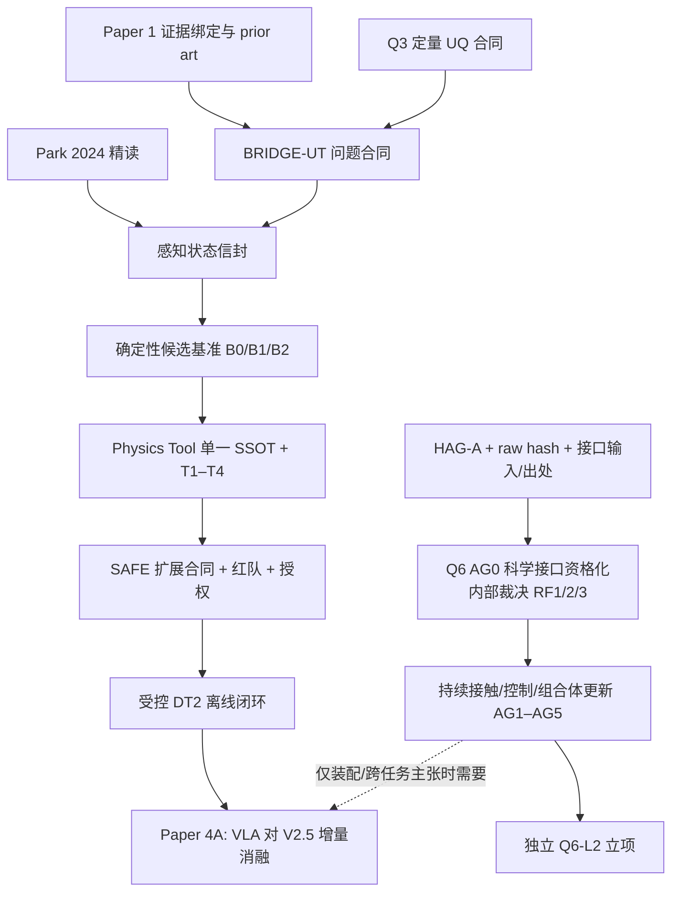

# 空间具身机器人技术缺口分析

_状态水印：2026-07-23；裁决：`CAPABILITY_PATH_DEFINED_EVIDENCE_GAPS_OPEN`。_

> 本文只盘点现有证据与合法下一产物。优先级表示“先闭合什么”，不表示已经授权实施。当前规则仍是 `NO_NEW_SIMULATION — STOP_AFTER_ARCHITECTURE_FREEZE`。

## 1. 当前能力盘点

| 能力 | 分类 | 本地证据 | 现行边界 |
|---|---|---|---|
| 冻结目标捕获可行域 | `VERIFIED + FROZEN` | `sim_10 SIM10_GATES_PASS` | 仅冻结刚体/资源合同；FLEX=`UNKNOWN_NOT_IN_CRITERIA` |
| 策略单元与绑定约束 | `VERIFIED + FROZEN` | `sim_12 SIM12_PHASE1_GATES_PASS` | 16 个 Phase 1 单元；FLEX 未入判据 |
| 有限接触带宽 | `LIMITED + FROZEN` | `sim_11 SIM11_GATES_PASS_WITH_PROVISIONAL_PARAMS` | 接触时间、帆板/柔性和部分工程参数 provisional |
| 抓取候选评价 | `LIMITED + FROZEN` | sim_09/E1 campaign | 无 global verdict；不是开放目标候选器 |
| 柔性安全认证 | `NEGATIVE_RESULT + FROZEN` | e15 core/ANCF | safe=0；`REPEAT_CORE_NO_SAFE_CANDIDATE`；`REPEAT_ANCF_CERTIFICATION` |
| 同步捕获扫描 | `LIMITED + FROZEN` | e16 | `PASS_WITH_GEOMETRY_AND_FLEX_LIMITATIONS`；formal safe=0 |
| fail-closed 运行时门 | `VERIFIED + FROZEN` | SAFE-00 | `PENDING_REVIEW`；`next_stage_authorized=false`；只覆盖冻结候选 |
| 末端/姿态控制 | `NEGATIVE_RESULT/LIMITED + FROZEN` | CTRL-01/02 | CTRL-01=`REPEAT`；CTRL-02 机器 `verdict=PASS`，对外 `PASS_WITH_PROVISIONAL_SCOPE`，`review_status=PENDING_REVIEW`，`formal_safety_classification_emitted=false`，`flex_status=UNKNOWN_NOT_IN_CRITERIA` |
| 带界不确定目标操作 | `PLANNED` | Q3/Q4、VLA 草案和文献 | 无状态包、基准、估计器、工具 Gate 或控制授权 |
| 预制接口模块装配 | `BLOCKED` | Q6、ASM-00 前检 | `ASM00_AG0_BLOCKED_BY_INTERFACE`；HAG-A 与参数未闭合 |
| 大型模块化结构 | `PLANNED/DEFERRED` | Q6-L2 文献先验 | 无合同、序列、全局柔性或机器证据 |
| 数字孪生/HIL | `LIMITED/BLOCKED` | 离线证据回放 | 最高为受限 DT2；DT3/DT4、HIL 和统一时钟未闭合 |
| VLA 候选层 | `PLANNED_NOT_IMPLEMENTED` | Q4 与 `10_research/vla/` | 无实体、训练、验证和执行权 |

## 2. 缺口优先级定义

| 优先级 | 含义 | 当前允许动作 |
|---|---|---|
| P0 | 不闭合就无法定义问题或合法启动后续研究 | 文档、来源、合同、状态冲突与人工授权闭合 |
| P1 | 问题定义后最先决定科学有效性与安全性的模型/证据 | 仅在单独批准的研究合同中实施 |
| P2 | 形成可发表闭环或向更高任务迁移所需 | 依赖 P0/P1 的机器 Gate |
| P3 | 高层智能、实时孪生或大型结构扩展 | 确定性基线和安全链闭合后再评估 |

## 3. P0：现在必须先闭合的缺口

| Gap ID | 缺口 | 当前证据/问题 | 合法下一产物 | 解锁门 | 当前禁止 |
|---|---|---|---|---|---|
| G-P0-01 | Paper 1 主张—Gate/hash 绑定尚未完全闭合 | C1–C4 已登记；新颖性仍 `UNASSESSED_PENDING_SYSTEMATIC_PRIOR_ART` | 逐主张、逐图、逐数字 evidence table 与专项 prior-art protocol | 全部定位器可复核，旧状态冲突消除 | 宣称首创、成功概率或超出冻结域 |
| G-P0-02 | Q3 只有参数追溯，没有定量不确定性传播 | 现有参数表能标来源/置信度，但无 interval/probability propagation Gate | `uncertainty_contract_v0`：变量、相关性、分布/区间、端点和拒绝规则 | 评审通过且不改旧 Gate | 把 provisional 参数当真实统计分布 |
| G-P0-03 | BRIDGE-UT 无感知—动力学输入合同 | 无数据集合同、估计器、同步、协方差校准、OOD 或角速度联合估计 Gate | `perception_state_envelope_schema_v0` 与 benchmark preregistration | U0–U3、真值、校准、expiry、OOD/UNKNOWN 规则冻结 | 训练、仿真或声称未知目标闭环 |
| G-P0-04 | 目标几何/表面/禁抓区真值不存在 | U3 目前只是设计空间外推 | 首样本前的 mesh/surface/collision/forbidden-zone registry | hash、许可、分组和污染防护闭合 | 用后验人工挑选候选真值 |
| G-P0-05 | Q6 接口输入与授权未闭合 | AG0 preflight 已运行且 BLOCKED；HAG-A、raw hash、所需接口输入/出处缺失；RF-1/2/3 等待 AG0 自身裁决 | 接口输入/来源包 + HAG-A 决策记录 + raw hash + SSOT 升级候选 | 获单独授权后开展 AG0 科学接口资格化/闭合复核 | 未获授权的 AG0 科学资格化/复核、ASM-01/02 或装配结论 |
| G-P0-06 | 装配核心文献卡缺口 | `lee2016modulartelescope` 有 PDF 无完整卡 | 依现有阅读卡规范精读并建卡 | controller 校验通过 | 在未精读前引用其具体技术主张 |
| G-P0-07 | 位姿估计核心文献卡缺口 | `park2024poseestimation` 有 PDF 无完整卡 | 精读、定位器和边界卡 | controller 校验通过 | 把题录/PDF-ready 当技术细节证据 |

## 4. P1：科学有效性与安全链缺口

| Gap ID | 缺口 | 当前机器状态 | 所需未来证据 | 失败/停止语义 |
|---|---|---|---|---|
| G-P1-01 | 不确定状态的物理传播 | `sim_10/12` 只覆盖冻结参数化类 | 区间/概率传播、最坏端点、覆盖与校准、鲁棒可行性新版本 Gate | 无法闭合即 `UNKNOWN/OUT_OF_COVERAGE` |
| G-P1-02 | 候选真值与执行授权四层未分离 | e15/e16 formal safe=0 | geometry-admissible、rigid-core-feasible、formal-safe/candidate-scientifically-safe、execution-authorized 分层标注与指标 | 禁止把前两层冒充候选科学安全，也禁止把 formal safe 当执行授权；Recall@K 分母未定义时报告 N/A |
| G-P1-03 | 柔性安全候选与 ANCF 认证未闭合 | e15 safe=0；ANCF=`REPEAT_ANCF_CERTIFICATION` | 新核心安全刚体候选后，另立合法 e15 认证合同 | 负结果保持，不以扩大搜索掩盖 |
| G-P1-04 | 末端/姿态控制证据不足 | CTRL-01=`REPEAT`；CTRL-02 机器 PASS 但对外 provisional、review pending、未发 formal safety 且 FLEX 未入判据 | 分阶段任务、执行器实测、独立红队和授权 | 当前桥接线止于离线候选/拒绝评价 |
| G-P1-05 | Physics Tool 合约冲突与未实现 | `tool_contract_draft.yaml` 为 DRAFT；存在工具数、词表、插值/EXACT、branch 命名冲突 | 单一 SSOT、closed schema、EXACT-first、签名 response_id、逐调用 hash/Gate 追溯，T1–T4 | 任一 schema/签名/限制字段缺失即拒绝 |
| G-P1-06 | SAFE 不能覆盖新候选集合 | SAFE PASS 仅冻结合同；review pending；不授权下游 | 独立状态信道、候选注册表、OOD/UNKNOWN 零 ALLOW/MODIFY、绕过集=0、红队 PASS 和显式授权 | 不修改冻结 SAFE；另立扩展合同 |
| G-P1-07 | 工程参数未转正 | B601 接触时间、执行器、帆板/柔性参数仍 provisional | 实测/权威来源、测量不确定度和配置版本绑定 | 不用单点猜测替代实测 |

## 5. P1/P2：从捕获到装配的专属缺口

| Gap ID | 缺口 | 为什么旧证据不够 | 所需未来证据 | 依赖 |
|---|---|---|---|---|
| G-AS-01 | 接口捕获域、公差与摩擦楔紧 | 捕获终端几何不含销孔、导向和卡滞 | 解析边界、来源参数、AG0 扫描 | G-P0-05 |
| G-AS-02 | 持续混杂接触和接触历史 | 捕获冲量不能表示 align/insert/jam/lock/backoff | 状态机、历史账本、守恒/能量审计、AG1/AG2 | AG0 |
| G-AS-03 | 目标侧自由漂浮与柔性模型 | `sim_11` 是受限追踪星侧柔性证据 | 目标侧 FFR、柔性参数、锁紧前后模型和验证 | 参数转正 |
| G-AS-04 | 锁紧后组合体更新 | 捕获组合体更新不足以表达新连接拓扑 | 质量/质心/惯量、连接矩阵、模态/ROM 更新、AG4 | G-AS-02/03 |
| G-AS-05 | 分阶段 5D/6D 控制与回退 | CTRL-01 负结果只提供分阶段动机 | 守卫、切换、回退、资源和失败模式 Gate | ASM-01 与控制授权 |
| G-AS-06 | 九判据端到端闭合 | 评估器冻结不等于输入资格化 | AG1–AG4 逐门结果、AG5 runtime safety、九判据聚合结果、逐行 trace 和人工审查 | HAG-A + AG0 |

## 6. P2/P3：大型结构、VLA 与数字孪生缺口

| Gap ID | 缺口 | 当前状态 | 未来最小合同 | 不得提前声称 |
|---|---|---|---|---|
| G-L2-01 | 多模块序列与物流 | `DEFERRED_Q6_L2` | 装配图、可达性、顺序/回退和物流约束 | 已能搭建桁架/望远镜 |
| G-L2-02 | 累积位姿误差和全局结构精度 | 无项目证据 | 重复接口误差模型和结构精度 Gate | 单接口结果可线性外推 |
| G-L2-03 | 时变拓扑与全局柔性模态 | 仅文献先验 | 模态/刚度更新、稳定性、模型降阶与独立 Q6-L2 合同 | Q6-L1 等同超大型结构 |
| G-VLA-01 | VLA 实体与增量价值 | `PLANNED_NOT_IMPLEMENTED` | V0/V1/V2/V2.5 对照、prompt/model hash、错误提案/弃权/效用/运行时指标 | 已实现安全 VLA 控制 |
| G-VLA-02 | 训练污染与“未见目标”效度 | 基座预训练污染无法排除 | 数据来源、提示级留出、渲染组间迁移、独立测试和局限声明 | 开集零样本泛化 |
| G-DT-01 | 实时状态流、统一时钟和双向接口 | 当前最高 DT2 | H0–H2、延迟/丢帧 Gate、不可覆盖原始日志 | 实时 DT3/DT4 或 HIL 已完成 |
| G-DT-02 | B601/HIL 和微重力外推 | 未启动/阻塞 | 硬件资格、标定、接触时间、地面试验适用域 | 地面固定基座等于在轨验证 |

## 7. 文献知识缺口

当前文献控制器状态：

| 指标 | 数量 |
|---|---:|
| 唯一题录 | 45 |
| 已验证本地 PDF | 44 |
| 完整阅读卡 | 29 |
| PDF-ready、待完整精读 | 15 |
| 缺全文 | 1（`gerstmayr2013ancfreview`） |

与本路线直接相关的已完成卡可支持**定义、方法、比较轴和局限**，不能替代项目 Gate。特别需要保持：

- `park2024poseestimation`：PDF-ready、无完整卡；先精读再使用具体技术细节；
- `lee2016modulartelescope`：PDF-ready、无完整卡；先精读再用于 Q6 架构论证；
- `gerstmayr2013ancfreview`：无全文，不得伪造阅读结论；
- `spacemind2026`、VLA 综述和姿态/视觉伺服文献不能证明本项目已实现泛化、实时性或安全控制；
- `li2022assemblysurvey`、`hu2025ultralarge` 可用于任务/技术分类与未来缺口，不能证明本项目装配成功。

## 8. 依赖图

图中箭头表示证据依赖，不代表自动授权。BRIDGE-UT 与 Q6-L1 可并行定义，且 BRIDGE-UT 不是 AG0 的强制前置。

## 9. 当前最有价值的五个合法动作

1. 完成 Paper 1 的逐主张证据绑定与专项 prior-art 计划；
2. 把 Q3 的参数追溯升级为**文档级**定量 UQ 合同草案；
3. 精读 `park2024poseestimation` 和 `lee2016modulartelescope` 并通过文献控制器验收；
4. 建立 BRIDGE-UT 的状态信封、真值分层、OOD 和候选 benchmark 预注册草案；
5. 收集 Q6 接口的真实出处、几何/摩擦参数和 HAG-A 决策材料。

以上动作不包含训练、科学仿真、Gate 改写、接口资格宣告或装配执行。

执行导航见 [Physics-Gated Agent 规划冻结](./physics_gated_agent_plan.md) 与[研究、学习与文献队列](./research_learning_and_literature_queue.md)。前者不关闭 G-P0-02/03 或 G-P1-05/06；它只冻结职责、词表和拒绝规则。

## 10. 最强失败假设

> VLA 在 L4 层可能完全多余；如果 `V2.5 = FSM + 全量物理工具` 与 VLA 方案表现相当，VLA 不形成安全或决策贡献。与此同时，当前候选级 formal-safe truth 为空，部分候选指标甚至不可定义；即使未来 formal safe 非空，也仍不等于 execution authorization。

本项目应预注册接受这一结果：

- VLA 贡献降级为语义候选生成；
- 论文核心保持不确定性传播、物理门控、拒绝行为或确定性任务合同；
- 不用 geometry-admissible 或 rigid-core-feasible 代替 formal-safe，也不把 formal-safe 候选分类代替 execution authorization；
- 不因为负结果而修改旧 Gate 或成功定义。

## 11. 来源与 AI 披露

- [当前状态速查](../knowledge_base/project_context/README.md#history)
- [贡献—证据矩阵](../contribution_map/claim_evidence_matrix.csv)
- [Q3 不确定性问题](../research_questions/Q3_uncertainty_constraint.md)
- [Q4 具身智能问题](../research_questions/Q4_embodied_intelligence.md)
- [Q5 数字孪生问题](../research_questions/Q5_digital_twin.md)
- [Q6 装配问题](../research_questions/Q6_on_orbit_assembly.md)
- [文献控制器状态](../knowledge_base/papers/controller_state.yaml)
- [在线/领域来源登记](../research_os_02/online_source_register.csv)
- [Physics-Gated Agent 规划冻结](./physics_gated_agent_plan.md)

本文由 AI 结合本地 Gate 状态、参数/模块卡、研究问题、文献控制器和三个只读专家 Agent 审计生成。所有“所需未来证据”均是计划项，不是已完成实验或新科学主张。
