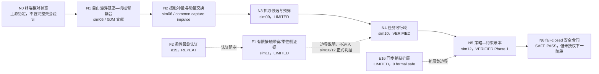

# Paper 1 理论链：从终端状态到绑定 Gate

## 1. 这条理论链回答什么

Paper 1 不尝试证明“机械臂已经能在真实太空自动抓住任意目标”。它回答更窄、可由现有证据审计的问题：

> 给定终端捕获初始状态和冻结的航天器/目标/执行机构参数，捕获后的动量与姿态状态是否满足当前任务阈值；若不满足，首先被哪个约束阻断；不同策略为何只能在具体工况下比较。

## 2. 总链路



## 3. N0：终端相对状态

对零基础读者，可以把捕获前一瞬间的信息写成一个状态包：

\[
\mathcal{X}_{c^-}=\{\mathbf{r}_{TG},\mathbf{v}_{TG},\mathbf{R}_{TG},\boldsymbol{\omega}_T,
m_T,\mathbf{I}_T,\mathbf{r}_{G/T}\}.
\]

它包含目标相对位置/速度、姿态/角速度、质量/惯量和抓取点相对质心的杠杆。本项目当前把这个状态包作为终端捕获阶段输入；并没有用现有 Gate 证明从远距离轨道交会一直到这里的完整导航与制导闭环。

因此：Hill/CW 可以作为未来轨道交会层的理论接口，但不能写成当前 Paper 1 已验证环节。

## 4. N1：自由漂浮基座—机械臂耦合

空间机械臂动作会通过动量守恒反作用到基座。一个标准的分块动力学记号是：

\[
\begin{bmatrix}
\mathbf{H}_b & \mathbf{H}_{bm}\\
\mathbf{H}_{bm}^{T} & \mathbf{H}_m
\end{bmatrix}
\begin{bmatrix}
\dot{\mathbf{v}}_b\\
\ddot{\mathbf{q}}
\end{bmatrix}
+
\begin{bmatrix}
\mathbf{c}_b\\
\mathbf{c}_m
\end{bmatrix}
=
\begin{bmatrix}
\mathbf{W}_{b,ext}\\
\boldsymbol{\tau}_m
\end{bmatrix}.
\]

- \(\mathbf{v}_b\)：基座的平移/转动速度；
- \(\mathbf{q}\)：机械臂关节变量；
- \(\mathbf{H}_{bm}\)：机械臂与基座的惯性耦合；
- \(\mathbf{W}_{b,ext}\)：外部力/力矩；短时自由漂浮段通常按项目模型合同处理。

在无外部冲量的短时段，系统总动量提供约束。广义雅可比可把关节速度和基座反作用共同映射到末端速度。这里的方程是统一符号层，不替代 `sim05` 的实现、Gate 或文献推导。

项目锚点：`30_simulation/sim_05_free_floating_arm/`；文献卡：`wilde2018tutorial`、`yoshida2001zrm`。

## 5. N2：接触冲量与动量交换

抓取接触在短时间内产生冲量 \(\mathbf{J}\)。对一个刚体，冲量引起的线动量和角动量变化可用接口关系表达：

\[
\Delta\mathbf{P}=\mathbf{J},\qquad
\Delta\mathbf{H}_{C}=\mathbf{r}_{G/C}\times\mathbf{J}+\boldsymbol{\Gamma},
\]

其中 \(\boldsymbol{\Gamma}\) 表示可能的接触偶量。刚性锁定后，服务航天器、机械臂和目标作为组合体，其捕获后角速度由总角动量与组合惯量共同决定。杠杆一方面改变冲量矩，另一方面通过 Steiner 项改变组合惯量，所以边界不应被简化为单变量线性规律。

项目锚点：`30_simulation/common/capture_impulse.py`、`30_simulation/sim_06_capture_impulse/`，由 `sim10` 的 X1/X3 Gate 与历史锚点交叉核对。

## 6. F1：有限接触带宽与柔性坐标

若帆板用有限模态坐标 \(\boldsymbol{\eta}\) 表示，可用标准接口形式写为：

\[
\mathbf{M}_f\ddot{\boldsymbol{\eta}}+
\mathbf{C}_f\dot{\boldsymbol{\eta}}+
\mathbf{K}_f\boldsymbol{\eta}=
\mathbf{Q}_f(t).
\]

接触不是理想零时长事件时，\(\mathbf{Q}_f(t)\) 的频谱取决于接触窗 \(T_c\)。`sim11` 使用有限接触带宽、FFR 帆板和自由漂浮多体模型，Gate 在其合同内通过；但模态数、模态形状、刚度档、阻尼和名义接触时长仍标为暂定。

因此本节点在 Paper 1 中的正确角色是：

- 解释理想冲量为何可能形成柔性高频模型边界；
- 提供有限带宽方法动机和数值侧证据；
- 明确柔性尚未进入 `sim10/sim12` 的正式分类标准。

它不能被写成“柔性捕获安全域已经认证”。`e15_ancf` 的原始裁决仍是 `REPEAT_ANCF_CERTIFICATION`。

## 7. N4：四类可行性区域

`sim10` 在冻结扫描合同下，把每个物理点分为：

1. `WHEELS_ONLY_FEASIBLE`：捕获后状态和轮控资源满足当前门限；
2. `THRUSTER_REQUIRED_FEASIBLE`：需要推力器但仍在当前资源预算内；
3. `INFEASIBLE_RATE`：捕获后角速度先触发门限；
4. `INFEASIBLE_RESOURCE`：姿态状态可处理但资源预算不满足。

这是一套项目分类合同，不等同于真实任务成功率。其关键输出不是单个“最好数字”，而是区域边界和绑定约束。

## 8. N5：策略选择与绑定 Gate

`sim12` 比较 4 个任务工况和 4 种策略，共 16 个单元。Gate 允许的核心表述是：

> Strategy selection depends on the active physical constraint (binding gate).

换成中文：策略是否合适，取决于该工况下首先起作用的物理约束。降低某一个冲量指标并不保证总角动量、姿态速率、轮动量或推进剂账本同时改善。

`sim12` 明确禁止：

- “动量整形总能改善捕获”；
- 任意无条件策略排名；
- 柔性 Gate 结论；
- 脱离完整账本单独宣传轮容量翻倍。

## 9. N6：安全与执行授权分离

科学 Gate、软件测试和执行授权是三件事：

```text
数值/物理 Gate 通过
  ≠ 真实任务安全已证明
  ≠ 下一阶段自动获批
  ≠ 学习策略可以绕过安全层
```

`safety_00` 当前为 `PASS`，但 `next_stage_authorized=false`。Paper 1 可以说明 fail-closed 合同存在，不能写成硬件或在轨执行已获批准。

## 10. Claim—Evidence 对应

| 候选论文命题 | 最小理论节点 | 机器证据 | 状态 |
|---|---|---|---|
| 冻结约束下的可行性区域 | N0–N4 | sim10 Gate | `VERIFIED_WITHIN_SCOPE` |
| 策略选择依赖绑定约束 | N2–N5 | sim12 Gate/ledger | `VERIFIED_WITHIN_PHASE1` |
| 有限接触带宽是柔性建模边界 | F1 | sim11 Gate | `LIMITED_PROVISIONAL` |
| 柔性整星安全域已认证 | F1/F2 | e15 ANCF | `NOT_SUPPORTED_REPEATED` |
| VLA/装配/实时孪生已闭环 | 无当前证据链 | 无 | `NOT_SUPPORTED` |

## 11. 反方审查（Devil's Advocate）

1. **问题是否可回答？** Q1 可以在冻结合同内回答；Q2/Q3 只能回答边界与缺口。
2. **范围是否过大？** 若加入完整交会、柔性安全域、VLA 或 HIL，当前证据立即不足，必须拆分后续研究。
3. **最强反驳是什么？** 多项关键参数为暂定/低置信度，且柔性没有进入主分类 Gate，因此结论可能只对当前模型合同成立。
4. **如何防止过度声明？** 每个结果必须同时附原始 verdict、`flex_status`、参数状态和禁止表述。
5. **什么证据最缺？** 实测硬件/柔性/接触参数、最终安全候选的 ANCF 交叉认证，以及新颖性系统检索。

## 12. 真值来源

- `10_research/00_project_architecture/paper_structure_plan.md`
- `10_research/00_project_architecture/simulation_scenario_map.md`
- `30_simulation/sim_10_mission_feasibility/results/sim_10_gate_check.json`
- `30_simulation/sim_11_coupled_dynamics/results/sim_11_gate_check.json`
- `30_simulation/sim_12_strategy_feasibility/results/sim_12_gate_check.json`
- `30_simulation/e15_core_coverage/results/core_gate_check.json`
- `30_simulation/e15_ancf_certification/results/gate_summary.json`
- `50_literature/references/notes/INDEX.md`

`last_verified_head: b75352c1c226c0f3e9a4bc9c469b766e06f41616`

