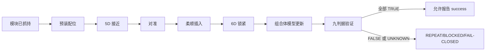

# Q6 模块装配理论—证据链

> 状态：`DERIVED_NAVIGATION_NOT_SCIENTIFIC_SSOT`
>
> 本文只把标准理论接口、现有项目对象和未来 Gate 对齐。公式是待资格化模型的接口，不是新仿真结果，也不证明装配已完成。

## 1. 从捕获到装配，多了什么

捕获回答“是否稳定获得目标/模块”；装配还必须回答“是否沿指定接口完成持续接触、约束形成、锁紧、功能状态更新和可审计验证”。因此，Q6 不是简单把 Q1 的末端角速度阈值换个名字，而是在捕获链之后增加接口与拓扑状态。



## 2. 理论节点与证据接口

| 节点 | 零基础解释 | 理论接口 | 可复用本地资产 | 仍缺的推导/证据 | Gate |
|---|---|---|---|---|---|
| T6-0 模块已抓持 | 机械臂已稳定拿住待装模块，状态可作为装配初值 | 自由漂浮基座—机械臂耦合、动量账本 | `sim_05`、`sim_10/12` 的方法 | 模块质量/惯量与抓持变换的正式来源 | 上游合同 |
| T6-1 预装配与 5D 接近 | 先控制位置和部分姿态，保留一个可用自由度避免过约束 | 任务雅可比、nullity、资源约束 | CTRL-01 负结果、CTRL-02 分账 | 相位任务矩阵、可达性、奇异裕度 | AG1/AG3 |
| T6-2 对准 | 导向锥和销孔把较大位姿误差逐步收敛 | 几何捕获域、公差栈、碰撞/间隙 | 接口草案、ASM-00 RF 分类 | 导向半径、销距、倒角、clearance 语义和 CAD 一致性 | AG0 |
| T6-3 柔顺插入 | 接触后不能只跟踪位置，还要限制力、摩擦、卡滞和结构振动 | 接触运动学、摩擦、阻抗/顺应、事件状态机 | `sim_11` 受限带宽侧证据、装配文献 | 持续接触模型、接触历史、材料/表面摩擦、B601 接触实测 | AG2/AG3 |
| T6-4 6D 锁紧 | 锁紧形成完整约束；此时才允许严格 6D 任务 | 约束切换、锁扣力学、执行器资源 | 九判据合同、SAFE fail-closed | 锁扣几何/力、切换守卫、失败回退 | AG3/AG5 |
| T6-5 组合体更新 | 安装后总质量、质心、惯量和柔性拓扑发生变化 | 质量/惯量合成、坐标变换、模态/拓扑更新 | 动量账本方法、e15/sim11 的限制信息 | 目标侧柔性模型、锁紧后模态/误差传播、模型版本绑定 | AG2/AG4 |
| T6-6 九判据验证 | 几何正确不等于装配成功，所有判据必须同时为真 | 单源布尔合取、UNKNOWN fail-closed、出处账本 | `assembly_success_evaluator_v1.yaml` | HAG-A 绑定、AG0–AG5 独立证据 | AG0–AG5 |

## 3. 标准方程接口

### 3.1 自由漂浮耦合

装配前的通用动力学接口可写成分块形式：

\[
\begin{bmatrix}H_{bb} & H_{bm}\\ H_{mb} & H_{mm}\end{bmatrix}
\begin{bmatrix}\ddot q_b\\ \ddot q_m\end{bmatrix}
+ C(q,\dot q)\dot q
=
\begin{bmatrix}\tau_b\\ \tau_m\end{bmatrix}+J_c^T\lambda_c .
\]

这里的关键不是宣称新模型已求解，而是保留三个可审计接口：基座—机械臂耦合项、接触广义力和执行器资源。现有 Q1/CTRL 资产只能提供方法入口；Q6 必须重新绑定模块、接口和目标侧拓扑。

### 3.2 接触状态与持续接触

接口至少需要定义法向间隙 \(g_n(q)\)、相对法向速度 \(v_n=\dot g_n\)、切向相对运动和接触状态。采用罚函数、互补条件或其他模型必须在未来合同中显式选择，不能在本文默认为项目真值。

建议的事件语义是：

```text
FREE -> PREENGAGE -> ENGAGED -> INSERTING -> LATCHED
                  \-> JAMMED / OVERLOAD / BACKOFF / UNKNOWN
```

任何未建模或未收敛接触态都应返回 UNKNOWN，而不是成功。

### 3.3 摩擦与楔紧边界

当前 ASM-00 前检已经计算了名义检查：

\[
\tan(15^\circ)-0.3=-0.0320508<0.
\]

机器裁决为 `RF2_BLOCKED_MISSING_FRICTION_PROVENANCE_OR_MARGIN`，且名义滑动条件为 false。这是一项需要保留的负边界，不得通过修改摩擦系数或角度制造 PASS。下一步应补材料对、表面状态、出处和裕度定义，再由 AG0 重新资格化。

### 3.4 锁紧后的质量与惯量更新

标准质量合成接口为 \(m^+=m_t+m_p\)。若把模块质心平移到组合体参考点，惯量需包含平行轴项：

\[
I^+=R_t I_t R_t^T+m_t[\rho_t]_\times^T[\rho_t]_\times
   +R_p I_p R_p^T+m_p[\rho_p]_\times^T[\rho_p]_\times .
\]

该式只说明必须更新哪些量。当前没有足够的正式模块参数和锁紧后拓扑证据，不能由此声称组合体模型已验证。

### 3.5 误差传播接口

接口参数和初始位姿误差对装配结果的局部影响可以规划为：

\[
\delta y \approx J_p\,\delta p + J_x\,\delta x_0 .
\]

未来 \(y\) 至少应覆盖最终位姿、接触载荷、插入深度、基座资源和柔性响应；\(p\) 应来自参数登记与接口 SSOT。当前尚未计算这些雅可比或置信区间，因此这里只是 Q3→Q6 的方法接口。

## 4. 九判据单源闭环

当前冻结合同包含：最终位置、最终姿态、插入深度、锁紧几何、接触载荷、基座/飞轮资源、柔性响应、出处与相位账本、接触历史。逻辑必须保持：

\[
success = \bigwedge_{i=1}^{9} C_i,
\qquad C_i\in\{TRUE,FALSE,UNKNOWN\},
\]

且任一 `FALSE` 或 `UNKNOWN` 都不得产生 success。合同结构通过只代表结构校验，不代表九项已有科学证据。

## 5. Q1–Q5 的复用边界

| 来源问题 | Q6 可复用 | Q6 必须新增 |
|---|---|---|
| Q1 | 可行域、绑定约束、资源分类方法 | 接口/接触/锁紧状态和装配成功语义 |
| Q2 | 有限接触带宽、柔性认证缺口 | 目标侧柔性拓扑、锁紧后模态与持续接触 |
| Q3 | 参数来源、状态和影响追溯 | 公差栈、摩擦、局部/全局不确定性传播 |
| Q4 | 候选技能必须经过确定性 Gate | 装配技能实体、V2.5 基线、AG6 消融；当前不实施 |
| Q5 | 哈希、Gate、日志和 DT2 回放思想 | 装配事件时序、接口状态和九判据的回放绑定 |

## 6. Q6-L2 大型结构扩展

大型桁架/望远镜扩展需要另加模块物流、连接序列、时变拓扑、密集低频模态、几何精度累积、多机器人协同和结构重复连接等问题。NASA 的 [TriTruss 地面试验](https://ntrs.nasa.gov/citations/20230013537) 使用固定试验台、UR10e、定制抓具、缩比模块和先验工作站模型；它支持“模块接口 + 分步验证”的方法参考，但不能证明本项目自由漂浮装配或在轨可用。

Q6-L2 只有在 Q6-L1 的接口、持续接触、锁紧、模型更新和验证合同闭合后才值得进入独立研究合同。

## 7. 允许与禁止表述

- 允许：已建立 Q6 的理论—证据接口，并识别现有捕获链到装配链必须补充的状态与 Gate。
- 允许：ASM-00 前检已冻结九判据合同并机器分类 RF-1/2/3。
- 禁止：接口已经测量/资格化；装配已经成功；ASM-01/02 已授权。
- 禁止：OSAM/ARMADAS/TriTruss 的结果证明本项目可行。
- 禁止：大型桁架是当前项目已实现能力；VLA 或实时数字孪生已接入。

## 8. 权威入口

- Q6 合同：`10_research/research_questions/Q6_on_orbit_assembly.md`
- 当前装配范围：`10_research/on_orbit_assembly/state_truth_and_scope.md`
- 当前机器裁决：`30_simulation/asm_00_interface_preflight/results/asm_00_gate_check.json`
- 九判据合同：`30_simulation/asm_00_interface_preflight/contracts/assembly_success_evaluator_v1.yaml`
- 证据规划：`10_research/research_os_02/q6_evidence_gap_and_generation_plan.md`

`last_verified_head: b75352c1c226c0f3e9a4bc9c469b766e06f41616`

